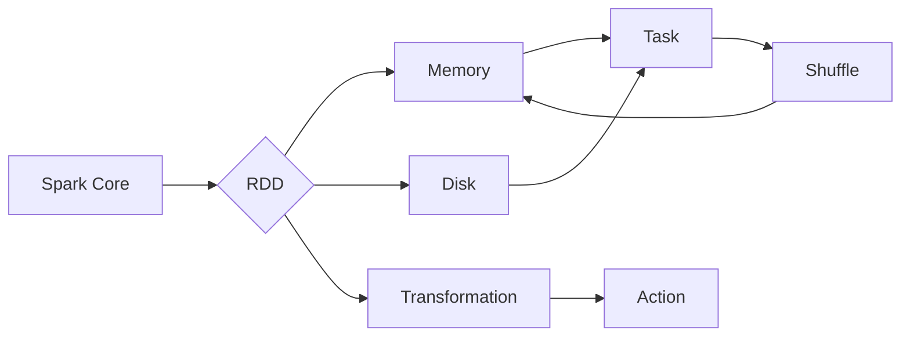

# RDD 原理与代码实例讲解

> 关键词：RDD, 分布式计算，大数据，Spark，Scala，弹性分布式数据集，弹性容错，弹性内存管理

## 1. 背景介绍

随着大数据时代的到来，处理海量数据的需求日益增长。传统的计算模型和存储系统在处理大规模数据集时往往力不从心。为了高效地处理和分析海量数据，Apache Spark提出了弹性分布式数据集（Resilient Distributed Dataset，简称RDD）这一核心概念。RDD为开发者提供了一种简单、可伸缩的抽象，用于并行处理大规模数据集。本文将深入讲解RDD的原理、应用和代码实例。

## 2. 核心概念与联系

### 2.1 核心概念

**RDD**：弹性分布式数据集是Spark中最基本的数据抽象，它代表一个不可变、可并行操作的数据集合。RDD可以被存储在内存或磁盘上，并且能够容忍节点故障。

**弹性**：RDD能够在节点故障时自动进行恢复，确保数据的完整性和计算的可靠性。

**分布式**：RDD可以分布在多个节点上，支持并行计算。

**数据集**：RDD代表一个数据集，可以由一系列的数据项组成。

### 2.2 架构的 Mermaid 流程图



### 2.3 核心概念之间的联系

- RDD是Spark Core的核心数据结构，它通过弹性内存管理在内存和磁盘之间自动切换。
- RDD通过Transformation操作生成，通过Action操作触发计算。
- 当RDD分布在多个节点上时，Spark会根据数据依赖关系将计算任务分配到不同的节点上执行。
- 在节点故障时，Spark会根据RDD的依赖关系重新计算丢失的数据块。

## 3. 核心算法原理 & 具体操作步骤

### 3.1 算法原理概述

Spark的RDD通过以下原理实现分布式计算：

- **数据划分**：将数据集划分为多个分区，并分配到集群的不同节点上。
- **任务调度**：根据RDD的依赖关系，将计算任务调度到相应的节点上执行。
- **数据传输**：在节点间传输数据时，Spark使用高效的数据序列化技术，如Kryo。
- **容错机制**：通过检查点（Checkpoint）和血缘关系实现数据的自动恢复。

### 3.2 算法步骤详解

1. **创建RDD**：通过读取文件、序列化集合或并行集合等操作创建RDD。
2. **Transformation**：对RDD执行Transformation操作，如map、filter、reduceByKey等。
3. **Action**：触发Action操作，如collect、count、saveAsTextFile等，触发实际的数据计算。
4. **任务调度**：Spark根据RDD的依赖关系和集群资源情况，调度任务执行。
5. **数据传输**：在节点间传输数据时，Spark使用高效的数据序列化技术。
6. **容错机制**：在节点故障时，Spark根据RDD的依赖关系和数据副本，重新计算丢失的数据块。

### 3.3 算法优缺点

#### 优点：

- **弹性**：能够在节点故障时自动恢复。
- **分布式**：支持大规模数据的并行计算。
- **可伸缩**：能够根据集群资源自动调整计算资源。
- **易用性**：提供丰富的API，易于使用。

#### 缺点：

- **序列化开销**：数据序列化可能会增加计算的开销。
- **内存管理**：需要开发者关注内存管理，避免内存溢出。

### 3.4 算法应用领域

- 大数据分析
- 实时流处理
- 图处理
- 数据挖掘
- 机器学习

## 4. 数学模型和公式 & 详细讲解 & 举例说明

### 4.1 数学模型构建

RDD的数学模型可以表示为：

$$
RDD = \{r_1, r_2, ..., r_n\}
$$

其中，$r_i$ 表示RDD中的第i个数据项。

### 4.2 公式推导过程

RDD的计算过程可以通过以下公式表示：

$$
result = \text{action}(RDD)
$$

其中，action表示Action操作，result表示Action操作的结果。

### 4.3 案例分析与讲解

假设我们有一个包含数字的RDD：

$$
RDD = \{1, 2, 3, 4, 5\}
$$

我们想要计算RDD中所有数字的和：

```scala
val data = List(1, 2, 3, 4, 5)
val sum = sc.parallelize(data).reduce(_ + _)
```

上述代码首先将数据序列化为RDD，然后使用reduce操作进行求和。

## 5. 项目实践：代码实例和详细解释说明

### 5.1 开发环境搭建

以下是使用Scala和Spark进行RDD开发的环境配置流程：

1. 安装Scala开发环境。
2. 安装Spark开发环境。
3. 编写Scala代码，实现RDD操作。

### 5.2 源代码详细实现

以下是一个简单的Scala代码示例，展示了如何创建RDD并进行基本操作：

```scala
import org.apache.spark.sql.SparkSession

val spark = SparkSession.builder.appName("RDD Example").getOrCreate()

val data = List(1, 2, 3, 4, 5)
val rdd = spark.sparkContext.parallelize(data)

val squared = rdd.map(x => x * x)
val sumOfSquares = squared.reduce(_ + _)

println(s"Sum of squares: $sumOfSquares")

spark.stop()
```

### 5.3 代码解读与分析

- 导入SparkSession和SparkContext。
- 创建SparkSession。
- 创建一个包含数字的序列化集合。
- 创建RDD，并使用parallelize操作将其序列化。
- 使用map操作对RDD中的每个元素进行平方运算。
- 使用reduce操作计算平方后的数字之和。
- 打印输出结果。
- 停止SparkSession。

### 5.4 运行结果展示

运行上述代码，输出结果为：

```
Sum of squares: 55
```

## 6. 实际应用场景

RDD在以下场景中得到了广泛应用：

- 数据清洗：对数据进行去重、过滤、转换等操作。
- 数据分析：计算统计数据、分析数据模式、识别数据趋势等。
- 机器学习：训练和评估机器学习模型。
- 图处理：分析社交网络、推荐系统等。

## 7. 工具和资源推荐

### 7.1 学习资源推荐

- Spark官方文档：[https://spark.apache.org/docs/latest/](https://spark.apache.org/docs/latest/)
- 《Spark快速大数据处理》书籍
- 《Spark核心技术与最佳实践》书籍

### 7.2 开发工具推荐

- IntelliJ IDEA
- Eclipse
- Scala IDE

### 7.3 相关论文推荐

- [Spark: A Unified Engine for Big Data Processing](https://www.usenix.org/conference/osdi12/technical-sessions/presentation/zaharia12spark.pdf)

## 8. 总结：未来发展趋势与挑战

### 8.1 研究成果总结

Spark的RDD作为一种高效、可伸缩的分布式数据集，已经成为大数据处理的事实标准。RDD的弹性、分布式和可伸缩的特性，使得它能够高效地处理大规模数据集。

### 8.2 未来发展趋势

- RDD将进一步与机器学习、图处理等领域深度融合。
- RDD的API将更加简洁易用。
- RDD的性能将进一步优化。

### 8.3 面临的挑战

- RDD的性能和可伸缩性需要进一步优化。
- RDD的API需要更加简洁易用。
- RDD的安全性和可靠性需要进一步提高。

### 8.4 研究展望

-RDD将与其他大数据处理框架（如Flink、Kafka等）进行集成。
-RDD将应用于更多领域，如物联网、金融等。
-RDD将推动大数据处理技术的发展。

## 9. 附录：常见问题与解答

**Q1：RDD与Hadoop MapReduce有什么区别？**

A：RDD与MapReduce的区别主要体现在以下方面：

- RDD提供更丰富的API，如map、filter、reduceByKey等，而MapReduce只有Map和Reduce两种操作。
- RDD支持弹性容错和内存管理，而MapReduce不支持。
- RDD可以存储在内存或磁盘上，而MapReduce只能存储在磁盘上。

**Q2：如何优化RDD的性能？**

A：以下是一些优化RDD性能的方法：

- 使用更有效的数据结构。
- 减少数据序列化开销。
- 使用持久化操作。
- 使用分区策略优化数据分区。
- 使用高效的Shuffle操作。

**Q3：如何实现RDD的容错机制？**

A：Spark通过以下机制实现RDD的容错：

- 检查点（Checkpoint）：将RDD数据写入磁盘，作为恢复数据的依据。
- 血缘关系：记录RDD的依赖关系，以便在节点故障时重新计算丢失的数据块。

**Q4：如何将RDD转换为DataFrame或Dataset？**

A：可以使用Spark SQL将RDD转换为DataFrame或Dataset。以下是一个示例：

```scala
import org.apache.spark.sql.SparkSession

val spark = SparkSession.builder.appName("RDD to DataFrame").getOrCreate()
val rdd = spark.sparkContext.parallelize(List(1, 2, 3, 4, 5))
val df = rdd.toDF("number")
df.show()
```

**Q5：如何使用RDD进行机器学习？**

A：可以使用MLlib库将RDD转换为DataFrame，并使用MLlib进行机器学习。以下是一个示例：

```scala
import org.apache.spark.ml.classification.LogisticRegression
import org.apache.spark.sql.SparkSession

val spark = SparkSession.builder.appName("MLlib Example").getOrCreate()
val data = spark.sparkContext.parallelize(List((1, 1.0), (2, 0.0), (3, 1.0), (4, 0.0), (5, 1.0)))
val df = data.toDF("label", "features")
val lr = new LogisticRegression().fit(df)
```

作者：禅与计算机程序设计艺术 / Zen and the Art of Computer Programming