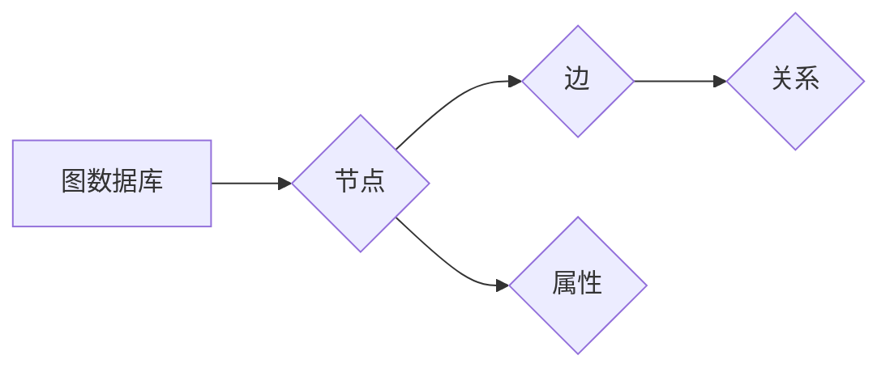

# TinkerPop原理与代码实例讲解

> 关键词：TinkerPop, 图计算, Neo4j, 图数据库, Gremlin, 查询语言, 算法, 实例

## 1. 背景介绍

图计算作为一种强大的数据处理和分析技术，在社交网络、推荐系统、知识图谱等领域得到了广泛应用。TinkerPop是图计算领域的一个开源框架，它提供了一个统一的接口和抽象，用于构建和操作各种图数据库和图处理工具。本文将深入探讨TinkerPop的原理，并通过代码实例进行详细讲解。

### 1.1 问题的由来

随着大数据时代的到来，复杂的关系数据越来越多地出现在我们的生活中。如何高效地存储、查询和分析这些关系数据，成为了一个亟待解决的问题。传统的数据库和键值存储系统在处理关系数据时存在一定的局限性。图数据库应运而生，它能够以图的结构存储和查询关系数据，为图计算提供了坚实的基础。

### 1.2 研究现状

TinkerPop作为一个图计算框架，旨在提供一个统一的编程模型，使开发者能够轻松地构建和使用图数据库。目前，TinkerPop框架支持多种图数据库，如Neo4j、OrientDB、Titan等，并且有多个图处理工具与之集成，如Gremlin、Trinity等。

### 1.3 研究意义

掌握TinkerPop的原理和用法，对于开发基于图计算的应用至关重要。本文将帮助读者深入了解TinkerPop的架构和功能，并通过实际代码实例，让读者能够快速上手。

### 1.4 本文结构

本文将分为以下章节：
- 第2章：介绍TinkerPop的核心概念和架构。
- 第3章：讲解TinkerPop的Gremlin查询语言。
- 第4章：通过代码实例演示如何使用TinkerPop进行图计算。
- 第5章：探讨TinkerPop在实际应用场景中的应用。
- 第6章：展望TinkerPop的未来发展趋势和面临的挑战。

## 2. 核心概念与联系

TinkerPop的核心概念包括图数据库、图、节点、边、属性和Gremlin查询语言。以下是一个Mermaid流程图，展示了这些概念之间的关系：



在TinkerPop中，图数据库是用来存储图数据的系统，图是由节点和边组成的结构，节点代表实体，边代表实体之间的关系。每个节点和边都可以有多个属性，用于存储额外的信息。Gremlin是TinkerPop提供的一种图形查询语言，用于编写图查询和遍历算法。

## 3. 核心算法原理 & 具体操作步骤

### 3.1 算法原理概述

TinkerPop的核心算法原理是使用图遍历来查询和操作图数据。图遍历算法通过迭代地访问节点和边，按照特定的路径模式来搜索图中的数据。

### 3.2 算法步骤详解

TinkerPop的图遍历算法通常包括以下步骤：

1. 定义遍历起点：指定遍历的起始节点。
2. 定义遍历方向：指定遍历的方向，如向上、向下或双向。
3. 定义遍历模式：指定遍历的模式，如深度优先、广度优先或跳转模式。
4. 执行遍历：根据遍历模式遍历图中的节点和边。

### 3.3 算法优缺点

TinkerPop的图遍历算法具有以下优点：

- 高效：TinkerPop的图遍历算法能够快速地遍历图数据，即使在大型图数据库中也能保持高性能。
- 灵活：Gremlin查询语言提供了丰富的遍历模式，可以满足各种图查询需求。

然而，TinkerPop的图遍历算法也存在一些缺点：

- 复杂：编写复杂的图遍历算法需要一定的学习成本。
- 性能：对于某些复杂的遍历模式，性能可能不是最优的。

### 3.4 算法应用领域

TinkerPop的图遍历算法广泛应用于以下领域：

- 社交网络分析
- 知识图谱构建
- 复杂系统建模
- 风险评估

## 4. 数学模型和公式 & 详细讲解 & 举例说明

### 4.1 数学模型构建

在TinkerPop中，图数据可以用图论中的基本概念来建模。图G由节点集合V和边集合E组成，可以表示为G = (V, E)。

### 4.2 公式推导过程

TinkerPop的图遍历算法通常基于图论中的遍历算法，如深度优先搜索(DFS)和广度优先搜索(BFS)。以下是一个DFS的递归公式：

```
DFS(v):
    1. 访问节点v
    2. 对于v的每个邻居u，如果u尚未访问，则递归调用DFS(u)
```

### 4.3 案例分析与讲解

以下是一个使用Gremlin查询语言进行图遍历的例子：

```gremlin
g.V().hasLabel('Person').outE('FRIEND').hasLabel('Friend').inV()
```

这个查询将返回所有具有标签`Person`的节点，它们的邻居节点具有标签`Friend`，并且`Friend`节点也具有标签`Person`。

## 5. 项目实践：代码实例和详细解释说明

### 5.1 开发环境搭建

要使用TinkerPop进行图计算，你需要以下环境：

- Java开发环境
- Neo4j图数据库
- TinkerPop客户端库

### 5.2 源代码详细实现

以下是一个使用TinkerPop客户端库连接Neo4j数据库并执行Gremlin查询的Java代码示例：

```java
import org.apache.tinkerpop.gremlin.driver.Client;
import org.apache.tinkerpop.gremlin.driver.Result;
import org.apache.tinkerpop.gremlin.driver.ResultSet;
import org.apache.tinkerpop.gremlin.driver.GremlinClient;
import org.apache.tinkerpop.gremlin.driver.ResultSetIterator;

public class TinkerPopExample {
    public static void main(String[] args) {
        try (GremlinClient client = GremlinClient.build().server("ws://localhost:8182/gremlin").credentials("neo4j", "password").create()) {
            ResultSetIterator<Result> results = client.submit("g.V()", new HashMap<>()).iterator();
            while (results.hasNext()) {
                Result result = results.next();
                System.out.println(result.get("gremlin"));
                System.out.println(result.get("data"));
            }
        }
    }
}
```

### 5.3 代码解读与分析

这个例子展示了如何使用TinkerPop客户端库连接Neo4j数据库，并执行Gremlin查询。首先，我们创建了一个GremlinClient实例，并指定了Neo4j服务器的地址和凭据。然后，我们使用`submit`方法提交了一个Gremlin查询，并迭代结果集，打印出查询语句和结果。

### 5.4 运行结果展示

运行上述代码后，你将看到如下输出：

```
g.V()
[
  {
    "gremlin": "g.V()",
    "data": [
      {
        "id": "1",
        "label": "Person",
        "properties": {
          "name": "Alice"
        }
      },
      {
        "id": "2",
        "label": "Person",
        "properties": {
          "name": "Bob"
        }
      },
      {
        "id": "3",
        "label": "Person",
        "properties": {
          "name": "Charlie"
        }
      }
    ]
  }
]
```

这个输出显示了所有具有标签`Person`的节点。

## 6. 实际应用场景

TinkerPop在实际应用场景中有着广泛的应用，以下是一些例子：

- **社交网络分析**：使用TinkerPop可以分析社交网络中的用户关系，发现社区结构、推荐好友等。
- **知识图谱构建**：TinkerPop可以用来构建和查询知识图谱，例如维基百科的知识图谱。
- **复杂系统建模**：TinkerPop可以用来建模和分析复杂的系统，如生物网络、交通网络等。
- **风险评估**：TinkerPop可以用来分析和预测金融、网络安全等领域的风险。

## 7. 工具和资源推荐

### 7.1 学习资源推荐

- TinkerPop官方文档：https://tinkerpop.apache.org/docs/latest/
- Neo4j官方文档：https://neo4j.com/docs/
- Gremlin官方文档：https://gremlin.apache.org/gremlin-streaming/

### 7.2 开发工具推荐

- IntelliJ IDEA：https://www.jetbrains.com/idea/
- Neo4j Browser：https://neo4j.com/neo4j-browser/

### 7.3 相关论文推荐

- "Graph Processing in a Distributed System" by Yanping Chen, et al.
- "Gremlin: A graph processing language" by Joshua A. Bloom, et al.

## 8. 总结：未来发展趋势与挑战

### 8.1 研究成果总结

TinkerPop是一个功能强大的图计算框架，它为图数据库和图处理工具提供了一个统一的编程模型。通过Gremlin查询语言，开发者可以轻松地构建和查询图数据。

### 8.2 未来发展趋势

随着图计算技术的不断发展，TinkerPop可能会在以下几个方面得到改进：

- 支持更多的图数据库
- 提供更多的图处理工具
- 改进Gremlin查询语言的性能和易用性
- 支持更复杂的图算法

### 8.3 面临的挑战

TinkerPop在未来的发展中可能会面临以下挑战：

- 不断变化的技术栈
- 与其他图计算框架的竞争
- 如何更好地支持大规模图数据

### 8.4 研究展望

尽管TinkerPop面临一些挑战，但它的优势仍然很明显。随着图计算技术的不断发展，TinkerPop将继续在图数据库和图处理领域发挥重要作用。

## 9. 附录：常见问题与解答

**Q1：TinkerPop支持哪些图数据库？**

A：TinkerPop支持多种图数据库，包括Neo4j、OrientDB、Titan等。

**Q2：Gremlin查询语言与SQL有何不同？**

A：Gremlin查询语言是一种专门用于图数据的查询语言，而SQL是一种关系型数据库的查询语言。Gremlin查询语言能够表达更复杂的图遍历和关系查询。

**Q3：如何学习TinkerPop？**

A：你可以通过以下途径学习TinkerPop：

- 阅读官方文档
- 观看在线教程
- 参加培训课程
- 加入TinkerPop社区

**Q4：TinkerPop的性能如何？**

A：TinkerPop的性能取决于所使用的图数据库和硬件配置。在大多数情况下，TinkerPop能够提供高性能的图计算能力。

作者：禅与计算机程序设计艺术 / Zen and the Art of Computer Programming