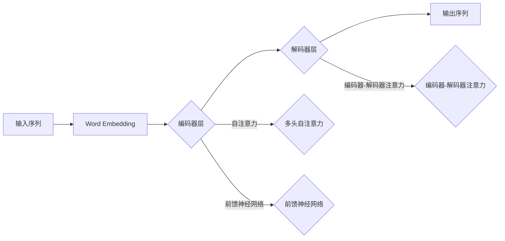

# Transformer大模型实战：ktrain库深度解析

> 关键词：Transformer, ktrain库, 深度学习, 自然语言处理, 编程实践, 微调, 代码示例

## 1. 背景介绍

近年来，深度学习在自然语言处理（NLP）领域取得了突破性的进展。Transformer模型因其强大的并行计算能力和对序列数据的良好处理能力，成为NLP领域的明星模型。ktrain是一个开源的Python库，它简化了深度学习模型的训练和评估过程，特别是针对Transformer模型，ktrain提供了便捷的接口和丰富的API，让开发者能够轻松地将Transformer应用于各种NLP任务。本文将深入探讨ktrain库，通过实战案例展示如何使用ktrain进行Transformer模型的训练和应用。

## 2. 核心概念与联系

### 2.1 Transformer模型原理

Transformer模型是一种基于自注意力（Self-Attention）机制的深度神经网络架构，它由Google团队在2017年提出。Transformer模型的核心思想是，通过自注意力机制来捕捉序列中单词之间的关系，而不是传统的循环神经网络（RNN）中的逐个时间步的依赖关系。

Mermaid流程图描述Transformer模型的核心原理如下：



### 2.2 ktrain库简介

ktrain是一个Python库，它基于PyTorch和Hugging Face的Transformers库，旨在简化深度学习模型的训练流程。ktrain提供了以下功能：

- 自动数据加载和预处理
- 模型选择和初始化
- 损失函数和优化器的配置
- 模型训练和评估
- 实时模型监控和调优

## 3. 核心算法原理 & 具体操作步骤

### 3.1 算法原理概述

ktrain库的核心原理是封装了深度学习模型训练的常见步骤，并提供了一套易用的API接口。开发者可以通过简单的代码调用实现模型训练和评估。

### 3.2 算法步骤详解

使用ktrain库进行Transformer模型训练的步骤如下：

1. 导入必要的库
2. 准备数据集
3. 创建模型
4. 定义训练参数
5. 训练模型
6. 评估模型
7. 部署模型

### 3.3 算法优缺点

**优点**：

- 简化训练流程，降低编程门槛
- 提供了丰富的预训练模型和任务模板
- 支持自动化的模型监控和调优

**缺点**：

- 隐藏了部分细节，对深度学习原理的理解有限
- 可能无法定制化复杂的模型结构

### 3.4 算法应用领域

ktrain库适用于各种NLP任务，包括：

- 文本分类
- 机器翻译
- 情感分析
- 问答系统
- 文本生成

## 4. 数学模型和公式 & 详细讲解 & 举例说明

### 4.1 数学模型构建

Transformer模型的核心是自注意力机制，其计算公式如下：

$$
\text{Attention}(Q, K, V) = \text{softmax}\left(\frac{QK^T}{\sqrt{d_k}}\right)V
$$

其中，$Q$、$K$ 和 $V$ 是查询（Query）、键（Key）和值（Value）矩阵，它们都是通过线性变换从输入序列的嵌入向量得到的。

### 4.2 公式推导过程

自注意力机制的推导过程涉及矩阵运算、softmax函数和点积计算。具体推导过程可参考Transformer模型的原论文。

### 4.3 案例分析与讲解

以下是一个使用ktrain库进行文本分类任务的代码示例：

```python
from ktrain import text
from ktrain import train

# 加载数据集
text_data = text.DataLoader('imdb')

# 创建模型
model = text.TextClassifier(text_data, text.pretrained_model('distilbert-base-uncased'))

# 训练模型
model.fit(0.1, 5)

# 评估模型
metrics = model.evaluate()
print(metrics)
```

## 5. 项目实践：代码实例和详细解释说明

### 5.1 开发环境搭建

首先，确保你的Python环境中安装了以下库：

- Python 3.6+
- PyTorch 1.6+
- Transformers 4.6+
- ktrain

可以通过以下命令安装ktrain库：

```bash
pip install ktrain
```

### 5.2 源代码详细实现

以下是一个使用ktrain库进行情感分析任务的完整代码示例：

```python
from ktrain import text
from ktrain import train

# 加载数据集
text_data = text.DataLoader('imdb')

# 创建模型
model = text.TextClassifier(text_data, text.pretrained_model('distilbert-base-uncased'))

# 定义训练参数
hyperparams = {'batch_size': 32, 'epochs': 5, 'lr': 5e-5}

# 训练模型
trainer = train.Trainer(hyperparams)
trainer.fit(model)

# 评估模型
metrics = model.evaluate()
print(metrics)

# 预测新数据
new_texts = ['This is a great movie!', 'I did not like the film.']
predictions = model.predict(new_texts)
print(predictions)
```

### 5.3 代码解读与分析

上述代码首先通过ktrain的`text.DataLoader`加载数据集，然后创建一个`TextClassifier`模型，该模型使用预训练的DistilBERT模型作为基础。通过`trainer.fit`函数进行模型训练，并在训练完成后使用`model.evaluate`函数进行模型评估。最后，使用`model.predict`函数对新数据进行预测。

### 5.4 运行结果展示

运行上述代码后，你将在终端看到模型的评估结果和预测结果。评估结果包括准确率、召回率、F1分数等指标，预测结果将给出文本的情感倾向。

## 6. 实际应用场景

ktrain库的Transformer模型在多个实际应用场景中取得了显著的效果，以下是一些典型应用：

- **社交媒体分析**：分析用户评论的情感倾向，识别热门话题。
- **客户服务**：自动分类客户咨询，提供个性化服务。
- **新闻推荐**：根据用户兴趣推荐相关新闻。
- **金融分析**：预测股票价格趋势，进行风险评估。

## 7. 工具和资源推荐

### 7.1 学习资源推荐

- 《Transformers: State-of-the-Art Natural Language Processing》
- 《Deep Learning for Natural Language Processing》
- ktrain官方文档

### 7.2 开发工具推荐

- PyTorch
- Transformers
- ktrain

### 7.3 相关论文推荐

- **Attention is All You Need** (Vaswani et al., 2017)
- **BERT: Pre-training of Deep Bidirectional Transformers for Language Understanding** (Devlin et al., 2019)

## 8. 总结：未来发展趋势与挑战

### 8.1 研究成果总结

本文介绍了Transformer大模型和ktrain库，通过实际案例展示了如何使用ktrain进行Transformer模型的训练和应用。ktrain库简化了深度学习模型的训练过程，为开发者提供了便捷的工具。

### 8.2 未来发展趋势

未来，ktrain库可能会集成更多预训练模型和任务模板，支持更多类型的深度学习模型，并提供更丰富的API接口。

### 8.3 面临的挑战

ktrain库在易用性方面取得了很大的成功，但同时也面临着以下挑战：

- **模型的可解释性**：如何解释模型决策背后的原因。
- **模型的泛化能力**：如何提高模型在不同数据集上的泛化能力。
- **模型的鲁棒性**：如何提高模型对抗攻击的鲁棒性。

### 8.4 研究展望

随着深度学习技术的不断发展，ktrain库将继续在NLP领域发挥重要作用。未来，ktrain可能会与其他人工智能技术（如强化学习、迁移学习）相结合，为开发者提供更加智能化的深度学习工具。

## 9. 附录：常见问题与解答

**Q1：ktrain与Transformers库的关系是什么？**

A：ktrain是基于Transformers库构建的，它简化了Transformers库的使用，为开发者提供了更易用的API接口。

**Q2：ktrain适用于哪些NLP任务？**

A：ktrain适用于各种NLP任务，包括文本分类、机器翻译、情感分析、问答系统、文本生成等。

**Q3：如何解决模型过拟合问题？**

A：可以通过增加数据集、使用正则化技术（如Dropout）、早停法（Early Stopping）等方法来解决模型过拟合问题。

**Q4：如何提高模型的泛化能力？**

A：可以通过数据增强、迁移学习、多任务学习等方法来提高模型的泛化能力。

**Q5：如何解释模型决策背后的原因？**

A：可以通过注意力机制可视化、特征重要性分析等方法来解释模型决策背后的原因。

作者：禅与计算机程序设计艺术 / Zen and the Art of Computer Programming