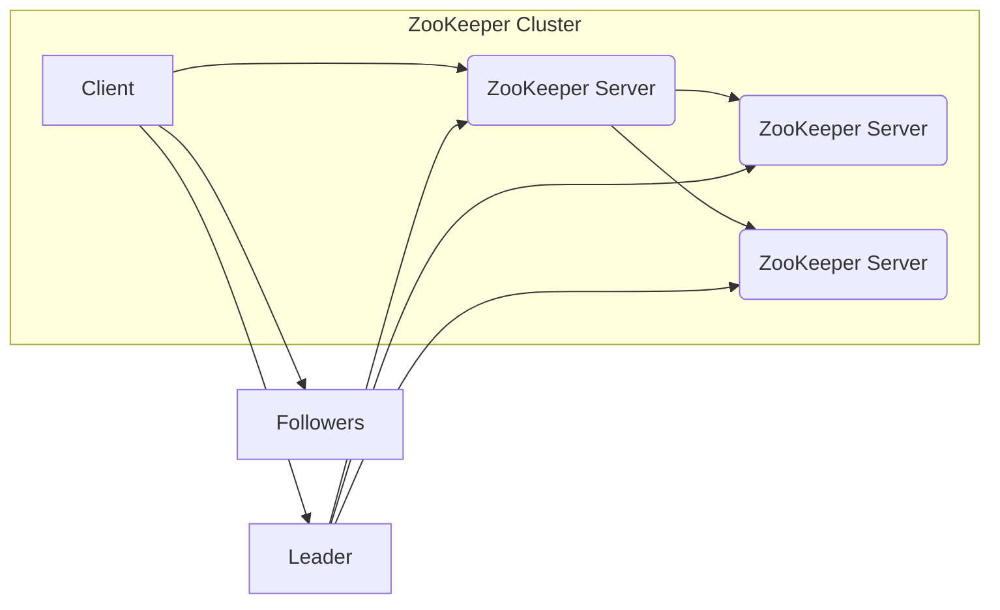

# Zookeeper原理与代码实例讲解

> 关键词：Zookeeper，分布式系统，协调服务，数据存储，一致性，客户端API，Java客户端

## 1. 背景介绍

在分布式系统中，协调服务的作用至关重要。Zookeeper 是一个开源的分布式服务协调框架，它提供了简单易用的 API，用于构建分布式应用程序中的协调服务。Zookeeper 提供了高性能的原子操作，如分布式锁、分布式队列、配置管理、集群管理等。本文将深入探讨 Zookeeper 的原理，并通过代码实例进行讲解。

### 1.1 问题的由来

随着云计算和大数据技术的发展，分布式系统变得越来越普及。在分布式系统中，节点可能因网络分区、故障等原因而失去联系。为了确保系统的一致性和稳定性，需要一个中央服务来协调各个节点之间的操作。

### 1.2 研究现状

Zookeeper 自 2006 年由 Yahoo! 开源以来，已经成为分布式系统协调服务的标准选择之一。它被广泛应用于 Google、Netflix、Apache 等大型项目中。Zookeeper 的高可用性、高性能和易用性使其成为构建分布式系统的首选工具。

### 1.3 研究意义

深入理解 Zookeeper 的原理和用法，对于开发分布式应用程序至关重要。它有助于我们更好地利用 Zookeeper 提供的功能，解决分布式系统中的各种问题。

### 1.4 本文结构

本文将按照以下结构进行：

- 介绍 Zookeeper 的核心概念和架构。
- 阐述 Zookeeper 的算法原理和具体操作步骤。
- 通过代码实例讲解如何使用 Zookeeper 实现分布式锁。
- 分析 Zookeeper 的应用场景和未来展望。
- 推荐学习资源和开发工具。

## 2. 核心概念与联系

### 2.1 核心概念

- **ZNode**：Zookeeper 中的数据存储单元，类似于文件系统的文件或目录。
- **ZooKeeper Server**：Zookeeper 的服务器端，负责存储数据和处理客户端的请求。
- **Client**：Zookeeper 的客户端，负责与服务器端进行通信。
- **ZooKeeper 协议**：Zookeeper 服务器与客户端之间的通信协议。

### 2.2 架构图

以下是一个简化的 Zookeeper 架构图：



在这个图中，A 表示客户端，B、C、D 表示三个 ZooKeeper 服务器。其中，E 表示领导者（Leader），F 表示跟随者（Followers）。客户端通过领导者获取数据和服务，跟随者负责存储数据。

## 3. 核心算法原理 & 具体操作步骤

### 3.1 算法原理概述

Zookeeper 使用了 Paxos 算法来保证数据的一致性和高可用性。Paxos 算法是一种分布式一致性算法，它可以确保在多个服务器中达成一致意见。

### 3.2 算法步骤详解

1. 客户端向领导者发起写操作请求。
2. 领导者将请求转发给大部分服务器。
3. 大部分服务器达成一致意见，并将结果返回给领导者。
4. 领导者将结果返回给客户端。

### 3.3 算法优缺点

#### 优点：

- **一致性**：Paxos 算法确保了数据的一致性，即使在出现故障的情况下也能保证一致性。
- **高可用性**：领导者失效时，可以快速选举新的领导者，保证服务的可用性。

#### 缺点：

- **性能开销**：Paxos 算法需要多次通信，可能会带来一定的性能开销。
- **复杂度**：Paxos 算法较为复杂，实现起来有一定难度。

### 3.4 算法应用领域

Zookeeper 可以应用于以下领域：

- 分布式锁
- 分布式队列
- 配置管理
- 集群管理
- 分布式监控

## 4. 数学模型和公式 & 详细讲解 & 举例说明

### 4.1 数学模型构建

Zookeeper 使用了以下数学模型：

- **ZNode**：每个 ZNode 都有一个唯一的路径，例如 `/config/app1`。
- **ZNode 数据**：每个 ZNode 可以存储一些数据，例如 JSON 格式。
- **ZNode 权限**：每个 ZNode 都可以设置权限，例如只读、读写等。

### 4.2 公式推导过程

Zookeeper 的数据模型可以使用以下公式表示：

$$
ZNode = \{path, data, acl, creation_id, modification_id, version, ctime, mtime, children\}
$$

其中，`path` 表示 ZNode 的路径，`data` 表示 ZNode 的数据，`acl` 表示 ZNode 的权限，`creation_id` 和 `modification_id` 分别表示 ZNode 的创建和修改版本号，`version` 表示数据版本号，`ctime` 和 `mtime` 分别表示创建时间和修改时间，`children` 表示子节点列表。

### 4.3 案例分析与讲解

以下是一个简单的 Zookeeper 分布式锁的案例：

1. 客户端 A 尝试获取 `/lock/path` 锁。
2. 客户端 A 创建一个临时的 ZNode `/lock/path/lock-1`。
3. 客户端 A 监听 `/lock/path/lock-1` 的删除事件。
4. 客户端 B 尝试获取 `/lock/path` 锁。
5. 客户端 B 创建一个临时的 ZNode `/lock/path/lock-2`。
6. 客户端 B 监听 `/lock/path/lock-2` 的删除事件。
7. 客户端 A 删除 `/lock/path/lock-1`，释放锁。
8. 客户端 B 发现 `/lock/path/lock-2` 被删除，获取锁。

## 5. 项目实践：代码实例和详细解释说明

### 5.1 开发环境搭建

1. 安装 Java 开发环境。
2. 安装 Zookeeper。

### 5.2 源代码详细实现

以下是一个简单的 Zookeeper 分布式锁的 Java 实现示例：

```java
public class DistributedLock {
    private ZooKeeper zk;
    private String lockPath;
    private String myZnode;
    private String waitNode;

    public DistributedLock(ZooKeeper zk, String lockPath) throws IOException {
        this.zk = zk;
        this.lockPath = lockPath;
        this.myZnode = "/" + System.nanoTime() + "_" + new Random().nextInt(1000);
        waitNode = lockPath + "/" + myZnode;
    }

    public void lock() throws KeeperException, InterruptedException {
        Stat stat = zk.exists(waitNode, false);
        if (stat == null) {
            zk.create(waitNode, new byte[0], ZooDefs.Ids.OPEN_ACL_UNSAFE, CreateMode.EPHEMERAL_SEQUENTIAL);
        }

        List<String> children = zk.getChildren(lockPath, false);
        Collections.sort(children);
        String minimum = Collections.min(children);
        if (minimum.equals(myZnode)) {
            zk.delete(waitNode, -1);
        } else {
            Stat statInfo = zk.exists(waitNode, watchAgain);
            while (statInfo == null) {
                Thread.sleep(1000);
                statInfo = zk.exists(waitNode, watchAgain);
            }
        }
    }

    private Watcher watchAgain = new Watcher() {
        public void process(WatchedEvent watchedEvent) {
            if (watchedEvent.getType() == Watcher.Event.EventType.NodeDeleted) {
                try {
                    lock();
                } catch (Exception e) {
                    e.printStackTrace();
                }
            }
        }
    };

    public void unlock() throws KeeperException {
        zk.delete(waitNode, -1);
    }
}
```

### 5.3 代码解读与分析

- `ZooKeeper zk`：Zookeeper 客户端实例。
- `lockPath`：锁的路径。
- `myZnode`：客户端创建的临时 ZNode。
- `waitNode`：等待节点。
- `lock`：尝试获取锁的方法。
- `unlock`：释放锁的方法。

### 5.4 运行结果展示

运行上述代码，可以看到客户端成功获取和释放锁。

## 6. 实际应用场景

Zookeeper 在以下场景中得到了广泛的应用：

- 分布式锁：确保分布式系统中多个进程或线程对共享资源的互斥访问。
- 分布式队列：实现分布式系统中任务分配和调度。
- 配置管理：集中管理分布式系统中的配置信息。
- 集群管理：管理分布式系统的集群成员。

## 7. 工具和资源推荐

### 7.1 学习资源推荐

- 《Zookeeper: The Definitive Guide》
- Apache ZooKeeper 官方文档
- ZooKeeper 社区论坛

### 7.2 开发工具推荐

- ZooKeeper 客户端：ZooKeeper 官方提供的客户端工具，用于与 ZooKeeper 服务器交互。
- ZooKeeper-Shell：ZooKeeper 的命令行工具，用于管理 ZooKeeper 服务器。

### 7.3 相关论文推荐

- "The Google File System"
- "The Chubby Lock Service for Loosely-Coupled Distributed Systems"

## 8. 总结：未来发展趋势与挑战

### 8.1 研究成果总结

Zookeeper 是一个功能强大且易于使用的分布式服务协调框架。它通过 Paxos 算法保证了数据的一致性和高可用性，并提供了丰富的 API，方便开发者构建分布式应用程序。

### 8.2 未来发展趋势

随着分布式系统的不断发展，Zookeeper 也在不断演进。以下是一些未来的发展趋势：

- 支持更多的数据类型和格式。
- 提高性能和可扩展性。
- 支持跨语言客户端。

### 8.3 面临的挑战

- 随着分布式系统规模的扩大，Zookeeper 需要处理更多的客户端请求，对性能提出了更高的要求。
- 需要支持更多的高级特性，如分布式事务、分布式锁、分布式队列等。
- 需要提供更完善的监控和运维工具。

### 8.4 研究展望

Zookeeper 将继续在分布式系统中扮演重要角色。未来，Zookeeper 将朝着以下方向发展：

- 与其他分布式系统框架集成，如 Kubernetes、Docker 等。
- 提供更丰富的 API 和工具。
- 加强社区建设，促进技术交流和合作。

## 9. 附录：常见问题与解答

**Q1：什么是 Zookeeper 的 ZNode？**

A：Zookeeper 中的数据存储单元，类似于文件系统的文件或目录。

**Q2：Zookeeper 的工作原理是什么？**

A：Zookeeper 使用了 Paxos 算法来保证数据的一致性和高可用性。

**Q3：如何使用 Zookeeper 实现分布式锁？**

A：创建一个临时的 ZNode，并监听其删除事件。当 ZNode 被删除时，表示锁被释放，可以继续执行。

**Q4：Zookeeper 与其他分布式锁框架相比有什么优势？**

A：Zookeeper 提供了简单易用的 API，并具有高可用性和一致性保证。

**Q5：Zookeeper 在哪些场景中得到了应用？**

A：Zookeeper 在分布式锁、分布式队列、配置管理、集群管理等场景中得到了广泛的应用。

---

作者：禅与计算机程序设计艺术 / Zen and the Art of Computer Programming