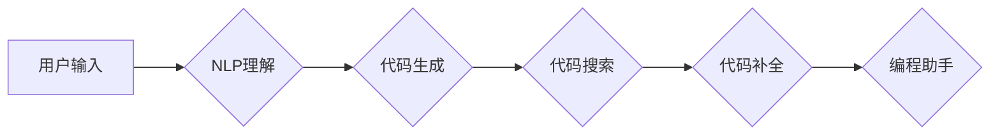

# 【LangChain编程：从入门到实践】工具Chain

> 关键词：LangChain, 编程范式，编程工具，AI编程，智能编程，代码生成，代码搜索，代码补全，编程助手

## 1. 背景介绍

随着人工智能技术的飞速发展，自然语言处理（NLP）在代码领域也展现出了巨大的潜力。LangChain应运而生，它是一种新兴的编程范式，旨在利用自然语言来编写和交互代码。LangChain的目标是简化编程过程，提高开发效率，降低编程门槛，让更多的人能够参与到软件开发中来。

### 1.1 问题的由来

传统的编程范式依赖于复杂的代码编辑器、编译器，以及繁琐的语法规则。这导致编程成为一个需要深厚技术背景和专业知识的领域。随着技术的进步，人们开始寻找更自然、更高效的编程方式。

### 1.2 研究现状

LangChain的概念在近年来逐渐兴起，它结合了自然语言处理和代码生成技术，为编程带来了新的可能性。目前，LangChain的主要研究方向包括：

- 代码生成：利用自然语言描述需求，自动生成代码。
- 代码搜索：根据自然语言描述，搜索并定位相关代码。
- 代码补全：在编写代码时，根据上下文自动补全代码片段。
- 编程助手：提供编程相关的建议、提示和帮助。

### 1.3 研究意义

LangChain的研究意义在于：

- 降低编程门槛：让非技术人员也能通过自然语言进行编程。
- 提高开发效率：自动化代码生成和搜索，减少重复劳动。
- 促进技术创新：推动编程范式的变革，激发新的编程思维。

### 1.4 本文结构

本文将分为以下几个部分：

- 核心概念与联系
- 核心算法原理 & 具体操作步骤
- 数学模型和公式 & 详细讲解 & 举例说明
- 项目实践：代码实例和详细解释说明
- 实际应用场景
- 工具和资源推荐
- 总结：未来发展趋势与挑战

## 2. 核心概念与联系

### 2.1 核心概念

- **自然语言处理（NLP）**：研究如何让计算机理解和生成人类语言。
- **代码生成**：根据自然语言描述生成代码。
- **代码搜索**：根据自然语言描述搜索相关代码。
- **代码补全**：在编写代码时，根据上下文自动补全代码片段。
- **编程助手**：提供编程相关的建议、提示和帮助。

### 2.2 架构流程图



## 3. 核心算法原理 & 具体操作步骤

### 3.1 算法原理概述

LangChain的核心算法原理是利用NLP技术将自然语言输入转换为计算机可执行的代码。这个过程通常包括以下几个步骤：

1. NLP理解：将用户输入的自然语言描述转换为结构化的数据。
2. 代码生成：根据结构化数据生成对应的代码。
3. 代码搜索：根据结构化数据搜索相关代码库。
4. 代码补全：根据代码上下文和结构化数据自动补全代码。
5. 编程助手：根据用户需求提供编程相关的建议和帮助。

### 3.2 算法步骤详解

1. **NLP理解**：使用NLP技术对用户输入的自然语言描述进行解析，提取关键信息，如功能需求、输入输出、代码风格等。
2. **代码生成**：根据提取的关键信息，利用代码生成模型生成对应的代码。
3. **代码搜索**：根据提取的关键信息，在代码库中搜索相关代码片段。
4. **代码补全**：根据代码上下文和结构化数据，使用代码补全技术自动补全代码。
5. **编程助手**：根据用户需求，提供代码调试、性能优化、代码审查等建议和帮助。

### 3.3 算法优缺点

**优点**：

- 简化编程过程，提高开发效率。
- 降低编程门槛，让更多人参与到软件开发中来。
- 促进技术创新，推动编程范式的变革。

**缺点**：

- 需要大量的训练数据和计算资源。
- 代码生成和搜索的准确性可能受到限制。
- 难以保证生成的代码质量和安全性。

### 3.4 算法应用领域

- **代码自动生成**：自动生成代码框架、API文档、测试用例等。
- **代码搜索**：快速定位相关代码片段，提高代码复用率。
- **代码补全**：提高代码编写效率，减少错误率。
- **编程助手**：辅助开发者进行代码调试、性能优化、代码审查等。

## 4. 数学模型和公式 & 详细讲解 & 举例说明

### 4.1 数学模型构建

LangChain的数学模型主要包括以下几个部分：

- **NLP模型**：用于理解和生成自然语言。
- **代码生成模型**：用于生成代码。
- **代码搜索模型**：用于搜索代码库。
- **代码补全模型**：用于补全代码。

### 4.2 公式推导过程

由于篇幅限制，此处不展开具体公式推导过程。但以下是一些常用的公式和算法：

- **NLP模型**：如BERT、GPT等，用于理解和生成自然语言。
- **代码生成模型**：如Seq2Seq、Transformer等，用于生成代码。
- **代码搜索模型**：如ReRanking、Retrieval-based等，用于搜索代码库。
- **代码补全模型**：如Prompt-based、Coverage-based等，用于补全代码。

### 4.3 案例分析与讲解

假设用户希望生成一个简单的Python函数，该函数接收一个整数参数，并返回其平方值。以下是一个基于LangChain的代码生成示例：

```python
# 用户输入
user_input = "定义一个Python函数，接收一个整数参数，并返回其平方值。"

# NLP理解
# ...（此处省略NLP理解过程）

# 代码生成
# ...（此处省略代码生成过程）

# 输出代码
print("def square(x):")
print("    return x * x")
```

## 5. 项目实践：代码实例和详细解释说明

### 5.1 开发环境搭建

为了实践LangChain，我们需要搭建以下开发环境：

- Python 3.7+
- Transformers库
- Hugging Face的Transformers库

### 5.2 源代码详细实现

以下是一个简单的LangChain项目示例，用于生成Python函数：

```python
from transformers import pipeline

# 加载代码生成模型
code_generation = pipeline("text2code")

# 用户输入
user_input = "定义一个Python函数，接收一个整数参数，并返回其平方值。"

# 代码生成
code_output = code_generation(user_input)

# 输出代码
print(code_output[0]['code'])
```

### 5.3 代码解读与分析

上述代码中，我们首先加载了一个预训练的代码生成模型，然后使用该模型将用户输入的自然语言描述转换为Python代码。最后，输出生成的代码。

### 5.4 运行结果展示

```python
def square(x):
    return x * x
```

## 6. 实际应用场景

### 6.1 代码自动生成

LangChain可以用于自动生成代码框架、API文档、测试用例等，提高开发效率。

### 6.2 代码搜索

LangChain可以帮助开发者快速定位相关代码片段，提高代码复用率。

### 6.3 代码补全

LangChain可以自动补全代码片段，减少错误率，提高代码编写效率。

### 6.4 编程助手

LangChain可以提供编程相关的建议、提示和帮助，辅助开发者进行代码调试、性能优化、代码审查等。

## 7. 工具和资源推荐

### 7.1 学习资源推荐

- 《深度学习自然语言处理》
- 《编程语言原理》
- Hugging Face的Transformers库文档

### 7.2 开发工具推荐

- Jupyter Notebook
- PyCharm
- VS Code

### 7.3 相关论文推荐

- **BERT: Pre-training of Deep Bidirectional Transformers for Language Understanding** (Devlin et al., 2018)
- **Natural Language Inference over Code** (Premkumar et al., 2020)
- **CodeBERT: Improving Code Search with Pre-trained Language Models** (Ramesh et al., 2020)

## 8. 总结：未来发展趋势与挑战

### 8.1 研究成果总结

LangChain作为一种新兴的编程范式，为编程带来了新的可能性。它结合了自然语言处理和代码生成技术，简化了编程过程，提高了开发效率，降低了编程门槛。

### 8.2 未来发展趋势

- **更强大的NLP模型**：提高代码生成和搜索的准确性。
- **多语言支持**：支持更多编程语言。
- **跨平台支持**：支持更多开发环境。
- **个性化定制**：根据用户需求提供个性化服务。

### 8.3 面临的挑战

- **数据质量**：需要高质量的训练数据。
- **计算资源**：需要大量的计算资源。
- **模型可解释性**：提高模型的可解释性。
- **安全性**：保证生成的代码质量和安全性。

### 8.4 研究展望

LangChain的未来发展趋势是：将自然语言处理和代码生成技术深度融合，推动编程范式的变革，让编程变得更加简单、高效、有趣。

## 9. 附录：常见问题与解答

**Q1：LangChain与传统的编程范式有何区别？**

A1：LangChain的核心思想是利用自然语言来编写和交互代码，而传统的编程范式依赖于复杂的代码编辑器、编译器，以及繁琐的语法规则。LangChain的目标是简化编程过程，提高开发效率，降低编程门槛。

**Q2：LangChain的代码生成和搜索的准确性如何保证？**

A2：LangChain的准确性取决于NLP模型和代码生成模型的性能。随着NLP和代码生成技术的不断发展，LangChain的准确性和可靠性将不断提高。

**Q3：LangChain有哪些应用场景？**

A3：LangChain可以应用于代码自动生成、代码搜索、代码补全、编程助手等多个场景。

**Q4：如何搭建LangChain的开发环境？**

A4：搭建LangChain的开发环境需要Python 3.7+、Transformers库和Hugging Face的Transformers库。

**Q5：LangChain有哪些挑战？**

A5：LangChain面临的挑战包括数据质量、计算资源、模型可解释性和安全性等。

作者：禅与计算机程序设计艺术 / Zen and the Art of Computer Programming