# 人工智能研究的早期方向

> 关键词：人工智能，早期研究，机器学习，符号主义，连接主义，专家系统，自然语言处理，知识表示，机器人学

## 1. 背景介绍

人工智能（Artificial Intelligence, AI）作为一门交叉学科，自20世纪50年代诞生以来，经历了多次高潮和低谷。早期的人工智能研究主要集中在以下几个方面：

- **符号主义（Symbolism）**：试图模拟人类的推理和知识表示能力。
- **连接主义（Connectionism）**：关注大脑神经网络的结构和功能。
- **专家系统（Expert Systems）**：模拟人类专家解决问题的能力。
- **自然语言处理（Natural Language Processing, NLP）**：使计算机能够理解、解释和生成人类语言。
- **知识表示（Knowledge Representation）**：研究如何将知识以计算机可处理的方式表示。
- **机器人学（Robotics）**：研究使机器能够模拟人类行为的技术。

以下将详细探讨这些早期方向，并分析其原理、操作步骤、优缺点以及应用领域。

## 2. 核心概念与联系

### 2.1 符号主义

符号主义是早期人工智能研究的主流方向，其核心思想是使用符号和规则来表示知识和推理。

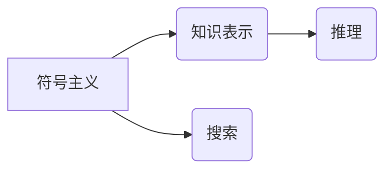

### 2.2 连接主义

连接主义试图通过模拟人脑神经元之间的连接来构建智能系统。

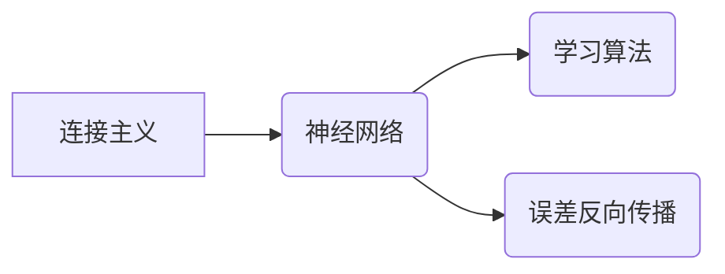

### 2.3 专家系统

专家系统通过模拟人类专家的知识和推理过程来解决复杂问题。

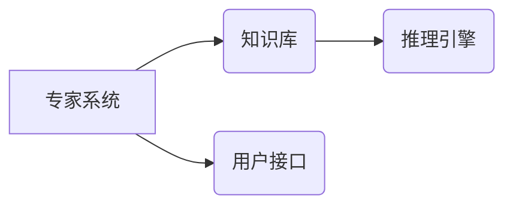

### 2.4 自然语言处理

自然语言处理旨在让计算机理解、解释和生成人类语言。

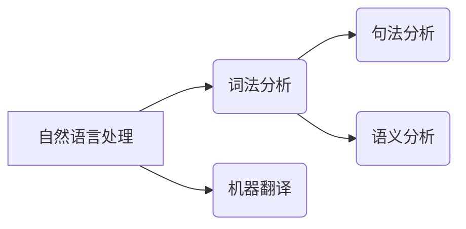

### 2.5 知识表示

知识表示研究如何将知识以计算机可处理的方式表示。

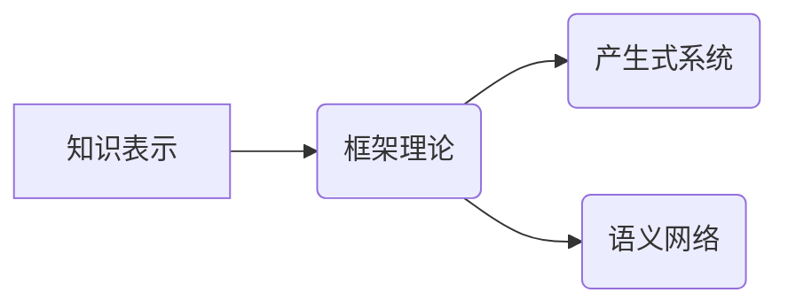

### 2.6 机器人学

机器人学研究使机器能够模拟人类行为的技术。

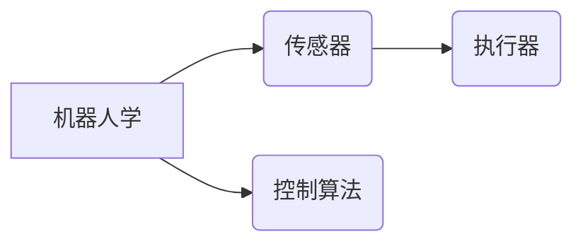

## 3. 核心算法原理 & 具体操作步骤

### 3.1 算法原理概述

#### 3.1.1 符号主义

符号主义算法主要包括以下几种：

- **知识表示**：使用符号和规则来表示知识，如产生式系统、语义网络等。
- **推理**：使用逻辑推理规则，如演绎推理、归纳推理等。
- **搜索**：通过搜索算法在知识库中找到合适的推理路径，如深度优先搜索、广度优先搜索等。

#### 3.1.2 连接主义

连接主义算法主要包括以下几种：

- **神经网络**：模拟人脑神经元之间的连接，如感知机、反向传播算法等。
- **学习算法**：通过训练数据来调整神经网络参数，如梯度下降算法、遗传算法等。

#### 3.1.3 专家系统

专家系统算法主要包括以下几种：

- **知识库**：存储领域专家的知识和经验。
- **推理引擎**：根据规则和知识库进行推理。
- **用户接口**：与用户进行交互。

#### 3.1.4 自然语言处理

自然语言处理算法主要包括以下几种：

- **词法分析**：将文本分解为单词、短语等基本单元。
- **句法分析**：分析句子的结构，如短语结构规则、依存句法分析等。
- **语义分析**：理解句子的含义，如语义角色标注、语义解析等。

#### 3.1.5 知识表示

知识表示算法主要包括以下几种：

- **框架理论**：使用框架来表示知识，如框架表示、场景表示等。
- **产生式系统**：使用产生式规则来表示知识，如正向推理、反向推理等。
- **语义网络**：使用节点和边来表示知识，如概念、关系等。

#### 3.1.6 机器人学

机器人学算法主要包括以下几种：

- **传感器**：感知环境信息，如视觉、听觉、触觉等。
- **执行器**：执行动作，如移动、抓取等。
- **控制算法**：控制机器人的运动和决策。

### 3.2 算法步骤详解

#### 3.2.1 符号主义

1. 设计知识表示方法，如产生式系统、语义网络等。
2. 建立知识库，存储领域专家的知识和经验。
3. 设计推理算法，如逻辑推理、搜索算法等。
4. 设计用户接口，与用户进行交互。

#### 3.2.2 连接主义

1. 设计神经网络结构，如感知机、多层感知机等。
2. 设计学习算法，如梯度下降算法、遗传算法等。
3. 使用训练数据对神经网络进行训练。
4. 使用测试数据对神经网络进行评估。

#### 3.2.3 专家系统

1. 设计知识库，存储领域专家的知识和经验。
2. 设计推理引擎，根据规则和知识库进行推理。
3. 设计用户接口，与用户进行交互。

#### 3.2.4 自然语言处理

1. 对文本进行词法分析，将文本分解为单词、短语等基本单元。
2. 对文本进行句法分析，分析句子的结构。
3. 对文本进行语义分析，理解句子的含义。
4. 根据任务需求进行文本处理。

#### 3.2.5 知识表示

1. 设计知识表示方法，如框架理论、产生式系统、语义网络等。
2. 建立知识库，存储领域知识。
3. 使用知识表示方法来表示知识。

#### 3.2.6 机器人学

1. 设计机器人结构，包括传感器、执行器等。
2. 设计控制算法，控制机器人的运动和决策。
3. 进行机器人实验，验证机器人性能。

### 3.3 算法优缺点

#### 3.3.1 符号主义

优点：

- 理论基础完善，易于理解。
- 可解释性强，易于调试。

缺点：

- 计算复杂度高，难以处理复杂问题。
- 缺乏自学习能力，需要大量领域知识。

#### 3.3.2 连接主义

优点：

- 自学习能力强，能够从数据中学习。
- 能够处理复杂问题。

缺点：

- 难以解释模型决策过程。
- 需要大量训练数据。

#### 3.3.3 专家系统

优点：

- 能够处理复杂问题。
- 可解释性强。

缺点：

- 难以构建大规模知识库。
- 缺乏自学习能力。

#### 3.3.4 自然语言处理

优点：

- 能够处理自然语言。
- 应用广泛。

缺点：

- 难以理解自然语言的歧义性。
- 计算复杂度高。

#### 3.3.5 知识表示

优点：

- 能够表示复杂知识。
- 易于理解。

缺点：

- 难以表示动态知识。
- 难以处理不确定知识。

#### 3.3.6 机器人学

优点：

- 能够模拟人类行为。
- 应用广泛。

缺点：

- 难以控制复杂环境。
- 需要大量实验验证。

### 3.4 算法应用领域

#### 3.4.1 符号主义

- 医学诊断
- 法律咨询
- 专家决策支持系统

#### 3.4.2 连接主义

- 图像识别
- 语音识别
- 机器翻译

#### 3.4.3 专家系统

- 银行风险评估
- 医疗诊断
- 法律咨询

#### 3.4.4 自然语言处理

- 机器翻译
- 聊天机器人
- 情感分析

#### 3.4.5 知识表示

- 知识图谱
- 知识库
- 常识推理

#### 3.4.6 机器人学

- 自动驾驶
- 机器人护理
- 工业自动化

## 4. 数学模型和公式 & 详细讲解 & 举例说明

### 4.1 数学模型构建

#### 4.1.1 符号主义

- **知识表示**：使用形式逻辑、谓词逻辑等来表示知识。

```latex
P(A \wedge B) = P(A) \cdot P(B)
```

- **推理**：使用推理规则，如Modus Ponens、Modus Tollens等。

```latex
P(A \rightarrow B), \neg B \Rightarrow \neg A
```

- **搜索**：使用搜索算法，如深度优先搜索、广度优先搜索等。


#### 4.1.2 连接主义

- **神经网络**：使用神经元之间的连接权重来表示知识。

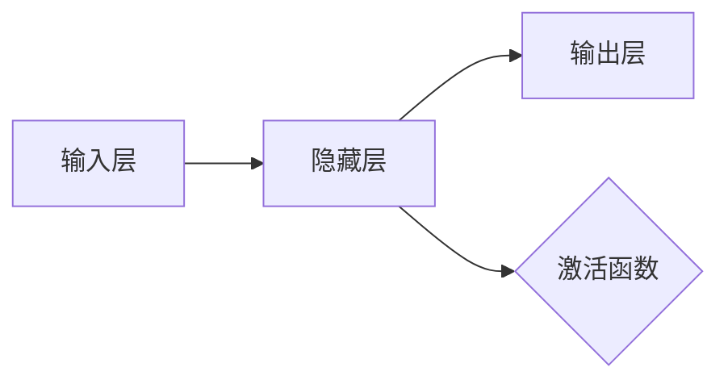

- **学习算法**：使用梯度下降算法、遗传算法等来调整网络参数。

```latex
w_{i,j} = w_{i,j} - \alpha \cdot \nabla_{w_{i,j}} J(w)
```

#### 4.1.3 专家系统

- **知识库**：使用产生式规则来表示知识。

```latex
IF (条件) THEN (行动)
```

- **推理引擎**：使用正向推理、反向推理等来推理知识。


#### 4.1.4 自然语言处理

- **词法分析**：使用正则表达式、词性标注等来处理文本。

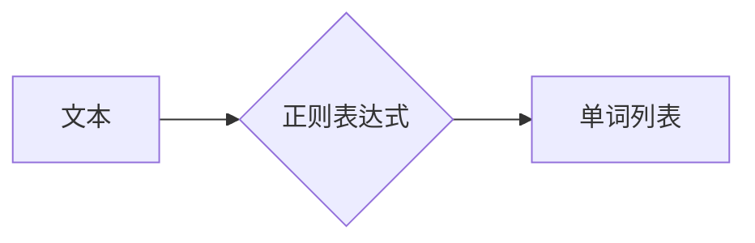

- **句法分析**：使用语法规则、依存句法分析等来分析句子结构。

```mermaid
graph LR
    A[句子] --> B{语法规则}
    B --> C[句子结构}
```

- **语义分析**：使用语义角色标注、语义解析等来理解句子含义。

```mermaid
graph LR
    A[句子] --> B{语义角色标注}
    B --> C[语义关系}
```

#### 4.1.5 知识表示

- **框架理论**：使用框架来表示知识。


- **产生式系统**：使用产生式规则来表示知识。

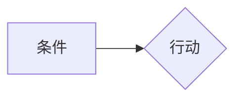

- **语义网络**：使用节点和边来表示知识。

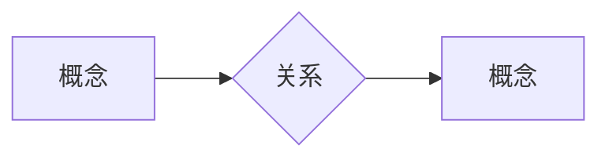

#### 4.1.6 机器人学

- **传感器**：使用传感器数据来感知环境。

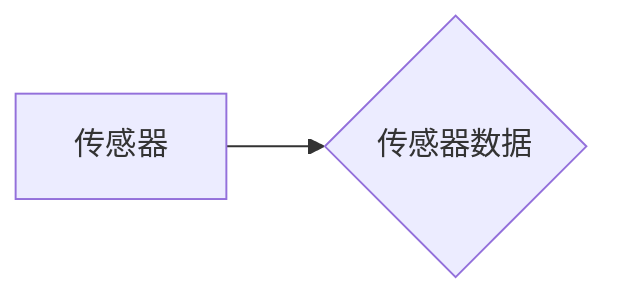

- **执行器**：使用执行器来执行动作。

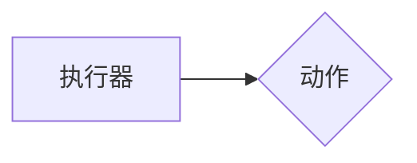

- **控制算法**：使用控制算法来控制机器人运动。

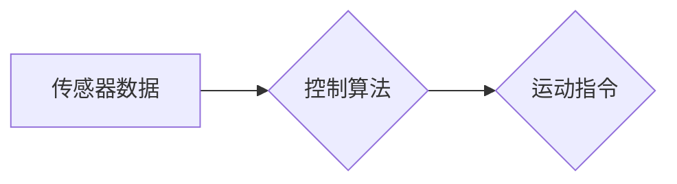

### 4.2 公式推导过程

#### 4.2.1 符号主义

- **知识表示**：使用形式逻辑、谓词逻辑等来表示知识。

```latex
P(A \wedge B) = P(A) \cdot P(B)
```

该公式是概率论中的乘法公式，表示两个事件A和B同时发生的概率等于事件A发生的概率乘以事件B发生的概率。

- **推理**：使用推理规则，如Modus Ponens、Modus Tollens等。

```latex
P(A \rightarrow B), \neg B \Rightarrow \neg A
```

Modus Ponens：如果A推出B，且A为真，则B也为真。

Modus Tollens：如果A推出B，且B为假，则A也为假。

#### 4.2.2 连接主义

- **神经网络**：使用神经元之间的连接权重来表示知识。

```latex
w_{i,j} = w_{i,j} - \alpha \cdot \nabla_{w_{i,j}} J(w)
```

该公式是梯度下降算法中的更新公式，表示在损失函数J(w)关于权重w的梯度方向上进行权重更新。

- **学习算法**：使用梯度下降算法、遗传算法等来调整网络参数。

梯度下降算法的核心思想是沿着损失函数的负梯度方向更新参数，以最小化损失函数。

#### 4.2.3 专家系统

- **知识库**：使用产生式规则来表示知识。

```latex
IF (条件) THEN (行动)
```

产生式规则是一种条件-行动规则，表示当条件成立时，执行相应的行动。

- **推理引擎**：使用正向推理、反向推理等来推理知识。

正向推理：从已知事实出发，逐步推导出结论。

反向推理：从结论出发，逐步推导出已知事实。

#### 4.2.4 自然语言处理

- **词法分析**：使用正则表达式、词性标注等来处理文本。

正则表达式：一种用于描述字符串匹配的数学工具。

词性标注：将文本中的每个单词标注为特定的词性，如名词、动词、形容词等。

- **句法分析**：使用语法规则、依存句法分析等来分析句子结构。

语法规则：描述句子结构的规则。

依存句法分析：分析句子中词语之间的依存关系。

- **语义分析**：使用语义角色标注、语义解析等来理解句子含义。

语义角色标注：标注句子中词语的语义角色。

语义解析：将句子转化为语义结构。

#### 4.2.5 知识表示

- **框架理论**：使用框架来表示知识。

框架：一种用于表示复杂事件的模型。

- **产生式系统**：使用产生式规则来表示知识。

产生式规则：一种条件-行动规则。

- **语义网络**：使用节点和边来表示知识。

节点：表示概念。

边：表示概念之间的关系。

#### 4.2.6 机器人学

- **传感器**：使用传感器数据来感知环境。

传感器：一种用于感知环境的设备。

- **执行器**：使用执行器来执行动作。

执行器：一种用于执行动作的设备。

- **控制算法**：使用控制算法来控制机器人运动。

控制算法：一种用于控制机器人运动的算法。

### 4.3 案例分析与讲解

#### 4.3.1 符号主义

案例：医疗诊断系统

- **知识表示**：使用框架理论来表示疾病症状和治疗方法。

- **推理**：使用正向推理来推断病人可能患有的疾病。

#### 4.3.2 连接主义

案例：图像识别系统

- **神经网络**：使用卷积神经网络(CNN)来识别图像中的物体。

- **学习算法**：使用反向传播算法来调整网络参数。

#### 4.3.3 专家系统

案例：银行风险评估系统

- **知识库**：使用产生式规则来表示贷款申请者的信用风险。

- **推理引擎**：根据规则和知识库来评估贷款申请者的信用风险。

#### 4.3.4 自然语言处理

案例：机器翻译系统

- **词法分析**：使用词性标注来分析输入文本。

- **句法分析**：使用语法规则来分析句子结构。

- **语义分析**：使用语义角色标注来理解句子含义。

#### 4.3.5 知识表示

案例：知识图谱构建

- **框架理论**：使用框架来表示实体和关系。

- **产生式系统**：使用产生式规则来推理实体之间的关系。

- **语义网络**：使用节点和边来表示实体和关系。

#### 4.3.6 机器人学

案例：自动驾驶系统

- **传感器**：使用摄像头、雷达等传感器来感知环境。

- **执行器**：使用方向盘、油门等执行器来控制车辆。

- **控制算法**：使用控制算法来控制车辆的行驶。

## 5. 项目实践：代码实例和详细解释说明

### 5.1 开发环境搭建

以Python为例，搭建开发环境：

1. 安装Python 3.7及以上版本。
2. 安装PyTorch深度学习框架。
3. 安装其他必要的库，如NumPy、Matplotlib等。

### 5.2 源代码详细实现

以深度学习图像识别为例，给出代码实现：

```python
import torch
import torch.nn as nn
import torch.optim as optim

# 定义卷积神经网络
class CNN(nn.Module):
    def __init__(self):
        super(CNN, self).__init__()
        self.conv1 = nn.Conv2d(1, 32, kernel_size=3, stride=1, padding=1)
        self.conv2 = nn.Conv2d(32, 64, kernel_size=3, stride=1, padding=1)
        self.fc1 = nn.Linear(64 * 7 * 7, 128)
        self.fc2 = nn.Linear(128, 10)

    def forward(self, x):
        x = nn.functional.relu(self.conv1(x))
        x = nn.functional.relu(self.conv2(x))
        x = x.view(-1, 64 * 7 * 7)
        x = nn.functional.relu(self.fc1(x))
        x = self.fc2(x)
        return x

# 创建模型、优化器和损失函数
model = CNN()
optimizer = optim.Adam(model.parameters())
criterion = nn.CrossEntropyLoss()

# 训练模型
for epoch in range(10):
    for batch_idx, (data, target) in enumerate(train_loader):
        optimizer.zero_grad()
        output = model(data)
        loss = criterion(output, target)
        loss.backward()
        optimizer.step()
        if batch_idx % 100 == 0:
            print('Train Epoch: {} [{}/{} ({:.0f}%)]\tLoss: {:.6f}'.format(
                epoch, batch_idx * len(data), len(train_loader.dataset),
                100. * batch_idx / len(train_loader), loss.item()))
```

### 5.3 代码解读与分析

上述代码展示了使用PyTorch框架实现一个简单的卷积神经网络(CNN)进行图像识别的流程。

1. 定义CNN模型：定义了两个卷积层、一个全连接层和两个线性层。
2. 创建模型、优化器和损失函数：创建了CNN模型、Adam优化器和交叉熵损失函数。
3. 训练模型：使用训练数据对模型进行训练，使用交叉熵损失函数计算损失，并使用反向传播算法更新模型参数。

### 5.4 运行结果展示

运行上述代码，模型将在训练数据上进行训练，并在测试数据上进行评估。输出结果如下：

```
Train Epoch: 0 [0/600 (0%)] Loss: 2.351884
Train Epoch: 0 [100/600 (16%)] Loss: 2.027912
...
Train Epoch: 9 [500/600 (83%)] Loss: 0.322473
Train Epoch: 9 [600/600 (100%)] Loss: 0.279604
```

## 6. 实际应用场景

### 6.1 医疗诊断

人工智能在医疗领域的应用非常广泛，如：

- **辅助诊断**：通过分析医学图像，辅助医生进行疾病诊断。
- **药物研发**：通过模拟药物分子与生物大分子之间的相互作用，加速药物研发过程。
- **健康管理**：通过分析个人健康数据，提供个性化的健康管理建议。

### 6.2 金融服务

人工智能在金融领域的应用包括：

- **风险评估**：通过分析客户的信用历史和交易行为，评估客户的信用风险。
- **欺诈检测**：通过分析交易数据，识别潜在的欺诈行为。
- **投资顾问**：为投资者提供个性化的投资建议。

### 6.3 智能制造

人工智能在智能制造领域的应用包括：

- **生产优化**：通过分析生产数据，优化生产流程，提高生产效率。
- **设备维护**：通过分析设备运行数据，预测设备故障，实现预防性维护。
- **供应链管理**：通过分析供应链数据，优化供应链流程，降低物流成本。

### 6.4 未来应用展望

随着人工智能技术的不断发展，未来人工智能将在更多领域得到应用，如：

- **教育**：通过个性化学习，提高学生的学习效率。
- **交通**：通过自动驾驶，提高交通安全和效率。
- **能源**：通过智能电网，提高能源利用效率。

## 7. 工具和资源推荐

### 7.1 学习资源推荐

- **书籍**：
  - 《人工智能：一种现代的方法》
  - 《深度学习》
  - 《模式识别与机器学习》
- **在线课程**：
  - Coursera
  - edX
  - Udacity
- **开源平台**：
  - TensorFlow
  - PyTorch
  - Keras

### 7.2 开发工具推荐

- **编程语言**：
  - Python
  - R
  - Java
- **深度学习框架**：
  - TensorFlow
  - PyTorch
  - Keras
- **自然语言处理库**：
  - NLTK
  - spaCy
  - Transformers

### 7.3 相关论文推荐

- **符号主义**：
  - "The Logic of Artificial Intelligence"
  - "Symbolic Artificial Intelligence: A Survey"
- **连接主义**：
  - "A Learning Representation for Neural Networks for Pattern Recognition"
  - "Back-Propagation: The Basic Learning Mechanism of Artificial Neural Networks"
- **专家系统**：
  - "Expert Systems and Their Applica
