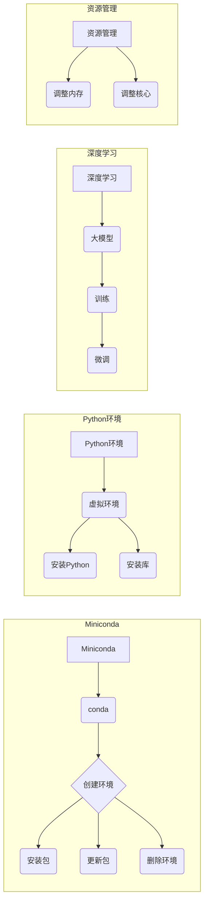

# 从零开始大模型开发与微调：Miniconda的下载与安装

> 关键词：Miniconda，conda，虚拟环境，大模型，开发环境，微调，Python，深度学习

## 1. 背景介绍

随着深度学习和大语言模型的快速发展，研究人员和开发者需要高效、可靠、可复现的实验环境。Miniconda 是一个开源的 Python 发行版和环境管理工具，它允许用户轻松创建和管理多个独立的 Python 环境和包。本文将详细介绍如何从零开始使用 Miniconda 进行大模型的开发与微调。

### 1.1 问题的由来

在深度学习和人工智能领域，研究人员经常需要使用多种不同的库和工具。这些库和工具可能存在版本冲突，导致实验无法复现。Miniconda 通过隔离不同的环境，有效地解决了这一问题。

### 1.2 研究现状

Miniconda 是 Anaconda 的轻量级分支，它提供了与 Anaconda 相同的核心功能，但体积更小，安装更简单。Miniconda 非常适合开发大模型，因为它允许用户：

- 管理多个独立的 Python 环境，每个环境都可以有自己特定的库和包版本。
- 使用 conda 来安装和更新软件包，包括 Python、深度学习库、文本处理库等。
- 快速创建和删除环境，方便实验的迭代和复现。

### 1.3 研究意义

使用 Miniconda 进行大模型的开发与微调，有以下重要意义：

- **隔离环境**：避免不同项目之间的版本冲突，确保实验的可复现性。
- **版本控制**：使用 Git 等版本控制系统管理环境和代码，方便协作和迭代。
- **高效安装**：快速安装和更新所需的库和包，节省时间。
- **资源管理**：根据需要调整环境资源，如内存和处理器核心数。

## 2. 核心概念与联系

### 2.1 核心概念

- **Miniconda**：一个轻量级的 Python 发行版和环境管理工具。
- **conda**：一个包管理器和环境管理器，用于安装、更新和管理软件包。
- **虚拟环境**：一个隔离的 Python 环境，包含特定版本的 Python 和库。
- **大模型**：在深度学习中，指参数数量巨大、计算量庞大的神经网络模型。

### 2.2 核心概念原理和架构的 Mermaid 流程图



## 3. 核心算法原理 & 具体操作步骤

### 3.1 算法原理概述

Miniconda 的核心原理是使用 conda 管理环境和包。用户可以创建一个全新的环境，安装特定版本的 Python 和所需的库，而不会影响到其他环境或系统全局的 Python 安装。

### 3.2 算法步骤详解

1. **下载 Miniconda**：从 Miniconda 官方网站下载适合操作系统的安装包。
2. **安装 Miniconda**：运行安装包，按照提示完成安装。
3. **创建虚拟环境**：使用 conda 命令创建一个新的虚拟环境。
4. **激活虚拟环境**：进入创建的虚拟环境。
5. **安装 Python 和库**：在虚拟环境中安装 Python 和所需的库。
6. **退出虚拟环境**：完成工作后，退出虚拟环境。

### 3.3 算法优缺点

**优点**：

- 隔离性：不同环境之间互不影响，避免版本冲突。
- 简便性：使用 conda 命令行工具安装和管理软件包。
- 复现性：使用 Git 等版本控制系统管理环境和代码。

**缺点**：

- 学习曲线：初学者可能需要时间适应 conda 的使用。
- 占用空间：每个环境都会占用一定空间。

### 3.4 算法应用领域

Miniconda 在深度学习、人工智能、数据分析等领域有着广泛的应用，特别是对于需要管理多个项目和库的开发者来说，Miniconda 是不可或缺的工具。

## 4. 数学模型和公式 & 详细讲解 & 举例说明

### 4.1 数学模型构建

Miniconda 的数学模型可以简化为一个环境管理器，它通过维护一个环境的状态来管理环境和包。

### 4.2 公式推导过程

由于 Miniconda 的核心功能是环境管理，因此没有复杂的数学公式推导。

### 4.3 案例分析与讲解

以下是一个简单的 Miniconda 环境创建和使用的例子：

```bash
# 下载 Miniconda
wget https://repo.anaconda.com/miniconda/Miniconda3-latest-Linux-x86_64.sh

# 安装 Miniconda
bash Miniconda3-latest-Linux-x86_64.sh

# 创建虚拟环境
conda create -n myenv python=3.8

# 激活虚拟环境
conda activate myenv

# 安装 TensorFlow
conda install tensorflow-gpu

# 安装 Jupyter Notebook
conda install jupyter

# 退出虚拟环境
conda deactivate
```

## 5. 项目实践：代码实例和详细解释说明

### 5.1 开发环境搭建

以下是如何使用 Miniconda 创建一个深度学习项目的开发环境：

1. **下载 Miniconda**：按照上一节中的步骤下载 Miniconda。
2. **安装 Miniconda**：按照安装包的提示完成安装。
3. **创建虚拟环境**：使用以下命令创建一个名为 `deep_learning` 的环境，并安装 Python 3.8 和必要的库：

```bash
conda create -n deep_learning python=3.8
```

4. **激活虚拟环境**：使用以下命令激活 `deep_learning` 环境：

```bash
conda activate deep_learning
```

5. **安装库**：在激活的环境中安装 TensorFlow、PyTorch 等库：

```bash
conda install tensorflow-gpu pytorch torchvision torchaudio
```

### 5.2 源代码详细实现

以下是一个简单的使用 TensorFlow 和 PyTorch 的 Python 代码示例：

```python
import tensorflow as tf
import torch

# TensorFlow 示例
a = tf.constant([[1.0, 2.0], [3.0, 4.0]])
b = tf.constant([[1.0, 2.0], [3.0, 4.0]])
c = tf.matmul(a, b)

print("TensorFlow result:", c.numpy())

# PyTorch 示例
x = torch.tensor([[1.0, 2.0], [3.0, 4.0]])
y = torch.tensor([[1.0, 2.0], [3.0, 4.0]])
z = torch.matmul(x, y)

print("PyTorch result:", z.numpy())
```

### 5.3 代码解读与分析

以上代码展示了如何使用 TensorFlow 和 PyTorch 进行矩阵乘法运算。TensorFlow 和 PyTorch 都是深度学习框架，它们提供了丰富的库和工具，用于构建和训练复杂的神经网络。

### 5.4 运行结果展示

运行以上代码，将分别输出 TensorFlow 和 PyTorch 的结果。由于两个框架的实现细节不同，结果可能略有差异。

## 6. 实际应用场景

Miniconda 在大模型开发与微调中的应用场景包括：

- **深度学习项目**：创建和管理深度学习项目所需的开发环境。
- **自然语言处理**：为 NLP 任务创建特定的环境，安装必要的库，如 spaCy、NLTK 等。
- **数据科学**：为数据分析和可视化项目创建环境，安装 pandas、matplotlib、seaborn 等。
- **机器学习**：创建机器学习项目环境，安装 scikit-learn、XGBoost 等。

## 7. 工具和资源推荐

### 7.1 学习资源推荐

- Miniconda 官方文档：[https://docs.conda.io/en/latest/miniconda.html](https://docs.conda.io/en/latest/miniconda.html)
- Conda 文档：[https://conda.io/docs/user-guide/getting-started.html](https://conda.io/docs/user-guide/getting-started.html)
- TensorFlow 文档：[https://www.tensorflow.org/guide/using_gpu](https://www.tensorflow.org/guide/using_gpu)
- PyTorch 文档：[https://pytorch.org/tutorials/recipes/recipes/colab.html](https://pytorch.org/tutorials/recipes/recipes/colab.html)

### 7.2 开发工具推荐

- Jupyter Notebook：用于交互式开发和学习。
- Visual Studio Code：一个流行的代码编辑器，支持多种编程语言和扩展。
- PyCharm：一个强大的 Python 开发环境，支持多种框架。

### 7.3 相关论文推荐

- [An Overview of Deep Learning Frameworks](https://arxiv.org/abs/1911.08250)
- [TensorFlow: Large-Scale Machine Learning on Heterogeneous Systems](https://arxiv.org/abs/1603.04468)
- [PyTorch: An Imperative Deep Learning Library](https://arxiv.org/abs/1506.02677)

## 8. 总结：未来发展趋势与挑战

### 8.1 研究成果总结

本文介绍了 Miniconda 的下载与安装，以及如何使用 Miniconda 进行大模型的开发与微调。Miniconda 提供了一个高效、可靠、可复现的实验环境，对于深度学习和人工智能领域的研究员和开发者来说，是一个非常有用的工具。

### 8.2 未来发展趋势

随着深度学习和人工智能技术的不断发展，Miniconda 和类似的工具将变得更加重要。以下是一些可能的发展趋势：

- **自动化环境配置**：使用自动化脚本和工具创建和管理环境。
- **云原生支持**：提供与云服务的集成，实现环境的弹性伸缩。
- **跨平台支持**：支持更多的操作系统和硬件平台。

### 8.3 面临的挑战

Miniconda 和类似的工具也面临着一些挑战：

- **资源消耗**：创建和管理大量环境可能会消耗大量内存和磁盘空间。
- **兼容性问题**：不同版本的软件包可能存在兼容性问题，导致环境创建失败。
- **安全性**：需要确保环境的安全性，防止恶意软件的感染。

### 8.4 研究展望

未来，Miniconda 和类似的工具将继续发展，以更好地支持深度学习和人工智能领域的需求。以下是一些可能的研究方向：

- **环境压缩**：减少环境的占用空间，提高资源利用率。
- **智能环境配置**：根据项目需求自动配置环境。
- **环境安全性**：提高环境的安全性，防止恶意软件的感染。

## 9. 附录：常见问题与解答

**Q1：为什么需要使用 Miniconda？**

A1：Miniconda 提供了一个高效、可靠、可复现的实验环境，可以避免不同项目之间的版本冲突，提高实验的可复现性。

**Q2：如何创建多个环境？**

A2：使用 `conda create` 命令可以创建多个环境。例如，`conda create -n myenv python=3.8` 会创建一个名为 `myenv` 的环境，并安装 Python 3.8。

**Q3：如何激活环境？**

A3：使用 `conda activate` 命令可以激活环境。例如，`conda activate myenv` 会激活名为 `myenv` 的环境。

**Q4：如何退出环境？**

A4：使用 `conda deactivate` 命令可以退出环境。

**Q5：如何安装库？**

A5：在激活环境中，使用 `conda install` 命令可以安装库。例如，`conda install tensorflow-gpu` 会安装 TensorFlow GPU。

**Q6：如何更新库？**

A6：使用 `conda update` 命令可以更新库。例如，`conda update tensorflow-gpu` 会更新 TensorFlow GPU。

**Q7：如何删除环境？**

A7：使用 `conda remove` 命令可以删除环境。例如，`conda remove -n myenv --all` 会删除名为 `myenv` 的所有环境。

作者：禅与计算机程序设计艺术 / Zen and the Art of Computer Programming