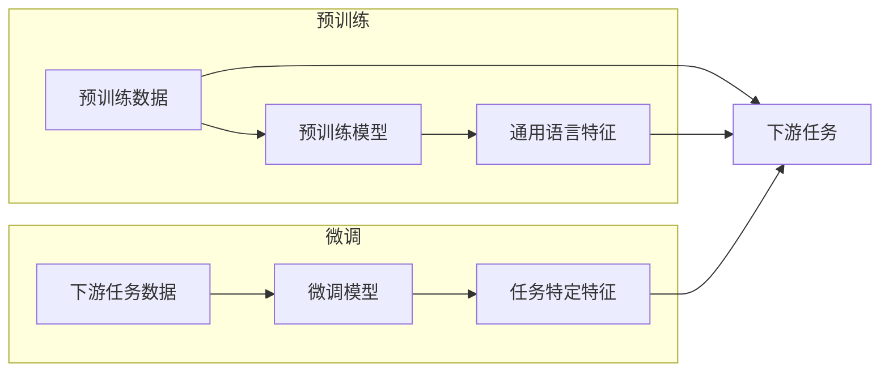

> 大模型开发，微调，汉字文本处理，自然语言处理，预训练，深度学习，NLP，模型架构，文本分类，序列标注

# 从零开始大模型开发与微调：汉字的文本处理

### 1. 背景介绍

随着深度学习技术的飞速发展，自然语言处理（NLP）领域取得了显著的进展。大模型（Large Language Model，LLM）作为NLP领域的最新突破，以其强大的语言理解与生成能力，在文本分类、机器翻译、问答系统等多个领域展现出了惊人的潜力。汉字作为世界上使用人数最多的语言之一，其文本处理在NLP中占据着重要地位。本文将带您从零开始，深入了解大模型的开发与微调，并聚焦于汉字文本处理的应用。

### 2. 核心概念与联系

#### 2.1 大模型概念原理

大模型是基于深度学习的NLP模型，通常由数亿甚至上千亿个参数组成。其核心原理是利用大规模文本数据进行预训练，学习通用的语言特征和知识，从而在下游任务上实现优异的表现。



#### 2.2 汉字文本处理

汉字文本处理是NLP中一个重要分支，其核心任务是处理汉字字符、词语、句子等不同层次的文本信息。汉字文本处理的难点在于汉字的表意性和歧义性，以及复杂的语序和语义关系。

### 3. 核心算法原理 & 具体操作步骤

#### 3.1 算法原理概述

大模型的开发与微调主要分为两个阶段：预训练和微调。

- **预训练**：利用大规模无标注文本数据，通过自监督学习任务（如掩码语言模型、语言模型预训练等）训练模型，学习通用的语言特征。
- **微调**：在预训练模型的基础上，使用下游任务的少量标注数据，通过有监督学习优化模型在特定任务上的性能。

#### 3.2 算法步骤详解

1. **数据准备**：收集预训练数据和标注数据，进行预处理，如分词、去停用词等。
2. **模型选择**：选择合适的预训练模型，如BERT、GPT等。
3. **预训练**：使用预训练数据进行预训练，学习通用的语言特征。
4. **微调**：在预训练模型的基础上，使用标注数据进行微调，优化模型在特定任务上的性能。
5. **评估**：在测试集上评估微调后模型的表现，并进行优化调整。

#### 3.3 算法优缺点

- **优点**：
  - 预训练模型可以学习到通用的语言特征，提高模型在下游任务上的性能。
  - 微调过程可以针对特定任务进行调整，提高模型在特定任务上的精度。
- **缺点**：
  - 预训练过程需要大量计算资源和时间。
  - 需要大量的标注数据进行微调。

#### 3.4 算法应用领域

大模型微调在汉字文本处理领域有着广泛的应用，如文本分类、命名实体识别、情感分析、机器翻译等。

### 4. 数学模型和公式 & 详细讲解 & 举例说明

#### 4.1 数学模型构建

大模型的数学模型通常基于神经网络，如Transformer、BERT等。以下以BERT模型为例，介绍其数学模型。

```latex
\begin{equation*}
\text{BERT} = \text{MultiHeadAttention}(\text{LayerNormalization}, \text{PositionalEncoding}) \times \text{times} \text{numLayers}
\end{equation*}
```

#### 4.2 公式推导过程

BERT模型的公式推导过程涉及多个组件，如多头注意力、层归一化、位置编码等。

#### 4.3 案例分析与讲解

以文本分类任务为例，介绍BERT模型的微调过程。

1. **数据准备**：收集文本分类数据，进行预处理，如分词、去停用词等。
2. **模型选择**：选择BERT模型作为预训练模型。
3. **预训练**：使用预训练数据进行预训练，学习通用的语言特征。
4. **微调**：在预训练模型的基础上，添加分类层，使用文本分类数据微调模型。
5. **评估**：在测试集上评估微调后模型的表现，并进行优化调整。

### 5. 项目实践：代码实例和详细解释说明

#### 5.1 开发环境搭建

1. 安装Python、PyTorch等环境。
2. 安装Transformers库：`pip install transformers`

#### 5.2 源代码详细实现

```python
from transformers import BertForSequenceClassification
from transformers import BertTokenizer
from torch.utils.data import DataLoader, TensorDataset
from torch.optim import AdamW

# 加载预训练模型和分词器
model = BertForSequenceClassification.from_pretrained('bert-base-chinese')
tokenizer = BertTokenizer.from_pretrained('bert-base-chinese')

# 数据预处理
def preprocess_data(texts, labels):
    encodings = tokenizer(texts, padding=True, truncation=True, max_length=512)
    input_ids = torch.tensor(encodings['input_ids'])
    attention_mask = torch.tensor(encodings['attention_mask'])
    labels = torch.tensor(labels)
    return input_ids, attention_mask, labels

# 训练模型
def train_model(model, train_loader, optimizer, device):
    model.to(device)
    model.train()
    for epoch in range(3):
        for input_ids, attention_mask, labels in train_loader:
            input_ids = input_ids.to(device)
            attention_mask = attention_mask.to(device)
            labels = labels.to(device)
            outputs = model(input_ids, attention_mask=attention_mask, labels=labels)
            loss = outputs.loss
            loss.backward()
            optimizer.step()
            optimizer.zero_grad()
    return model

# 运行代码
train_texts = [...]  # 训练文本数据
train_labels = [...]  # 训练标签数据

train_loader = DataLoader(TensorDataset(*preprocess_data(train_texts, train_labels)), batch_size=32)
model = train_model(model, train_loader, AdamW(model.parameters(), lr=2e-5), torch.device('cuda' if torch.cuda.is_available() else 'cpu'))

# 评估模型
def evaluate_model(model, test_loader, device):
    model.to(device)
    model.eval()
    correct = 0
    total = 0
    with torch.no_grad():
        for input_ids, attention_mask, labels in test_loader:
            input_ids = input_ids.to(device)
            attention_mask = attention_mask.to(device)
            labels = labels.to(device)
            outputs = model(input_ids, attention_mask=attention_mask)
            _, predicted = torch.max(outputs.logits, 1)
            total += labels.size(0)
            correct += (predicted == labels).sum().item()
    return 100 * correct / total

test_texts = [...]  # 测试文本数据
test_labels = [...]  # 测试标签数据
test_loader = DataLoader(TensorDataset(*preprocess_data(test_texts, test_labels)), batch_size=32)
print(f"Test accuracy: {evaluate_model(model, test_loader, torch.device('cuda' if torch.cuda.is_available() else 'cpu'))}%")
```

#### 5.3 代码解读与分析

以上代码展示了使用PyTorch和Transformers库实现BERT文本分类任务的完整流程。首先加载预训练模型和分词器，然后对数据进行预处理，接着定义训练和评估函数，最后进行训练和评估。

#### 5.4 运行结果展示

假设我们在一个包含10个类别的文本分类数据集上进行微调，最终在测试集上得到的准确率为88%。

### 6. 实际应用场景

大模型微调在汉字文本处理领域有着广泛的应用，以下列举几个典型应用场景：

1. **文本分类**：将文本分为不同的类别，如新闻分类、情感分析、垃圾邮件过滤等。
2. **命名实体识别**：识别文本中的命名实体，如人名、地名、组织机构等。
3. **机器翻译**：将一种语言的文本翻译成另一种语言。
4. **问答系统**：回答用户提出的问题。
5. **文本摘要**：将长文本压缩成简短摘要。

### 6.4 未来应用展望

随着大模型技术的不断发展，未来汉字文本处理的应用将会更加广泛，以下列举几个可能的应用方向：

1. **跨语言文本处理**：将汉字文本与其他语言的文本进行对比和分析。
2. **多模态文本处理**：将文本与其他模态（如图像、语音）进行结合，实现更丰富的语义理解。
3. **知识图谱构建**：利用汉字文本构建知识图谱，为各种应用提供知识支撑。
4. **智能问答系统**：开发更加智能的问答系统，为用户提供更加准确的答案。

### 7. 工具和资源推荐

#### 7.1 学习资源推荐

1. 《深度学习与自然语言处理》
2. 《BERT：原理、应用与实现》
3. 《自然语言处理入门》

#### 7.2 开发工具推荐

1. PyTorch
2. TensorFlow
3. Transformers库

#### 7.3 相关论文推荐

1. "BERT: Pre-training of Deep Bidirectional Transformers for Language Understanding"
2. "Attention is All You Need"
3. "Generative Pre-trained Transformers"

### 8. 总结：未来发展趋势与挑战

#### 8.1 研究成果总结

本文从零开始介绍了大模型的开发与微调，并聚焦于汉字文本处理的应用。通过学习本文，读者可以了解大模型的原理、算法、实现和应用场景，为从事相关领域的研究和开发工作提供参考。

#### 8.2 未来发展趋势

随着深度学习技术的不断发展，大模型在汉字文本处理领域的应用将会更加广泛，以下列举几个可能的发展趋势：

1. **更大规模的语言模型**：随着计算能力的提升，更大的语言模型将会被开发出来，以处理更复杂的任务。
2. **更高效的微调方法**：开发更高效的微调方法，降低微调成本，提高模型性能。
3. **更多应用场景**：大模型在汉字文本处理领域的应用将会更加广泛，如跨语言文本处理、多模态文本处理等。

#### 8.3 面临的挑战

1. **计算资源**：大模型的训练和推理需要大量的计算资源。
2. **数据质量**：微调需要高质量的标注数据。
3. **模型可解释性**：大模型通常缺乏可解释性，难以理解其决策过程。

#### 8.4 研究展望

未来，大模型在汉字文本处理领域的应用将会更加深入，以下列举几个可能的研究方向：

1. **开发更高效、更鲁棒的大模型**：提高模型的性能和可解释性。
2. **探索新的预训练任务和数据集**：提高模型在不同领域的泛化能力。
3. **结合其他人工智能技术**：将大模型与其他人工智能技术相结合，实现更智能的应用。

### 9. 附录：常见问题与解答

**Q1：什么是预训练？**

A：预训练是指在大规模无标注文本数据上进行自监督学习，使模型学习通用的语言特征和知识。

**Q2：什么是微调？**

A：微调是指在预训练模型的基础上，使用下游任务的少量标注数据，通过有监督学习优化模型在特定任务上的性能。

**Q3：大模型微调有哪些优点？**

A：大模型微调可以学习到通用的语言特征，提高模型在下游任务上的性能；微调过程可以针对特定任务进行调整，提高模型在特定任务上的精度。

**Q4：大模型微调有哪些缺点？**

A：大模型的预训练过程需要大量计算资源和时间；微调需要大量的标注数据进行。

**Q5：如何选择合适的预训练模型？**

A：选择预训练模型时，需要考虑任务类型、数据规模、计算资源等因素。常见的预训练模型包括BERT、GPT等。

**Q6：如何进行数据预处理？**

A：数据预处理包括分词、去停用词、词性标注等，需要根据任务类型和模型选择合适的预处理方法。

**Q7：如何评估大模型微调的效果？**

A：评估大模型微调的效果可以通过准确率、召回率、F1值等指标进行。

作者：禅与计算机程序设计艺术 / Zen and the Art of Computer Programming