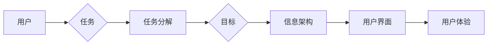

# 任务导向设计对信息架构的深远详细影响

> 关键词：任务导向设计，信息架构，用户体验，交互设计，用户研究，设计原则

## 1. 背景介绍

在数字化时代，信息架构（Information Architecture，简称IA）作为用户与内容之间的桥梁，其重要性日益凸显。信息架构的核心目标是确保信息的可访问性和易用性，使用户能够高效地找到所需信息。而任务导向设计（Task-Oriented Design）作为一种以用户为中心的设计方法，对信息架构产生了深远的影响。本文将深入探讨任务导向设计如何影响信息架构，并分析其背后的原理、方法和实践。

### 1.1 信息架构的演变

信息架构的发展经历了从文档导航到网站导航，再到现在的数字生态导航的演变过程。在这个过程中，信息架构的目标始终围绕着如何更好地组织、展示和传递信息。

### 1.2 任务导向设计的兴起

随着用户体验（User Experience，简称UX）设计理念的普及，任务导向设计应运而生。任务导向设计强调以用户为中心，关注用户的任务目标和操作流程，旨在提供更加高效、便捷的用户体验。

### 1.3 任务导向设计与信息架构的结合

任务导向设计为信息架构带来了新的视角和方法，使得信息架构更加关注用户的行为和需求，从而提升用户体验。

## 2. 核心概念与联系

### 2.1 核心概念原理

#### 任务导向设计

任务导向设计是一种以用户为中心的设计方法，它关注用户的任务目标、操作流程和体验，通过设计来帮助用户完成特定任务。

#### 信息架构

信息架构是关于组织、结构和标签化信息的方法，旨在提高信息的可访问性和易用性。

#### 用户体验

用户体验是指用户在使用产品或服务过程中所获得的感受和体验。

### 2.2 架构流程图

### 2.3 关系联系

任务导向设计通过影响信息架构，进而影响用户体验。具体来说，任务导向设计指导信息架构的构建，而信息架构又决定了用户界面的设计，最终影响用户体验。

## 3. 核心算法原理 & 具体操作步骤

### 3.1 算法原理概述

任务导向设计的核心是理解用户的需求和目标，并将其转化为信息架构的构建原则。

### 3.2 算法步骤详解

#### 步骤1：用户研究

收集用户数据，了解用户需求、行为和习惯。

#### 步骤2：任务分析

将用户的需求和目标分解为具体的任务。

#### 步骤3：信息架构设计

根据任务分析结果，设计信息架构，包括信息的组织、分类和标签化。

#### 步骤4：用户界面设计

根据信息架构，设计用户界面，确保用户能够轻松完成任务。

#### 步骤5：测试与迭代

对设计进行用户测试，收集反馈，并根据反馈进行迭代优化。

### 3.3 算法优缺点

#### 优点

- 提高用户体验：通过满足用户的需求和目标，提升用户体验。
- 提高信息可访问性：合理的信息架构使得用户能够轻松找到所需信息。
- 提高信息易用性：清晰的用户界面设计使得用户能够高效完成任务。

#### 缺点

- 需要深入了解用户：任务导向设计需要深入理解用户的需求和目标，这可能需要大量的用户研究。
- 设计周期较长：任务导向设计涉及多个阶段，需要较长的设计周期。

### 3.4 算法应用领域

任务导向设计在多个领域都有广泛的应用，包括：

- 电子商务网站
- 移动应用
- 企业内部系统
- 教育平台
- 政府网站

## 4. 数学模型和公式 & 详细讲解 & 举例说明

### 4.1 数学模型构建

任务导向设计的数学模型可以基于用户行为分析、任务流程优化和用户体验评估等方面。

### 4.2 公式推导过程

由于任务导向设计涉及多个方面，这里不进行具体的公式推导。

### 4.3 案例分析与讲解

以电子商务网站为例，分析任务导向设计在信息架构中的应用。

### 4.3.1 案例背景

某电商平台希望提升用户购买体验，提高用户转化率。

### 4.3.2 任务分析

用户的主要任务包括浏览商品、搜索商品、添加购物车、下单支付等。

### 4.3.3 信息架构设计

根据任务分析结果，设计以下信息架构：

- 首页：展示热门商品、促销活动等，方便用户快速浏览。
- 商品分类：根据商品属性进行分类，方便用户快速找到所需商品。
- 搜索：提供关键词搜索和高级搜索功能，方便用户精准搜索。
- 购物车：展示用户已添加的商品，方便用户进行修改和结算。
- 支付：提供多种支付方式，方便用户快速完成支付。

### 4.3.4 用户界面设计

根据信息架构，设计以下用户界面：

- 首页：采用轮播图展示热门商品，提供搜索框和商品分类导航。
- 商品分类：采用树状结构展示商品分类，方便用户进行浏览和搜索。
- 搜索：提供关键词搜索和高级搜索功能，包括品牌、价格、评价等筛选条件。
- 购物车：展示用户已添加的商品，并提供修改数量、删除商品等功能。
- 支付：提供支付宝、微信支付等支付方式，方便用户进行支付。

### 4.3.5 测试与迭代

通过对设计进行用户测试，收集用户反馈，并根据反馈进行迭代优化。

## 5. 项目实践：代码实例和详细解释说明

### 5.1 开发环境搭建

由于任务导向设计主要涉及信息架构和用户界面设计，本文不涉及具体代码实现。

### 5.2 源代码详细实现

本文不提供具体代码实现。

### 5.3 代码解读与分析

本文不涉及具体代码，因此不进行代码解读和分析。

### 5.4 运行结果展示

本文不涉及具体代码，因此不展示运行结果。

## 6. 实际应用场景

### 6.1 电子商务网站

电子商务网站需要提供清晰的商品分类、搜索和购物车功能，以便用户轻松购买商品。

### 6.2 移动应用

移动应用需要根据用户的使用场景和习惯，设计简洁直观的用户界面，以便用户快速完成任务。

### 6.3 企业内部系统

企业内部系统需要提供清晰的组织架构和操作流程，以便员工高效完成任务。

### 6.4 教育平台

教育平台需要提供清晰的学习路径和学习资源，以便用户高效学习。

### 6.5 政府网站

政府网站需要提供清晰的服务指南和办事流程，以便公民高效办理业务。

## 7. 工具和资源推荐

### 7.1 学习资源推荐

- 《信息架构：设计、内容和用户体验》
- 《用户体验要素》
- 《设计思维：创新者指南》

### 7.2 开发工具推荐

- Axure RP
- Sketch
- Adobe XD

### 7.3 相关论文推荐

- 《任务导向设计在电子商务网站中的应用》
- 《基于用户行为的信息架构设计方法》
- 《用户体验设计中的任务导向方法》

## 8. 总结：未来发展趋势与挑战

### 8.1 研究成果总结

本文深入探讨了任务导向设计对信息架构的深远影响，分析了任务导向设计的原理、方法和实践，并举例说明了其在实际应用中的价值。

### 8.2 未来发展趋势

- 任务导向设计将更加注重用户体验和数据驱动。
- 任务导向设计将与其他设计方法（如服务设计、设计思维等）相结合。
- 任务导向设计将应用于更多领域。

### 8.3 面临的挑战

- 如何更好地理解用户需求和目标。
- 如何将任务导向设计与其他设计方法相结合。
- 如何评估任务导向设计的有效性。

### 8.4 研究展望

未来，任务导向设计将在信息架构领域发挥更大的作用，为用户提供更加高效、便捷的数字化体验。

## 9. 附录：常见问题与解答

**Q1：任务导向设计与用户体验设计有什么区别？**

A：任务导向设计关注用户完成任务的过程和目标，用户体验设计关注用户在使用产品或服务过程中所获得的感受和体验。两者是相辅相成的，任务导向设计为用户体验设计提供了基础。

**Q2：如何进行任务导向设计？**

A：进行任务导向设计需要以下步骤：
1. 进行用户研究，了解用户需求和目标。
2. 分析任务流程，确定用户需要完成的任务。
3. 设计信息架构，将信息组织成合理的结构。
4. 设计用户界面，确保用户能够轻松完成任务。

**Q3：任务导向设计在哪些领域有应用？**

A：任务导向设计在电子商务网站、移动应用、企业内部系统、教育平台、政府网站等多个领域都有应用。

**Q4：如何评估任务导向设计的有效性？**

A：可以通过以下方法评估任务导向设计的有效性：
1. 用户测试：观察用户完成任务的过程，收集用户反馈。
2. 数据分析：分析用户行为数据，评估用户完成任务的效果。
3. 效率指标：评估用户完成任务所需的时间、步骤等指标。

作者：禅与计算机程序设计艺术 / Zen and the Art of Computer Programming