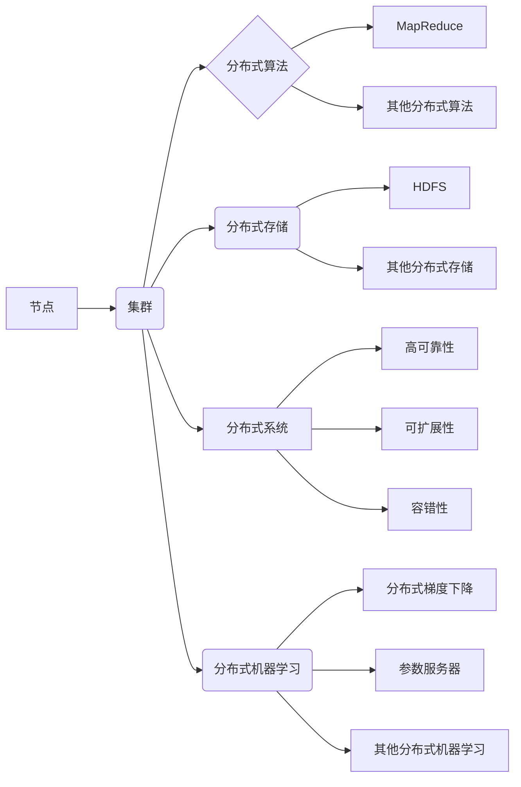

# 分布式计算原理与代码实战案例讲解

> 关键词：分布式计算, MapReduce, 软件架构, 大数据处理, 云计算, 节点通信, 数据一致性, 容错机制

## 1. 背景介绍

随着互联网和大数据时代的到来，数据处理和分析的需求日益增长，传统的单机计算模式已经无法满足海量数据的处理需求。分布式计算应运而生，它通过将计算任务分解成多个子任务，然后在多台计算机上并行执行，从而实现大规模数据的高效处理。本文将深入探讨分布式计算的原理，并举例说明其实战案例。

### 1.1 分布式计算的由来

分布式计算的概念起源于20世纪60年代。随着计算机硬件和通信技术的不断发展，人们开始探索如何利用多台计算机协同工作来完成复杂计算任务。早期的分布式计算主要用于科学计算和军事领域，如美国曼哈顿计划中的计算机系统。

### 1.2 分布式计算的研究现状

近年来，随着云计算、大数据和物联网等技术的发展，分布式计算的应用领域不断扩展，已成为现代IT技术体系的重要组成部分。目前，分布式计算的研究主要集中在以下几个方面：

- **分布式算法**：研究如何在分布式环境中高效地执行计算任务。
- **分布式存储**：研究如何高效地存储和访问分布式数据。
- **分布式系统**：研究如何构建稳定、可靠、可扩展的分布式应用系统。
- **分布式机器学习**：研究如何利用分布式计算进行大规模机器学习任务。

### 1.3 研究意义

分布式计算技术对于解决大规模数据处理问题具有重要意义：

- **提高计算效率**：通过并行计算，可以显著提高计算效率，缩短计算时间。
- **降低成本**：分布式计算可以利用廉价的计算资源，降低计算成本。
- **提高可靠性**：分布式系统具有较高的容错能力，能够应对硬件故障。
- **扩展性**：分布式系统可以根据需求动态扩展计算资源。

## 2. 核心概念与联系

### 2.1 核心概念

#### 2.1.1 节点与集群

分布式系统由多个节点组成，每个节点可以是一台计算机或服务器。多个节点通过网络连接形成一个集群，共同完成计算任务。

#### 2.1.2 分布式算法

分布式算法是指在分布式环境中执行的计算任务，如MapReduce、DAG调度等。

#### 2.1.3 分布式存储

分布式存储是指在多台节点上存储数据的系统，如HDFS、Ceph等。

#### 2.1.4 分布式系统

分布式系统是由多个节点组成的系统，具有高可靠性、可扩展性和容错性。

#### 2.1.5 分布式机器学习

分布式机器学习是指在大规模数据集上进行机器学习任务，如分布式梯度下降、参数服务器等。

### 2.2 核心概念原理和架构的 Mermaid 流程图



### 2.3 核心概念之间的联系

- **节点**是分布式系统的基本单元，是构成集群和分布式系统的基石。
- **分布式算法**和**分布式存储**是分布式系统的核心组成部分，负责数据的处理和存储。
- **分布式系统**通过节点之间的通信和协作，实现高可靠性、可扩展性和容错性。
- **分布式机器学习**是分布式系统在机器学习领域的应用，通过分布式计算加速机器学习任务的训练和推理。

## 3. 核心算法原理 & 具体操作步骤

### 3.1 算法原理概述

分布式计算的核心算法包括：

- **MapReduce**：一种分布式计算模型，用于大规模数据集的并行处理。
- **DAG调度**：一种任务调度算法，用于将任务分解成多个子任务，并在多个节点上并行执行。
- **数据流处理**：一种实时数据处理技术，用于处理高速流动的数据。

### 3.2 算法步骤详解

#### 3.2.1 MapReduce

MapReduce算法包括两个主要步骤：

1. **Map步骤**：将数据分割成多个小块，对每个小块进行映射操作，生成中间结果。
2. **Reduce步骤**：将Map步骤生成的中间结果进行归约操作，生成最终结果。

#### 3.2.2 DAG调度

DAG调度算法包括以下步骤：

1. **任务分解**：将计算任务分解成多个子任务。
2. **节点分配**：将子任务分配给不同的节点执行。
3. **任务调度**：根据节点负载和任务依赖关系，动态调整任务调度策略。

#### 3.2.3 数据流处理

数据流处理算法包括以下步骤：

1. **数据采集**：从数据源采集数据。
2. **数据预处理**：对采集到的数据进行预处理，如过滤、转换等。
3. **实时计算**：对预处理后的数据进行实时计算。
4. **结果输出**：将计算结果输出到目标系统。

### 3.3 算法优缺点

#### 3.3.1 MapReduce

**优点**：

- 高效：利用并行计算提高计算效率。
- 可扩展：可以处理大规模数据集。
- 容错：节点故障时，可以自动从其他节点恢复。

**缺点**：

- 开发复杂：需要编写Map和Reduce函数。
- 数据倾斜：可能导致MapReduce任务运行时间不均衡。

#### 3.3.2 DAG调度

**优点**：

- 灵活：可以处理复杂的计算任务。
- 可扩展：可以处理大规模任务调度。

**缺点**：

- 开发复杂：需要编写DAG描述语言。
- 调度开销：DAG调度需要消耗一定的计算资源。

#### 3.3.3 数据流处理

**优点**：

- 实时：可以处理实时数据。
- 高效：可以利用硬件加速。

**缺点**：

- 开发复杂：需要编写数据流处理程序。
- 容错性：需要考虑数据流的完整性。

### 3.4 算法应用领域

- **MapReduce**：适用于大规模数据集的并行处理，如搜索引擎、数据仓库等。
- **DAG调度**：适用于复杂的计算任务调度，如科学计算、图计算等。
- **数据流处理**：适用于实时数据处理，如在线广告、金融交易等。

## 4. 数学模型和公式 & 详细讲解 & 举例说明

### 4.1 数学模型构建

分布式计算中的数学模型主要包括：

- **数据模型**：描述数据在分布式系统中的存储和访问方式。
- **计算模型**：描述分布式计算任务的执行过程。
- **通信模型**：描述节点之间的通信方式。

### 4.2 公式推导过程

以下以MapReduce为例，介绍分布式计算中的数学模型和公式。

#### 4.2.1 数据模型

MapReduce的数据模型主要包括：

- **输入数据**：原始数据集，如文本文件、图像等。
- **中间键值对**：Map步骤生成的键值对，如词频统计。
- **输出数据**：Reduce步骤生成的最终结果，如单词出现的频率。

#### 4.2.2 计算模型

MapReduce的计算模型主要包括：

- **Map函数**：对输入数据进行映射操作，生成中间键值对。
- **Shuffle函数**：根据键值对的键进行排序，将具有相同键的键值对发送到同一个Reduce任务。
- **Reduce函数**：对中间键值对进行归约操作，生成最终结果。

#### 4.2.3 通信模型

MapReduce的通信模型主要包括：

- **节点间通信**：节点之间通过网络进行数据传输。
- **数据传输**：节点间通过TCP/IP协议传输数据。

### 4.3 案例分析与讲解

以下以Hadoop中的MapReduce为例，介绍分布式计算的代码实现。

```java
public class WordCount {

  // Map函数
  public static class Map extends Mapper<Object, Text, Text, IntWritable> {
    private final static IntWritable one = new IntWritable(1);
    private Text word = new Text();

    public void map(Object key, Text value, Context context) throws IOException, InterruptedException {
      StringTokenizer itr = new StringTokenizer(value.toString());
      while (itr.hasMoreTokens()) {
        word.set(itr.nextToken());
        context.write(word, one);
      }
    }
  }

  // Reduce函数
  public static class Reduce extends Reducer<Text, IntWritable, Text, IntWritable> {
    public void reduce(Text key, Iterable<IntWritable> values, Context context) throws IOException, InterruptedException {
      int sum = 0;
      for (IntWritable val : values) {
        sum += val.get();
      }
      context.write(key, new IntWritable(sum));
    }
  }

  public static void main(String[] args) throws Exception {
    Configuration conf = new Configuration();
    Job job = Job.getInstance(conf, "word count");
    job.setJarByClass(WordCount.class);
    job.setMapperClass(Map.class);
    job.setCombinerClass(Reduce.class);
    job.setReducerClass(Reduce.class);
    job.setOutputKeyClass(Text.class);
    job.setOutputValueClass(IntWritable.class);
    FileInputFormat.addInputPath(job, new Path(args[0]));
    FileOutputFormat.setOutputPath(job, new Path(args[1]));
    System.exit(job.waitForCompletion(true) ? 0 : 1);
  }
}
```

以上代码实现了MapReduce的WordCount案例。Map函数将文本分割成单词，Reduce函数对单词进行计数。

## 5. 项目实践：代码实例和详细解释说明

### 5.1 开发环境搭建

以下以Hadoop为例，介绍分布式计算的开发环境搭建。

1. 下载Hadoop源码。
2. 解压源码，配置环境变量。
3. 编译Hadoop源码。
4. 配置Hadoop集群。

### 5.2 源代码详细实现

Hadoop的源代码主要包括以下几个模块：

- **Common模块**：提供Hadoop的基础功能，如序列化、配置管理等。
- **HDFS模块**：提供分布式文件系统。
- **MapReduce模块**：提供分布式计算框架。

### 5.3 代码解读与分析

Hadoop的源代码采用了模块化设计，每个模块负责特定的功能。Common模块提供基础功能，HDFS模块提供分布式文件系统，MapReduce模块提供分布式计算框架。

### 5.4 运行结果展示

在Hadoop集群上运行WordCount程序，可以得到单词出现的频率统计结果。

## 6. 实际应用场景

### 6.1 大数据平台

分布式计算技术广泛应用于大数据平台，如Hadoop、Spark等。这些平台可以处理海量数据，支持各种大数据应用。

### 6.2 云计算平台

分布式计算技术是云计算平台的核心技术之一。云计算平台可以提供弹性、可扩展的计算资源，满足用户的不同需求。

### 6.3 人工智能平台

分布式计算技术可以加速人工智能模型的训练和推理，提高人工智能应用的性能。

## 7. 工具和资源推荐

### 7.1 学习资源推荐

- 《Hadoop权威指南》
- 《分布式系统原理与范型》
- 《大规模分布式存储系统：原理与实现》

### 7.2 开发工具推荐

- Hadoop
- Spark
- Kafka
- ZooKeeper

### 7.3 相关论文推荐

- 《The Google File System》
- 《The Chubby lock service for loosely-coupled distributed systems》
- 《The Google MapReduce programming model》

## 8. 总结：未来发展趋势与挑战

### 8.1 研究成果总结

本文深入探讨了分布式计算原理，介绍了核心算法、数学模型和公式，并通过代码实例和案例讲解，展示了分布式计算在实际应用中的价值。

### 8.2 未来发展趋势

- **异构计算**：利用不同类型的硬件加速分布式计算，如GPU、FPGA等。
- **边缘计算**：将计算任务迁移到边缘节点，降低延迟，提高实时性。
- **人工智能与分布式计算融合**：利用人工智能技术优化分布式计算任务调度、资源分配等。

### 8.3 面临的挑战

- **系统复杂性**：随着分布式系统规模的扩大，系统复杂性不断提高。
- **性能优化**：需要不断优化分布式计算算法和系统设计，提高计算效率。
- **安全性**：需要加强分布式系统的安全性，防止数据泄露和恶意攻击。

### 8.4 研究展望

分布式计算技术将继续发展，并在更多领域得到应用。未来，分布式计算将与人工智能、物联网等技术深度融合，推动数字经济的发展。

## 9. 附录：常见问题与解答

**Q1：什么是分布式计算？**

A：分布式计算是指利用多台计算机协同工作来完成计算任务的技术。

**Q2：MapReduce算法的优缺点是什么？**

A：MapReduce算法的优点是高效、可扩展、容错；缺点是开发复杂、数据倾斜。

**Q3：如何优化分布式计算性能？**

A：可以从以下几个方面优化分布式计算性能：
1. 优化算法设计。
2. 优化系统架构。
3. 优化资源分配。
4. 优化网络传输。

**Q4：分布式计算在哪些领域应用广泛？**

A：分布式计算在以下领域应用广泛：
1. 大数据平台
2. 云计算平台
3. 人工智能平台

**Q5：如何保证分布式系统的安全性？**

A：可以从以下几个方面保证分布式系统的安全性：
1. 加密数据传输。
2. 权限控制。
3. 安全审计。
4. 恢复机制。

作者：禅与计算机程序设计艺术 / Zen and the Art of Computer Programming