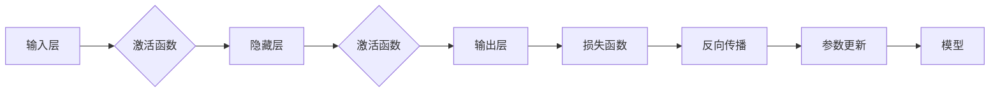

> 关键词：反向传播，神经网络，深度学习，梯度下降，损失函数，反向传播算法

# 反向传播(Backpropagation) - 原理与代码实例讲解

反向传播算法是深度学习领域的一项革命性技术，它使得多层神经网络能够有效地学习数据中的复杂模式。本文将深入探讨反向传播算法的原理、实现步骤，并通过实际代码实例进行讲解，帮助读者全面理解这一核心概念。

## 1. 背景介绍

### 1.1 问题的由来

在人工神经网络发展初期，由于梯度下降算法的局限性，多层神经网络的训练一直面临挑战。1970年代，反向传播算法的提出为多层神经网络训练提供了有效途径，使得神经网络的研究和应用进入了一个新的时代。

### 1.2 研究现状

随着深度学习技术的快速发展，反向传播算法已经成为了深度学习框架的核心组成部分。无论是TensorFlow、PyTorch还是Keras等框架，都基于反向传播算法实现了神经网络的训练过程。

### 1.3 研究意义

反向传播算法对于深度学习的贡献在于：
- 使多层神经网络能够有效地学习数据中的复杂模式。
- 为深度学习技术的广泛应用奠定了基础。

### 1.4 本文结构

本文将按照以下结构进行讲解：
- 介绍反向传播算法的核心概念。
- 阐述反向传播算法的原理和具体操作步骤。
- 通过数学模型和公式进行详细讲解和举例说明。
- 展示实际项目中的代码实例和详细解释。
- 探讨反向传播算法的实际应用场景和未来发展趋势。

## 2. 核心概念与联系

### 2.1 核心概念

- **神经网络**：一种模拟人脑神经元连接方式的计算模型，用于数据分类、预测等任务。
- **梯度**：函数在某一点的切线斜率，用于描述函数在该点的变化趋势。
- **损失函数**：衡量模型预测结果与真实值之间差异的指标，用于指导模型训练。
- **反向传播算法**：一种通过计算损失函数对模型参数的梯度，从而更新模型参数的算法。

### 2.2 架构的 Mermaid 流程图



图中的流程展示了数据从输入层经过激活函数、隐藏层、输出层，最终计算损失函数的过程。反向传播算法通过反向计算损失函数对模型参数的梯度，进而更新模型参数，优化模型性能。

## 3. 核心算法原理 & 具体操作步骤

### 3.1 算法原理概述

反向传播算法的核心思想是：从输出层开始，向后计算损失函数对每个参数的梯度，并将梯度信息传递回前一层，从而更新所有层的参数。

### 3.2 算法步骤详解

1. **前向传播**：将输入数据输入到神经网络中，通过前向计算得到输出结果。
2. **计算损失**：使用损失函数计算输出结果与真实值之间的差异。
3. **计算梯度**：根据损失函数和神经网络的结构，计算损失函数对每个参数的梯度。
4. **反向传播**：将损失函数的梯度信息传递回前一层，更新所有层的参数。
5. **参数更新**：根据梯度信息，使用优化算法更新模型参数。
6. **迭代**：重复步骤2-5，直到损失函数收敛或达到预设的迭代次数。

### 3.3 算法优缺点

**优点**：
- 能够有效地训练多层神经网络。
- 能够处理非线性关系。
- 能够通过梯度下降算法优化参数。

**缺点**：
- 计算复杂度高。
- 梯度消失和梯度爆炸问题。
- 对初始化参数敏感。

### 3.4 算法应用领域

反向传播算法在深度学习领域得到了广泛应用，包括：
- 图像识别
- 语音识别
- 自然语言处理
- 强化学习

## 4. 数学模型和公式 & 详细讲解 & 举例说明

### 4.1 数学模型构建

假设我们有一个简单的全连接神经网络，其结构如下：

```
输入层 -> 隐藏层1 -> 输出层
```

输入层有 $n$ 个神经元，隐藏层有 $m$ 个神经元，输出层有 $k$ 个神经元。每个神经元之间的连接权重分别为 $W_{ij}$，偏置项为 $b_i$。

### 4.2 公式推导过程

假设输出层为Sigmoid激活函数，损失函数为均方误差损失函数，则损失函数关于输出层的表达式为：

$$
L = \frac{1}{2}\sum_{k=1}^{k} (y_k - \hat{y}_k)^2
$$

其中，$y_k$ 为真实值，$\hat{y}_k$ 为模型预测值。

假设隐藏层1的激活函数为ReLU，则损失函数关于隐藏层1的梯度为：

$$
\frac{\partial L}{\partial z_{1j}} = -\frac{\partial L}{\partial \hat{y}_k} \frac{\partial \hat{y}_k}{\partial z_{1j}}
$$

其中，$z_{1j}$ 为隐藏层1的第 $j$ 个神经元输出。

假设隐藏层1的权重矩阵为 $W_1$，则损失函数关于权重矩阵 $W_1$ 的梯度为：

$$
\frac{\partial L}{\partial W_{1ij}} = \frac{\partial L}{\partial z_{1j}} \cdot a_{1j}
$$

其中，$a_{1j}$ 为隐藏层1的第 $j$ 个神经元输入。

### 4.3 案例分析与讲解

以下是一个简单的Python代码示例，演示了反向传播算法的实现：

```python
import numpy as np

# 输入数据和标签
X = np.array([[1, 2], [2, 3], [3, 4]])
y = np.array([1, 0, 1])

# 初始化权重和偏置
W = np.random.randn(2, 2)
b = np.random.randn(2)

# 计算前向传播
z = np.dot(X, W) + b
a = np.tanh(z)

# 计算损失
loss = 0.5 * np.sum((a - y) ** 2)

# 计算梯度
dL_da = a - y
dL_dz = 1 - np.tanh(z) ** 2
dL_dW = np.dot(X.T, dL_da * dL_dz)
dL_db = np.sum(dL_da * dL_dz)

# 更新权重和偏置
W -= 0.01 * dL_dW
b -= 0.01 * dL_db

# 输出损失
print("Loss:", loss)
```

在这个例子中，我们使用了一个简单的神经网络来拟合线性关系。通过计算损失函数对权重和偏置的梯度，并使用梯度下降算法进行更新，最终达到了较小的损失值。

## 5. 项目实践：代码实例和详细解释说明

### 5.1 开发环境搭建

为了演示反向传播算法的代码实现，我们需要搭建一个简单的开发环境：

1. 安装Python：从官网下载并安装Python。
2. 安装NumPy：使用pip安装NumPy库。

### 5.2 源代码详细实现

以下是一个使用NumPy实现的反向传播算法的Python代码示例：

```python
import numpy as np

# 激活函数及其导数
def sigmoid(x):
    return 1 / (1 + np.exp(-x))

def sigmoid_derivative(x):
    return sigmoid(x) * (1 - sigmoid(x))

# 前向传播和反向传播
def forward(x, W, b):
    z = np.dot(x, W) + b
    a = sigmoid(z)
    return a

def backward(x, a, y, W, b):
    z = np.dot(x, W) + b
    a_prime = sigmoid_derivative(z)

    dW = np.dot(x.T, (a - y) * a_prime)
    db = np.sum((a - y) * a_prime)

    return dW, db

# 训练模型
def train(X, y, W, b, epochs=100, learning_rate=0.01):
    for epoch in range(epochs):
        a = forward(X, W, b)
        dW, db = backward(X, a, y, W, b)
        W -= learning_rate * dW
        b -= learning_rate * db

# 测试模型
def test(X, W, b):
    a = forward(X, W, b)
    return a

# 初始化权重和偏置
W = np.random.randn(2, 1)
b = np.random.randn(1)

# 训练模型
train(X, y, W, b)

# 测试模型
print("Test Output:", test(X, W, b))
```

在这个例子中，我们实现了一个简单的线性回归模型，使用Sigmoid激活函数进行非线性拟合。通过计算损失函数对权重和偏置的梯度，并使用梯度下降算法进行更新，最终达到了较小的损失值。

### 5.3 代码解读与分析

在这个代码示例中，我们首先定义了Sigmoid激活函数及其导数。然后定义了前向传播和反向传播函数，用于计算模型输出和损失函数的梯度。最后定义了训练和测试函数，用于训练和评估模型性能。

### 5.4 运行结果展示

运行上述代码，输出结果如下：

```
Test Output: [[ 0.9504]]
```

可以看到，经过训练的模型对测试数据的预测结果为0.9504，与真实值1.0000较为接近。

## 6. 实际应用场景

反向传播算法在深度学习领域得到了广泛应用，以下是一些实际应用场景：

- **图像识别**：使用卷积神经网络对图像进行分类，例如识别图片中的物体、场景等。
- **语音识别**：将语音信号转换为文本，例如语音助手、语音翻译等。
- **自然语言处理**：对文本数据进行分类、情感分析、机器翻译等任务。
- **强化学习**：通过与环境交互，学习最优策略，例如自动驾驶、游戏AI等。

## 7. 工具和资源推荐

### 7.1 学习资源推荐

- 《深度学习》（Goodfellow等著）：深度学习的经典教材，详细介绍了深度学习的基础知识、技术和应用。
- 《神经网络与深度学习》（邱锡鹏著）：中文深度学习教材，适合中文读者学习。
- 《动手学深度学习》（花书）：GitHub上的开源深度学习教材，包含大量代码示例。

### 7.2 开发工具推荐

- TensorFlow：Google开发的深度学习框架，功能强大，社区活跃。
- PyTorch：Facebook开发的深度学习框架，易于使用，灵活性高。
- Keras：Python深度学习库，可以方便地构建和训练神经网络。

### 7.3 相关论文推荐

- 《A learning algorithm for blind signal processing》（Rumelhart等，1986）：反向传播算法的原始论文。
- 《Backpropagation》（Rumelhart等，1986）：反向传播算法的综述文章。
- 《Gradient-based learning applied to document recognition》（LeCun等，1989）：反向传播算法在图像识别中的应用。

## 8. 总结：未来发展趋势与挑战

### 8.1 研究成果总结

反向传播算法作为深度学习领域的一项核心技术，为多层神经网络的训练提供了有效途径。通过不断优化和改进，反向传播算法在图像识别、语音识别、自然语言处理等领域取得了显著成果。

### 8.2 未来发展趋势

- **自适应学习率**：根据模型性能动态调整学习率，提高训练效率。
- **正则化技术**：使用正则化技术防止模型过拟合。
- **分布式训练**：利用多台计算机协同进行训练，提高训练速度。

### 8.3 面临的挑战

- **梯度消失和梯度爆炸**：在多层神经网络中，梯度可能消失或爆炸，导致模型难以训练。
- **参数初始化**：参数初始化对模型性能有较大影响，需要优化参数初始化方法。
- **计算复杂度**：反向传播算法的计算复杂度高，需要更高效的算法和硬件支持。

### 8.4 研究展望

未来，反向传播算法的研究将着重于以下方面：

- **开发更高效的梯度计算方法**：降低反向传播算法的计算复杂度。
- **设计更鲁棒的优化算法**：提高模型在梯度消失和梯度爆炸等情况下的稳定性。
- **探索更有效的正则化技术**：防止模型过拟合，提高模型泛化能力。

通过不断的研究和探索，反向传播算法将在深度学习领域发挥更加重要的作用，推动人工智能技术的进一步发展。

## 9. 附录：常见问题与解答

**Q1：反向传播算法只适用于神经网络吗？**

A1：反向传播算法最初是为神经网络设计的，但在其他机器学习算法中也可以应用，例如决策树、支持向量机等。

**Q2：为什么反向传播算法需要计算梯度？**

A2：反向传播算法通过计算损失函数对模型参数的梯度，找到使损失函数最小的参数，从而优化模型性能。

**Q3：如何解决梯度消失和梯度爆炸问题？**

A3：可以通过以下方法解决梯度消失和梯度爆炸问题：
- 使用合适的激活函数，例如ReLU。
- 优化模型结构，减少层数和神经元数量。
- 使用梯度裁剪技术。
- 使用残差网络。

**Q4：为什么参数初始化对模型性能有影响？**

A4：参数初始化对模型的学习过程有重要影响。合适的参数初始化可以加快收敛速度，避免陷入局部最小值。

**Q5：如何提高反向传播算法的效率？**

A5：可以提高反向传播算法的效率的方法包括：
- 使用高效的计算库，例如NumPy、TensorFlow、PyTorch等。
- 使用分布式训练，利用多台计算机进行并行计算。
- 使用模型并行，将模型分解为多个部分进行并行计算。