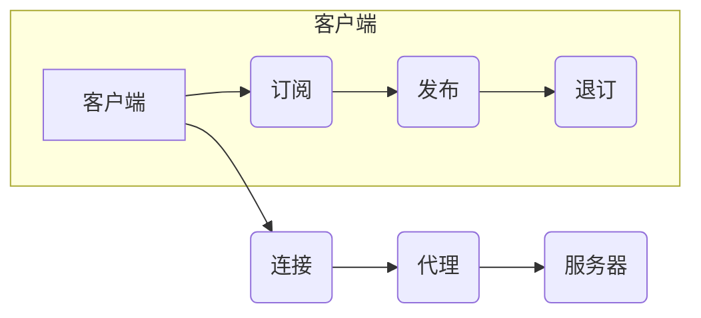

> 关键词：智能家居，Java，MQTT协议，设备通讯，物联网，嵌入式开发，消息队列，微服务架构

# 基于Java的智能家居设计：如何使用MQTT协议实现设备通讯

智能家居系统正在迅速发展，其核心是能够高效、可靠地连接和控制家中的各种设备。在众多物联网通讯协议中，MQTT（Message Queuing Telemetry Transport）因其轻量级、低功耗、低延迟的特点，成为了智能家居设备通讯的首选协议。本文将深入探讨如何使用Java实现基于MQTT协议的智能家居设计，包括核心概念、算法原理、项目实践以及实际应用场景。

## 1. 背景介绍

### 1.1 智能家居的兴起

随着物联网（IoT）技术的快速发展，智能家居市场正在迅速扩张。智能家居系统通过将家中的电器设备联网，实现远程控制、自动化和智能化管理，为用户带来更加便捷、舒适的生活体验。

### 1.2 MQTT协议的优势

MQTT协议是一种轻量级的消息传输协议，适用于低功耗、低带宽的物联网应用。其核心特点包括：

- 发布/订阅模式：设备可以订阅感兴趣的主题，接收相关的消息。
- 质量服务（QoS）级别：支持不同级别的消息可靠性。
- 简单的客户端实现：易于在嵌入式设备上部署。

### 1.3 Java在智能家居中的应用

Java作为一种跨平台、功能强大的编程语言，在嵌入式开发、企业级应用等领域有着广泛的应用。使用Java开发智能家居系统，可以充分利用其丰富的库和框架，实现复杂的业务逻辑和用户界面。

## 2. 核心概念与联系

### 2.1 MQTT协议原理

MQTT协议定义了三种消息传递模式：

- 发布（Publish）：客户端向服务器发送消息，服务器将消息转发给所有订阅了该主题的客户端。
- 订阅（Subscribe）：客户端向服务器订阅特定主题，接收服务器发送的消息。
- 退订（Unsubscribe）：客户端取消订阅特定主题。

### 2.2 MQTT协议架构

MQTT协议架构包括以下几个组件：

- 客户端（Client）：发起消息发送、订阅和退订操作的实体。
- 代理（Broker）：接收客户端的消息，并根据订阅关系转发消息。
- 服务器（Server）：提供MQTT服务的实体。

### 2.3 Mermaid流程图



## 3. 核心算法原理 & 具体操作步骤

### 3.1 算法原理概述

MQTT协议的算法原理基于以下几个关键点：

- 发布者（Publisher）发送消息到代理（Broker），指定消息的QoS级别。
- 订阅者（Subscriber）向代理订阅主题，指定QoS级别。
- 代理根据订阅关系转发消息。

### 3.2 算法步骤详解

1. 客户端连接到代理。
2. 客户端订阅感兴趣的主题。
3. 客户端发布消息到主题。
4. 代理根据订阅关系转发消息。
5. 客户端退订主题。
6. 客户端断开连接。

### 3.3 算法优缺点

**优点**：

- 轻量级：协议简单，易于实现。
- 可靠性：支持不同的QoS级别，确保消息的可靠性。
- 节能：适用于低功耗设备。

**缺点**：

- 速度较慢：由于协议简单，可能无法满足高速通讯需求。
- 扩展性：对于复杂应用，可能需要额外的扩展。

### 3.4 算法应用领域

- 智能家居：设备之间进行高效、可靠的通讯。
- 工业自动化：设备监控和控制。
- 物流追踪：实时跟踪物流信息。
- 健康监测：远程医疗设备数据传输。

## 4. 数学模型和公式 & 详细讲解 & 举例说明

### 4.1 数学模型构建

MQTT协议的数学模型可以表示为：

$$
MQTT = (C, B, T, M, QoS, S)
$$

其中：

- $C$：客户端集合。
- $B$：代理集合。
- $T$：主题集合。
- $M$：消息集合。
- $QoS$：质量服务级别。
- $S$：会话集合。

### 4.2 公式推导过程

MQTT协议的公式推导过程涉及复杂的网络拓扑和消息传递算法，这里不再详细展开。

### 4.3 案例分析与讲解

以智能家居为例，假设家中有一台智能灯泡和一个智能温度传感器。智能灯泡需要根据温度传感器发送的温度数据来调整亮度。

1. 温度传感器将温度数据发布到主题`home/temperature`。
2. 智能灯泡订阅主题`home/temperature`。
3. 当温度传感器检测到温度变化时，它将温度数据发布到`home/temperature`主题。
4. 智能灯泡接收到温度数据后，根据温度调整亮度。

## 5. 项目实践：代码实例和详细解释说明

### 5.1 开发环境搭建

1. 安装Java开发环境。
2. 安装MQTT客户端库，如Paho MQTT客户端库。

### 5.2 源代码详细实现

以下是一个简单的MQTT客户端示例，演示了如何使用Paho MQTT客户端库订阅主题和接收消息：

```java
import org.eclipse.paho.client.mqttv3.*;
import org.eclipse.paho.client.mqttv3.MqttConnectOptions;

public class MqttClientExample {

    public static void main(String[] args) {
        // 创建MQTT客户端连接选项
        MqttConnectOptions options = new MqttConnectOptions();
        options.setServerURI("tcp://localhost:1883");

        // 创建MQTT客户端实例
        MqttClient client = new MqttClient(options.getServerURI(), "ClientID");

        // 设置MQTT回调接口
        client.setCallback(new MqttCallback() {
            @Override
            public void connectionLost(Throwable cause) {
                // 连接丢失处理
            }

            @Override
            public void messageArrived(String topic, MqttMessage message) throws Exception {
                // 消息到达处理
                System.out.println("Received message: " + new String(message.getPayload()));
            }

            @Override
            public void deliveryComplete(IMqttDeliveryToken token) {
                // 消息发送完成处理
            }
        });

        try {
            // 连接到MQTT代理
            client.connect(options);

            // 订阅主题
            client.subscribe("home/temperature", 1);

            // 连接循环
            while (true) {
                Thread.sleep(1000);
            }
        } catch (MqttException e) {
            e.printStackTrace();
        }
    }
}
```

### 5.3 代码解读与分析

- 创建MQTT客户端连接选项，设置服务器地址。
- 创建MQTT客户端实例，指定客户端ID。
- 设置MQTT回调接口，用于处理连接丢失、消息到达、消息发送完成等事件。
- 连接到MQTT代理。
- 订阅主题。
- 进入连接循环，等待消息到达。

### 5.4 运行结果展示

当温度传感器发送温度数据到`home/temperature`主题时，智能灯泡将接收到消息并调整亮度。

## 6. 实际应用场景

### 6.1 智能照明系统

智能照明系统可以通过MQTT协议实现灯光的远程控制、定时开关、场景联动等功能。

### 6.2 智能安防系统

智能安防系统可以使用MQTT协议连接门禁、摄像头、报警器等设备，实现实时监控和报警联动。

### 6.3 智能家居控制中心

智能家居控制中心可以集成各种智能家居设备，通过MQTT协议实现集中管理和控制。

## 7. 工具和资源推荐

### 7.1 学习资源推荐

- 《Java编程思想》
- 《MQTT协议规范》
- Paho MQTT客户端库文档

### 7.2 开发工具推荐

- Eclipse IDE
- IntelliJ IDEA
- Postman

### 7.3 相关论文推荐

- MQTT协议规范
- 基于MQTT的智能家居系统设计

## 8. 总结：未来发展趋势与挑战

### 8.1 研究成果总结

本文深入探讨了基于Java的智能家居设计，重点介绍了MQTT协议的原理和应用。通过项目实践，展示了如何使用Java实现基于MQTT协议的设备通讯。

### 8.2 未来发展趋势

- MQTT协议将更加完善，支持更多高级功能和特性。
- Java在智能家居领域的应用将更加广泛。
- 智能家居系统将更加智能化、个性化。

### 8.3 面临的挑战

- 智能家居设备的安全性问题。
- 智能家居系统的可扩展性问题。
- 智能家居设备的兼容性问题。

### 8.4 研究展望

- 开发更加安全、可靠、易用的智能家居系统。
- 探索新的智能家居设备和服务。
- 促进智能家居技术的标准化和规范化。

## 9. 附录：常见问题与解答

**Q1：MQTT协议与HTTP协议有什么区别？**

A：MQTT协议比HTTP协议更加轻量级，适用于低功耗、低带宽的物联网应用。HTTP协议适用于Web应用，需要更高的带宽和计算资源。

**Q2：如何确保MQTT消息的可靠性？**

A：MQTT协议支持不同的QoS级别，可以选择0、1或2级。QoS级别越高，消息的可靠性越高。

**Q3：如何使用Java实现MQTT服务器？**

A：可以使用Paho MQTT服务器库实现MQTT服务器。

**Q4：如何测试MQTT客户端和服务器？**

A：可以使用Postman等工具测试MQTT客户端和服务器。

**Q5：如何提高MQTT的性能？**

A：可以使用以下方法提高MQTT的性能：

- 使用更加高效的客户端库。
- 减少消息的传输大小。
- 优化网络配置。

---

作者：禅与计算机程序设计艺术 / Zen and the Art of Computer Programming