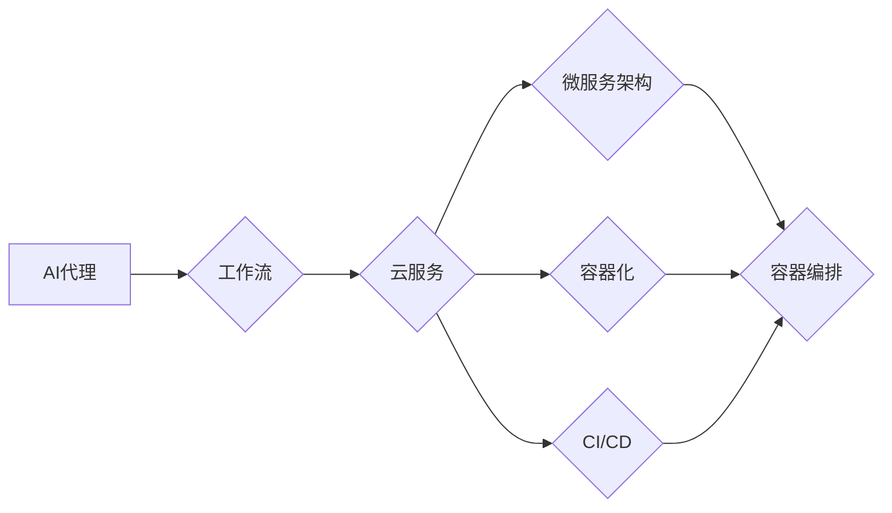

> 云服务, AI代理, 工作流部署, 微服务架构, 自动化, 可伸缩性, 容器化, 持续集成与持续部署

# 基于云服务的AI代理工作流部署策略

随着云计算和人工智能技术的快速发展，AI代理作为一种智能化的软件实体，已经在各个行业中发挥着越来越重要的作用。AI代理能够自动执行复杂的任务，提高工作效率，降低运营成本。然而，将AI代理部署到生产环境中，实现高效、可靠的工作流管理，是一个复杂的过程。本文将探讨基于云服务的AI代理工作流部署策略，分析其核心概念、原理、操作步骤、数学模型、实际应用，并展望未来的发展趋势与挑战。

## 1. 背景介绍

### 1.1 问题的由来

AI代理在工作流中的应用越来越广泛，如智能客服、智能调度、智能推荐等。然而，随着AI代理的增多，如何有效地管理这些代理，确保它们协同工作、高效执行任务，成为一个亟待解决的问题。

### 1.2 研究现状

目前，云服务提供了一种高效、灵活的部署环境，可以满足AI代理工作流的部署需求。许多云服务提供商，如AWS、Azure、Google Cloud等，都提供了丰富的云服务和工具，支持AI代理的部署和管理工作。

### 1.3 研究意义

研究基于云服务的AI代理工作流部署策略，对于提高AI代理的部署效率、降低成本、保证可靠性具有重要意义。

### 1.4 本文结构

本文将按照以下结构进行阐述：

- 第2章：介绍核心概念与联系，并给出Mermaid流程图。
- 第3章：阐述AI代理工作流部署的核心算法原理和具体操作步骤。
- 第4章：讲解数学模型和公式，并进行案例分析。
- 第5章：提供代码实例和详细解释说明。
- 第6章：探讨实际应用场景和未来应用展望。
- 第7章：推荐相关工具和资源。
- 第8章：总结研究成果、未来发展趋势和挑战。
- 第9章：提供附录，解答常见问题。

## 2. 核心概念与联系

### 2.1 核心概念

- **AI代理**：一种智能化的软件实体，能够自动执行复杂的任务，并与用户和环境进行交互。
- **工作流**：一组按特定顺序执行的任务，用于完成特定业务流程。
- **云服务**：一种基于互联网的计算服务，提供计算资源、存储、网络等基础设施。
- **微服务架构**：一种将应用程序拆分为小型、独立、可扩展的服务的方法。
- **容器化**：一种打包应用程序及其依赖项的技术，以便在隔离环境中运行。
- **持续集成与持续部署（CI/CD）**：一种软件开发流程，自动化构建、测试、部署等环节。

### 2.2 联系

AI代理工作流部署策略涉及多个核心概念，它们之间的关系可以用以下Mermaid流程图表示：



## 3. 核心算法原理 & 具体操作步骤

### 3.1 算法原理概述

AI代理工作流部署策略的核心是构建一个可扩展、可靠、高效的系统，以满足AI代理在云环境中的部署需求。

### 3.2 算法步骤详解

1. **需求分析**：分析业务需求，确定工作流中的任务和AI代理类型。
2. **设计工作流**：根据任务和AI代理类型，设计工作流的结构和流程。
3. **选择云服务**：选择合适的云服务提供商和产品，如AWS Lambda、Azure Functions、Google Cloud Functions等。
4. **容器化AI代理**：将AI代理打包成容器，以便在云环境中运行。
5. **部署工作流**：将工作流部署到云环境中，并配置相关资源。
6. **集成CI/CD**：集成持续集成与持续部署流程，实现自动化部署和测试。
7. **监控与维护**：监控工作流运行状态，进行必要的维护和优化。

### 3.3 算法优缺点

**优点**：

- **可伸缩性**：基于云服务的工作流可以轻松扩展，满足不同业务需求。
- **高可靠性**：云服务提供高可用性和故障转移机制，保证工作流的稳定运行。
- **自动化**：CI/CD流程简化了部署和维护过程，提高效率。

**缺点**：

- **成本**：云服务通常需要支付费用，成本较高。
- **安全性**：需要确保云环境和数据的安全性。

### 3.4 算法应用领域

AI代理工作流部署策略适用于以下领域：

- **智能客服**：实现智能化的客户服务，提高客户满意度。
- **智能调度**：优化资源分配，提高工作效率。
- **智能推荐**：提供个性化的推荐服务，提升用户体验。

## 4. 数学模型和公式 & 详细讲解 & 举例说明

### 4.1 数学模型构建

AI代理工作流部署策略的数学模型主要涉及以下几个方面：

- **工作流模型**：描述工作流的任务、状态、转换关系等。
- **AI代理模型**：描述AI代理的行为、能力、性能等。
- **云资源模型**：描述云服务的性能、成本、可用性等。

### 4.2 公式推导过程

由于AI代理工作流部署策略的复杂性，这里不进行具体的公式推导。

### 4.3 案例分析与讲解

以智能客服为例，分析AI代理工作流部署策略的应用。

- **工作流模型**：包括接待客户、理解客户需求、推荐解决方案、处理客户反馈等任务。
- **AI代理模型**：负责理解客户需求、推荐解决方案等任务。
- **云资源模型**：根据工作负载选择合适的云服务实例。

## 5. 项目实践：代码实例和详细解释说明

### 5.1 开发环境搭建

选择合适的云服务提供商和产品，如AWS Lambda，并配置相应的开发环境。

### 5.2 源代码详细实现

以下是一个简单的AWS Lambda函数示例，用于处理智能客服中的客户咨询：

```python
def lambda_handler(event, context):
    # 解析客户咨询内容
    # ...
    # 处理咨询内容
    # ...
    # 返回处理结果
    return {
        'statusCode': 200,
        'body': json.dumps('您好，感谢您的咨询！')
    }
```

### 5.3 代码解读与分析

该示例中，lambda_handler函数为AWS Lambda的入口函数，用于处理客户咨询。在函数内部，首先解析客户咨询内容，然后进行处理，最后返回处理结果。

### 5.4 运行结果展示

当调用该Lambda函数时，会返回一个包含处理结果的JSON对象。

```json
{
  "statusCode": 200,
  "body": "您好，感谢您的咨询！"
}
```

## 6. 实际应用场景

### 6.1 智能客服

智能客服是AI代理工作流部署策略的典型应用场景。通过将AI代理部署到云环境中，可以实现24小时不间断的客户服务，提高客户满意度。

### 6.2 智能调度

智能调度是另一个重要的应用场景。通过将AI代理部署到云环境中，可以实现资源的智能分配，提高资源利用率。

### 6.3 智能推荐

智能推荐也是AI代理工作流部署策略的重要应用场景。通过将AI代理部署到云环境中，可以实现个性化的推荐服务，提升用户体验。

## 7. 工具和资源推荐

### 7.1 学习资源推荐

- 《AWS Lambda官方文档》：介绍了AWS Lambda的基本概念、使用方法和最佳实践。
- 《Azure Functions官方文档》：介绍了Azure Functions的基本概念、使用方法和最佳实践。
- 《Google Cloud Functions官方文档》：介绍了Google Cloud Functions的基本概念、使用方法和最佳实践。

### 7.2 开发工具推荐

- AWS Toolkit for Visual Studio Code：提供AWS Lambda、Amazon API Gateway等服务的开发插件。
- Azure Functions Core Tools：用于创建、构建、测试和部署Azure Functions的命令行工具。
- Google Cloud Functions CLI：用于创建、部署和管理Google Cloud Functions的命令行工具。

### 7.3 相关论文推荐

- “Serverless Computing: Everything You Need to Know” by AWS
- “Serverless Microservices with Azure Functions” by Azure
- “Serverless Computing on Google Cloud” by Google Cloud

## 8. 总结：未来发展趋势与挑战

### 8.1 研究成果总结

本文探讨了基于云服务的AI代理工作流部署策略，分析了其核心概念、原理、操作步骤、数学模型、实际应用，并展望了未来的发展趋势与挑战。

### 8.2 未来发展趋势

- **自动化**：自动化部署和管理将成为AI代理工作流部署的重要趋势。
- **智能化**：AI代理将更加智能化，能够自动优化工作流。
- **跨平台**：AI代理工作流将支持跨平台部署，提高灵活性。

### 8.3 面临的挑战

- **安全性**：确保云环境和数据的安全性是重要的挑战。
- **成本**：云服务费用可能较高，需要优化成本。
- **可伸缩性**：确保工作流的可伸缩性是一个挑战。

### 8.4 研究展望

未来，基于云服务的AI代理工作流部署策略将不断发展和完善，为各行各业提供更加智能、高效、可靠的解决方案。

## 9. 附录：常见问题与解答

**Q1：什么是AI代理？**

A：AI代理是一种智能化的软件实体，能够自动执行复杂的任务，并与用户和环境进行交互。

**Q2：什么是工作流？**

A：工作流是一组按特定顺序执行的任务，用于完成特定业务流程。

**Q3：什么是云服务？**

A：云服务是一种基于互联网的计算服务，提供计算资源、存储、网络等基础设施。

**Q4：什么是微服务架构？**

A：微服务架构是一种将应用程序拆分为小型、独立、可扩展的服务的方法。

**Q5：什么是容器化？**

A：容器化是一种打包应用程序及其依赖项的技术，以便在隔离环境中运行。

**Q6：什么是持续集成与持续部署？**

A：持续集成与持续部署（CI/CD）是一种软件开发流程，自动化构建、测试、部署等环节。

**Q7：如何确保AI代理工作流的安全性？**

A：确保云环境和数据的安全性是重要的。需要采取以下措施：

- 使用加密技术保护数据。
- 采用身份验证和授权机制。
- 定期更新和打补丁。

**Q8：如何优化AI代理工作流部署的成本？**

A：可以采取以下措施优化成本：

- 选择合适的云服务实例。
- 精细化资源管理。
- 使用自动化工具。

**Q9：如何保证AI代理工作流的可伸缩性？**

A：可以采取以下措施保证可伸缩性：

- 使用可伸缩的云服务。
- 设计可伸缩的工作流。
- 监控工作流运行状态，根据需求调整资源。

作者：禅与计算机程序设计艺术 / Zen and the Art of Computer Programming