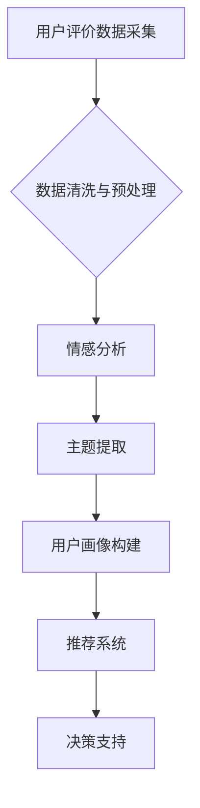

## 基于用户评价体系推动某旅游发展的分析与研究

> 关键词：用户评价、旅游发展、数据挖掘、推荐系统、机器学习、自然语言处理、情感分析

## 1. 背景介绍

随着互联网和移动技术的快速发展，旅游业也迎来了数字化转型。用户评价作为一种重要的旅游信息来源，蕴含着丰富的旅游需求、体验和偏好信息。有效利用用户评价数据，可以帮助旅游企业提升服务质量、优化产品结构、精准营销，从而推动旅游业的可持续发展。

然而，用户评价数据往往是海量、结构化、多模态的，直接利用其价值十分困难。需要借助数据挖掘、机器学习等技术手段，对用户评价进行分析和挖掘，提取其中的关键信息和潜在规律。

本研究旨在探讨基于用户评价体系推动某旅游发展的分析与研究，通过构建用户评价分析模型，挖掘用户评价数据中的价值，为旅游企业提供数据驱动的决策支持。

## 2. 核心概念与联系

### 2.1 用户评价体系

用户评价体系是指收集、存储、分析和利用用户对旅游产品、服务、体验等方面的评价信息的系统。它通常包括以下几个关键要素：

* **评价数据来源**: 包括旅游网站、APP、社交媒体等平台上的用户评论、评分、晒图等信息。
* **评价数据采集**: 利用爬虫、API等技术手段，从不同数据源中采集用户评价数据。
* **评价数据清洗**: 对采集到的数据进行清洗、去噪、格式化等处理，去除无效信息和重复数据。
* **评价数据分析**: 利用数据挖掘、机器学习等技术手段，对用户评价数据进行分析，提取其中的关键信息和潜在规律。
* **评价结果展示**: 将分析结果以图表、报告等形式展示给用户和旅游企业，以便进行决策支持。

### 2.2 数据挖掘与机器学习

数据挖掘是指从海量数据中发现隐藏的模式、规律和知识的过程。机器学习则是数据挖掘的重要技术手段之一，它通过训练模型，使计算机能够从数据中学习，并对新数据进行预测或分类。

在用户评价体系中，数据挖掘和机器学习技术可以用于以下方面：

* **情感分析**: 分析用户评价中的情感倾向，判断用户对旅游产品的满意度或不满意的程度。
* **主题提取**: 从用户评价中提取出主要的主题和关键词，了解用户关注的旅游方面。
* **用户画像**: 根据用户评价数据，构建用户画像，了解不同用户群体的旅游需求和偏好。
* **推荐系统**: 基于用户评价数据，推荐用户可能感兴趣的旅游产品或服务。

### 2.3 流程图



## 3. 核心算法原理 & 具体操作步骤

### 3.1 算法原理概述

本研究将采用以下核心算法：

* **情感分析**: 使用深度学习模型，例如BERT、LSTM等，对用户评价文本进行情感分类，判断其情感倾向为正面、负面或中性。
* **主题提取**: 使用LDA（Latent Dirichlet Allocation）主题模型，从用户评价文本中提取出主要的主题和关键词。
* **用户画像构建**: 使用K-means聚类算法，将用户根据其评价特征进行聚类，构建不同用户群体的画像。
* **推荐系统**: 使用协同过滤算法，根据用户评价历史数据，推荐用户可能感兴趣的旅游产品或服务。

### 3.2 算法步骤详解

#### 3.2.1 情感分析

1. **数据预处理**: 对用户评价文本进行清洗、去停用词、分词等预处理操作。
2. **模型训练**: 使用深度学习模型，例如BERT、LSTM等，对预处理后的文本数据进行训练，学习情感分类的特征。
3. **情感分类**: 将训练好的模型应用于新的用户评价文本，预测其情感倾向。

#### 3.2.2 主题提取

1. **数据预处理**: 对用户评价文本进行清洗、去停用词、分词等预处理操作。
2. **主题模型训练**: 使用LDA主题模型，对预处理后的文本数据进行训练，学习主题分布。
3. **主题提取**: 根据训练好的主题模型，提取出用户评价文本中的主要主题和关键词。

#### 3.2.3 用户画像构建

1. **特征提取**: 从用户评价数据中提取用户特征，例如年龄、性别、旅游偏好、评价频率等。
2. **数据聚类**: 使用K-means聚类算法，将用户根据其特征进行聚类，构建不同用户群体的画像。

#### 3.2.4 推荐系统

1. **用户评分矩阵构建**: 根据用户对旅游产品的评价数据，构建用户评分矩阵。
2. **协同过滤算法**: 使用协同过滤算法，根据用户评分矩阵，推荐用户可能感兴趣的旅游产品或服务。

### 3.3 算法优缺点

#### 3.3.1 情感分析

* **优点**: 可以准确地识别用户评价中的情感倾向，为旅游企业提供用户满意度评估。
* **缺点**: 对文本数据格式和语言风格敏感，需要进行充分的数据预处理和模型训练。

#### 3.3.2 主题提取

* **优点**: 可以发现用户评价中的隐藏主题和关键词，帮助旅游企业了解用户关注的旅游方面。
* **缺点**: 主题模型的训练需要大量数据，并且主题提取结果的解释性相对较弱。

#### 3.3.3 用户画像构建

* **优点**: 可以将用户进行细分，为旅游企业提供精准营销和个性化服务。
* **缺点**: 用户画像的构建需要大量数据和复杂的算法，并且用户画像的稳定性需要不断验证。

#### 3.3.4 推荐系统

* **优点**: 可以根据用户历史数据，推荐用户可能感兴趣的旅游产品或服务，提高用户体验。
* **缺点**: 推荐系统容易陷入冷启动问题，需要不断更新数据和模型才能保持推荐效果。

### 3.4 算法应用领域

* **旅游产品开发**: 根据用户评价数据，了解用户对旅游产品的需求和偏好，为旅游企业提供产品开发参考。
* **旅游服务优化**: 分析用户评价中的负面反馈，找出旅游服务中的问题，并进行改进。
* **精准营销**: 根据用户画像，进行精准营销，提高营销效果。
* **个性化推荐**: 基于用户评价数据，推荐用户可能感兴趣的旅游产品或服务，提升用户体验。

## 4. 数学模型和公式 & 详细讲解 & 举例说明

### 4.1 数学模型构建

#### 4.1.1 情感分类模型

本研究采用深度学习模型，例如BERT，对用户评价文本进行情感分类。BERT模型基于Transformer架构，能够捕捉文本中的长距离依赖关系，提高情感分类的准确性。

#### 4.1.2 主题提取模型

本研究采用LDA主题模型，从用户评价文本中提取出主要的主题和关键词。LDA模型假设每个文档是由多个主题组成的混合分布，每个主题对应一个词语分布。

#### 4.1.3 用户画像构建模型

本研究采用K-means聚类算法，将用户根据其评价特征进行聚类，构建不同用户群体的画像。K-means算法将数据点划分为K个簇，每个簇的中心点代表该簇的特征。

#### 4.1.4 推荐系统模型

本研究采用协同过滤算法，根据用户评分矩阵，推荐用户可能感兴趣的旅游产品或服务。协同过滤算法基于用户的相似性，推荐用户可能喜欢的其他用户也喜欢的产品或服务。

### 4.2 公式推导过程

#### 4.2.1 BERT模型

BERT模型的训练目标是最大化以下公式：

$$
\mathcal{L} = -\sum_{i=1}^{N} \sum_{j=1}^{M} \log p(y_i^j | x_i^j, \theta)
$$

其中：

* $N$ 是训练样本的数量。
* $M$ 是每个样本的词语数量。
* $x_i^j$ 是第 $i$ 个样本的第 $j$ 个词语。
* $y_i^j$ 是第 $i$ 个样本的第 $j$ 个词语的标签。
* $\theta$ 是模型的参数。

#### 4.2.2 LDA模型

LDA模型的主题分布和词语分布可以用以下公式表示：

$$
p(z_i | \alpha) \sim Dirichlet(\alpha)
$$

$$
p(w_i | z_i, \beta) \sim Categorical(\beta_{z_i})
$$

其中：

* $z_i$ 是第 $i$ 个词语所属的主题。
* $\alpha$ 是主题分布的超参数。
* $w_i$ 是第 $i$ 个词语。
* $\beta$ 是词语分布的超参数。

#### 4.2.3 K-means聚类算法

K-means聚类算法的目标是将数据点划分为K个簇，每个簇的中心点代表该簇的特征。算法步骤如下：

1. 随机选择K个数据点作为初始聚类中心。
2. 将每个数据点分配到距离其最近的聚类中心所属的簇。
3. 计算每个簇的中心点。
4. 重复步骤2和步骤3，直到聚类中心不再变化。

#### 4.2.4 协同过滤算法

协同过滤算法基于用户的相似性，推荐用户可能喜欢的其他用户也喜欢的产品或服务。算法步骤如下：

1. 计算用户之间的相似度。
2. 找到与目标用户相似度最高的用户的评分数据。
3. 根据相似用户的评分数据，推荐目标用户可能感兴趣的产品或服务。

### 4.3 案例分析与讲解

#### 4.3.1 情感分析案例

假设用户对某旅游景点评价如下：

“景色非常漂亮，服务态度很好，非常推荐！”

使用BERT模型进行情感分析，可以预测其情感倾向为正面。

#### 4.3.2 主题提取案例

假设用户对某旅游产品的评价如下：

“酒店房间很舒适，早餐种类丰富，但交通不太方便。”

使用LDA主题模型进行主题提取，可以发现主题1为“酒店设施”，主题2为“交通便利性”。

#### 4.3.3 用户画像构建案例

假设用户评价数据包含用户年龄、性别、旅游偏好等特征，使用K-means聚类算法可以将用户分为以下几个群体：

* 年轻人，喜欢探险旅游。
* 中年人，喜欢休闲度假。
* 老年人，喜欢文化旅游。

#### 4.3.4 推荐系统案例

假设用户对某旅游景点评分为5星，使用协同过滤算法可以推荐其他用户也对该景点评分高的旅游景点。

## 5. 项目实践：代码实例和详细解释说明

### 5.1 开发环境搭建

本项目使用Python语言开发，需要安装以下软件包：

* NLTK
* SpaCy
* Gensim
* scikit-learn
* TensorFlow或PyTorch

### 5.2 源代码详细实现

#### 5.2.1 情感分析代码示例

```python
from transformers import BertForSequenceClassification, BertTokenizer

# 加载预训练模型和词典
model_name = "bert-base-uncased"
tokenizer = BertTokenizer.from_pretrained(model_name)
model = BertForSequenceClassification.from_pretrained(model_name, num_labels=3)

# 对用户评价文本进行预处理
text = "景色非常漂亮，服务态度很好，非常推荐！"
inputs = tokenizer(text, return_tensors="pt")

# 进行情感分类
outputs = model(**inputs)
predicted_class = outputs.logits.argmax().item()

# 输出情感倾向
if predicted_class == 0:
    print("负面")
elif predicted_class == 1:
    print("中性")
else:
    print("正面")