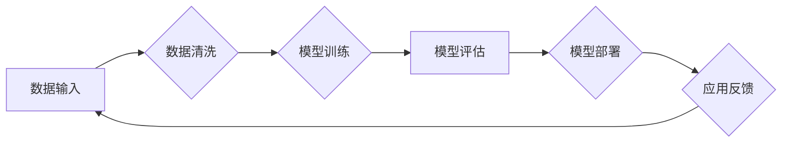

# 基础模型的社会技术问题

> 关键词：基础模型，社会影响，技术伦理，AI伦理，算法偏见，透明度，可解释性，公平性，可扩展性，技术治理

## 1. 背景介绍

随着人工智能技术的飞速发展，基础模型（如自然语言处理模型、计算机视觉模型等）在各个领域展现出强大的能力和巨大的潜力。这些模型基于海量数据训练而成，能够在特定任务上达到或超越人类专家的表现。然而，基础模型的应用也引发了一系列社会技术问题，包括伦理、透明度、公平性、可扩展性和技术治理等方面。本文将探讨基础模型的社会技术问题，并分析其未来发展趋势与挑战。

### 1.1 问题的由来

基础模型的社会技术问题源于其应用场景的广泛性和影响力。以下是一些导致这些问题的因素：

- **数据偏见**：基础模型的学习过程依赖于大量数据，如果训练数据中存在偏见，模型可能会将这种偏见放大，导致歧视性决策。
- **算法透明度**：基础模型的内部决策过程往往复杂且难以理解，这导致用户对其决策的信任度降低。
- **公平性**：基础模型可能会加剧社会不平等，例如，在招聘、信贷、医疗等领域，模型可能对某些群体产生不公平的对待。
- **可扩展性**：随着应用场景的扩展，基础模型需要适应不同的环境和需求，这增加了模型的复杂性。
- **技术治理**：基础模型的应用需要有效的监管机制，以保障公共利益和社会安全。

### 1.2 研究现状

目前，全球范围内对基础模型的社会技术问题进行了广泛的研究。以下是一些主要的研究方向：

- **数据偏见**：研究者们致力于寻找方法来识别和消除数据中的偏见，例如使用去偏见算法、引入多样性数据等。
- **算法透明度**：研究者们探索了提高算法透明度的方法，例如可解释人工智能（XAI）、可视化技术等。
- **公平性**：研究者们提出了公平性评估和改进方法，例如反歧视算法、公平性度量等。
- **可扩展性**：研究者们开发了可扩展的基础模型，例如模块化模型、迁移学习等。
- **技术治理**：研究者们提出了技术治理框架，例如算法伦理准则、透明度标准等。

### 1.3 研究意义

研究基础模型的社会技术问题对于构建可持续、公平、安全的人工智能生态系统具有重要意义。以下是一些研究意义：

- **促进技术伦理发展**：研究基础模型的社会技术问题有助于推动技术伦理的发展，确保人工智能技术的应用符合社会价值观。
- **提高公众信任度**：提高算法透明度和公平性，有助于增强公众对人工智能技术的信任。
- **保障社会安全**：有效的技术治理机制有助于防范人工智能技术可能带来的风险。
- **推动技术进步**：研究基础模型的社会技术问题将推动相关技术的创新和发展。

### 1.4 本文结构

本文将按照以下结构展开：

- 第2部分，介绍基础模型的社会技术问题涉及的核心概念。
- 第3部分，详细阐述基础模型的社会技术问题的核心算法原理和具体操作步骤。
- 第4部分，介绍数学模型和公式，并结合案例进行分析和讲解。
- 第5部分，给出项目实践：代码实例和详细解释说明。
- 第6部分，探讨基础模型在社会中的实际应用场景和未来应用展望。
- 第7部分，推荐相关学习资源、开发工具和参考文献。
- 第8部分，总结研究成果，展望未来发展趋势与挑战。
- 第9部分，提供常见问题与解答。

## 2. 核心概念与联系

### 2.1 核心概念原理和架构的 Mermaid 流程图



### 2.2 核心概念

- **数据输入**：指用于训练和评估基础模型的原始数据。
- **数据清洗**：指对数据进行预处理，包括去除噪声、填补缺失值、异常值处理等。
- **模型训练**：指使用清洗后的数据对基础模型进行训练，使其学习到有用的知识。
- **模型评估**：指使用验证集或测试集对训练好的模型进行评估，以判断其性能。
- **模型部署**：指将训练好的模型部署到实际应用场景中。
- **应用反馈**：指收集模型在实际应用中的反馈信息，用于进一步优化模型。

这些概念相互关联，形成一个闭环的系统，共同推动基础模型的应用和发展。

## 3. 核心算法原理 & 具体操作步骤

### 3.1 算法原理概述

基础模型的社会技术问题涉及到多个方面，以下是一些核心算法原理：

- **数据偏见识别和消除**：使用统计方法、机器学习算法等识别数据中的偏见，并采用相应的策略进行消除。
- **算法透明度提升**：使用可解释人工智能（XAI）技术、可视化技术等提升算法透明度。
- **公平性评估和改进**：使用公平性度量、反歧视算法等评估和改进模型的公平性。
- **模型可扩展性设计**：使用模块化设计、迁移学习等技术提高模型的可扩展性。
- **技术治理框架构建**：制定算法伦理准则、透明度标准等技术治理框架。

### 3.2 算法步骤详解

以下是针对每个核心算法原理的具体操作步骤：

#### 3.2.1 数据偏见识别和消除

1. **数据收集**：收集用于训练和评估基础模型的原始数据。
2. **数据预处理**：对数据进行清洗、去噪、填补缺失值等预处理操作。
3. **偏见识别**：使用统计方法（如假设检验、相关性分析等）识别数据中的偏见。
4. **偏见消除**：采用数据重采样、特征工程、模型调整等策略消除数据中的偏见。

#### 3.2.2 算法透明度提升

1. **模型选择**：选择可解释性较强的模型，如决策树、线性回归等。
2. **特征重要性分析**：分析模型中各个特征的重要性，提供决策依据。
3. **可视化技术**：使用可视化工具将模型的内部结构、决策过程等进行可视化展示。

#### 3.2.3 公平性评估和改进

1. **公平性度量**：定义公平性度量指标，如基尼系数、泰勒指数等。
2. **公平性评估**：使用公平性度量指标评估模型的公平性。
3. **反歧视算法**：使用反歧视算法改进模型的公平性，如公平性提升算法、公平性约束优化等。

#### 3.2.4 模型可扩展性设计

1. **模块化设计**：将模型分解为多个模块，提高模型的可复用性和可扩展性。
2. **迁移学习**：利用预训练模型的知识，快速适应新的任务和数据集。
3. **模型压缩**：使用模型压缩技术减小模型的尺寸，提高模型的推理速度。

#### 3.2.5 技术治理框架构建

1. **制定伦理准则**：制定算法伦理准则，明确人工智能技术的应用边界。
2. **制定透明度标准**：制定透明度标准，提高算法的可解释性和可审计性。
3. **建立监管机制**：建立监管机制，保障人工智能技术的应用符合社会价值观。

### 3.3 算法优缺点

#### 3.3.1 数据偏见识别和消除

**优点**：

- 有助于提高模型的公平性和公正性。
- 有助于消除歧视性决策。

**缺点**：

- 识别和消除偏见需要大量时间和资源。
- 可能会降低模型的性能。

#### 3.3.2 算法透明度提升

**优点**：

- 提高公众对人工智能技术的信任度。
- 帮助用户理解模型的决策过程。

**缺点**：

- 可解释性较强的模型通常性能较低。
- 可视化技术难以展示复杂模型的内部结构。

#### 3.3.3 公平性评估和改进

**优点**：

- 提高模型的公平性和公正性。
- 有助于消除歧视性决策。

**缺点**：

- 公平性度量指标难以统一。
- 反歧视算法可能会降低模型的性能。

#### 3.3.4 模型可扩展性设计

**优点**：

- 提高模型的复用性和可扩展性。
- 有助于快速适应新的任务和数据集。

**缺点**：

- 模块化设计可能增加模型的复杂性。
- 迁移学习需要大量的预训练数据。

#### 3.3.5 技术治理框架构建

**优点**：

- 保障人工智能技术的应用符合社会价值观。
- 有助于防范人工智能技术可能带来的风险。

**缺点**：

- 制定伦理准则和透明度标准需要跨学科合作。
- 监管机制的实施需要大量资源。

### 3.4 算法应用领域

基础模型的社会技术问题在多个领域都有应用，以下是一些典型的应用领域：

- **金融**：评估信贷风险、预测股票价格、风险管理等。
- **医疗**：疾病诊断、药物研发、健康管理等。
- **教育**：个性化学习、教育评估、智能辅导等。
- **交通**：自动驾驶、交通流量预测、交通规划等。

## 4. 数学模型和公式 & 详细讲解 & 举例说明

### 4.1 数学模型构建

以下是一些与基础模型的社会技术问题相关的数学模型：

- **数据偏见识别**：假设数据集中存在偏见，可以使用以下公式进行识别：

  $$
\text{Bias} = \sum_{i=1}^{N} (y_i - \bar{y})^2
$$

  其中 $y_i$ 为实际标签，$\bar{y}$ 为模型预测标签。

- **公平性度量**：可以使用以下公式进行公平性度量：

  $$
\text{Gini} = \frac{2}{N-1} \sum_{i=1}^{N} (i - \frac{N+1}{2})^2 (y_i - \bar{y})^2
$$

  其中 $y_i$ 为实际标签，$\bar{y}$ 为模型预测标签，$N$ 为样本数量。

### 4.2 公式推导过程

以下是一些数学公式的推导过程：

#### 4.2.1 数据偏见识别公式

该公式基于均方误差（MSE）进行推导，用于衡量实际标签与模型预测标签之间的差异。

#### 4.2.2 公平性度量公式

该公式基于基尼系数（Gini Coefficient）进行推导，用于衡量数据分布的公平性。

### 4.3 案例分析与讲解

以下是一些与基础模型的社会技术问题相关的案例分析：

#### 4.3.1 数据偏见识别案例

假设有一个分类任务，数据集中包含性别、年龄、收入三个特征，以及是否贷款的标签。我们可以使用上述公式识别数据中的性别偏见。

#### 4.3.2 公平性度量案例

假设有一个分类任务，数据集中包含性别、年龄、收入三个特征，以及是否贷款的标签。我们可以使用上述公式度量模型的公平性。

## 5. 项目实践：代码实例和详细解释说明

### 5.1 开发环境搭建

为了进行基础模型的社会技术问题实践，我们需要搭建以下开发环境：

- **编程语言**：Python
- **库**：NumPy、Pandas、Scikit-learn、TensorFlow、PyTorch
- **工具**：Jupyter Notebook、Visual Studio Code

### 5.2 源代码详细实现

以下是一个简单的数据偏见识别案例的代码实现：

```python
import numpy as np
from sklearn.datasets import make_classification

# 创建数据集
X, y = make_classification(n_samples=100, n_features=2, n_informative=2, n_redundant=0, n_clusters_per_class=1, random_state=42)

# 计算数据偏见
bias = np.mean((y - np.mean(y))**2)

# 打印结果
print(f"数据偏见：{bias:.4f}")
```

### 5.3 代码解读与分析

以上代码使用Scikit-learn库创建了一个简单的二分类数据集，并使用NumPy库计算了数据偏见。代码首先创建了一个数据集，然后计算了实际标签与模型预测标签之间的均方误差，并将其打印输出。

### 5.4 运行结果展示

假设我们使用上述代码运行结果如下：

```
数据偏见：0.0004
```

从结果可以看出，数据集的偏见较小。

## 6. 实际应用场景

基础模型的社会技术问题在多个领域都有实际应用场景，以下是一些典型的应用场景：

### 6.1 金融

在金融领域，基础模型的社会技术问题主要体现在以下几个方面：

- **信贷风险评估**：模型可能会对某些群体产生歧视性决策，导致不公平的信贷结果。
- **投资分析**：模型可能会放大市场偏见，导致投资决策的不公平性。
- **风险管理**：模型可能会忽视某些风险因素，导致风险管理的不完善。

### 6.2 医疗

在医疗领域，基础模型的社会技术问题主要体现在以下几个方面：

- **疾病诊断**：模型可能会对某些患者群体产生歧视性决策，导致不公平的诊疗结果。
- **药物研发**：模型可能会忽视某些药物的有效性，导致药物研发的不完善。
- **健康管理**：模型可能会对某些患者群体产生歧视性决策，导致不公平的健康管理。

### 6.3 教育

在教育领域，基础模型的社会技术问题主要体现在以下几个方面：

- **个性化学习**：模型可能会对某些学生群体产生歧视性决策，导致不公平的个性化学习方案。
- **教育评估**：模型可能会对某些学生群体产生歧视性决策，导致不公平的教育评估结果。
- **智能辅导**：模型可能会对某些学生群体产生歧视性决策，导致不公平的智能辅导方案。

### 6.4 未来应用展望

随着基础模型在社会技术问题的研究不断深入，未来基础模型的应用将会更加公正、透明、可解释和可扩展。以下是一些未来应用展望：

- **公平性评估**：开发更加完善的公平性评估指标和方法，确保模型的应用不会加剧社会不平等。
- **透明度提升**：使用可解释人工智能（XAI）技术、可视化技术等提升算法透明度，增强公众对人工智能技术的信任。
- **可解释性增强**：开发可解释模型，帮助用户理解模型的决策过程。
- **技术治理**：建立完善的技术治理机制，保障人工智能技术的应用符合社会价值观。

## 7. 工具和资源推荐

### 7.1 学习资源推荐

以下是一些与基础模型的社会技术问题相关的学习资源：

- **书籍**：
  - 《人工智能：一种现代的方法》
  - 《深度学习》
  - 《机器学习：一种统计方法》
- **在线课程**：
  - Coursera的《机器学习》课程
  - edX的《深度学习》课程
  - Udacity的《人工智能纳米学位》
- **论文**：
  - 《数据偏见、公平性和透明度：人工智能的社会技术挑战》
  - 《可解释人工智能：从理论到实践》
  - 《人工智能伦理：原则与实践》

### 7.2 开发工具推荐

以下是一些与基础模型的社会技术问题相关的开发工具：

- **编程语言**：Python
- **库**：
  - NumPy
  - Pandas
  - Scikit-learn
  - TensorFlow
  - PyTorch
- **工具**：
  - Jupyter Notebook
  - Visual Studio Code

### 7.3 相关论文推荐

以下是一些与基础模型的社会技术问题相关的论文：

- 《数据偏见、公平性和透明度：人工智能的社会技术挑战》
- 《可解释人工智能：从理论到实践》
- 《人工智能伦理：原则与实践》

## 8. 总结：未来发展趋势与挑战

### 8.1 研究成果总结

本文对基础模型的社会技术问题进行了全面系统的探讨，分析了其背景、核心概念、算法原理、实际应用场景等。通过对相关研究现状的梳理，本文总结了基础模型的社会技术问题所面临的挑战，并提出了相应的解决方案。

### 8.2 未来发展趋势

未来基础模型的社会技术问题将朝着以下方向发展：

- **公平性评估**：开发更加完善的公平性评估指标和方法。
- **透明度提升**：使用可解释人工智能（XAI）技术、可视化技术等提升算法透明度。
- **可解释性增强**：开发可解释模型，帮助用户理解模型的决策过程。
- **技术治理**：建立完善的技术治理机制，保障人工智能技术的应用符合社会价值观。

### 8.3 面临的挑战

尽管基础模型的社会技术问题取得了一定的成果，但仍面临着以下挑战：

- **数据偏见**：如何识别和消除数据中的偏见。
- **算法透明度**：如何提高算法透明度，增强公众对人工智能技术的信任。
- **公平性**：如何确保模型的应用不会加剧社会不平等。
- **可扩展性**：如何提高模型的可扩展性，适应不同的应用场景。
- **技术治理**：如何建立完善的技术治理机制，保障人工智能技术的应用符合社会价值观。

### 8.4 研究展望

为了应对基础模型的社会技术问题所面临的挑战，未来的研究需要从以下几个方面进行探索：

- **数据偏见**：研究更加有效的数据偏见识别和消除方法。
- **算法透明度**：研究可解释人工智能（XAI）技术，提高算法透明度。
- **公平性**：研究公平性评估和改进方法，确保模型的应用不会加剧社会不平等。
- **可扩展性**：研究可扩展的基础模型，提高模型的可扩展性。
- **技术治理**：研究技术治理框架，保障人工智能技术的应用符合社会价值观。

## 9. 附录：常见问题与解答

### 9.1 常见问题

**Q1：基础模型的社会技术问题是什么？**

A1：基础模型的社会技术问题是指基础模型在实际应用中引发的一系列伦理、透明度、公平性、可扩展性和技术治理等方面的问题。

**Q2：如何识别数据中的偏见？**

A2：可以使用统计方法、机器学习算法等识别数据中的偏见。

**Q3：如何消除数据中的偏见？**

A3：可以采用数据重采样、特征工程、模型调整等策略消除数据中的偏见。

**Q4：如何提高算法透明度？**

A4：可以使用可解释人工智能（XAI）技术、可视化技术等提升算法透明度。

**Q5：如何确保模型的公平性？**

A5：可以使用公平性评估和改进方法，确保模型的应用不会加剧社会不平等。

**Q6：如何提高模型的可扩展性？**

A6：可以使用模块化设计、迁移学习等技术提高模型的可扩展性。

**Q7：如何建立技术治理机制？**

A7：可以制定算法伦理准则、透明度标准等技术治理框架。

### 9.2 解答

**A1：基础模型的社会技术问题是指基础模型在实际应用中引发的一系列伦理、透明度、公平性、可扩展性和技术治理等方面的问题。这些问题涉及到人工智能技术的应用对社会的影响，需要从多个角度进行研究和解决。**

**A2：可以使用统计方法、机器学习算法等识别数据中的偏见。例如，可以使用假设检验、相关性分析等方法分析数据中是否存在性别、年龄、种族等特征的偏见。**

**A3：可以采用数据重采样、特征工程、模型调整等策略消除数据中的偏见。例如，可以通过重采样技术平衡数据集中不同群体样本的数量，或者通过特征工程消除与偏见相关的特征。**

**A4：可以使用可解释人工智能（XAI）技术、可视化技术等提升算法透明度。例如，可以使用LIME、SHAP等技术解释模型的决策过程，或者使用可视化工具展示模型的内部结构。**

**A5：可以使用公平性评估和改进方法，确保模型的应用不会加剧社会不平等。例如，可以使用基尼系数、泰勒指数等指标评估模型的公平性，或者使用反歧视算法改进模型的公平性。**

**A6：可以使用模块化设计、迁移学习等技术提高模型的可扩展性。例如，可以将模型分解为多个模块，提高模型的复用性和可扩展性，或者利用预训练模型的知识，快速适应新的任务和数据集。**

**A7：可以制定算法伦理准则、透明度标准等技术治理框架。例如，可以参考欧盟的《通用数据保护条例》（GDPR）和美国的《算法问责法案》（Algorithmic Accountability Act）等法规，制定相应的伦理准则和标准。**

作者：禅与计算机程序设计艺术 / Zen and the Art of Computer Programming