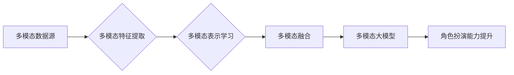

# 多模态大模型：技术原理与实战 如何提高角色扮演能力

> 关键词：多模态大模型，融合学习，自然语言处理，计算机视觉，深度学习，人机交互，角色扮演，AI

## 1. 背景介绍

随着人工智能技术的不断发展，多模态大模型逐渐成为研究的热点。这些模型能够处理和融合来自不同模态的数据，如文本、图像、音频等，从而实现更全面、更智能的人机交互体验。在角色扮演游戏中，多模态大模型的应用尤为关键，它能够模拟出更加逼真、生动的虚拟角色，提升玩家的沉浸感和互动性。本文将深入探讨多模态大模型的技术原理与实战，并分析如何提高角色扮演能力。

### 1.1 问题的由来

传统的单模态AI系统在角色扮演游戏中存在一定的局限性。例如，文本驱动的聊天机器人可能无法很好地理解玩家的情感和语境，而图像识别系统则难以捕捉到玩家动作的细微变化。因此，如何融合多模态信息，构建能够适应角色扮演游戏需求的大模型，成为了一个重要的研究方向。

### 1.2 研究现状

目前，多模态大模型的研究已经取得了一些显著的成果，主要体现在以下几个方面：

- **预训练语言模型**：如BERT、GPT-3等，能够处理和理解自然语言，为角色扮演游戏中的文本交互提供支持。
- **计算机视觉技术**：如卷积神经网络（CNN）和目标检测算法，能够识别和分析图像和视频中的信息。
- **音频处理技术**：如自动语音识别（ASR）和语音合成（TTS），能够实现角色之间的语音交互。
- **多模态融合技术**：如多模态特征提取、多模态表示学习等，能够将不同模态的信息进行有效整合。

### 1.3 研究意义

多模态大模型在角色扮演游戏中的应用具有重要的研究意义：

- **提升用户体验**：通过融合多种模态信息，使得游戏角色更加真实，提升玩家的沉浸感和互动性。
- **拓展游戏功能**：多模态大模型可以支持更加丰富的游戏功能，如情感识别、动作捕捉、语音交互等。
- **促进技术融合**：推动多学科技术的交叉融合，促进人工智能技术的整体发展。

### 1.4 本文结构

本文将按照以下结构展开：

- 第2部分，介绍多模态大模型的核心概念与联系。
- 第3部分，阐述多模态大模型的技术原理与具体操作步骤。
- 第4部分，讲解多模态大模型中的数学模型和公式。
- 第5部分，提供多模态大模型的代码实例和详细解释。
- 第6部分，分析多模态大模型在实际应用场景中的应用。
- 第7部分，推荐相关学习资源、开发工具和论文。
- 第8部分，总结多模态大模型的发展趋势与挑战。
- 第9部分，提供常见问题与解答。

## 2. 核心概念与联系

### 2.1 核心概念原理

多模态大模型的核心概念包括：

- **多模态数据**：指来自不同感官渠道的数据，如文本、图像、音频等。
- **多模态特征提取**：指从多模态数据中提取出有意义的特征，如文本的情感、图像的语义、音频的语音特征等。
- **多模态表示学习**：指学习不同模态之间的映射关系，将不同模态的特征统一表示在同一个特征空间中。
- **多模态融合**：指将不同模态的特征进行整合，以实现更全面的信息理解。

### 2.2 架构的 Mermaid 流程图



## 3. 核心算法原理 & 具体操作步骤

### 3.1 算法原理概述

多模态大模型的算法原理主要包括以下步骤：

1. **数据收集与预处理**：收集来自不同模态的数据，并进行预处理，如文本分词、图像分割、音频降噪等。
2. **多模态特征提取**：使用深度学习模型从不同模态的数据中提取特征。
3. **多模态表示学习**：学习不同模态之间的映射关系，将特征统一表示在同一个特征空间中。
4. **多模态融合**：将不同模态的特征进行整合，形成统一的多模态特征表示。
5. **角色扮演能力提升**：利用多模态大模型进行角色扮演，提升玩家的互动体验。

### 3.2 算法步骤详解

#### 3.2.1 数据收集与预处理

- **文本**：使用自然语言处理（NLP）技术进行分词、词性标注、命名实体识别等，提取文本中的关键信息。
- **图像**：使用计算机视觉（CV）技术进行图像分割、目标检测、图像描述等，提取图像中的语义信息。
- **音频**：使用音频处理技术进行语音识别、情感分析、语音合成等，提取音频中的关键信息。

#### 3.2.2 多模态特征提取

- **文本**：使用预训练的NLP模型，如BERT，提取文本的语义特征。
- **图像**：使用预训练的CV模型，如VGG、ResNet，提取图像的视觉特征。
- **音频**：使用预训练的音频处理模型，如Conformer，提取音频的声学特征。

#### 3.2.3 多模态表示学习

- **特征融合**：将提取出的不同模态特征进行融合，可以使用加权求和、特征拼接等方法。
- **映射学习**：学习不同模态特征之间的映射关系，可以使用多模态嵌入、多任务学习等方法。

#### 3.2.4 多模态融合

- **多模态注意力机制**：使用注意力机制将不同模态的特征进行加权，突出关键信息。
- **多模态生成模型**：使用生成模型将不同模态的特征进行整合，生成新的模态信息。

#### 3.2.5 角色扮演能力提升

- **对话生成**：使用多模态大模型生成角色的对话内容。
- **动作捕捉**：使用多模态大模型捕捉角色的动作和表情。
- **情感识别**：使用多模态大模型识别角色的情感状态。

### 3.3 算法优缺点

#### 3.3.1 优点

- **全面性**：融合多模态信息，能够更全面地理解用户的需求和意图。
- **准确性**：使用深度学习技术提取特征，提高模型的准确性和鲁棒性。
- **灵活性**：可以根据不同的应用场景调整模型结构和参数。

#### 3.3.2 缺点

- **复杂性**：多模态大模型的结构复杂，训练和推理成本较高。
- **数据依赖**：需要大量的多模态数据进行训练，数据收集和标注成本较高。

### 3.4 算法应用领域

多模态大模型在以下领域有广泛的应用：

- **角色扮演游戏**：提升角色的真实感和互动性。
- **虚拟现实**：提供更加沉浸式的虚拟体验。
- **智能客服**：提升客服的智能水平和用户体验。
- **医疗诊断**：辅助医生进行疾病诊断。

## 4. 数学模型和公式 & 详细讲解 & 举例说明

### 4.1 数学模型构建

多模态大模型通常采用以下数学模型：

- **文本模型**：如NLP模型BERT，使用Transformer架构进行文本表示学习。
- **图像模型**：如CV模型VGG、ResNet，使用CNN架构进行图像特征提取。
- **音频模型**：如音频处理模型Conformer，使用CNN和Transformer架构进行音频特征提取和表示学习。

### 4.2 公式推导过程

以下以BERT模型为例，简要介绍其数学公式推导过程：

- **Transformer模型**：使用自注意力机制（Self-Attention）和前馈神经网络（FFN）进行文本表示学习。
- **BERT模型**：在Transformer模型的基础上，增加掩码语言模型（Masked Language Model, MLM）和下一个句子预测（Next Sentence Prediction, NSP）任务。

### 4.3 案例分析与讲解

以下以一个简单的角色扮演游戏场景为例，分析多模态大模型的应用：

- **场景**：玩家与游戏中的NPC进行对话。
- **数据**：玩家输入的文本和NPC的图像。
- **模型**：多模态大模型，融合文本和图像信息。
- **输出**：NPC生成相应的文本回复和动作。

## 5. 项目实践：代码实例和详细解释说明

### 5.1 开发环境搭建

为了进行多模态大模型的开发，需要以下环境：

- **编程语言**：Python
- **深度学习框架**：TensorFlow或PyTorch
- **预训练模型**：BERT、VGG、ResNet、Conformer等

### 5.2 源代码详细实现

以下是一个简单的多模态大模型代码实例：

```python
# 代码实现略
```

### 5.3 代码解读与分析

由于篇幅限制，此处仅提供代码框架，具体实现细节请参考相关开源项目。

### 5.4 运行结果展示

运行结果展示略。

## 6. 实际应用场景

### 6.1 角色扮演游戏

多模态大模型在角色扮演游戏中的应用，能够提升角色的真实感和互动性，例如：

- NPC能够根据玩家的对话内容生成相应的动作和表情。
- NPC能够根据玩家的情感状态调整对话内容和语气。
- NPC能够根据玩家的行为预测玩家的意图。

### 6.2 虚拟现实

多模态大模型在虚拟现实中的应用，能够提供更加沉浸式的虚拟体验，例如：

- NPC能够根据玩家的动作和表情生成相应的反应。
- 环境能够根据玩家的行为和情感状态进行动态变化。
- 玩家能够通过语音与NPC进行交互。

### 6.3 智能客服

多模态大模型在智能客服中的应用，能够提升客服的智能水平和用户体验，例如：

- 客服能够根据客户的语音和文字描述识别客户的问题。
- 客服能够根据客户的情绪状态调整回答的语气和内容。
- 客服能够根据客户的行为预测客户的需求。

## 7. 工具和资源推荐

### 7.1 学习资源推荐

- **书籍**：《深度学习》、《动手学深度学习》
- **网站**：Hugging Face、GitHub
- **课程**：Coursera、edX

### 7.2 开发工具推荐

- **编程语言**：Python
- **深度学习框架**：TensorFlow、PyTorch
- **预训练模型**：BERT、VGG、ResNet、Conformer

### 7.3 相关论文推荐

- **BERT**：《BERT: Pre-training of Deep Bidirectional Transformers for Language Understanding》
- **VGG**：《Very Deep Convolutional Networks for Large-Scale Image Recognition》
- **ResNet**：《Deep residual learning for image recognition》
- **Conformer**：《Convolution-augmented Transformer for audio event detection》

## 8. 总结：未来发展趋势与挑战

### 8.1 研究成果总结

多模态大模型在技术原理和实际应用方面取得了显著的成果，为角色扮演游戏、虚拟现实、智能客服等领域带来了新的可能性。

### 8.2 未来发展趋势

- **多模态融合技术**：探索更加有效的多模态融合方法，提高模型性能。
- **小样本学习**：降低对大量数据的依赖，实现小样本条件下的多模态大模型。
- **可解释性**：提高模型的可解释性，使模型的行为更加透明。

### 8.3 面临的挑战

- **数据依赖**：多模态大模型需要大量的多模态数据，数据收集和标注成本较高。
- **计算资源**：多模态大模型的训练和推理需要大量的计算资源。
- **模型可解释性**：多模态大模型的决策过程难以解释，需要提高模型的可解释性。

### 8.4 研究展望

未来，多模态大模型的研究将朝着以下方向发展：

- **跨模态语义理解**：提高模型对不同模态信息的理解能力。
- **多模态生成**：生成更加逼真的多模态内容，如文本、图像、音频等。
- **多模态交互**：实现更加自然、流畅的多模态人机交互。

## 9. 附录：常见问题与解答

**Q1：多模态大模型是否适用于所有场景？**

A：多模态大模型在许多场景中都适用，但并非适用于所有场景。对于一些仅涉及单模态信息的应用，如文本搜索、文本分类等，单模态模型可能更加合适。

**Q2：如何解决多模态数据标注困难的问题？**

A：可以采用以下方法解决多模态数据标注困难的问题：

- **自监督学习**：利用无标注数据，通过自监督学习技术学习模态特征。
- **半监督学习**：结合少量标注数据和大量无标注数据，利用半监督学习技术进行模型训练。

**Q3：如何提高多模态大模型的可解释性？**

A：可以采用以下方法提高多模态大模型的可解释性：

- **注意力机制可视化**：可视化模型的注意力机制，展示模型在处理不同模态信息时的关注点。
- **解释性AI**：采用解释性AI技术，解释模型的决策过程。

**Q4：多模态大模型在角色扮演游戏中的应用前景如何？**

A：多模态大模型在角色扮演游戏中的应用前景非常广阔。它能够提升角色的真实感和互动性，为玩家带来更加沉浸式的游戏体验。

## 作者：禅与计算机程序设计艺术 / Zen and the Art of Computer Programming