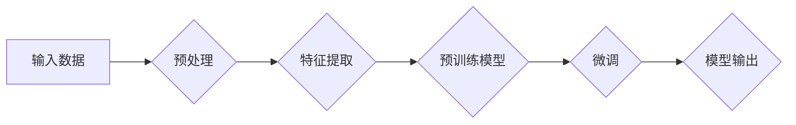

# 大模型在to B市场的应用

> 关键词：大模型，to B市场，商业应用，企业解决方案，定制化，智能服务，行业落地

## 1. 背景介绍

随着人工智能技术的飞速发展，大模型（Large Models）已经成为了推动产业变革的重要力量。大模型能够处理和生成大量复杂的数据，通过学习人类知识，为各行各业提供智能化的解决方案。在to B市场中，大模型的应用越来越广泛，成为企业提升竞争力、优化业务流程的关键驱动力。

### 1.1 问题的由来

传统to B市场中的企业面临着诸多挑战，如：

- 数据处理能力不足，难以从海量数据中提取有价值的信息。
- 业务流程繁琐，人工效率低下，成本高昂。
- 竞争激烈，需要快速响应市场变化，提供个性化的服务。

大模型的出现，为解决这些问题提供了新的思路。通过将大模型应用于to B市场，企业可以实现以下目标：

- 提高数据处理和分析能力，实现数据驱动决策。
- 优化业务流程，降低成本，提升效率。
- 提供个性化服务，增强客户粘性，提升市场竞争力。

### 1.2 研究现状

目前，大模型在to B市场的应用已经取得了显著进展，以下是一些典型应用领域：

- 客户服务：智能客服、智能语音助手等。
- 供应链管理：需求预测、库存管理、物流优化等。
- 金融风控：信用评估、反欺诈、投资策略等。
- 医疗健康：疾病预测、病例分析、医疗诊断等。
- 教育培训：个性化学习、自动批改作业、智能辅导等。

### 1.3 研究意义

大模型在to B市场的应用具有重要的研究意义：

- 推动企业数字化转型，提升企业竞争力。
- 促进产业结构升级，创造新的经济增长点。
- 推动人工智能技术落地，实现产业化应用。

## 2. 核心概念与联系

### 2.1 核心概念原理

大模型是人工智能领域的一个分支，它通过学习海量数据，建立起复杂的数学模型，能够对复杂任务进行预测、决策和生成。大模型的原理主要包括：

- 预训练：在大规模无标签数据上进行预训练，学习通用知识。
- 微调：在特定任务上使用标注数据进行微调，适应特定领域。
- 迁移学习：将预训练模型的知识迁移到新的任务上。

### 2.2 架构流程图

以下是大模型在to B市场的应用架构流程图：



**A：输入数据**：企业提供的原始业务数据，如客户数据、交易数据、运营数据等。

**B：预处理**：对输入数据进行清洗、转换、标准化等操作，为后续处理做准备。

**C：特征提取**：从预处理后的数据中提取有助于任务完成的特征。

**D：预训练模型**：使用在大规模无标签数据上预训练的通用大模型，如BERT、GPT等。

**E：微调**：在特定任务上使用标注数据进行微调，优化模型参数。

**F：模型输出**：模型对输入数据进行分析后，生成的预测、决策或生成结果。

## 3. 核心算法原理 & 具体操作步骤

### 3.1 算法原理概述

大模型在to B市场的应用，主要依赖于以下算法：

- 预训练算法：如BERT、GPT等，通过在大规模无标签数据上预训练，学习通用知识。
- 微调算法：如基于梯度的优化算法，通过在特定任务上使用标注数据进行微调，优化模型参数。
- 迁移学习算法：如多任务学习、多样本学习等，将预训练模型的知识迁移到新的任务上。

### 3.2 算法步骤详解

大模型在to B市场的应用步骤如下：

1. 数据收集与预处理：收集企业业务数据，进行清洗、转换、标准化等预处理操作。
2. 特征提取：从预处理后的数据中提取有助于任务完成的特征。
3. 选择预训练模型：根据任务类型和特点，选择合适的预训练模型。
4. 微调模型：在特定任务上使用标注数据进行微调，优化模型参数。
5. 模型评估：在测试集上评估模型性能，调整模型结构和参数。
6. 模型部署：将模型部署到生产环境中，应用于实际业务场景。

### 3.3 算法优缺点

**优点**：

- 预训练模型学习到了丰富的通用知识，能够快速适应特定任务。
- 微调过程参数更新量小，计算效率高。
- 迁移学习能力强，能够将预训练模型的知识迁移到新的任务上。

**缺点**：

- 预训练数据质量对模型性能影响较大。
- 微调过程中需要大量的标注数据。
- 模型解释性差，难以理解其内部工作机制。

### 3.4 算法应用领域

大模型在to B市场的应用领域广泛，以下是一些典型应用：

- 客户服务：智能客服、智能语音助手等。
- 供应链管理：需求预测、库存管理、物流优化等。
- 金融风控：信用评估、反欺诈、投资策略等。
- 医疗健康：疾病预测、病例分析、医疗诊断等。
- 教育培训：个性化学习、自动批改作业、智能辅导等。

## 4. 数学模型和公式 & 详细讲解 & 举例说明

### 4.1 数学模型构建

大模型在to B市场的应用，主要依赖于以下数学模型：

- 生成模型：如GPT-3，用于文本生成、机器翻译等任务。
- 分类模型：如BERT，用于文本分类、情感分析等任务。
- 回归模型：如LSTM，用于时间序列预测、股票价格预测等任务。

### 4.2 公式推导过程

以下以BERT为例，介绍其数学模型的基本原理：

- BERT模型采用Transformer架构，主要由多头自注意力机制和前馈神经网络组成。
- 自注意力机制：通过计算查询向量、键向量和值向量之间的关系，实现对序列中各个位置信息的加权聚合。
- 前馈神经网络：对自注意力机制输出的结果进行非线性变换，进一步增强模型的表达能力。

### 4.3 案例分析与讲解

以下以智能客服为例，分析大模型在to B市场的应用：

- 预训练模型：选择BERT作为预训练模型，通过在大规模无标签客服对话数据上进行预训练，学习通用语言知识。
- 微调模型：在标注的客服对话数据上进行微调，优化模型参数，使其能够理解客户意图，生成合适的回复。
- 模型评估：在测试集上评估模型性能，调整模型结构和参数。
- 模型部署：将模型部署到生产环境中，实现对客户咨询的智能回复。

## 5. 项目实践：代码实例和详细解释说明

### 5.1 开发环境搭建

以下以Python为例，介绍如何搭建大模型在to B市场的应用开发环境：

- 安装Python：从Python官网下载并安装Python 3.8及以上版本。
- 安装TensorFlow或PyTorch：根据个人喜好选择合适的深度学习框架。
- 安装Hugging Face的Transformers库：使用pip安装transformers库，用于加载预训练模型和微调模型。

### 5.2 源代码详细实现

以下以智能客服为例，给出使用BERT模型进行微调的Python代码实例：

```python
from transformers import BertTokenizer, BertForSequenceClassification, Trainer, TrainingArguments

# 加载预训练模型和分词器
tokenizer = BertTokenizer.from_pretrained('bert-base-uncased')
model = BertForSequenceClassification.from_pretrained('bert-base-uncased')

# 加载标注数据
train_encodings = tokenizer(train_texts, truncation=True, padding=True, max_length=128)
train_labels = [label2id[label] for label in train_labels]

# 定义训练参数
training_args = TrainingArguments(
    output_dir='./results',
    num_train_epochs=3,
    per_device_train_batch_size=16,
    per_device_eval_batch_size=64,
    warmup_steps=500,
    weight_decay=0.01,
    logging_dir='./logs',
    logging_steps=10,
)

# 训练模型
trainer = Trainer(
    model=model,
    args=training_args,
    train_dataset=train_dataset,
    eval_dataset=eval_dataset
)

trainer.train()
```

### 5.3 代码解读与分析

以上代码展示了使用Hugging Face的Transformers库，使用BERT模型对智能客服对话数据进行微调的完整过程。首先，加载预训练模型和分词器，然后加载标注数据，定义训练参数，最后使用Trainer类训练模型。

### 5.4 运行结果展示

训练完成后，在测试集上评估模型的性能：

```python
# 加载测试集
test_encodings = tokenizer(test_texts, truncation=True, padding=True, max_length=128)
test_labels = [label2id[label] for label in test_labels]

# 评估模型
predictions = model.predict(test_encodings['input_ids'], attention_mask=test_encodings['attention_mask'])

# 计算准确率
accuracy = (predictions.argmax(-1) == test_labels).mean()
print(f"Test accuracy: {accuracy}")
```

以上代码展示了如何使用训练好的模型对测试集进行预测，并计算准确率。

## 6. 实际应用场景

### 6.1 客户服务

智能客服是大模型在to B市场的一个典型应用场景。通过将大模型应用于客服领域，可以实现以下功能：

- 自动回答常见问题，提高客服效率。
- 分析客户咨询内容，提供个性化服务。
- 识别客户情绪，进行情绪安抚。

### 6.2 供应链管理

大模型在供应链管理中的应用主要包括：

- 需求预测：预测未来一段时间内的产品需求，优化库存管理。
- 库存管理：根据需求预测结果，制定合理的库存策略。
- 物流优化：优化物流路线，降低运输成本。

### 6.3 金融风控

大模型在金融风控中的应用主要包括：

- 信用评估：评估客户信用等级，降低信贷风险。
- 反欺诈：识别欺诈行为，减少欺诈损失。
- 投资策略：根据市场数据，制定投资策略。

### 6.4 医疗健康

大模型在医疗健康领域的应用主要包括：

- 疾病预测：预测患者疾病风险，提前进行干预。
- 病例分析：分析病例信息，辅助医生进行诊断。
- 医疗诊断：根据患者症状，辅助医生进行诊断。

### 6.5 教育培训

大模型在教育培训领域的应用主要包括：

- 个性化学习：根据学生学习情况，提供个性化的学习方案。
- 自动批改作业：自动批改学生作业，提高教师工作效率。
- 智能辅导：根据学生学习情况，提供个性化的辅导建议。

## 7. 工具和资源推荐

### 7.1 学习资源推荐

- 《深度学习》（Goodfellow, Bengio, Courville）：深度学习领域的经典教材，全面介绍了深度学习的基本原理和应用。
- 《动手学深度学习》（Dive into Deep Learning）：开源的深度学习教材，提供丰富的实践案例。
- Hugging Face官网：提供大量预训练模型和微调教程。

### 7.2 开发工具推荐

- PyTorch：开源的深度学习框架，灵活方便。
- TensorFlow：开源的深度学习框架，适合大规模应用。
- Hugging Face的Transformers库：提供丰富的预训练模型和微调教程。

### 7.3 相关论文推荐

- "BERT: Pre-training of Deep Bidirectional Transformers for Language Understanding"：BERT模型的论文，详细介绍了BERT的结构和训练过程。
- "Generative Pretrained Transformer for Language Modeling"：GPT-2模型的论文，详细介绍了GPT-2的结构和训练过程。
- "BERT in Action"：一本关于BERT的实践教程，介绍了如何使用BERT进行自然语言处理。

## 8. 总结：未来发展趋势与挑战

### 8.1 研究成果总结

大模型在to B市场的应用取得了显著成果，为各行业带来了巨大的变革。未来，大模型在to B市场的应用将呈现以下趋势：

- 模型规模将进一步扩大，学习到更丰富的知识。
- 微调技术将更加成熟，实现更加高效的模型优化。
- 多模态融合将成为趋势，实现跨模态信息处理。
- 模型解释性将得到提升，增强模型的可信度。
- 模型安全性将得到保障，避免潜在风险。

### 8.2 未来发展趋势

未来，大模型在to B市场的应用将呈现以下发展趋势：

- 模型规模将进一步扩大，学习到更丰富的知识。
- 微调技术将更加成熟，实现更加高效的模型优化。
- 多模态融合将成为趋势，实现跨模态信息处理。
- 模型解释性将得到提升，增强模型的可信度。
- 模型安全性将得到保障，避免潜在风险。

### 8.3 面临的挑战

大模型在to B市场的应用也面临以下挑战：

- 数据隐私和安全性：如何确保数据和模型的安全性，避免数据泄露和滥用。
- 模型可解释性：如何解释模型决策过程，增强模型的可信度。
- 模型公平性和公正性：如何避免模型偏见，确保模型公平公正。
- 模型效率和资源消耗：如何降低模型计算复杂度和资源消耗，提高模型效率。

### 8.4 研究展望

未来，大模型在to B市场的应用研究需要关注以下方向：

- 研究更加安全、可靠的大模型，确保数据隐私和模型安全性。
- 提升模型可解释性，增强模型的可信度。
- 开发更加高效、轻量级的大模型，降低模型计算复杂度和资源消耗。
- 探索大模型在不同行业领域的应用，推动产业升级和数字化转型。

## 9. 附录：常见问题与解答

**Q1：大模型在to B市场的应用前景如何？**

A：大模型在to B市场的应用前景广阔，有望成为推动产业变革的重要力量。随着技术的不断发展和应用场景的不断拓展，大模型将为各行业带来巨大的变革。

**Q2：如何选择合适的大模型进行微调？**

A：选择合适的大模型进行微调需要考虑以下因素：

- 任务类型：根据任务类型选择合适的模型架构，如文本生成、文本分类等。
- 数据规模：根据数据规模选择合适的模型规模，如小模型、中模型、大模型等。
- 计算资源：根据计算资源选择合适的模型复杂度，如轻量级模型、中量级模型、重量级模型等。

**Q3：大模型在to B市场的应用有哪些挑战？**

A：大模型在to B市场的应用面临以下挑战：

- 数据隐私和安全性：如何确保数据和模型的安全性，避免数据泄露和滥用。
- 模型可解释性：如何解释模型决策过程，增强模型的可信度。
- 模型公平性和公正性：如何避免模型偏见，确保模型公平公正。
- 模型效率和资源消耗：如何降低模型计算复杂度和资源消耗，提高模型效率。

**Q4：如何评估大模型在to B市场的应用效果？**

A：评估大模型在to B市场的应用效果可以从以下方面进行：

- 模型性能：评估模型在目标任务上的性能指标，如准确率、召回率、F1值等。
- 业务指标：评估模型对业务流程的优化效果，如效率提升、成本降低、收益增加等。
- 用户满意度：评估用户对模型应用效果的满意度。

作者：禅与计算机程序设计艺术 / Zen and the Art of Computer Programming