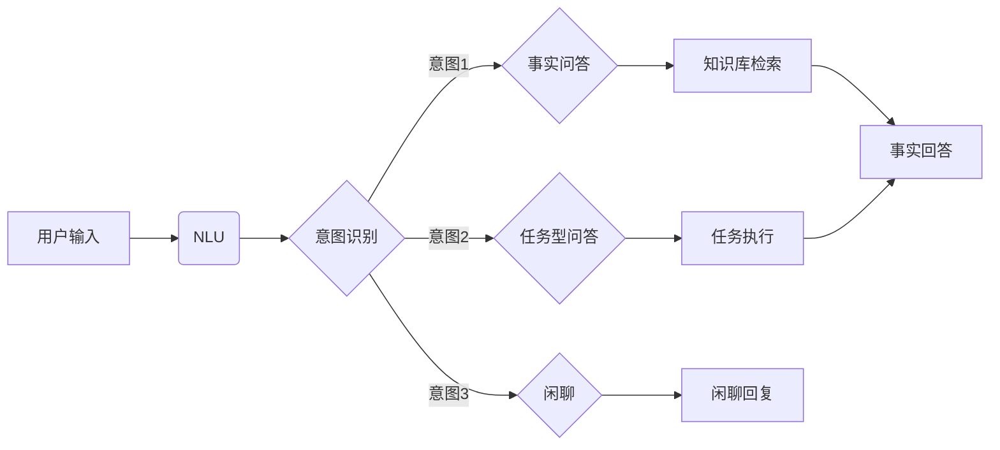

# 大模型问答机器人的对话式交互

> 关键词：大模型，问答机器人，对话式交互，自然语言理解，自然语言生成，NLP，预训练，微调，BERT，GPT

## 1. 背景介绍

随着人工智能技术的飞速发展，自然语言处理（NLP）领域取得了显著的进展。大模型问答机器人作为NLP应用的重要分支，旨在通过对话式交互为用户提供高效、便捷的信息检索和问题解答服务。本文将深入探讨大模型问答机器人的对话式交互原理、技术实现和应用场景，并展望其未来发展趋势。

### 1.1 问题的由来

在互联网时代，信息量呈爆炸式增长，人们越来越依赖智能设备获取信息和解决问题。传统的问答系统往往依赖于人工编写的规则和模板，难以适应海量信息的检索和复杂问题的解答。大模型问答机器人则利用先进的NLP技术和大规模数据，实现了对自然语言的理解和生成，为用户提供更加智能、个性化的交互体验。

### 1.2 研究现状

近年来，大模型问答机器人取得了显著的进展，主要得益于以下技术突破：

- 预训练语言模型：如BERT、GPT等，通过在大量无标签语料上进行预训练，学习到了丰富的语言知识和模式。
- 对话管理技术：通过维护对话状态，实现用户意图理解和问题解答。
- 对话生成技术：通过自然语言生成技术，实现流畅、自然的对话回复。

### 1.3 研究意义

大模型问答机器人的对话式交互具有以下研究意义：

- 提高信息检索效率：通过智能问答，快速定位用户需求，提高信息检索效率。
- 优化用户体验：实现人机对话，提供更加人性化的交互方式。
- 推动NLP技术发展：促进NLP技术在问答、对话等领域的应用，推动NLP技术发展。

## 2. 核心概念与联系

### 2.1 核心概念

以下是大模型问答机器人对话式交互的核心概念：

- **预训练语言模型**：在大规模无标签语料上进行预训练，学习到丰富的语言知识和模式。
- **自然语言理解（NLU）**：将用户输入的自然语言转换为机器可理解的结构化信息。
- **自然语言生成（NLG）**：将机器理解的结构化信息转换为自然语言输出。
- **对话管理**：维护对话状态，实现用户意图理解和问题解答。
- **对话策略**：根据对话状态和上下文信息，制定合适的对话策略。

### 2.2 架构流程图

以下是大模型问答机器人对话式交互的Mermaid流程图：



## 3. 核心算法原理 & 具体操作步骤

### 3.1 算法原理概述

大模型问答机器人的对话式交互主要基于以下算法原理：

- **预训练语言模型**：通过在大量无标签语料上进行预训练，学习到丰富的语言知识和模式。
- **NLU**：利用NLP技术，将用户输入的自然语言转换为机器可理解的结构化信息。
- **NLG**：利用NLP技术，将机器理解的结构化信息转换为自然语言输出。
- **对话管理**：根据对话状态和上下文信息，制定合适的对话策略。
- **对话策略**：根据对话状态和上下文信息，选择合适的回复内容和回复方式。

### 3.2 算法步骤详解

以下是大模型问答机器人对话式交互的具体操作步骤：

1. **接收用户输入**：系统接收用户输入的自然语言。
2. **NLU处理**：利用NLU技术，将用户输入的自然语言转换为机器可理解的结构化信息，包括意图识别和实体抽取。
3. **对话管理**：根据对话状态和上下文信息，选择合适的对话策略。
4. **NLG处理**：根据对话策略和用户意图，利用NLG技术生成回复内容。
5. **输出回复**：将生成的回复内容输出给用户。

### 3.3 算法优缺点

#### 优点：

- **自然交互**：通过对话式交互，实现人机自然交互，提高用户体验。
- **高效检索**：利用预训练语言模型和知识库，实现高效的信息检索和问题解答。
- **个性化服务**：根据用户的历史交互数据，实现个性化服务。

#### 缺点：

- **数据依赖**：需要大量标注数据对模型进行训练和微调。
- **理解能力有限**：对于复杂、抽象的问题，模型理解能力有限。
- **生成质量**：生成的回复内容可能存在歧义或不够准确。

### 3.4 算法应用领域

大模型问答机器人的对话式交互技术广泛应用于以下领域：

- **客户服务**：为用户提供高效、便捷的客服服务。
- **智能助手**：为用户提供个性化、智能的助手服务。
- **教育领域**：提供智能教育辅导和答疑服务。
- **医疗健康**：提供智能医疗咨询和健康管理服务。

## 4. 数学模型和公式 & 详细讲解 & 举例说明

### 4.1 数学模型构建

大模型问答机器人的对话式交互涉及以下数学模型：

- **预训练语言模型**：如BERT、GPT等，通过在大量无标签语料上进行预训练，学习到丰富的语言知识和模式。
- **NLU**：利用NLP技术，将用户输入的自然语言转换为机器可理解的结构化信息。
- **NLG**：利用NLP技术，将机器理解的结构化信息转换为自然语言输出。
- **对话管理**：根据对话状态和上下文信息，制定合适的对话策略。
- **对话策略**：根据对话状态和上下文信息，选择合适的回复内容和回复方式。

### 4.2 公式推导过程

以下是一些关键公式的推导过程：

- **BERT模型**：BERT模型的核心思想是将输入文本分解为多个token，并使用多头注意力机制对token进行编码，最后输出token的表示。
- **GPT模型**：GPT模型的核心思想是生成一个预测概率分布，从而预测下一个token。

### 4.3 案例分析与讲解

以下是一个简单的问答机器人对话示例：

**用户**：今天的天气怎么样？

**机器人**：好的，我需要查询一下今天的天气预报。

**（机器人与天气服务API交互**）

**机器人**：今天的天气预报是多云，最高温度20℃，最低温度10℃。

这个例子展示了问答机器人的工作流程：

1. 机器人接收用户输入的自然语言。
2. 机器人利用NLU技术，将用户输入的自然语言转换为机器可理解的结构化信息。
3. 机器人根据对话状态和上下文信息，选择合适的对话策略。
4. 机器人利用NLG技术，生成回复内容。
5. 机器人将生成的回复内容输出给用户。

## 5. 项目实践：代码实例和详细解释说明

### 5.1 开发环境搭建

以下是使用Python进行大模型问答机器人开发的开发环境搭建步骤：

1. 安装Anaconda：从Anaconda官网下载并安装Anaconda。
2. 创建Python环境：在Anaconda Navigator中创建Python环境，例如名为`问答机器人`的环境。
3. 安装必要的库：使用pip安装以下库：`transformers`、`torch`、`flask`等。

### 5.2 源代码详细实现

以下是一个简单的大模型问答机器人代码示例：

```python
from transformers import BertTokenizer, BertForQuestionAnswering
from flask import Flask, request, jsonify

app = Flask(__name__)
tokenizer = BertTokenizer.from_pretrained('bert-base-chinese')
model = BertForQuestionAnswering.from_pretrained('bert-base-chinese-cls')

@app.route('/question', methods=['POST'])
def question():
    data = request.get_json()
    question = data['question']
    context = data['context']
    
    inputs = tokenizer.encode_plus(question, context, return_tensors='pt', add_special_tokens=True)
    outputs = model(**inputs)
    
    start_positions = outputs.start_logits.argmax(-1).squeeze().tolist()[0]
    end_positions = outputs.end_logits.argmax(-1).squeeze().tolist()[0]
    
    answer = context[start_positions:end_positions + 1]
    answer = tokenizer.decode(answer, skip_special_tokens=True)
    
    return jsonify({'answer': answer})

if __name__ == '__main__':
    app.run(debug=True)
```

### 5.3 代码解读与分析

以上代码展示了使用Flask框架和transformers库构建问答机器人的基本流程：

1. 导入必要的库。
2. 创建Flask应用实例。
3. 定义`question`路由，用于处理用户输入的问答请求。
4. 解析请求内容，获取问题和上下文。
5. 使用BERT模型进行问答。
6. 返回问答结果。

### 5.4 运行结果展示

运行以上代码，访问`/question`路由，传入问题和上下文，即可获取问答结果。

## 6. 实际应用场景

### 6.1 智能客服

大模型问答机器人可以应用于智能客服领域，为用户提供7x24小时的在线咨询服务。

### 6.2 智能助手

大模型问答机器人可以作为智能助手，为用户提供个性化的服务，如日程管理、任务提醒等。

### 6.3 教育领域

大模型问答机器人可以应用于教育领域，为用户提供智能辅导和答疑服务。

### 6.4 医疗健康

大模型问答机器人可以应用于医疗健康领域，为用户提供智能咨询和健康管理服务。

## 7. 工具和资源推荐

### 7.1 学习资源推荐

- 《深度学习自然语言处理》课程：斯坦福大学开设的NLP课程，详细介绍NLP领域的理论和实践。
- 《Transformers: State-of-the-Art Natural Language Processing》书籍：介绍transformers库及其在NLP领域的应用。

### 7.2 开发工具推荐

- PyTorch：开源深度学习框架，易于上手和使用。
- Flask：轻量级Web开发框架，用于构建Web应用。

### 7.3 相关论文推荐

- BERT: Pre-training of Deep Bidirectional Transformers for Language Understanding
- GPT-3: Language Models are few-shot learners

## 8. 总结：未来发展趋势与挑战

### 8.1 研究成果总结

大模型问答机器人的对话式交互技术取得了显著的进展，在多个领域得到广泛应用。未来，大模型问答机器人将继续朝着以下方向发展：

- **更强大的NLU能力**：提高模型对自然语言的语义理解和处理能力。
- **更丰富的NLG能力**：提高模型生成自然语言回复的多样性和准确性。
- **更智能的对话管理**：实现更加智能、个性化的对话交互。

### 8.2 未来发展趋势

- **多模态交互**：结合图像、语音等多模态信息，实现更加丰富的交互方式。
- **知识图谱融合**：结合知识图谱，实现更加智能的知识问答。
- **多轮对话**：实现多轮对话，提高用户交互体验。

### 8.3 面临的挑战

- **数据质量**：需要高质量、多样化的训练数据。
- **模型可解释性**：提高模型的可解释性，增强用户信任。
- **模型安全性**：防止模型被恶意攻击。

### 8.4 研究展望

大模型问答机器人的对话式交互技术具有广阔的应用前景。未来，随着技术的不断发展，大模型问答机器人将为用户提供更加智能、便捷的服务，推动人工智能技术在更多领域的应用。

## 9. 附录：常见问题与解答

**Q1：大模型问答机器人的核心技术是什么？**

A：大模型问答机器人的核心技术包括预训练语言模型、自然语言理解、自然语言生成和对话管理。

**Q2：如何提高大模型问答机器人的性能？**

A：提高大模型问答机器人的性能可以从以下几个方面入手：
- 使用更强大的预训练语言模型。
- 提高训练数据的多样性和质量。
- 优化NLU和NLG算法。
- 优化对话管理策略。

**Q3：大模型问答机器人在实际应用中面临哪些挑战？**

A：大模型问答机器人在实际应用中面临的挑战包括数据质量、模型可解释性和模型安全性等。

**Q4：如何确保大模型问答机器人的安全性？**

A：为确保大模型问答机器人的安全性，可以采取以下措施：
- 对模型进行严格的测试和验证。
- 对用户输入进行过滤和审查。
- 对输出进行审核和监控。

**Q5：大模型问答机器人的未来发展趋势是什么？**

A：大模型问答机器人的未来发展趋势包括多模态交互、知识图谱融合和多轮对话等。