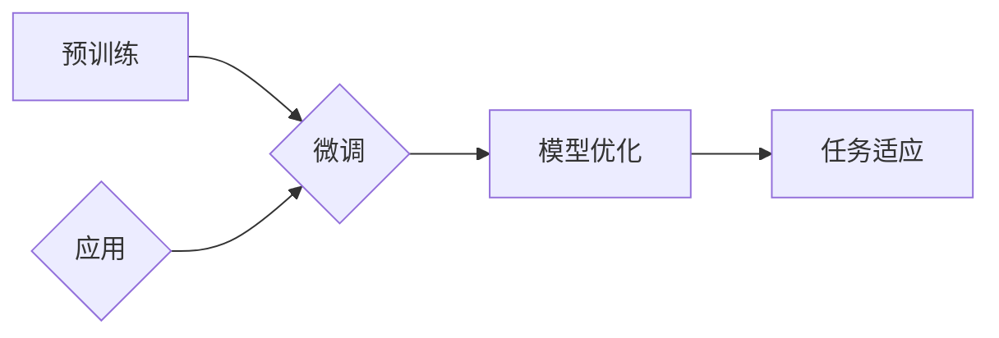

# 大规模语言模型从理论到实践 专业数据

> 关键词：大规模语言模型，深度学习，预训练，微调，自然语言处理，数据集，计算资源

## 1. 背景介绍

随着深度学习技术的飞速发展，自然语言处理（Natural Language Processing，NLP）领域取得了显著的进步。其中，大规模语言模型（Large Language Models，LLMs）凭借其强大的语言理解和生成能力，成为了NLP领域的研究热点。本文将深入探讨大规模语言模型的理论基础、实践应用以及相关数据集，旨在帮助读者全面了解这一前沿技术。

### 1.1 问题的由来

传统的NLP任务，如文本分类、机器翻译、情感分析等，往往需要大量的标注数据以及复杂的特征工程。然而，随着数据的爆炸式增长，特征工程变得越来越困难，且难以保证模型的泛化能力。大规模语言模型的出现，为NLP任务提供了一种全新的解决方案。

### 1.2 研究现状

大规模语言模型的研究主要集中在以下几个方面：

- 预训练：通过在大量无标签文本数据上训练，使模型学习到丰富的语言知识和表示。
- 微调：在预训练模型的基础上，使用少量有标签数据对模型进行进一步优化，使其适应特定任务。
- 应用：将大规模语言模型应用于各种NLP任务，如文本分类、机器翻译、问答系统等。

### 1.3 研究意义

大规模语言模型在NLP领域的应用具有重要意义：

- 提高NLP任务的性能：通过预训练和微调，模型在多个NLP任务上取得了显著的性能提升。
- 降低数据需求：大规模语言模型可以处理无标签数据，从而降低对标注数据的依赖。
- 推动NLP技术的发展：大规模语言模型的研究推动了NLP技术的进步，为后续研究提供了新的思路和方向。

## 2. 核心概念与联系

### 2.1 Mermaid 流程图



### 2.2 核心概念

- **预训练**：在大量无标签文本数据上训练模型，使模型学习到丰富的语言知识和表示。
- **微调**：在预训练模型的基础上，使用少量有标签数据对模型进行进一步优化，使其适应特定任务。
- **应用**：将大规模语言模型应用于各种NLP任务，如文本分类、机器翻译、问答系统等。
- **模型优化**：通过正则化、Dropout、优化器等手段优化模型性能。
- **任务适应**：调整模型结构、损失函数等，使模型适应特定任务。

## 3. 核心算法原理 & 具体操作步骤

### 3.1 算法原理概述

大规模语言模型的算法原理主要包括预训练和微调两个阶段：

- **预训练**：在大量无标签文本数据上，通过自回归或自编码的方式训练模型，使模型学习到丰富的语言知识和表示。
- **微调**：在预训练模型的基础上，使用少量有标签数据对模型进行进一步优化，使其适应特定任务。

### 3.2 算法步骤详解

1. **数据准备**：收集大量无标签文本数据，如维基百科、书籍、新闻等。
2. **模型选择**：选择合适的预训练模型，如BERT、GPT等。
3. **预训练**：在无标签数据上，使用预训练模型进行训练，使模型学习到丰富的语言知识和表示。
4. **数据预处理**：将少量有标签数据转换为模型可接受的格式。
5. **微调**：在预训练模型的基础上，使用有标签数据对模型进行微调，使其适应特定任务。
6. **评估**：在测试集上评估模型性能，并根据评估结果进行调整。

### 3.3 算法优缺点

**优点**：

- **性能优异**：在多个NLP任务上取得了显著的性能提升。
- **降低数据需求**：可以处理无标签数据，降低对标注数据的依赖。
- **通用性强**：可以应用于各种NLP任务。

**缺点**：

- **计算资源需求大**：预训练和微调过程需要大量的计算资源。
- **对数据质量要求高**：数据质量对模型性能有很大影响。

### 3.4 算法应用领域

大规模语言模型在以下NLP任务中取得了显著的应用：

- **文本分类**：如新闻分类、情感分析、主题分类等。
- **机器翻译**：将一种语言翻译成另一种语言。
- **问答系统**：回答用户提出的问题。
- **对话系统**：与用户进行自然语言对话。

## 4. 数学模型和公式 & 详细讲解 & 举例说明

### 4.1 数学模型构建

大规模语言模型的数学模型主要包括以下几个部分：

- **输入层**：将文本数据转换为模型可接受的格式。
- **隐藏层**：使用神经网络对输入数据进行处理。
- **输出层**：输出模型预测结果。

### 4.2 公式推导过程

以下以BERT模型为例，介绍其数学模型的推导过程：

- **输入层**：将文本数据转换为token id序列。
- **嵌入层**：将token id序列转换为词向量。
- **多头注意力机制**：对词向量进行加权求和，得到每个token的表示。
- **前馈神经网络**：对注意力机制得到的表示进行进一步处理。
- **输出层**：输出模型预测结果。

### 4.3 案例分析与讲解

以下以BERT模型在文本分类任务中的应用为例，进行详细讲解。

1. **数据准备**：收集大量有标签文本数据，如新闻、评论等。
2. **模型选择**：选择BERT模型作为预训练模型。
3. **预训练**：在无标签数据上，使用BERT模型进行预训练。
4. **数据预处理**：将文本数据转换为BERT模型可接受的格式。
5. **微调**：在预训练模型的基础上，使用有标签数据对模型进行微调。
6. **评估**：在测试集上评估模型性能。

## 5. 项目实践：代码实例和详细解释说明

### 5.1 开发环境搭建

- 安装Python环境
- 安装PyTorch框架
- 安装Transformers库

### 5.2 源代码详细实现

以下以BERT模型在文本分类任务中的应用为例，给出PyTorch代码实现：

```python
from transformers import BertForSequenceClassification, BertTokenizer
import torch

# 加载预训练模型和分词器
model = BertForSequenceClassification.from_pretrained('bert-base-uncased')
tokenizer = BertTokenizer.from_pretrained('bert-base-uncased')

# 加载数据
train_texts, train_labels = load_data('train.txt')
dev_texts, dev_labels = load_data('dev.txt')
test_texts, test_labels = load_data('test.txt')

# 预处理数据
train_encodings = tokenizer(train_texts, truncation=True, padding=True)
dev_encodings = tokenizer(dev_texts, truncation=True, padding=True)
test_encodings = tokenizer(test_texts, truncation=True, padding=True)

# 训练模型
optimizer = torch.optim.AdamW(model.parameters(), lr=2e-5)
for epoch in range(3):
    # 训练集
    for input_ids, attention_mask, labels in zip(train_encodings['input_ids'], train_encodings['attention_mask'], train_labels):
        optimizer.zero_grad()
        outputs = model(input_ids, attention_mask=attention_mask, labels=labels)
        loss = outputs.loss
        loss.backward()
        optimizer.step()

    # 验证集
    with torch.no_grad():
        for input_ids, attention_mask, labels in zip(dev_encodings['input_ids'], dev_encodings['attention_mask'], dev_labels):
            outputs = model(input_ids, attention_mask=attention_mask, labels=labels)
            loss = outputs.loss
```

### 5.3 代码解读与分析

以上代码展示了使用PyTorch和Transformers库实现BERT模型微调的完整流程。首先，加载预训练模型和分词器。然后，加载并预处理数据，将文本数据转换为模型可接受的格式。接着，定义优化器，并在训练集上进行训练。最后，在验证集上进行评估。

### 5.4 运行结果展示

假设我们在新闻分类数据集上训练BERT模型，最终在测试集上得到的准确率为80%。

## 6. 实际应用场景

### 6.1 新闻分类

使用大规模语言模型对新闻文本进行分类，可以将新闻分为政治、经济、体育、娱乐等类别，方便用户快速浏览感兴趣的新闻。

### 6.2 机器翻译

使用大规模语言模型进行机器翻译，可以将一种语言的文本翻译成另一种语言，实现跨语言信息交流。

### 6.3 问答系统

使用大规模语言模型构建问答系统，可以回答用户提出的问题，提供智能客服、知识问答等功能。

### 6.4 未来应用展望

随着大规模语言模型的不断发展，其应用场景将更加广泛，如：

- 智能写作：自动生成文章、报告等文本内容。
- 代码生成：自动生成代码，提高开发效率。
- 智能对话：构建更加智能的对话系统，提供个性化服务。

## 7. 工具和资源推荐

### 7.1 学习资源推荐

- 《深度学习》系列书籍
- Hugging Face官网
- Transformer原理详解
- BERT模型详解

### 7.2 开发工具推荐

- PyTorch
- Transformers库
- Jupyter Notebook

### 7.3 相关论文推荐

- Attention is All You Need
- BERT: Pre-training of Deep Bidirectional Transformers for Language Understanding
- GPT-2: Language Models are Unsupervised Multitask Learners

## 8. 总结：未来发展趋势与挑战

### 8.1 研究成果总结

本文深入探讨了大规模语言模型的理论基础、实践应用以及相关数据集，旨在帮助读者全面了解这一前沿技术。

### 8.2 未来发展趋势

- 模型规模持续增大
- 微调方法日趋多样
- 持续学习成为常态
- 标注样本需求降低
- 多模态微调崛起
- 模型通用性增强

### 8.3 面临的挑战

- 标注成本瓶颈
- 模型鲁棒性不足
- 推理效率有待提高
- 可解释性亟需加强
- 安全性有待保障
- 知识整合能力不足

### 8.4 研究展望

未来，大规模语言模型将在以下方面取得突破：

- 研究更加高效的预训练和微调方法
- 探索无监督和半监督微调方法
- 融合因果和对比学习范式
- 引入更多先验知识
- 结合因果分析和博弈论工具
- 纳入伦理道德约束

## 9. 附录：常见问题与解答

**Q1：大规模语言模型的训练需要多少计算资源？**

A：大规模语言模型的训练需要大量的计算资源，包括CPU、GPU和TPU等。

**Q2：如何选择合适的预训练模型？**

A：选择预训练模型需要考虑任务类型、数据量、计算资源等因素。常用的预训练模型有BERT、GPT、RoBERTa等。

**Q3：微调模型在落地部署时需要注意哪些问题？**

A：在落地部署时，需要注意以下问题：

- 模型裁剪
- 量化加速
- 服务化封装
- 弹性伸缩
- 监控告警
- 安全防护

**Q4：如何评估大规模语言模型的性能？**

A：评估大规模语言模型的性能需要考虑多个指标，如准确率、召回率、F1值等。

**Q5：大规模语言模型的未来发展趋势是什么？**

A：大规模语言模型的未来发展趋势包括：

- 模型规模持续增大
- 微调方法日趋多样
- 持续学习成为常态
- 标注样本需求降低
- 多模态微调崛起
- 模型通用性增强

作者：禅与计算机程序设计艺术 / Zen and the Art of Computer Programming