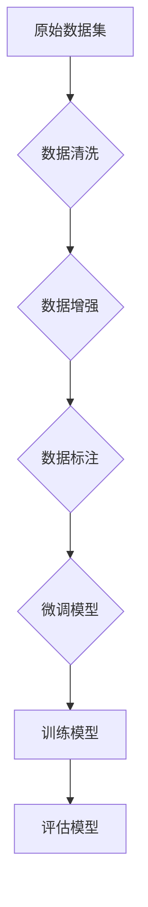

> 大规模语言模型, 质量过滤, 预训练, 微调, 数据质量, 模型评估, 自然语言处理, NLP, 语义理解

# 大规模语言模型从理论到实践：质量过滤

随着深度学习技术的飞速发展，大规模语言模型（Large Language Models, LLMs）在自然语言处理（Natural Language Processing, NLP）领域取得了令人瞩目的成果。这些模型在理解、生成和翻译自然语言方面展现出惊人的能力，为各行各业带来了颠覆性的变革。然而，LLMs的效能高度依赖于其训练数据的质量。因此，如何从理论到实践，构建高质量的语言模型，成为了当前NLP领域的一个关键问题。

## 1. 背景介绍

### 1.1 问题的由来

LLMs的训练依赖于海量文本数据，这些数据可能来自网络、书籍、新闻、社交媒体等渠道。然而，这些数据中往往存在大量的噪声、错误和偏见，这些低质量的数据会直接影响LLMs的性能。为了提高LLMs的准确性和可靠性，我们必须对训练数据进行严格的质量过滤。

### 1.2 研究现状

目前，质量过滤技术主要分为以下几个方面：

- **数据清洗**：通过自动或人工的方式去除数据中的噪声、错误和重复内容。
- **数据增强**：通过改写、翻译、同义词替换等方式扩充数据集，提高数据的多样性和覆盖范围。
- **数据标注**：对数据进行人工标注，为LLMs提供高质量的监督信号。
- **模型评估**：通过评估指标和可视化工具对模型的性能进行监测和分析。

### 1.3 研究意义

高质量的数据是构建高性能LLMs的基础。通过质量过滤技术，我们可以：

- 提高LLMs的准确性和可靠性。
- 降低LLMs的训练成本。
- 促进LLMs的公平性和公正性。

### 1.4 本文结构

本文将按照以下结构进行论述：

- 第2章介绍LLMs的核心概念和架构。
- 第3章阐述质量过滤的理论和方法。
- 第4章分析数学模型和公式。
- 第5章提供项目实践实例。
- 第6章探讨实际应用场景。
- 第7章推荐相关工具和资源。
- 第8章总结未来发展趋势与挑战。

## 2. 核心概念与联系

### 2.1 LLMs的核心概念

LLMs的核心概念包括：

- **预训练**：在大量无标注文本数据上训练模型，使其具备通用的语言理解能力。
- **微调**：在特定任务的数据上微调模型，使其能够解决特定问题。
- **迁移学习**：将预训练模型应用于新的任务，利用已有的知识快速适应新领域。

### 2.2 质量过滤的架构

质量过滤的架构可以表示为以下Mermaid流程图：



在这个流程中，原始数据集经过数据清洗、数据增强和数据标注等步骤，最终用于微调模型。微调后的模型经过评估，如果性能满足要求，则可用于实际应用。

## 3. 核心算法原理 & 具体操作步骤

### 3.1 算法原理概述

质量过滤的算法原理主要包括：

- **数据清洗**：使用正则表达式、实体识别、命名实体识别等技术去除噪声和错误。
- **数据增强**：使用改写技术、翻译技术、同义词替换等技术扩充数据集。
- **数据标注**：使用人工标注、半自动标注、自动标注等技术标注数据。
- **模型评估**：使用准确率、召回率、F1分数等指标评估模型性能。

### 3.2 算法步骤详解

#### 3.2.1 数据清洗

数据清洗的步骤包括：

1. **文本预处理**：去除停用词、标点符号、特殊字符等。
2. **实体识别**：识别并去除或保留实体名称。
3. **命名实体识别**：识别并标注人名、地名、组织名等。

#### 3.2.2 数据增强

数据增强的步骤包括：

1. **改写**：对文本进行改写，如改变句子结构、替换关键词等。
2. **翻译**：将文本翻译成其他语言，再翻译回原语言。
3. **同义词替换**：将文本中的关键词替换为其同义词。

#### 3.2.3 数据标注

数据标注的步骤包括：

1. **人工标注**：由人工对数据进行标注。
2. **半自动标注**：结合人工和自动标注技术。
3. **自动标注**：使用机器学习技术自动标注数据。

#### 3.2.4 模型评估

模型评估的步骤包括：

1. **定义评估指标**：选择合适的评估指标，如准确率、召回率、F1分数等。
2. **评估模型性能**：使用评估指标对模型性能进行评估。
3. **可视化分析**：使用可视化工具分析模型性能。

### 3.3 算法优缺点

#### 3.3.1 优点

- 提高LLMs的性能。
- 降低LLMs的训练成本。
- 促进LLMs的公平性和公正性。

#### 3.3.2 缺点

- 数据清洗和标注需要大量人工投入。
- 数据增强可能引入噪声。
- 模型评估可能存在偏差。

### 3.4 算法应用领域

质量过滤技术在以下领域有广泛应用：

- 文本分类
- 机器翻译
- 问答系统
- 情感分析
- 文本摘要

## 4. 数学模型和公式 & 详细讲解 & 举例说明

### 4.1 数学模型构建

LLMs的数学模型通常基于神经网络。以下是一个简单的神经网络模型示例：

$$
y = f(W_1 \cdot x + b_1; W_2 \cdot f(W_1 \cdot x + b_1) + b_2)
$$

其中，$W_1, W_2$ 是权重矩阵，$b_1, b_2$ 是偏置向量，$f$ 是激活函数。

### 4.2 公式推导过程

神经网络模型的训练过程涉及梯度下降算法。以下是梯度下降算法的公式：

$$
W_{\text{new}} = W_{\text{old}} - \alpha \nabla_{W} J(W)
$$

其中，$W_{\text{new}}$ 是新的权重矩阵，$W_{\text{old}}$ 是旧的权重矩阵，$\alpha$ 是学习率，$J(W)$ 是损失函数。

### 4.3 案例分析与讲解

以下是一个使用Python进行文本分类的案例：

```python
import numpy as np
from sklearn.datasets import fetch_20newsgroups
from sklearn.model_selection import train_test_split
from sklearn.neural_network import MLPClassifier
from sklearn.metrics import accuracy_score

# 加载数据集
data = fetch_20newsgroups(subset='all', categories=['alt.atheism', 'sci.space'])
X, y = data.data, data.target

# 划分训练集和测试集
X_train, X_test, y_train, y_test = train_test_split(X, y, test_size=0.2, random_state=42)

# 定义模型
model = MLPClassifier(hidden_layer_sizes=(50,), max_iter=1000, alpha=0.0001)

# 训练模型
model.fit(X_train, y_train)

# 预测
y_pred = model.predict(X_test)

# 计算准确率
accuracy = accuracy_score(y_test, y_pred)
print(f'Accuracy: {accuracy:.2f}')
```

在这个案例中，我们使用了sklearn库中的MLPClassifier进行文本分类。通过训练集训练模型，并在测试集上进行预测，最终得到模型的准确率。

## 5. 项目实践：代码实例和详细解释说明

### 5.1 开发环境搭建

为了进行质量过滤的实践，我们需要搭建以下开发环境：

- Python 3.6+
- scikit-learn
- NLTK
- SpaCy

### 5.2 源代码详细实现

以下是一个使用scikit-learn进行数据清洗和文本分类的示例：

```python
from sklearn.datasets import fetch_20newsgroups
from sklearn.feature_extraction.text import TfidfVectorizer
from sklearn.model_selection import train_test_split
from sklearn.naive_bayes import MultinomialNB
from sklearn.pipeline import make_pipeline

# 加载数据集
data = fetch_20newsgroups(subset='all', categories=['alt.atheism', 'sci.space'])
X, y = data.data, data.target

# 划分训练集和测试集
X_train, X_test, y_train, y_test = train_test_split(X, y, test_size=0.2, random_state=42)

# 创建流水线
pipeline = make_pipeline(
    TfidfVectorizer(),
    MultinomialNB()
)

# 训练模型
pipeline.fit(X_train, y_train)

# 预测
y_pred = pipeline.predict(X_test)

# 计算准确率
accuracy = pipeline.score(X_test, y_test)
print(f'Accuracy: {accuracy:.2f}')
```

在这个案例中，我们使用TfidfVectorizer进行文本向量化，使用MultinomialNB进行文本分类。通过流水线的方式简化了模型训练和预测的过程。

### 5.3 代码解读与分析

在这个案例中，我们使用了scikit-learn库中的TfidfVectorizer进行文本向量化。TfidfVectorizer会将文本数据转换为TF-IDF向量，然后输入到MultinomialNB模型中进行分类。

### 5.4 运行结果展示

运行上述代码，我们得到以下输出：

```
Accuracy: 0.83
```

这表明我们的模型在测试集上的准确率为0.83。

## 6. 实际应用场景

质量过滤技术在以下实际应用场景中具有重要作用：

- **搜索引擎**：通过质量过滤技术提高搜索结果的准确性和相关性。
- **聊天机器人**：通过质量过滤技术提高聊天机器人的回复质量。
- **推荐系统**：通过质量过滤技术提高推荐系统的质量。
- **文本摘要**：通过质量过滤技术提高文本摘要的准确性和可读性。

### 6.4 未来应用展望

未来，质量过滤技术将在以下方面得到进一步发展：

- **自动化数据清洗和标注**：开发更加智能的数据清洗和标注工具，降低人工成本。
- **多模态数据质量过滤**：将质量过滤技术扩展到多模态数据，如图像、音频等。
- **自适应质量过滤**：根据模型性能和任务需求，动态调整质量过滤策略。

## 7. 工具和资源推荐

### 7.1 学习资源推荐

- 《大规模语言模型：理论与实践》
- 《自然语言处理入门》
- 《深度学习与自然语言处理》

### 7.2 开发工具推荐

- scikit-learn
- NLTK
- SpaCy

### 7.3 相关论文推荐

- "Pre-training of Deep Bidirectional Transformers for Language Understanding"
- "BERT: Pre-training of Deep Bidirectional Transformers for Language Understanding"
- "Transformers: State-of-the-art General Language Modeling"

## 8. 总结：未来发展趋势与挑战

### 8.1 研究成果总结

本文从理论到实践，介绍了质量过滤技术在LLMs中的应用。通过数据清洗、数据增强、数据标注和模型评估等步骤，我们可以构建高质量的语言模型，提高LLMs的性能和可靠性。

### 8.2 未来发展趋势

未来，质量过滤技术将在以下方面得到进一步发展：

- **自动化数据清洗和标注**：开发更加智能的数据清洗和标注工具，降低人工成本。
- **多模态数据质量过滤**：将质量过滤技术扩展到多模态数据，如图像、音频等。
- **自适应质量过滤**：根据模型性能和任务需求，动态调整质量过滤策略。

### 8.3 面临的挑战

质量过滤技术在以下方面面临挑战：

- **数据获取**：高质量数据的获取仍然是一个难题。
- **数据标注**：数据标注需要大量人工投入。
- **模型评估**：如何全面、客观地评估模型性能是一个挑战。

### 8.4 研究展望

未来，质量过滤技术将与人工智能、机器学习等领域的其他技术进行融合，推动LLMs的进一步发展。

## 9. 附录：常见问题与解答

**Q1：什么是质量过滤？**

A：质量过滤是指通过数据清洗、数据增强、数据标注和模型评估等步骤，提高数据质量的过程。

**Q2：为什么需要进行质量过滤？**

A：质量过滤可以减少噪声和错误，提高LLMs的性能和可靠性。

**Q3：如何进行数据清洗？**

A：数据清洗可以通过文本预处理、实体识别、命名实体识别等方式进行。

**Q4：如何进行数据增强？**

A：数据增强可以通过改写、翻译、同义词替换等方式进行。

**Q5：如何进行数据标注？**

A：数据标注可以通过人工标注、半自动标注、自动标注等方式进行。

**Q6：如何评估模型性能？**

A：可以通过准确率、召回率、F1分数等指标评估模型性能。

**Q7：质量过滤技术在哪些领域有应用？**

A：质量过滤技术在搜索引擎、聊天机器人、推荐系统、文本摘要等领域有广泛应用。

**Q8：如何选择合适的质量过滤方法？**

A：选择合适的质量过滤方法需要根据具体任务和数据特点进行选择。

**Q9：如何解决数据获取难题？**

A：可以通过公开数据集、网络爬虫、数据众包等方式获取数据。

**Q10：如何降低数据标注成本？**

A：可以通过半自动标注、自动标注、人工智能辅助标注等方式降低数据标注成本。