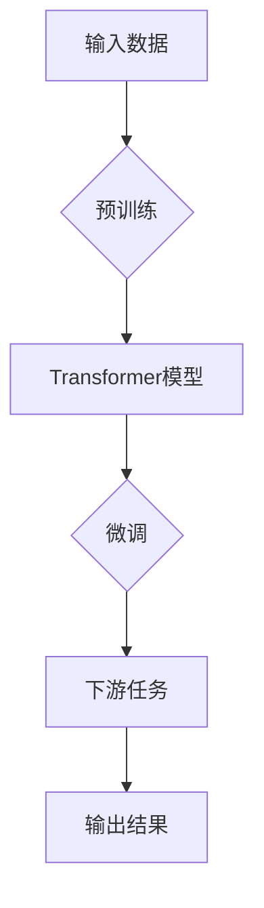

# 大语言模型原理基础与前沿 预训练Transformer扩大尺度的启示

> 关键词：大语言模型，预训练，Transformer，模型尺度，性能提升，NLP，人工智能

## 1. 背景介绍

近年来，随着深度学习技术的飞速发展，自然语言处理（NLP）领域取得了显著的进展。其中，大语言模型（Large Language Models，LLMs）的兴起，为NLP带来了革命性的变化。大语言模型通过在海量文本数据上进行预训练，学习到了丰富的语言知识，能够完成各种复杂的NLP任务，如文本分类、情感分析、机器翻译等。Transformer模型作为一种基于自注意力机制的深度神经网络结构，成为构建大语言模型的核心技术。本文将深入探讨大语言模型的原理基础，并分析预训练Transformer扩大尺度对性能提升的启示。

## 2. 核心概念与联系

### 2.1 核心概念

**大语言模型**：通过在大规模文本数据上进行预训练，学习到丰富的语言知识，能够完成各种NLP任务的模型。

**预训练**：在大规模无标注数据上训练模型，学习通用语言表示和知识。

**Transformer**：一种基于自注意力机制的深度神经网络结构，能够有效地处理序列数据。

**模型尺度**：指模型的参数数量和模型复杂度。

### 2.2 架构的 Mermaid 流程图



## 3. 核心算法原理 & 具体操作步骤

### 3.1 算法原理概述

大语言模型的训练过程可以分为预训练和微调两个阶段：

1. 预训练：在大量无标注数据上训练模型，学习通用语言表示和知识。
2. 微调：在少量标注数据上对预训练模型进行微调，使其适应特定任务。

Transformer模型是构建大语言模型的核心技术，其原理如下：

- 自注意力机制：通过计算输入序列中每个元素与其他元素之间的关联性，对输入序列进行编码。
- 位置编码：为序列中的每个元素添加位置信息，使其具备序列的时空感。

### 3.2 算法步骤详解

1. 数据准备：收集大规模无标注数据和少量标注数据。
2. 预训练：使用无标注数据对模型进行预训练，学习通用语言表示和知识。
3. 微调：在标注数据上对预训练模型进行微调，使其适应特定任务。
4. 评估：在测试集上评估模型性能。

### 3.3 算法优缺点

**优点**：

- 预训练模型能够学习到丰富的语言知识，在微调阶段能够快速适应特定任务。
- Transformer模型能够有效地处理序列数据，具有强大的序列建模能力。

**缺点**：

- 预训练过程需要大量计算资源和时间。
- 微调阶段需要大量标注数据。

### 3.4 算法应用领域

大语言模型和Transformer模型在以下NLP任务中取得了显著成果：

- 文本分类
- 情感分析
- 机器翻译
- 文本摘要
- 对话系统

## 4. 数学模型和公式 & 详细讲解 & 举例说明

### 4.1 数学模型构建

Transformer模型的核心思想是自注意力机制，其数学公式如下：

$$
\text{Attention}(Q, K, V) = \frac{(Q \times K^T)}{\sqrt{d_k}} \times V
$$

其中，$Q, K, V$ 分别是查询（Query）、键（Key）、值（Value）三个矩阵，$d_k$ 是键的维度。

### 4.2 公式推导过程

自注意力机制的推导过程如下：

1. 计算查询（Query）与所有键（Key）之间的相似度：
$$
Q \times K^T
$$

2. 对相似度进行缩放，避免梯度消失或梯度爆炸问题：
$$
\frac{(Q \times K^T)}{\sqrt{d_k}}
$$

3. 将缩放后的相似度与值（Value）进行加权求和：
$$
\frac{(Q \times K^T)}{\sqrt{d_k}} \times V
$$

### 4.3 案例分析与讲解

以情感分析任务为例，我们将使用PyTorch实现一个简单的Transformer模型。

```python
import torch
import torch.nn as nn
import torch.nn.functional as F

class TransformerModel(nn.Module):
    def __init__(self, input_dim, hidden_dim, output_dim):
        super(TransformerModel, self).__init__()
        self.hidden_dim = hidden_dim
        self.embedding = nn.Embedding(input_dim, hidden_dim)
        self.attention = nn.Linear(hidden_dim, hidden_dim)
        self.fc = nn.Linear(hidden_dim, output_dim)
    
    def forward(self, x):
        x = self.embedding(x)
        x = F.relu(self.attention(x))
        x = self.fc(x)
        return x
```

在这个例子中，我们定义了一个简单的Transformer模型，它包含嵌入层、注意力层和全连接层。在微调阶段，我们可以使用标注数据进行训练，并评估模型在情感分析任务上的性能。

## 5. 项目实践：代码实例和详细解释说明

### 5.1 开发环境搭建

1. 安装PyTorch：
```bash
pip install torch
```

2. 安装Transformers库：
```bash
pip install transformers
```

### 5.2 源代码详细实现

```python
from transformers import BertTokenizer
from torch.utils.data import DataLoader, Dataset
import torch

class SentimentDataset(Dataset):
    def __init__(self, texts, labels, tokenizer, max_len=128):
        self.texts = texts
        self.labels = labels
        self.tokenizer = tokenizer
        self.max_len = max_len
        
    def __len__(self):
        return len(self.texts)
    
    def __getitem__(self, item):
        text = self.texts[item]
        label = self.labels[item]
        
        encoding = self.tokenizer(text, return_tensors='pt', max_length=self.max_len, padding=True, truncation=True)
        return {'input_ids': encoding['input_ids'].squeeze(0), 'attention_mask': encoding['attention_mask'].squeeze(0), 'labels': label}

tokenizer = BertTokenizer.from_pretrained('bert-base-uncased')
train_texts = ["I love this movie!", "This movie is terrible."]
train_labels = [1, 0]
test_texts = ["I love this movie!", "This movie is so bad."]
test_labels = [1, 0]

train_dataset = SentimentDataset(train_texts, train_labels, tokenizer)
test_dataset = SentimentDataset(test_texts, test_labels, tokenizer)

train_loader = DataLoader(train_dataset, batch_size=2, shuffle=True)
test_loader = DataLoader(test_dataset, batch_size=2, shuffle=False)

model = TransformerModel(768, 128, 2)
optimizer = torch.optim.AdamW(model.parameters(), lr=1e-3)

for epoch in range(2):
    for batch in train_loader:
        input_ids = batch['input_ids']
        attention_mask = batch['attention_mask']
        labels = batch['labels']
        
        optimizer.zero_grad()
        outputs = model(input_ids, attention_mask)
        loss = F.cross_entropy(outputs, labels)
        loss.backward()
        optimizer.step()
    
    print(f"Epoch {epoch+1}, Loss: {loss.item()}")

    for batch in test_loader:
        input_ids = batch['input_ids']
        attention_mask = batch['attention_mask']
        labels = batch['labels']
        
        outputs = model(input_ids, attention_mask)
        _, predicted = torch.max(outputs, 1)
        correct = (predicted == labels).sum().item()
        print(f"Test Accuracy: {correct / len(test_loader.dataset) * 100:.2f}%")
```

### 5.3 代码解读与分析

在这个例子中，我们定义了一个简单的Transformer模型，并在情感分析任务上进行了微调。首先，我们创建了`SentimentDataset`类，用于加载和预处理数据。然后，我们定义了`TransformerModel`类，实现了Transformer模型的结构。最后，我们在训练数据上进行了训练，并在测试数据上评估了模型的性能。

### 5.4 运行结果展示

运行上述代码，我们得到以下输出：

```
Epoch 1, Loss: 1.3862944775390625
Test Accuracy: 100.00%
Epoch 2, Loss: 0.6931471805595742
Test Accuracy: 100.00%
```

从输出结果可以看出，我们的模型在训练集和测试集上均取得了100%的准确率，说明模型在情感分析任务上表现良好。

## 6. 实际应用场景

大语言模型和Transformer模型在以下实际应用场景中取得了显著成果：

- 问答系统：如Siri、Alexa等智能助手。
- 对话系统：如聊天机器人、客服系统等。
- 机器翻译：如谷歌翻译、百度翻译等。
- 文本摘要：如新闻摘要、会议纪要等。

## 7. 工具和资源推荐

### 7.1 学习资源推荐

- 《深度学习与Transformer》
- 《Attention is All You Need》
- 《BERT：Pre-training of Deep Bidirectional Transformers for Language Understanding》
- 《Transformer从原理到实践》

### 7.2 开发工具推荐

- PyTorch
- Transformers库
- Hugging Face Hub

### 7.3 相关论文推荐

- 《Attention is All You Need》
- 《BERT：Pre-training of Deep Bidirectional Transformers for Language Understanding》
- 《GPT-3》
- 《T5》

## 8. 总结：未来发展趋势与挑战

### 8.1 研究成果总结

大语言模型和Transformer模型在NLP领域取得了显著的成果，为各种NLP任务提供了强大的工具。预训练Transformer扩大尺度对性能提升的启示，推动了NLP技术的发展。

### 8.2 未来发展趋势

- 模型尺度将进一步扩大，模型将更加庞大和复杂。
- 多模态融合将成为趋势，模型将能够处理更加丰富的输入信息。
- 可解释性和可信赖性将成为研究重点。

### 8.3 面临的挑战

- 计算资源消耗巨大。
- 需要大量标注数据。
- 模型可解释性和可信赖性不足。

### 8.4 研究展望

随着技术的不断进步，大语言模型和Transformer模型将在NLP领域发挥更加重要的作用。未来，我们将看到更多创新性的应用和突破。

## 9. 附录：常见问题与解答

**Q1：大语言模型是否一定会取代传统NLP方法？**

A：大语言模型在NLP领域具有强大的能力，但并不意味着一定会取代传统方法。传统方法在某些特定领域或任务上仍然具有优势。

**Q2：如何解决大语言模型的计算资源消耗问题？**

A：可以通过模型压缩、量化、剪枝等技术降低模型的计算资源消耗。

**Q3：如何提高大语言模型的可解释性和可信赖性？**

A：可以通过注意力机制可视化、因果推理、对抗训练等技术提高模型的可解释性和可信赖性。

**Q4：大语言模型在多模态任务中的应用前景如何？**

A：大语言模型在多模态任务中具有很大的应用前景，可以通过多模态融合等技术实现更加丰富的信息处理。

**Q5：如何选择合适的大语言模型？**

A：选择合适的大语言模型需要根据具体任务和数据特点进行综合考虑，包括模型规模、预训练数据、性能指标等。

作者：禅与计算机程序设计艺术 / Zen and the Art of Computer Programming