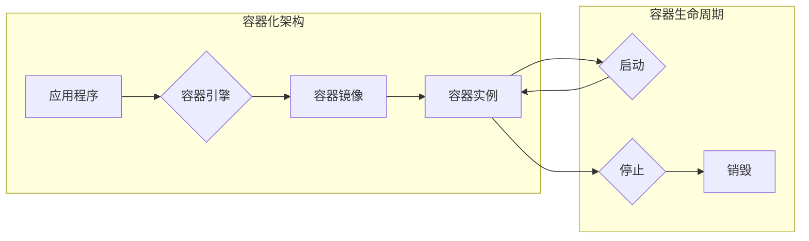

# 容器 原理与代码实例讲解

> 关键词：Docker, 容器化, 虚拟化, 容器引擎, 操作系统级虚拟化, 镜像, 容器编排, Kubernetes, DevOps, 轻量级

## 1. 背景介绍

随着云计算和DevOps文化的兴起，容器技术逐渐成为现代软件开发和运维的重要组成部分。容器化技术通过轻量级的虚拟化，实现了应用程序与环境解耦，极大地简化了应用程序的部署、扩展和管理。本文将深入探讨容器的原理，并通过代码实例展示如何使用Docker和Kubernetes进行容器化实践。

### 1.1 容器化的起源与发展

容器化技术的起源可以追溯到20世纪70年代，当时为了在大型机和小型机之间迁移应用程序，研究者提出了虚拟化技术。然而，传统的虚拟化技术（如全虚拟化）资源开销大，性能损耗明显。随着Linux内核的发展，操作系统级虚拟化技术逐渐成熟，为容器化技术的兴起提供了技术基础。

容器化技术的快速发展得益于以下几个因素：

- **云原生技术的兴起**：云原生技术强调应用程序的无状态、可扩展性和动态管理，而容器化是实现这些特性的关键技术之一。
- **DevOps文化的推广**：DevOps文化的推广促进了开发和运维的紧密协作，容器化技术为这种协作提供了强大的支持。
- **开源社区的活跃**：Docker等开源项目的兴起，为容器化技术的发展提供了强大的动力。

### 1.2 容器化的优势

容器化技术相较于传统的虚拟化技术具有以下优势：

- **轻量级**：容器共享主机操作系统的内核，无需虚拟化硬件，启动速度快，资源占用少。
- **隔离性**：容器之间相互隔离，确保应用程序的安全性和稳定性。
- **一致性**：容器可以在不同的环境中运行，保证了应用程序的一致性。
- **可移植性**：容器可以在不同的平台上无缝迁移，简化了应用程序的部署和运维。

## 2. 核心概念与联系

### 2.1 Mermaid 流程图

以下为容器化技术的核心概念原理和架构的 Mermaid 流程图：



### 2.2 核心概念

- **容器**：容器是应用程序的运行环境，由容器镜像定义，包含应用程序及其依赖项。
- **容器镜像**：容器镜像是一个静态文件，包含了容器运行所需的所有文件，如应用程序代码、运行时库、配置文件等。
- **容器引擎**：容器引擎负责管理容器的创建、启动、停止、删除等生命周期操作，常见的容器引擎包括Docker和rkt。
- **容器实例**：容器实例是容器镜像运行时的实际实例，具有独立的进程空间、网络栈和文件系统。

## 3. 核心算法原理 & 具体操作步骤

### 3.1 算法原理概述

容器化技术的核心是容器镜像的构建和容器引擎的运行。容器镜像通常使用Dockerfile来构建，通过定义容器所需的依赖项、文件系统和启动命令等信息。容器引擎根据容器镜像创建容器实例，并管理其生命周期。

### 3.2 算法步骤详解

**构建容器镜像**

1. 编写Dockerfile，定义容器镜像的构建过程。
2. 使用`docker build`命令构建容器镜像。

**运行容器实例**

1. 使用`docker run`命令运行容器实例。
2. 容器引擎根据容器镜像创建容器实例，并将应用程序及其依赖项加载到容器中。

**管理容器实例**

1. 使用`docker ps`命令查看正在运行的容器实例。
2. 使用`docker stop`、`docker start`、`docker restart`等命令管理容器实例的生命周期。

### 3.3 算法优缺点

**优点**

- 简化应用程序的部署和运维。
- 提高应用程序的稳定性和可移植性。
- 节省资源，提高资源利用率。

**缺点**

- 容器镜像的构建和管理较为复杂。
- 容器引擎的维护和升级需要一定的技术能力。

### 3.4 算法应用领域

容器化技术广泛应用于以下领域：

- 云原生应用开发
- DevOps实践
- 微服务架构
- 容器编排和自动化

## 4. 数学模型和公式 & 详细讲解 & 举例说明

容器化技术主要涉及操作系统级虚拟化，其数学模型相对简单。以下以Docker为例，介绍容器镜像的构建过程。

### 4.1 数学模型构建

容器镜像的构建过程可以抽象为以下数学模型：

```latex
\text{容器镜像} = \{ \text{基础镜像} \cup \text{应用依赖} \cup \text{配置文件} \cup \text{启动命令} \}
```

其中：

- **基础镜像**：提供容器运行环境的操作系统镜像。
- **应用依赖**：应用程序运行所需的库、工具等依赖项。
- **配置文件**：应用程序的配置文件，如数据库配置、环境变量等。
- **启动命令**：启动应用程序的命令。

### 4.2 公式推导过程

容器镜像的构建过程通常遵循以下步骤：

1. 从Docker Hub或其他镜像仓库下载基础镜像。
2. 将应用程序代码和应用依赖添加到基础镜像中。
3. 修改或配置应用程序的配置文件。
4. 添加启动应用程序的命令。

### 4.3 案例分析与讲解

以下是一个简单的Dockerfile示例，用于构建一个简单的Web应用程序镜像：

```Dockerfile
# 使用官方Python镜像作为基础镜像
FROM python:3.8-slim

# 设置工作目录
WORKDIR /app

# 将应用程序代码复制到容器中
COPY . /app

# 安装应用程序依赖
RUN pip install --no-cache-dir -r requirements.txt

# 暴露80端口
EXPOSE 80

# 运行应用程序
CMD ["python", "app.py"]
```

该Dockerfile首先使用Python 3.8-slim作为基础镜像，然后设置工作目录，将应用程序代码复制到容器中，安装依赖，暴露80端口，并运行应用程序。

## 5. 项目实践：代码实例和详细解释说明

### 5.1 开发环境搭建

为了进行容器化实践，需要以下开发环境：

- Docker
- Kubernetes

以下是Docker和Kubernetes的安装步骤：

**安装Docker**

1. 下载Docker Engine安装包。
2. 安装Docker Engine。

**安装Kubernetes**

1. 下载Kubernetes安装包。
2. 安装Kubernetes。

### 5.2 源代码详细实现

以下是一个使用Docker和Kubernetes构建的简单Web应用程序示例。

**Dockerfile**

```Dockerfile
FROM python:3.8-slim

WORKDIR /app

COPY . /app

RUN pip install --no-cache-dir -r requirements.txt

EXPOSE 80

CMD ["python", "app.py"]
```

**app.py**

```python
from flask import Flask, request

app = Flask(__name__)

@app.route('/')
def hello():
    return "Hello, World!"

if __name__ == '__main__':
    app.run(host='0.0.0.0', port=80)
```

**requirements.txt**

```
Flask==1.1.2
```

### 5.3 代码解读与分析

Dockerfile定义了容器镜像的构建过程，包括使用Python 3.8-slim作为基础镜像、设置工作目录、复制应用程序代码、安装依赖、暴露80端口和运行应用程序。

app.py是Web应用程序的源代码，使用Flask框架构建了一个简单的Hello World示例。

requirements.txt定义了应用程序的依赖项，即Flask框架。

### 5.4 运行结果展示

1. 构建容器镜像：

```bash
docker build -t myapp .
```

2. 创建并启动容器：

```bash
docker run -d -p 8080:80 myapp
```

3. 访问Web应用程序：

```bash
http://localhost:8080
```

在浏览器中，您将看到"Hello, World!"的显示。

## 6. 实际应用场景

容器化技术已经在许多实际应用场景中得到广泛应用，以下是一些典型的应用场景：

- **Web应用程序部署**：使用容器化技术可以将Web应用程序部署到云平台，实现快速、灵活的部署和扩展。
- **微服务架构**：容器化技术是微服务架构的理想选择，可以实现服务之间的隔离和独立部署。
- **持续集成和持续部署**：容器化技术可以简化持续集成和持续部署的流程，提高开发效率。
- **DevOps实践**：容器化技术是实现DevOps文化的关键技术之一，可以促进开发和运维的紧密协作。

## 7. 工具和资源推荐

### 7.1 学习资源推荐

- Docker官方文档：https://docs.docker.com/
- Kubernetes官方文档：https://kubernetes.io/docs/
- 云原生计算基金会网站：https://www.cncf.io/

### 7.2 开发工具推荐

- Docker Desktop：https://www.docker.com/products/docker-desktop
- Kubernetes Dashboard：https://kubernetes.io/docs/tasks/access-application-cluster/kubernetes-dashboard/

### 7.3 相关论文推荐

- **Docker: Lightweight container for environments across platforms**: https://www.usenix.org/conference/lisa14/technical-sessions/presentation/arguinier
- **Kubernetes: System Design and Architecture**: https://kubernetes.io/docs/concepts/overview/what-is-kubernetes/

## 8. 总结：未来发展趋势与挑战

### 8.1 研究成果总结

容器化技术已经成为现代软件开发和运维的重要工具，其轻量级、隔离性、一致性和可移植性等特点，极大地简化了应用程序的部署、扩展和管理。Docker和Kubernetes等开源项目的兴起，推动了容器化技术的发展和应用。

### 8.2 未来发展趋势

- **容器编排技术的演进**：随着容器化技术的普及，容器编排技术将得到进一步发展，实现更高效、更智能的容器管理。
- **容器化技术的标准化**：容器化技术将逐步实现标准化，降低不同平台之间的兼容性问题。
- **容器化技术的融合**：容器化技术将与虚拟化、云原生等技术在更多领域融合，形成更加完善的技术体系。

### 8.3 面临的挑战

- **安全性**：容器化技术面临安全性的挑战，需要加强容器镜像的安全性管理和容器运行时的安全监控。
- **性能优化**：容器化技术需要进一步优化性能，提高资源利用率，降低延迟。
- **生态系统完善**：容器化技术的生态系统需要进一步完善，提供更丰富的工具和服务。

### 8.4 研究展望

容器化技术将继续在软件开发和运维领域发挥重要作用，未来研究方向包括：

- **安全性增强**：研究更安全的容器化技术，提高容器运行时的安全性。
- **性能优化**：研究更高效的容器化技术，提高资源利用率和性能。
- **自动化和智能化**：研究自动化和智能化的容器化技术，简化容器管理流程。

## 9. 附录：常见问题与解答

**Q1：容器化技术与虚拟化技术有什么区别？**

A1：容器化技术与虚拟化技术的主要区别在于虚拟化技术模拟了整个硬件环境，而容器化技术仅虚拟化操作系统资源。因此，容器化技术具有更高的性能和更低的资源占用。

**Q2：Docker和Kubernetes有什么区别？**

A2：Docker是一个容器引擎，负责管理容器的创建、启动、停止、删除等生命周期操作。Kubernetes是一个容器编排工具，负责管理容器集群的生命周期，包括服务发现、负载均衡、弹性伸缩等。

**Q3：如何选择合适的容器化技术？**

A3：选择合适的容器化技术需要考虑以下因素：

- 应用程序类型：对于资源消耗小、启动速度快的应用程序，可以选择Docker。对于资源消耗大、需要高可用性的应用程序，可以选择Kubernetes。
- 运维需求：对于需要自动化、智能化的容器管理，可以选择Kubernetes。

**Q4：容器化技术是否安全？**

A4：容器化技术本身是安全的，但需要加强容器镜像的安全性管理和容器运行时的安全监控。

**Q5：容器化技术是否适用于所有应用程序？**

A5：容器化技术适用于大多数应用程序，但对于一些需要高性能、低延迟的应用程序，可能需要进一步优化和调整。

作者：禅与计算机程序设计艺术 / Zen and the Art of Computer Programming