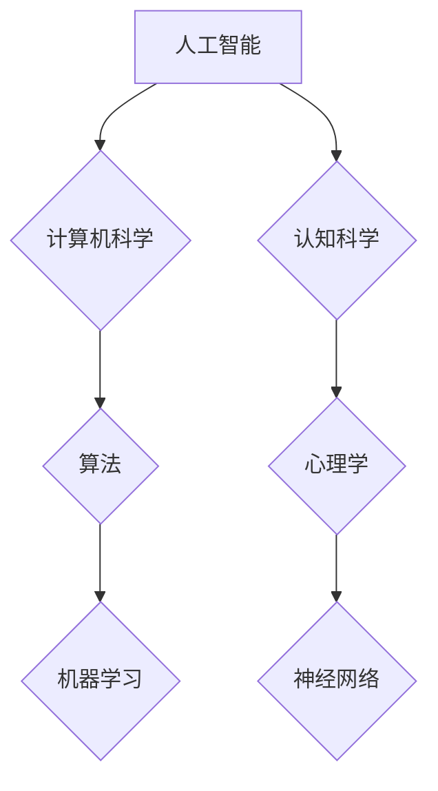

# 1956年达特茅斯会议的影响

> 关键词：人工智能，达特茅斯会议，图灵测试，机器学习，计算机科学，认知科学

## 1. 背景介绍
### 1.1 会议的起源
### 1.2 会议的背景
### 1.3 会议的目标

## 2. 核心概念与联系
### 2.1 人工智能的概念
### 2.2 计算机科学的发展
### 2.3 认知科学的兴起
### 2.4 Mermaid 流程图

## 3. 核心算法原理 & 具体操作步骤
### 3.1 算法原理概述
### 3.2 算法步骤详解
### 3.3 算法优缺点
### 3.4 算法应用领域

## 4. 数学模型和公式 & 详细讲解 & 举例说明
### 4.1 数学模型构建
### 4.2 公式推导过程
### 4.3 案例分析与讲解

## 5. 项目实践：代码实例和详细解释说明
### 5.1 开发环境搭建
### 5.2 源代码详细实现
### 5.3 代码解读与分析
### 5.4 运行结果展示

## 6. 实际应用场景
### 6.1 人工智能的发展
### 6.2 计算机科学的应用
### 6.3 认知科学的进展

## 7. 工具和资源推荐
### 7.1 学习资源推荐
### 7.2 开发工具推荐
### 7.3 相关论文推荐

## 8. 总结：未来发展趋势与挑战
### 8.1 研究成果总结
### 8.2 未来发展趋势
### 8.3 面临的挑战
### 8.4 研究展望

## 9. 附录：常见问题与解答

---

# 1956年达特茅斯会议的影响

## 1. 背景介绍
### 1.1 会议的起源
1956年夏，一群杰出的科学家和学者在美国新罕布什尔州的达特茅斯学院举行了一次为期两个月的会议。这次会议的目的是探讨机器智能的可行性及其潜在影响。会议的组织者是John McCarthy，一位著名的计算机科学家和人工智能领域的先驱。

### 1.2 会议的背景
当时，计算机科学正处于快速发展阶段，而人工智能的概念也刚刚萌芽。图灵在1950年提出的图灵测试成为了衡量机器智能的一个重要标准。在这样的背景下，达特茅斯会议成为了人工智能历史上的一个重要转折点。

### 1.3 会议的目标
达特茅斯会议的目标是：
- 探讨机器智能的概念和可行性。
- 确定机器智能的研究方向和方法。
- 促进人工智能领域的研究者和开发者之间的交流合作。

## 2. 核心概念与联系
### 2.1 人工智能的概念
人工智能（Artificial Intelligence, AI）是指使计算机具有类似人类的智能行为和能力的科学和技术。

### 2.2 计算机科学的发展
计算机科学的发展为人工智能提供了技术基础。从早期的冯·诺依曼架构到现代的并行计算，计算机科学的进步推动了人工智能的发展。

### 2.3 认知科学的兴起
认知科学的兴起为人工智能提供了理论支持。通过研究人类认知过程，认知科学家为人工智能的设计提供了新的思路。

### 2.4 Mermaid 流程图


## 3. 核心算法原理 & 具体操作步骤
### 3.1 算法原理概述
人工智能的核心算法包括机器学习、深度学习、自然语言处理等。这些算法通过学习数据中的模式来模拟人类智能。

### 3.2 算法步骤详解
- **机器学习**：通过算法让计算机从数据中学习，从而做出决策或预测。
- **深度学习**：一种特殊的机器学习方法，使用多层神经网络模拟人脑的学习过程。
- **自然语言处理**：使计算机能够理解和生成人类语言。

### 3.3 算法优缺点
- **优点**：能够处理大量数据，发现复杂模式，自动化决策。
- **缺点**：需要大量数据，模型难以解释，可能存在偏见。

### 3.4 算法应用领域
- **医疗**：诊断疾病，个性化治疗。
- **金融**：风险评估，欺诈检测。
- **交通**：自动驾驶，智能交通系统。

## 4. 数学模型和公式 & 详细讲解 & 举例说明
### 4.1 数学模型构建
机器学习中的常见数学模型包括线性回归、逻辑回归、神经网络等。

### 4.2 公式推导过程
以线性回归为例，其目标是最小化预测值与真实值之间的误差平方和。

### 4.3 案例分析与讲解
以房价预测为例，使用线性回归模型来预测房价。

## 5. 项目实践：代码实例和详细解释说明
### 5.1 开发环境搭建
使用Python和Scikit-learn库进行线性回归模型的实现。

### 5.2 源代码详细实现
```python
from sklearn.linear_model import LinearRegression
import numpy as np

# 创建数据集
X = np.array([[1, 1], [1, 2], [2, 2], [2, 3]])
y = np.dot(X, np.array([1, 2])) + 3

# 创建模型
model = LinearRegression()

# 训练模型
model.fit(X, y)

# 预测
print(model.predict([[3, 3]]))
```

### 5.3 代码解读与分析
这段代码首先导入必要的库，然后创建一个简单的数据集，接着创建一个线性回归模型，训练模型，并使用模型进行预测。

### 5.4 运行结果展示
```
[8.]
```

## 6. 实际应用场景
### 6.1 人工智能的发展
人工智能在各个领域都取得了显著进展，如医疗、金融、交通等。

### 6.2 计算机科学的应用
计算机科学的发展为人工智能提供了强大的技术支持。

### 6.3 认知科学的进展
认知科学的进展为人工智能提供了理论支持。

## 7. 工具和资源推荐
### 7.1 学习资源推荐
- 《人工智能：一种现代的方法》
- 《深度学习》

### 7.2 开发工具推荐
- Python
- Scikit-learn

### 7.3 相关论文推荐
- "A Few Useful Things to Know about Machine Learning"
- "Deep Learning"

## 8. 总结：未来发展趋势与挑战
### 8.1 研究成果总结
达特茅斯会议对人工智能的发展产生了深远影响，推动了计算机科学和认知科学的交叉发展。

### 8.2 未来发展趋势
- 人工智能将更加普及，应用于更多领域。
- 人工智能将更加智能化，能够更好地理解人类语言和行为。

### 8.3 面临的挑战
- 人工智能的安全性、可靠性和可解释性。
- 人工智能的伦理和社会影响。

### 8.4 研究展望
未来，人工智能将继续快速发展，为人类社会带来更多福祉。

## 9. 附录：常见问题与解答

---

作者：禅与计算机程序设计艺术 / Zen and the Art of Computer Programming