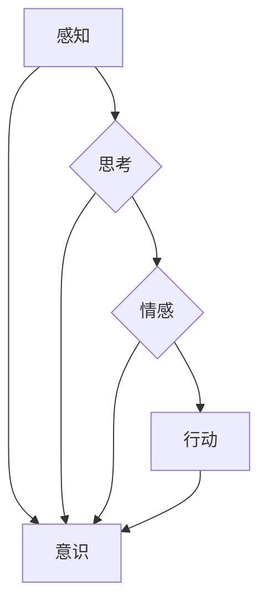

# 意识功能的价值标准解析

> 关键词：意识功能，价值标准，人工智能，机器学习，神经科学，认知科学

## 1. 背景介绍

随着人工智能技术的飞速发展，机器学习算法在模仿和模拟人类智能方面取得了显著的成果。然而，尽管机器在处理大量数据和执行复杂计算方面表现出色，但它们在意识功能上仍然与人类存在巨大的差距。意识功能是指生物体对自身状态和环境变化的主观体验，包括感知、思考、情感等。本文旨在探讨意识功能的价值标准，分析其在人工智能领域的意义，并展望未来发展的趋势与挑战。

### 1.1 意识功能的由来

意识功能的起源可以追溯到生物进化的早期阶段。在长期的进化过程中，生物体发展出了能够感知环境、做出决策和适应环境变化的意识功能。这些功能对于个体的生存和繁衍具有重要意义。随着科学技术的进步，人类对意识功能的本质和机制有了更深入的了解，但对其价值标准的研究仍然是一个复杂的课题。

### 1.2 研究现状

近年来，神经科学和认知科学领域对意识功能的研究取得了显著进展。研究者们试图通过脑成像、电生理学等方法，揭示意识功能的生物学基础。同时，人工智能领域也涌现出许多旨在模拟意识功能的机器学习算法。然而，意识功能的价值标准仍然是一个模糊且充满争议的概念。

### 1.3 研究意义

研究意识功能的价值标准对于以下方面具有重要意义：

- 帮助我们更好地理解人类自身和生物的进化历程。
- 为人工智能技术的发展提供新的思路和方向。
- 促进人类对自身认知和情感的深入探索。
- 推动跨学科研究，促进科学技术的进步。

### 1.4 本文结构

本文将分为以下几个部分：

- 第二部分，介绍意识功能的核心概念与联系，并给出相应的Mermaid流程图。
- 第三部分，探讨意识功能的价值标准，分析其构成要素。
- 第四部分，讨论意识功能在人工智能领域的应用和挑战。
- 第五部分，介绍相关的研究工具和资源。
- 第六部分，总结研究成果，展望未来发展趋势与挑战。
- 第七部分，列出常见问题与解答。

## 2. 核心概念与联系

### 2.1 意识功能的核心概念

**意识**：个体对自身状态和环境变化的主观体验。

**感知**：通过感官器官接收外部信息的过程。

**思考**：对感知到的信息进行处理、分析和解释的过程。

**情感**：对事物产生的情绪体验。

### 2.2 意识功能的Mermaid流程图

### 2.3 意识功能的联系

意识功能是生物体适应环境、进行学习和发展的基础。感知、思考、情感和行动相互联系，共同构成了意识功能的整体。

## 3. 意识功能的价值标准

### 3.1 价值标准的构成要素

意识功能的价值标准可以从以下几个方面进行考量：

- **适应性**：意识功能是否能够帮助生物体更好地适应环境变化。
- **学习能力**：意识功能是否能够帮助生物体学习和积累经验。
- **情感体验**：意识功能是否能够产生积极的情感体验。
- **创造力**：意识功能是否能够激发生物体的创造力。
- **道德伦理**：意识功能是否与道德伦理观念相符。

### 3.2 价值标准的评估方法

评估意识功能的价值标准，可以从以下几个方面进行：

- **实验研究**：通过实验研究，观察生物体在不同环境下的行为表现，分析意识功能对生物体的影响。
- **数据分析**：通过数据分析，挖掘意识功能与生物体生存、繁衍等指标之间的关系。
- **跨学科研究**：结合神经科学、认知科学、人工智能等领域的研究成果，从多角度评估意识功能的价值。

## 4. 意识功能在人工智能领域的应用和挑战

### 4.1 意识功能在人工智能领域的应用

- **增强学习**：通过模拟生物体的感知、思考、情感和行动过程，实现更加智能的增强学习算法。
- **自然语言处理**：利用意识功能模拟人类的语言理解、情感表达和思维逻辑。
- **机器人技术**：通过模拟生物体的感知、思考和行动，开发更加智能的机器人。

### 4.2 意识功能在人工智能领域的挑战

- **认知建模**：如何建立准确、高效的人工智能认知模型，模拟意识功能。
- **伦理道德**：如何确保人工智能的决策和行为符合伦理道德标准。
- **计算资源**：如何利用有限的计算资源，实现高效的人工智能意识功能模拟。

## 5. 相关的研究工具和资源

### 5.1 学习资源推荐

- 《认知科学导论》
- 《人工智能：一种现代的方法》
- 《神经科学原理》

### 5.2 开发工具推荐

- TensorFlow
- PyTorch
- Keras

### 5.3 相关论文推荐

- "Artificial consciousness: A review of the neuropsychological and cognitive neuroscience literature"
- "A distributed hierarchy of brain function"
- "The neural basis of consciousness: A critical review"

## 6. 总结：未来发展趋势与挑战

### 6.1 研究成果总结

本文从意识功能的核心概念、价值标准、人工智能领域的应用等方面进行了探讨，为意识功能的研究提供了新的思路和方向。

### 6.2 未来发展趋势

- **跨学科研究**：意识功能的研究需要神经科学、认知科学、人工智能等领域的交叉融合。
- **计算模型**：开发更加准确、高效的人工智能认知模型，模拟意识功能。
- **伦理道德**：关注人工智能的伦理道德问题，确保人工智能的发展符合人类价值观。

### 6.3 面临的挑战

- **认知建模**：如何建立准确、高效的人工智能认知模型，模拟意识功能。
- **计算资源**：如何利用有限的计算资源，实现高效的人工智能意识功能模拟。
- **伦理道德**：如何确保人工智能的决策和行为符合伦理道德标准。

### 6.4 研究展望

随着科学技术的不断进步，相信在不久的将来，人类将能够更加深入地理解意识功能，并将其应用于人工智能领域，推动人工智能的发展。

## 7. 附录：常见问题与解答

**Q1：意识功能与人工智能有何区别？**

A：意识功能是指生物体对自身状态和环境变化的主观体验，而人工智能是指通过模拟人类的智能行为，实现特定任务的计算机系统。两者在本质上是不同的，但人工智能可以模仿意识功能的一些特征。

**Q2：意识功能的研究对人类有什么意义？**

A：意识功能的研究可以帮助我们更好地理解人类自身和生物的进化历程，推动人工智能技术的发展，促进人类对自身认知和情感的深入探索。

**Q3：人工智能能否拥有意识？**

A：目前，人工智能还没有意识。尽管人工智能可以模拟一些意识功能的特征，但它们缺乏主观体验和情感。

**Q4：意识功能的价值标准如何确定？**

A：意识功能的价值标准可以从适应性、学习能力、情感体验、创造力和道德伦理等方面进行考量。

**Q5：意识功能的研究面临哪些挑战？**

A：意识功能的研究面临的主要挑战包括认知建模、计算资源和伦理道德等方面。

---

作者：禅与计算机程序设计艺术 / Zen and the Art of Computer Programming