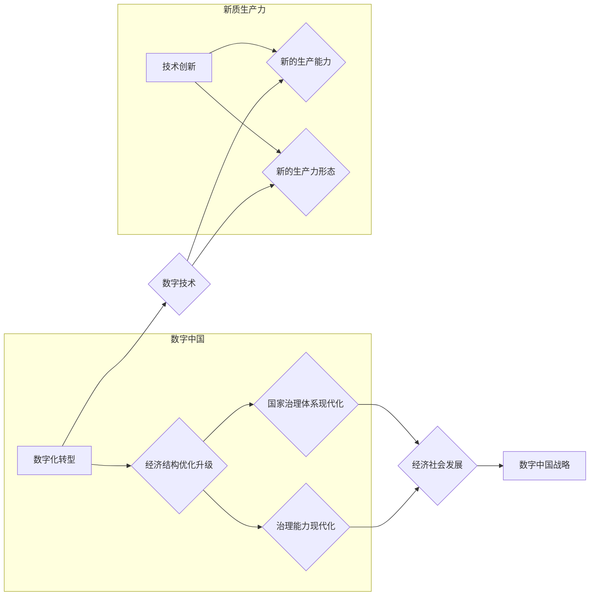

# 数字中国战略与新质生产力的结合点

> 关键词：数字中国，新质生产力，数字化转型，人工智能，大数据，区块链，云计算，5G

## 1. 背景介绍

随着信息技术的飞速发展，数字技术逐渐成为推动社会经济发展的重要力量。中国政府提出了“数字中国”战略，旨在通过数字化转型，推动经济社会高质量发展，构建数字中国。新质生产力，作为推动经济发展的新动能，与数字中国战略的结合，将引领我国进入一个崭新的发展阶段。

### 1.1 数字中国战略的提出

“数字中国”战略是党中央、国务院在新时代背景下提出的重要战略部署。该战略旨在通过信息化驱动现代化，以数字化转型为主线，推动经济结构优化升级，提升国家治理体系和治理能力现代化水平。

### 1.2 新质生产力的内涵

新质生产力是指在新的技术、新的产业、新的业态、新的模式等方面，以创新为动力，以数字技术为支撑，形成的新的生产能力和生产力形态。新质生产力具有以下特征：

- 以技术创新为核心驱动力
- 以数字化为重要支撑
- 以跨界融合为显著特征
- 以共享经济为重要形态
- 以绿色低碳为发展方向

### 1.3 数字中国战略与新质生产力的关系

数字中国战略是新质生产力发展的重要推动力，新质生产力是数字中国战略的重要实现途径。两者相互促进、相互依存，共同构建我国经济社会发展的新格局。

## 2. 核心概念与联系

### 2.1 核心概念原理

**数字中国**：以信息技术为核心，通过数字化转型推动经济社会高质量发展，实现国家治理体系和治理能力现代化。

**新质生产力**：以创新为动力，以数字技术为支撑，形成的新的生产能力和生产力形态。

### 2.2 核心概念架构的 Mermaid 流程图



### 2.3 核心概念联系

数字中国战略通过数字化转型推动经济社会高质量发展，培育新质生产力，而新质生产力的发展又进一步推动数字中国战略的实施。

## 3. 核心算法原理 & 具体操作步骤

### 3.1 算法原理概述

数字中国战略与新质生产力的结合点主要体现在以下几个方面：

- **人工智能**：利用人工智能技术，提升生产效率，优化资源配置。
- **大数据**：通过大数据分析，挖掘潜在价值，为决策提供支持。
- **区块链**：利用区块链技术，构建可信、安全的数字经济体系。
- **云计算**：通过云计算服务，降低企业运营成本，提高资源利用效率。
- **5G**：以5G为代表的新一代通信技术，为万物互联提供基础。

### 3.2 算法步骤详解

1. **顶层设计**：制定数字中国战略，明确发展目标和路径。
2. **基础设施建设**：加强人工智能、大数据、区块链、云计算等基础设施的建设。
3. **技术创新**：加大人工智能、大数据、区块链等领域的研发投入，推动技术创新。
4. **产业升级**：利用数字技术，推动传统产业转型升级，培育新质生产力。
5. **人才培养**：培养数字经济领域人才，为数字中国建设提供智力支持。
6. **政策支持**：出台相关政策，鼓励数字产业发展，营造良好的发展环境。

### 3.3 算法优缺点

**优点**：

- 提升生产效率，降低生产成本。
- 优化资源配置，提高资源利用效率。
- 创造新的经济增长点，推动经济高质量发展。
- 提升社会治理能力，提高公共服务水平。

**缺点**：

- 技术风险，如数据安全、隐私保护等。
- 人才短缺，需要加大人才培养力度。
- 数字鸿沟，可能导致社会不平等加剧。

### 3.4 算法应用领域

数字中国战略与新质生产力的结合，将在以下领域得到广泛应用：

- 制造业
- 服务业
- 农业业
- 城市管理
- 医疗健康
- 教育培训

## 4. 数学模型和公式 & 详细讲解 & 举例说明

### 4.1 数学模型构建

在数字中国战略与新质生产力的结合过程中，我们可以构建以下数学模型：

- **生产函数**：描述生产要素（如劳动力、资本、技术）与产出之间的关系。
- **投入产出模型**：描述产业链上下游之间的相互关系。
- **经济增长模型**：描述经济增长与各种因素之间的关系。

### 4.2 公式推导过程

以生产函数为例，其基本形式为：

$$
Y = F(K, L, T)
$$

其中，$Y$ 表示产出，$K$ 表示资本，$L$ 表示劳动力，$T$ 表示技术。

### 4.3 案例分析与讲解

以下以制造业为例，分析数字中国战略与新质生产力的结合。

1. **制造企业**通过引入人工智能技术，提升生产效率，降低生产成本。
2. **企业**通过收集和分析大数据，优化生产流程，提高产品质量。
3. **产业链上下游企业**通过区块链技术，构建可信的供应链体系。
4. **政府**通过云计算服务，提高政务服务效率。

## 5. 项目实践：代码实例和详细解释说明

### 5.1 开发环境搭建

以Python为例，搭建开发环境：

```bash
pip install numpy pandas matplotlib jupyter notebook
```

### 5.2 源代码详细实现

以下为使用Python进行数据分析的示例代码：

```python
import pandas as pd
import matplotlib.pyplot as plt

# 读取数据
data = pd.read_csv('data.csv')

# 绘制折线图
plt.plot(data['日期'], data['产出'])
plt.title('产出趋势图')
plt.xlabel('日期')
plt.ylabel('产出')
plt.show()
```

### 5.3 代码解读与分析

上述代码使用了pandas库读取CSV数据，matplotlib库绘制折线图。通过分析产出趋势，可以了解企业生产情况。

### 5.4 运行结果展示

运行上述代码，将生成产出趋势图，直观展示企业产出变化情况。

## 6. 实际应用场景

### 6.1 制造业

制造业是数字中国战略与新质生产力结合的重要领域。通过引入人工智能、大数据、区块链等技术，制造业可以实现以下应用：

- **智能生产**：利用人工智能技术，实现生产过程的自动化、智能化。
- **供应链管理**：利用区块链技术，构建可信的供应链体系。
- **产品溯源**：利用物联网技术，实现产品从生产到销售的全流程追溯。

### 6.2 服务业

服务业是数字中国战略与新质生产力结合的另一重要领域。通过引入数字技术，服务业可以实现以下应用：

- **在线教育**：利用在线教育平台，提供个性化、智能化的教育服务。
- **远程医疗**：利用远程医疗技术，提高医疗服务可及性。
- **电子商务**：利用电子商务平台，拓展销售渠道，提升企业竞争力。

### 6.3 农业业

农业是数字中国战略与新质生产力结合的又一重要领域。通过引入数字技术，农业可以实现以下应用：

- **智慧农业**：利用物联网、大数据等技术，实现农业生产的智能化管理。
- **农产品溯源**：利用区块链技术，实现农产品从种植到销售的全流程追溯。
- **农业电商**：利用农业电商平台，拓展农产品销售渠道。

## 7. 工具和资源推荐

### 7.1 学习资源推荐

- 《数字中国建设报告》
- 《大数据时代：生活、工作与思维的大变革》
- 《人工智能：一种现代的方法》
- 《区块链技术指南》

### 7.2 开发工具推荐

- Python
- R
- Java
- JavaScript

### 7.3 相关论文推荐

- 《数字中国建设战略思考》
- 《大数据时代的经济发展模式创新》
- 《人工智能与未来经济》
- 《区块链技术及其应用》

## 8. 总结：未来发展趋势与挑战

### 8.1 研究成果总结

数字中国战略与新质生产力的结合，为我国经济社会发展带来了新的机遇。通过技术创新、产业升级、人才培养和政策支持，我国数字经济发展取得了显著成果。

### 8.2 未来发展趋势

- **数字经济规模持续扩大**：数字经济将成为我国经济增长的主要驱动力。
- **数字技术不断创新**：人工智能、大数据、区块链等数字技术将不断取得突破。
- **产业数字化转型加速**：传统产业将加速向数字化、智能化转型。
- **数字治理能力提升**：数字治理体系将更加完善，治理能力将不断提升。

### 8.3 面临的挑战

- **技术瓶颈**：部分数字技术仍处于发展初期，存在技术瓶颈。
- **人才短缺**：数字经济领域人才短缺，制约产业发展。
- **数据安全**：数据安全问题突出，需要加强数据安全保障。
- **数字鸿沟**：数字鸿沟可能导致社会不平等加剧。

### 8.4 研究展望

未来，我们需要在以下方面加强研究：

- **数字技术创新**：加大研发投入，突破关键核心技术。
- **人才培养**：加强数字经济领域人才培养，提升人才素质。
- **数据治理**：建立健全数据安全管理制度，保障数据安全。
- **数字治理**：加强数字治理体系建设，提升治理能力。

通过不断努力，相信我国数字中国建设将取得更加辉煌的成就。

## 9. 附录：常见问题与解答

**Q1：数字中国战略与新质生产力的结合点是什么？**

A：数字中国战略与新质生产力的结合点主要体现在人工智能、大数据、区块链、云计算、5G等数字技术的应用，以及产业升级、人才培养、政策支持等方面。

**Q2：数字中国战略与新质生产力结合对经济社会发展有哪些影响？**

A：数字中国战略与新质生产力结合将推动经济高质量发展，提高生产效率，优化资源配置，创造新的经济增长点，提升社会治理能力，提高公共服务水平。

**Q3：数字中国战略与新质生产力结合面临哪些挑战？**

A：数字中国战略与新质生产力结合面临技术瓶颈、人才短缺、数据安全、数字鸿沟等挑战。

**Q4：如何应对数字中国战略与新质生产力结合面临的挑战？**

A：应对挑战需要加大研发投入，加强人才培养，建立健全数据安全管理制度，加强数字治理体系建设。

---

作者：禅与计算机程序设计艺术 / Zen and the Art of Computer Programming