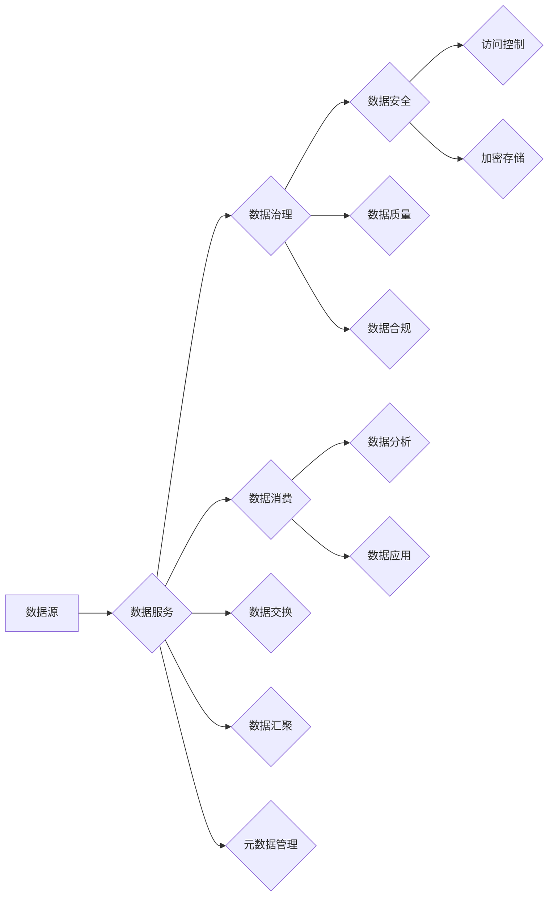

> 数据mesh, 去中心化, 数据架构, 数据治理, 数据共享, 元数据管理

# 数据mesh: 去中心化的数据架构新思潮

在数字化转型的浪潮下，数据已成为企业的核心资产。然而，随着数据量的爆炸式增长和业务场景的日益复杂，传统的集中式数据架构面临着巨大的挑战，如数据孤岛、数据冗余、数据质量参差不齐等。为了解决这些问题，数据mesh架构作为一种去中心化的数据架构新思潮逐渐兴起。本文将深入探讨数据mesh的概念、原理、实现方式以及在各个行业的应用，展望其未来发展趋势与挑战。

## 1. 背景介绍

### 1.1 数据孤岛问题

在传统的集中式数据架构中，数据被存储在多个独立的数据仓库中，不同系统、部门之间难以共享数据，形成了所谓的“数据孤岛”。数据孤岛导致数据重复存储、冗余浪费，同时也阻碍了数据分析的深度应用。

### 1.2 数据治理挑战

随着数据量的激增，数据治理变得日益困难。数据质量、数据安全、数据合规等问题成为企业数据管理的主要挑战。集中式数据架构难以应对这些挑战，需要一种新的数据架构来提高数据治理的效率和效果。

### 1.3 数据mesh的兴起

数据mesh作为一种去中心化的数据架构，旨在解决集中式数据架构的痛点，通过构建一个分布式的数据架构，实现数据共享、数据治理和数据安全的协同发展。

## 2. 核心概念与联系

### 2.1 数据mesh概念

数据mesh是一种去中心化的数据架构，它将数据视为服务，通过构建一个数据网状结构，实现数据的统一视图、统一访问和统一治理。

### 2.2 数据mesh与数据架构的关系

数据mesh是数据架构的一种实现方式，它将数据视为服务，通过分布式架构实现数据的共享、治理和安全性。

### 2.3 数据mesh的架构特点

- **去中心化**：数据mesh采用去中心化的架构，数据服务分布在各个系统、部门，降低了数据孤岛的风险。
- **微服务化**：数据mesh将数据服务化，提供统一的数据接口，便于数据共享和复用。
- **自治性**：数据mesh中的数据服务具有自治性，可以独立部署和扩展。
- **元数据管理**：数据mesh强调元数据管理，提供数据描述、数据质量、数据安全等元数据的统一管理。

### 2.4 数据mesh的Mermaid流程图



## 3. 核心算法原理 & 具体操作步骤

### 3.1 算法原理概述

数据mesh的核心算法原理是构建一个分布式数据网状结构，通过数据服务化、元数据管理和数据治理等手段，实现数据的统一视图、统一访问和统一治理。

### 3.2 算法步骤详解

1. **数据服务化**：将数据资源抽象为数据服务，提供统一的数据接口。
2. **元数据管理**：构建元数据中心，统一管理数据描述、数据质量、数据安全等元数据。
3. **数据治理**：建立数据治理机制，确保数据质量、数据安全和数据合规。
4. **数据消费**：用户通过数据服务接口消费数据，进行数据分析、数据应用等。

### 3.3 算法优缺点

**优点**：

- 提高数据共享和复用效率
- 降低数据孤岛风险
- 提高数据治理效率
- 提升数据安全性和合规性

**缺点**：

- 架构复杂，实施难度大
- 需要较强的技术能力
- 数据治理成本较高

### 3.4 算法应用领域

数据mesh架构适用于各个行业，包括但不限于：

- 金融
- 互联网
- 电信
- 制造业
- 医疗
- 教育

## 4. 数学模型和公式 & 详细讲解 & 举例说明

### 4.1 数学模型构建

数据mesh的数学模型可以构建为一个图结构，其中节点代表数据服务，边代表数据依赖关系。

### 4.2 公式推导过程

数据mesh的公式推导过程涉及图论、概率论和统计学等数学工具。

### 4.3 案例分析与讲解

以金融行业为例，数据mesh可以应用于以下场景：

- **风险评估**：通过数据mesh构建客户画像，分析客户风险，进行信贷审批。
- **欺诈检测**：通过数据mesh整合多个数据源，实时监控交易行为，识别欺诈风险。
- **客户服务**：通过数据mesh提供个性化推荐服务，提升客户满意度。

## 5. 项目实践：代码实例和详细解释说明

### 5.1 开发环境搭建

数据mesh项目需要以下开发环境：

- 操作系统：Linux或Windows
- 编程语言：Java、Python等
- 数据库：MySQL、PostgreSQL等
- 框架：Spring Boot、Django等

### 5.2 源代码详细实现

以下是一个简单的数据mesh项目示例：

```python
# Python代码示例

from flask import Flask, request, jsonify

app = Flask(__name__)

# 数据服务接口
@app.route('/data_service', methods=['GET'])
def data_service():
    # 获取请求参数
    data_id = request.args.get('data_id')
    # 查询数据服务
    data = query_data_service(data_id)
    # 返回数据
    return jsonify(data)

def query_data_service(data_id):
    # 查询数据服务的逻辑
    pass

if __name__ == '__main__':
    app.run()
```

### 5.3 代码解读与分析

上述代码示例展示了数据mesh的一个简单实现。通过Flask框架构建一个Web服务，提供数据服务接口，实现数据的统一访问。

### 5.4 运行结果展示

当访问 `/data_service?data_id=1` 时，服务器将返回查询到的数据。

## 6. 实际应用场景

### 6.1 金融行业

在金融行业中，数据mesh可以应用于以下场景：

- **风险控制**：通过数据mesh整合多源风险数据，构建全面的风险评估模型。
- **反欺诈**：通过数据mesh实时监控交易行为，识别欺诈风险。
- **个性化营销**：通过数据mesh分析客户行为，提供个性化推荐服务。

### 6.2 互联网行业

在互联网行业中，数据mesh可以应用于以下场景：

- **用户画像**：通过数据mesh整合用户行为数据，构建用户画像。
- **精准营销**：通过数据mesh分析用户偏好，实现精准营销。
- **推荐系统**：通过数据mesh整合商品、用户、行为等多源数据，构建推荐系统。

### 6.3 制造业

在制造业中，数据mesh可以应用于以下场景：

- **生产监控**：通过数据mesh整合生产数据，实现生产过程监控。
- **设备管理**：通过数据mesh管理设备状态，实现设备预测性维护。
- **供应链优化**：通过数据mesh优化供应链管理，降低成本，提高效率。

## 7. 工具和资源推荐

### 7.1 学习资源推荐

- 《数据架构师手册》
- 《数据治理：理论与实践》
- 《Apache Flink：流处理引擎实战》
- 《Spring Cloud微服务实战》

### 7.2 开发工具推荐

- Spring Cloud
- Apache Flink
- Apache Kafka
- Apache Hadoop

### 7.3 相关论文推荐

- DataMesh: The Data Architecture for the Era of Cloud Native
- A Theoretical Framework for Data Mesh
- Designing Data Mesh

## 8. 总结：未来发展趋势与挑战

### 8.1 研究成果总结

数据mesh作为一种去中心化的数据架构，在解决数据孤岛、提高数据治理效率、提升数据安全性和合规性等方面取得了显著成果。

### 8.2 未来发展趋势

- 数据mesh将更加成熟和普及
- 数据mesh将与其他技术（如AI、区块链等）深度融合
- 数据mesh将推动数据治理的自动化和智能化

### 8.3 面临的挑战

- 数据mesh架构复杂，实施难度大
- 数据治理成本较高
- 数据安全和隐私保护

### 8.4 研究展望

未来，数据mesh将在以下方面进行深入研究：

- 数据mesh的标准化
- 数据mesh与其他技术的融合
- 数据mesh在多云环境中的应用

## 9. 附录：常见问题与解答

**Q1：数据mesh与传统数据架构的区别是什么？**

A：数据mesh与传统数据架构的主要区别在于数据架构的分布式程度。数据mesh采用去中心化的架构，数据服务分布在各个系统、部门，而传统数据架构采用集中式架构，数据存储在中心化的数据仓库中。

**Q2：数据mesh的优势有哪些？**

A：数据mesh的优势包括提高数据共享和复用效率、降低数据孤岛风险、提高数据治理效率、提升数据安全性和合规性等。

**Q3：数据mesh在哪些行业应用最广泛？**

A：数据mesh在金融、互联网、制造业、医疗、教育等行业应用最广泛。

**Q4：如何实施数据mesh架构？**

A：实施数据mesh架构需要以下步骤：

1. 明确数据架构目标
2. 设计数据mesh架构
3. 选择合适的工具和技术
4. 构建数据服务
5. 实施数据治理

**Q5：数据mesh与数据湖、数据仓库的区别是什么？**

A：数据湖、数据仓库和数据mesh是三种不同的数据架构。数据湖是存储海量数据的大数据平台，数据仓库是存储结构化数据的数据存储系统，而数据mesh是一种去中心化的数据架构，旨在实现数据的共享、治理和安全性。

---

作者：禅与计算机程序设计艺术 / Zen and the Art of Computer Programming