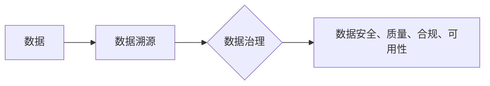

# 数据溯源:软件2.0时代的数据治理利器

> 关键词：数据溯源，数据治理，区块链，分布式账本，数字指纹，软件2.0，隐私保护，可追溯性

## 1. 背景介绍

随着互联网和大数据技术的快速发展，数据已成为现代社会最为宝贵的资产之一。然而，数据量的激增也带来了数据治理的挑战。如何确保数据的安全、可靠、可追溯，成为企业数字化转型的重要课题。在软件2.0时代，数据溯源技术应运而生，成为数据治理的利器。

### 1.1 问题的由来

在传统的数据治理模式中，数据往往分散存储在各个系统、平台和设备中，缺乏统一的管理和监控。这使得数据的一致性、安全性和可追溯性难以保证。以下是一些常见的数据治理问题：

- **数据孤岛**：不同系统之间的数据难以共享和整合，导致数据价值无法得到充分利用。
- **数据质量问题**：数据质量参差不齐，存在错误、重复、不一致等问题，影响数据分析的准确性。
- **数据安全问题**：数据泄露、篡改等安全事件频发，威胁企业利益和用户隐私。
- **数据可追溯性差**：在数据出现问题时，难以追踪数据来源和流转过程，难以进行问题定位和责任追溯。

### 1.2 研究现状

为了解决上述问题，业界提出了多种数据治理技术和方法，如数据质量管理、数据安全防护、数据生命周期管理等。其中，数据溯源技术因其能够提供数据的完整追溯链而备受关注。

### 1.3 研究意义

数据溯源技术对于企业数字化转型具有重要意义：

- **提升数据可信度**：通过数据溯源，可以确保数据的真实性和可靠性，增强数据使用的信心。
- **加强数据安全**：实时监控数据流动，及时发现和防范数据泄露、篡改等安全事件。
- **优化数据治理**：帮助企业和组织更好地了解数据流动情况，优化数据管理策略。
- **促进创新**：数据溯源技术可以为新兴应用提供支持，如供应链金融、区块链等。

### 1.4 本文结构

本文将围绕数据溯源技术展开，探讨其核心概念、算法原理、应用场景和发展趋势。文章结构如下：

- **第2章**：介绍数据溯源的核心概念与联系。
- **第3章**：阐述数据溯源算法的原理和具体操作步骤。
- **第4章**：讲解数据溯源的数学模型和公式，并举例说明。
- **第5章**：通过项目实践，展示数据溯源技术的代码实例和详细解释。
- **第6章**：分析数据溯源技术在实际应用场景中的应用。
- **第7章**：推荐数据溯源相关的学习资源、开发工具和论文。
- **第8章**：总结数据溯源技术的研究成果、未来发展趋势和挑战。
- **第9章**：提供数据溯源的常见问题与解答。

## 2. 核心概念与联系

### 2.1 核心概念

#### 数据溯源

数据溯源是指追踪数据的来源、流动、处理和最终去向的过程。通过数据溯源，可以确保数据的可追溯性、完整性和安全性。

#### 数据治理

数据治理是指对数据资产的管理、控制和优化，以确保数据的质量、安全、合规和可用性。

#### 区块链

区块链是一种分布式账本技术，具有不可篡改、可追溯、透明等特点，被广泛应用于数据溯源场景。

#### 数字指纹

数字指纹是指用于唯一标识数据对象的特征值，如哈希值、数字签名等。

### 2.2 核心概念联系

数据溯源技术是数据治理的重要组成部分，通过区块链、数字指纹等技术，实现数据的可追溯性。其逻辑关系如下：



## 3. 核心算法原理 & 具体操作步骤

### 3.1 算法原理概述

数据溯源算法主要包括以下步骤：

1. **数据采集**：从各个系统和平台采集数据，并进行初步清洗和格式化。
2. **数据指纹生成**：对采集到的数据生成数字指纹，如哈希值、数字签名等。
3. **数据存储**：将数据指纹存储在区块链上，实现数据的不可篡改和可追溯。
4. **数据查询**：通过查询区块链，追踪数据的来源、流动和去向。

### 3.2 算法步骤详解

#### 数据采集

数据采集是指从各个系统和平台获取数据的过程。具体步骤如下：

- **数据源识别**：确定数据源，如数据库、日志文件、API接口等。
- **数据连接**：建立与数据源的连接，如SQL查询、API调用等。
- **数据提取**：从数据源中提取所需数据，并进行初步清洗和格式化。

#### 数据指纹生成

数据指纹生成是指为每个数据对象生成唯一的标识符。具体步骤如下：

- **选择指纹算法**：选择合适的指纹算法，如SHA-256、MD5等。
- **计算指纹值**：对数据对象进行指纹算法处理，生成指纹值。

#### 数据存储

数据存储是指将数据指纹存储在区块链上。具体步骤如下：

- **选择区块链平台**：选择合适的区块链平台，如以太坊、Hyperledger Fabric等。
- **创建智能合约**：创建智能合约，用于存储和管理数据指纹。
- **存储指纹数据**：将数据指纹写入区块链，实现数据的不可篡改和可追溯。

#### 数据查询

数据查询是指通过区块链查询数据的来源、流动和去向。具体步骤如下：

- **连接区块链**：连接到区块链平台，获取区块链数据。
- **查询数据指纹**：查询特定数据指纹的记录。
- **分析数据轨迹**：分析数据指纹的记录，了解数据的来源、流动和去向。

### 3.3 算法优缺点

#### 优点

- **不可篡改**：区块链的分布式特性保证了数据指纹的不可篡改性。
- **可追溯**：通过查询区块链，可以追溯数据的来源、流动和去向。
- **透明**：区块链的公开性保证了数据溯源过程的透明性。

#### 缺点

- **性能限制**：区块链的共识机制可能导致性能瓶颈。
- **存储成本**：区块链的数据存储成本较高。
- **技术门槛**：区块链技术的应用需要一定的技术门槛。

### 3.4 算法应用领域

数据溯源算法在以下领域具有广泛应用：

- **供应链管理**：追踪产品来源、生产和流通过程，确保产品质量和安全。
- **食品安全**：追踪食品来源、生产日期和运输过程，保障食品安全。
- **金融服务**：追踪资金流动、交易记录和账户信息，确保金融安全。
- **医疗健康**：追踪药物来源、使用情况和患者信息，保障医疗安全。

## 4. 数学模型和公式 & 详细讲解 & 举例说明

### 4.1 数学模型构建

数据溯源的数学模型主要包括以下部分：

- **数据指纹模型**：用于生成数据指纹的数学模型。
- **区块链模型**：用于存储和管理数据指纹的区块链模型。
- **数据查询模型**：用于查询数据指纹的数学模型。

### 4.2 公式推导过程

#### 数据指纹模型

数据指纹模型通常采用哈希函数进行数据指纹生成。哈希函数的输入为数据对象，输出为固定长度的指纹值。常见的哈希函数有SHA-256、MD5等。

#### 区块链模型

区块链模型采用分布式账本技术，包括区块、链和共识机制。区块包含数据指纹、时间戳、区块头等信息。链由多个区块按顺序链接而成。

#### 数据查询模型

数据查询模型采用哈希函数进行数据指纹匹配。通过查询区块链，找到与查询指纹匹配的区块，获取数据来源、流动和去向信息。

### 4.3 案例分析与讲解

以下是一个数据溯源的简单示例：

假设一家食品企业使用数据溯源技术追踪其产品的生产和流通过程。

1. **数据采集**：企业采集产品生产、加工、运输和销售过程中的数据，如生产日期、批号、运输时间等。
2. **数据指纹生成**：对采集到的数据生成SHA-256指纹值。
3. **数据存储**：将指纹值写入区块链，每个区块包含一个指纹值和时间戳。
4. **数据查询**：消费者通过扫描产品上的二维码，查询产品的区块链信息，了解产品来源、生产日期和运输情况。

通过上述示例，可以看出数据溯源技术可以有效地追踪数据的来源、流动和去向，保障数据的安全性和可靠性。

## 5. 项目实践：代码实例和详细解释说明

### 5.1 开发环境搭建

为了实现数据溯源功能，我们需要搭建以下开发环境：

- **编程语言**：Python
- **区块链平台**：以太坊
- **开发工具**：Truffle、Solidity、web3.py

### 5.2 源代码详细实现

以下是一个基于以太坊的数据溯源智能合约示例：

```solidity
// SPDX-License-Identifier: MIT
pragma solidity ^0.8.0;

contract DataTrace {
    mapping(string => string) private dataFingerprints;
    mapping(string => uint256) private timestamps;

    function setDataFingerprint(string memory dataId, string memory fingerprint) external {
        dataFingerprints[dataId] = fingerprint;
        timestamps[dataId] = block.timestamp;
    }

    function getDataFingerprint(string memory dataId) external view returns (string memory, uint256) {
        require(bytes(dataFingerprints[dataId]).length > 0, "No data fingerprint found");
        return (dataFingerprints[dataId], timestamps[dataId]);
    }
}
```

### 5.3 代码解读与分析

上述智能合约定义了两个映射：`dataFingerprints` 用于存储数据指纹，`timestamps` 用于存储数据指纹的创建时间。合约提供了两个函数：`setDataFingerprint` 用于设置数据指纹和时间戳，`getDataFingerprint` 用于查询数据指纹和时间戳。

### 5.4 运行结果展示

通过Truffle等工具部署上述智能合约后，可以调用合约函数进行数据指纹的设置和查询。

```python
from web3 import Web3

# 连接到以太坊节点
web3 = Web3(Web3.HTTPProvider('https://mainnet.infura.io/v3/YOUR_PROJECT_ID'))

# 部署智能合约
contract = web3.eth.contract(abi=contract_abi, bytecode=contract_bytecode)
contract_instance = contract.constructor().transact({'from': web3.eth.defaultAccount})

# 设置数据指纹
contract_instance.setDataFingerprint("12345", "fingerprint_value").transact({'from': web3.eth.defaultAccount})

# 查询数据指纹
fingerprint, timestamp = contract_instance.getDataFingerprint("12345").call()
```

## 6. 实际应用场景

数据溯源技术在以下领域具有广泛应用：

### 6.1 供应链管理

数据溯源技术可以用于追踪产品的来源、生产和流通过程，确保产品质量和安全。例如，食品、药品、化妆品等行业可以使用数据溯源技术，保障消费者的权益。

### 6.2 食品安全

数据溯源技术可以用于追踪食品的来源、生产日期、运输时间和销售渠道，确保食品安全。例如，通过扫描产品上的二维码，消费者可以了解食品的生产信息和溯源信息。

### 6.3 金融服务

数据溯源技术可以用于追踪资金的流动、交易记录和账户信息，确保金融安全。例如，金融机构可以使用数据溯源技术，防范洗钱、欺诈等金融犯罪。

### 6.4 医疗健康

数据溯源技术可以用于追踪药物来源、使用情况和患者信息，保障医疗安全。例如，医院可以使用数据溯源技术，确保药物的质量和患者用药安全。

## 7. 工具和资源推荐

### 7.1 学习资源推荐

- 《区块链技术指南》
- 《Solidity编程》
- 《Python编程：从入门到实践》

### 7.2 开发工具推荐

- Truffle
- Solidity
- web3.py

### 7.3 相关论文推荐

- Blockchain-Based Data Provenance and Traceability for Cloud Data Services
- Provenance: The First Step Toward Trusted Scientific Data

## 8. 总结：未来发展趋势与挑战

### 8.1 研究成果总结

本文介绍了数据溯源技术，探讨了其核心概念、算法原理、应用场景和发展趋势。数据溯源技术作为一种数据治理利器，在软件2.0时代具有重要的应用价值。

### 8.2 未来发展趋势

- **跨平台数据溯源**：实现不同区块链平台之间的数据溯源，打破数据孤岛。
- **数据隐私保护**：在数据溯源过程中，采用隐私保护技术，保护用户隐私。
- **智能合约优化**：优化智能合约性能，提高数据溯源效率。

### 8.3 面临的挑战

- **数据安全**：确保数据溯源过程中的数据安全，防止数据泄露和篡改。
- **隐私保护**：在数据溯源过程中，保护用户隐私，避免隐私泄露风险。
- **技术门槛**：降低数据溯源技术的应用门槛，让更多开发者能够使用。

### 8.4 研究展望

未来，数据溯源技术将与其他人工智能技术、区块链技术等相结合，为数据治理和数字化转型提供更加安全、可靠、高效的解决方案。

## 9. 附录：常见问题与解答

**Q1：数据溯源技术是否适用于所有类型的数据？**

A1：数据溯源技术主要适用于结构化数据，对于非结构化数据，需要进行预处理和转换。

**Q2：数据溯源技术如何保护用户隐私？**

A2：在数据溯源过程中，可以采用匿名化、差分隐私等技术，保护用户隐私。

**Q3：数据溯源技术的成本如何？**

A3：数据溯源技术的成本取决于具体应用场景和技术方案，需要根据实际情况进行评估。

**Q4：数据溯源技术与其他数据治理技术的关系是什么？**

A4：数据溯源技术是数据治理的重要组成部分，与其他数据治理技术如数据质量管理、数据安全防护等相互补充。

**Q5：数据溯源技术有哪些应用案例？**

A5：数据溯源技术在供应链管理、食品安全、金融服务、医疗健康等领域有广泛应用案例。

---

作者：禅与计算机程序设计艺术 / Zen and the Art of Computer Programming