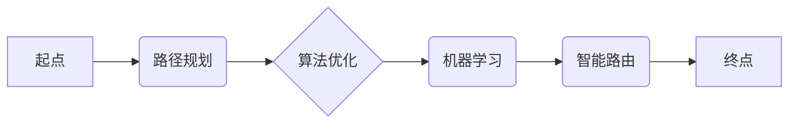

## 智能路由优化在物流管理中的应用

> 关键词：智能路由，物流管理，算法优化，机器学习，路径规划，运输效率，成本降低

## 1. 背景介绍

在当今全球化经济时代，物流管理扮演着至关重要的角色。高效、快速的物流配送能够显著提升企业竞争力，降低运营成本，提升客户满意度。然而，传统的物流配送模式往往面临着诸多挑战，例如：

* **路线规划复杂:**  物流配送网络通常庞大复杂，包含多个配送点、车辆和货物，需要考虑多种因素，如距离、时间、交通状况、货物类型等，制定最优的配送路线是一个复杂的优化问题。
* **运输成本高:**  运输成本是物流管理中的一项主要支出，不合理的路线规划会导致运输距离增加，燃油消耗增加，从而提高运输成本。
* **配送效率低:**  传统的配送模式往往存在路线重复、车辆空载等问题，导致配送效率低下，无法满足现代物流对速度和效率的要求。

智能路由优化技术应运而生，旨在通过运用人工智能、机器学习等先进技术，对物流配送路线进行智能化规划，从而提高运输效率、降低运输成本，提升客户满意度。

## 2. 核心概念与联系

智能路由优化技术的核心概念包括：

* **路径规划:**  根据给定的起点和终点，以及各种约束条件，找到最优的路径。
* **算法优化:**  运用各种算法，如遗传算法、模拟退火算法等，对路径规划进行优化，找到最优解或近似最优解。
* **机器学习:**  利用机器学习算法，从历史数据中学习，预测未来交通状况、货物需求等，从而进行更精准的路径规划。

**核心概念架构**



## 3. 核心算法原理 & 具体操作步骤

### 3.1  算法原理概述

智能路由优化算法通常基于以下原理：

* **贪婪算法:**  每次选择当前最优的局部解，逐步逼近全局最优解。
* **启发式算法:**  利用启发式函数，评估不同路径的优劣，选择更有可能找到全局最优解的路径。
* **进化算法:**  模拟自然进化过程，通过选择、交叉、变异等操作，不断优化路径方案。

### 3.2  算法步骤详解

以遗传算法为例，其具体操作步骤如下：

1. **编码:** 将路径方案编码成染色体，例如使用整数表示每个节点的顺序。
2. **初始化种群:**  随机生成多个染色体，构成初始种群。
3. **适应度评估:**  根据路径方案的性能，如总距离、运输时间等，计算每个染色体的适应度值。
4. **选择:**  根据适应度值，选择部分染色体进行交叉和变异操作。
5. **交叉:**  将两个父代染色体进行交叉操作，生成两个子代染色体。
6. **变异:**  对子代染色体进行随机变异操作，增加遗传多样性。
7. **更新种群:**  将新生成的子代染色体加入种群，淘汰部分低适应度的染色体。
8. **重复步骤3-7:**  重复上述步骤，直到达到终止条件，例如最大迭代次数或种群适应度达到目标值。

### 3.3  算法优缺点

**优点:**

* 能够找到全局最优解或近似最优解。
* 适应性强，能够处理复杂、多变的物流配送场景。

**缺点:**

* 计算复杂度高，需要较大的计算资源。
* 算法参数设置对结果影响较大，需要进行仔细调试。

### 3.4  算法应用领域

智能路由优化算法广泛应用于以下领域：

* **快递物流:**  优化快递配送路线，提高配送效率和客户满意度。
* **货运物流:**  优化货运车辆路线，降低运输成本和运输时间。
* **城市配送:**  优化城市配送路线，缓解城市交通拥堵问题。
* **无人配送:**  为无人配送系统提供路径规划方案。

## 4. 数学模型和公式 & 详细讲解 & 举例说明

### 4.1  数学模型构建

智能路由优化问题可以建模为一个图论问题，其中：

* 节点代表配送点或仓库。
* 边代表连接两个节点的道路或运输路线，边权代表道路长度或运输时间。

目标是找到从起点到终点的最优路径，满足一定的约束条件，例如车辆容量、运输时间限制等。

### 4.2  公式推导过程

常用的路径规划算法，如 Dijkstra 算法，可以利用以下公式进行路径计算：

* **距离公式:**  $d(u, v) = w(u, v)$，其中 $d(u, v)$ 表示节点 $u$ 到节点 $v$ 的距离，$w(u, v)$ 表示连接节点 $u$ 和 $v$ 的边的权重。
* **最短路径公式:**  $d(start, end) = min_{path} \sum_{u, v \in path} d(u, v)$，其中 $d(start, end)$ 表示从起点到终点的最短距离，$path$ 表示所有可能的路径。

### 4.3  案例分析与讲解

假设有一个物流配送网络，包含三个配送点 A、B、C，以及连接它们的道路，道路长度如下：

* A 到 B: 10 公里
* A 到 C: 15 公里
* B 到 C: 5 公里

如果起点是 A，终点是 C，则可以使用 Dijkstra 算法计算最短路径，结果为 A -> B -> C，总距离为 15 公里。

## 5. 项目实践：代码实例和详细解释说明

### 5.1  开发环境搭建

本项目使用 Python 语言进行开发，所需环境如下：

* Python 3.x
* NetworkX 库

### 5.2  源代码详细实现

```python
import networkx as nx

# 创建图
graph = nx.Graph()

# 添加节点
graph.add_nodes_from(['A', 'B', 'C'])

# 添加边
graph.add_edge('A', 'B', weight=10)
graph.add_edge('A', 'C', weight=15)
graph.add_edge('B', 'C', weight=5)

# 计算最短路径
shortest_path = nx.shortest_path(graph, source='A', target='C', weight='weight')

# 打印最短路径
print(f"最短路径: {shortest_path}")
```

### 5.3  代码解读与分析

* 使用 NetworkX 库创建图对象，并添加节点和边。
* 使用 `nx.shortest_path()` 函数计算从节点 A 到节点 C 的最短路径，并指定边权重为 `weight`。
* 打印计算出的最短路径。

### 5.4  运行结果展示

```
最短路径: ['A', 'B', 'C']
```

## 6. 实际应用场景

智能路由优化技术在物流管理中的应用场景广泛，例如：

* **快递配送:**  优化快递配送路线，减少配送时间和成本，提高客户满意度。
* **货运物流:**  优化货运车辆路线，减少运输距离和燃油消耗，降低运输成本。
* **城市配送:**  优化城市配送路线，缓解城市交通拥堵问题，提高配送效率。
* **无人配送:**  为无人配送系统提供路径规划方案，实现无人配送的自动化和效率提升。

### 6.4  未来应用展望

随着人工智能、机器学习等技术的不断发展，智能路由优化技术将更加智能化、精准化，并应用于更多物流管理场景，例如：

* **个性化配送:**  根据客户需求，提供个性化的配送路线和时间。
* **动态路径规划:**  实时监控交通状况、货物需求等变化，动态调整配送路线，提高配送效率。
* **多模态运输:**  整合多种运输方式，例如公路、铁路、航空等，优化多模态运输路线，降低运输成本。

## 7. 工具和资源推荐

### 7.1  学习资源推荐

* **书籍:**
    * 《物流管理》
    * 《人工智能算法》
    * 《机器学习》
* **在线课程:**
    * Coursera:  物流管理、人工智能、机器学习
    * edX:  物流管理、人工智能、机器学习
    * Udemy:  物流管理、人工智能、机器学习

### 7.2  开发工具推荐

* **Python:**  Python 语言是智能路由优化算法开发的常用语言。
* **NetworkX:**  NetworkX 库是 Python 中用于构建和分析图的常用库。
* **Google Maps API:**  Google Maps API 可以提供实时交通状况数据，用于动态路径规划。

### 7.3  相关论文推荐

* **论文:**
    * "A Survey of Routing Algorithms for Logistics and Transportation"
    * "Intelligent Routing Optimization in Logistics Management"
    * "Machine Learning for Route Optimization in Logistics"

## 8. 总结：未来发展趋势与挑战

### 8.1  研究成果总结

智能路由优化技术在物流管理领域取得了显著成果，能够有效提高运输效率、降低运输成本，提升客户满意度。

### 8.2  未来发展趋势

未来智能路由优化技术将朝着以下方向发展：

* **更加智能化:**  利用更先进的人工智能算法，实现更精准、更动态的路径规划。
* **更加个性化:**  根据客户需求，提供个性化的配送路线和时间。
* **更加多模态:**  整合多种运输方式，优化多模态运输路线。

### 8.3  面临的挑战

智能路由优化技术也面临着一些挑战：

* **数据获取和处理:**  需要大量真实的数据进行训练和测试，数据获取和处理是一个难题。
* **算法复杂度:**  一些智能路由优化算法计算复杂度较高，需要更高效的算法和计算资源。
* **系统集成:**  将智能路由优化技术与现有的物流管理系统进行集成是一个挑战。

### 8.4  研究展望

未来研究将重点关注以下方面：

* 开发更智能、更高效的路由优化算法。
* 探索新的数据来源和数据处理方法。
* 研究智能路由优化技术在不同物流场景下的应用。


## 9. 附录：常见问题与解答

**常见问题:**

* **智能路由优化算法的适用场景有哪些？**

**解答:** 智能路由优化算法适用于各种需要优化路径规划的场景，例如快递配送、货运物流、城市配送、无人配送等。

* **智能路由优化算法的优缺点是什么？**

**解答:** 智能路由优化算法的优点是能够找到全局最优解或近似最优解，适应性强。缺点是计算复杂度高，算法参数设置对结果影响较大。

* **如何选择合适的智能路由优化算法？**

**解答:** 选择合适的智能路由优化算法需要根据具体场景的特点进行选择，例如数据规模、路径复杂度、时间限制等。

* **智能路由优化技术与传统物流管理模式相比有哪些优势？**

**解答:** 智能路由优化技术能够提高运输效率、降低运输成本、提升客户满意度，相比传统物流管理模式具有明显的优势。


作者：禅与计算机程序设计艺术 / Zen and the Art of Computer Programming 
