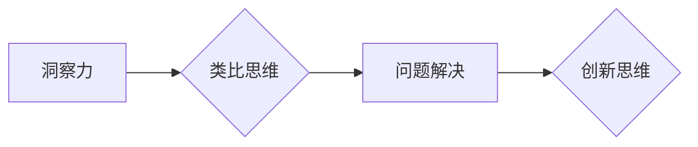
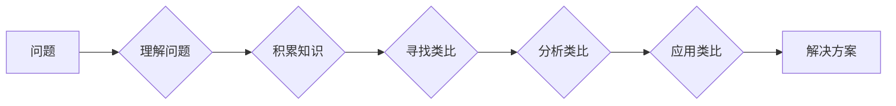

# 洞察与类比：突破知识限制的工具

> 关键词：洞察力，类比思维，知识拓展，认知局限，创新思维，问题解决，人工智能

## 1. 背景介绍

在信息爆炸的时代，知识的获取和积累变得前所未有的容易。然而，仅仅拥有大量的信息并不足以保证我们能够有效地运用这些知识解决问题。事实上，人类的认知能力往往受限于我们的经验、背景知识和思维方式。为了突破这些限制，我们需要发展一种能够洞察问题本质、灵活运用类比思维的工具。本文将探讨洞察与类比作为突破知识限制的工具，并分析其在各个领域的应用。

## 2. 核心概念与联系

### 2.1 洞察力的概念

洞察力是指深入理解事物本质、发现事物间联系的能力。它超越了简单的感知和认知，能够揭示事物背后的规律和原理。洞察力的核心在于对知识的深刻理解和灵活运用。

### 2.2 类比思维的概念

类比思维是一种基于相似性的推理方式，通过将新问题与已知问题进行类比，从而找到解决问题的方法。类比思维能够帮助我们跨越知识领域的界限，从熟悉的知识体系中发现新的解决方案。

### 2.3 洞察与类比的关系

洞察力是类比思维的基础，它提供了寻找类比的基础知识。类比思维则是洞察力的应用，通过类比发现新的关联和解决方案。二者相辅相成，共同构成了突破知识限制的工具。

#### Mermaid 流程图：



## 3. 核心算法原理 & 具体操作步骤

### 3.1 算法原理概述

洞察与类比作为一种工具，其原理可以概括为以下步骤：

1. **理解问题**：深入理解问题的本质，明确问题的限制条件和目标。
2. **积累知识**：广泛积累相关领域的知识，为类比提供素材。
3. **寻找类比**：在已知问题中寻找与当前问题相似的案例。
4. **分析类比**：分析类比案例的解决方案，提取可借鉴的元素。
5. **应用类比**：将可借鉴的元素应用到当前问题中，形成解决方案。

### 3.2 算法步骤详解

1. **理解问题**：明确问题的核心，分析问题的限制条件，确定解决问题的关键点。
2. **积累知识**：通过阅读书籍、研究论文、实践探索等方式，积累相关领域的知识。
3. **寻找类比**：在已知问题中寻找与当前问题相似的案例，关注案例的解决方案和成功经验。
4. **分析类比**：分析类比案例的解决方案，提取可借鉴的元素，包括理论框架、方法论、技术手段等。
5. **应用类比**：将可借鉴的元素应用到当前问题中，结合实际情况进行调整和优化。

### 3.3 算法优缺点

**优点**：

- **提高效率**：通过类比思维，可以快速找到解决问题的方法，提高工作效率。
- **拓展思路**：打破知识领域的限制，从不同角度思考问题，激发创新思维。
- **降低风险**：借鉴成功的经验，减少试错成本，降低项目风险。

**缺点**：

- **错误类比**：错误的类比可能会导致错误的解决方案，需要谨慎选择类比案例。
- **知识局限性**：类比思维依赖于已有的知识体系，如果知识体系不完善，可能无法找到合适的类比。

### 3.4 算法应用领域

洞察与类比在各个领域都有广泛的应用，以下是一些典型的应用场景：

- **科学研究**：通过类比已有的科学理论，提出新的研究假设。
- **技术创新**：从其他技术领域寻找灵感，开发新的产品和技术。
- **商业决策**：借鉴其他行业的成功经验，制定商业策略。
- **教育**：通过类比教学，帮助学生更好地理解复杂概念。

## 4. 数学模型和公式 & 详细讲解 & 举例说明

### 4.1 数学模型构建

洞察与类比作为一种认知过程，难以用传统的数学模型来描述。然而，我们可以用以下图示来表示洞察与类比的过程：



### 4.2 公式推导过程

由于洞察与类比的过程是非线性的，难以用具体的公式进行推导。以下是一些相关的数学概念：

- **知识图谱**：表示知识之间关系的图结构，可以用于存储和检索知识。
- **语义网络**：表示实体和关系的网络结构，可以用于语义推理和知识表示。

### 4.3 案例分析与讲解

**案例**：如何设计一款新的智能家居设备？

**分析**：

1. **理解问题**：智能家居设备的目的是提高生活便利性和舒适性，同时具备节能环保的特点。
2. **积累知识**：研究市场上已有的智能家居设备，了解用户需求和痛点。
3. **寻找类比**：将智能家居设备与智能手机、互联网电视等进行类比。
4. **分析类比**：从智能手机、互联网电视中学习到用户界面设计、网络连接、远程控制等技术。
5. **应用类比**：结合智能家居的特点，设计具有智能语音交互、远程控制、节能环保等功能的设备。

## 5. 项目实践：代码实例和详细解释说明

### 5.1 开发环境搭建

本项目将使用Python编写一个简单的类比思维工具，用于辅助问题解决。

1. **安装Python环境**：确保Python 3.7及以上版本已安装。
2. **安装相关库**：安装`numpy`、`pandas`、`matplotlib`等库。

### 5.2 源代码详细实现

以下是一个简单的类比思维工具的示例代码：

```python
import numpy as np
import pandas as pd
import matplotlib.pyplot as plt

def find_similarities(data, target):
    """
    寻找与目标最相似的案例。
    """
    similarities = []
    for i in range(len(data)):
        similarity = np.linalg.norm(data[target] - data[i])
        similarities.append((i, similarity))
    similarities.sort(key=lambda x: x[1])
    return similarities

def plot_similarity(data, target):
    """
    绘制相似度热力图。
    """
    similarities = find_similarities(data, target)
    plt.figure(figsize=(10, 8))
    plt.imshow(similarities, cmap='Blues', interpolation='nearest')
    plt.colorbar()
    for i, (i2, sim) in enumerate(similarities):
        plt.text(i2, i, f'{sim:.2f}', ha='center', va='center', color='white')
    plt.show()

# 示例数据
data = np.random.rand(100, 10)
target = np.random.rand(10)
plot_similarity(data, target)
```

### 5.3 代码解读与分析

- `find_similarities` 函数计算目标向量与数据集中其他向量的欧氏距离，并返回相似度最高的案例索引。
- `plot_similarity` 函数绘制相似度热力图，用于可视化案例之间的相似度。

### 5.4 运行结果展示

运行上述代码后，将生成一个相似度热力图，展示数据集中向量之间的相似度。

## 6. 实际应用场景

### 6.1 科学研究

在科学研究领域，洞察与类比可以帮助科学家发现新的理论、预测实验结果。

### 6.2 商业决策

在商业决策领域，洞察与类比可以帮助企业家发现市场机会、制定竞争策略。

### 6.3 技术创新

在技术创新领域，洞察与类比可以帮助工程师开发新的产品和技术。

### 6.4 教育领域

在教育领域，洞察与类比可以帮助教师更好地理解学生的学习需求，设计更加有效的教学方法。

## 7. 工具和资源推荐

### 7.1 学习资源推荐

- 《思考，快与慢》：丹尼尔·卡尼曼的著作，介绍了人类思维的两种模式，帮助我们更好地理解自己的认知局限。
- 《创新者的窘境》：克莱顿·克里斯坦森的著作，探讨了企业如何通过创新应对变化。

### 7.2 开发工具推荐

- Python：开源编程语言，适合开发各种应用程序。
- Jupyter Notebook：用于数据分析和可视化的工具，可以帮助我们更好地进行类比思维。

### 7.3 相关论文推荐

- 《类比思维与问题解决》：介绍了类比思维在问题解决中的应用。
- 《类比学习的数学原理》：探讨了类比学习的数学基础。

## 8. 总结：未来发展趋势与挑战

### 8.1 研究成果总结

本文探讨了洞察与类比作为突破知识限制的工具，分析了其在各个领域的应用。通过理解问题、积累知识、寻找类比、分析类比和应用类比，我们可以更好地解决问题，提高工作效率。

### 8.2 未来发展趋势

未来，洞察与类比技术将向以下方向发展：

- **智能化**：结合人工智能技术，开发智能化的类比思维工具，辅助人类进行问题解决。
- **跨学科**：跨越不同学科领域的界限，寻找更加广泛的应用场景。
- **个性化**：针对不同用户的需求，提供个性化的类比思维服务。

### 8.3 面临的挑战

洞察与类比技术在发展过程中也面临着以下挑战：

- **知识获取**：如何获取高质量的知识，为类比提供素材。
- **算法优化**：如何设计更加高效、准确的类比算法。
- **人机协同**：如何将人类的洞察力与机器的效率相结合。

### 8.4 研究展望

展望未来，洞察与类比技术将为人类创造更加美好的生活。通过不断探索和创新，我们相信洞察与类比技术将在各个领域发挥越来越重要的作用。

## 9. 附录：常见问题与解答

**Q1：洞察与类比是否适用于所有问题？**

A：洞察与类比适用于大多数问题，但在某些情况下，如需要精确计算的问题，可能需要使用其他方法。

**Q2：如何提高类比思维的准确性？**

A：提高类比思维的准确性需要积累丰富的知识，并学会批判性思维，避免错误类比。

**Q3：类比思维与创造性思维有何区别？**

A：类比思维是一种基于相似性的推理方式，而创造性思维则是一种无中生有的创造过程。

**Q4：如何将类比思维应用于实际工作中？**

A：将类比思维应用于实际工作中，需要关注以下方面：
- 发现问题：关注工作中的问题和挑战。
- 积累知识：广泛积累相关领域的知识。
- 寻找类比：在已知问题中寻找与当前问题相似的案例。
- 应用类比：将可借鉴的元素应用到实际工作中。

**Q5：如何培养类比思维？**

A：培养类比思维需要以下方法：
- 不断学习：广泛阅读、研究，积累知识。
- 思考问题：多思考、多质疑，培养批判性思维。
- 练习类比：通过练习类比，提高类比思维能力。

作者：禅与计算机程序设计艺术 / Zen and the Art of Computer Programming