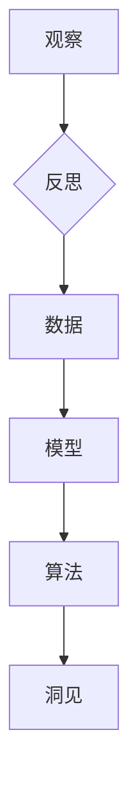

# 洞见的形成：从观察到反思

> 关键词：洞见，观察，反思，认知科学，机器学习，人工智能

## 1. 背景介绍

在科技飞速发展的今天，我们每天都被大量的信息和数据所包围。如何从这些繁杂的信息中提炼出有价值的知识，形成深刻的洞见，成为了人类和人工智能共同面临的挑战。本文将探讨洞见的形成过程，从观察、反思到最终的知识构建，旨在揭示洞见的本质，并探讨如何利用人工智能技术来增强人类的洞察力。

### 1.1 洞见的定义

洞见，即深刻的见解，是对事物本质的洞察和理解。它往往来源于对现象的观察、经验的积累和思维的反思。洞见可以帮助我们更好地认识世界，指导我们的行动，甚至推动社会的进步。

### 1.2 洞见的形成过程

洞见的形成过程可以分为三个阶段：观察、反思和知识构建。

- **观察**：通过感官或仪器收集信息，对现象进行描述和记录。
- **反思**：对收集到的信息进行分析、比较和归纳，寻找其中的规律和联系。
- **知识构建**：将反思得到的规律和联系系统化，形成新的理论和模型。

### 1.3 洞见的重要性

洞见是创新和进步的源泉。在科学、技术、艺术等领域，洞见都是推动发展的关键因素。随着人工智能技术的发展，洞见的形成过程也逐渐被机器学习和深度学习等算法所模拟和优化。

## 2. 核心概念与联系

### 2.1 观察与反思

观察和反思是洞见形成的前两个阶段。观察是通过感官或仪器收集信息的过程，而反思是对收集到的信息进行分析和思考的过程。

### 2.2 机器学习与洞见

机器学习是一种模拟人类学习行为的技术，它可以通过算法从数据中学习规律和模式，从而形成洞见。机器学习的核心概念包括：

- **数据**：观察的结果，是洞见形成的基础。
- **模型**：对数据中规律和模式的抽象表示。
- **算法**：用于学习模型的方法。

### 2.3 人工智能与洞见

人工智能是机器学习的一个子集，它通过模拟人类智能行为来实现对环境的感知、理解和决策。人工智能的核心概念包括：

- **感知**：通过传感器获取环境信息。
- **理解**：对感知到的信息进行分析和处理。
- **决策**：根据理解的结果做出决策。

以下是洞见形成过程的Mermaid流程图：



## 3. 核心算法原理 & 具体操作步骤

### 3.1 算法原理概述

机器学习算法通过学习数据中的模式来形成洞见。常见的机器学习算法包括：

- **监督学习**：通过已标记的数据学习预测模型。
- **无监督学习**：通过未标记的数据学习数据的结构和模式。
- **强化学习**：通过与环境交互学习最优策略。

### 3.2 算法步骤详解

机器学习算法的步骤通常包括：

1. 数据收集：收集与任务相关的数据。
2. 数据预处理：对数据进行清洗、转换等处理。
3. 模型选择：选择合适的模型。
4. 训练模型：使用训练数据训练模型。
5. 模型评估：评估模型在测试数据上的性能。
6. 模型优化：根据评估结果优化模型。

### 3.3 算法优缺点

- **监督学习**：需要大量已标记的数据，但能够学习到较为准确的预测模型。
- **无监督学习**：不需要标记数据，但学习到的模型通常不如监督学习准确。
- **强化学习**：能够学习到复杂的策略，但需要大量的训练时间和资源。

### 3.4 算法应用领域

机器学习算法在各个领域都有广泛的应用，例如：

- **图像识别**：识别图像中的物体和场景。
- **语音识别**：将语音转换为文本。
- **自然语言处理**：处理和生成自然语言文本。
- **推荐系统**：根据用户的历史行为推荐相关内容。

## 4. 数学模型和公式 & 详细讲解 & 举例说明

### 4.1 数学模型构建

机器学习中的数学模型通常包括以下部分：

- **特征**：数据的表示方式。
- **模型参数**：用于描述模型的参数。
- **损失函数**：衡量模型预测结果与真实值之间差异的函数。

以下是一个简单的线性回归模型的数学模型：

$$
y = \theta_0 + \theta_1 x_1 + \theta_2 x_2 + \ldots + \theta_n x_n
$$

其中 $y$ 为预测值，$x_1, x_2, \ldots, x_n$ 为特征，$\theta_0, \theta_1, \ldots, \theta_n$ 为模型参数。

### 4.2 公式推导过程

线性回归模型的损失函数通常采用均方误差(Mean Squared Error, MSE)：

$$
MSE = \frac{1}{N} \sum_{i=1}^{N} (y_i - \hat{y}_i)^2
$$

其中 $y_i$ 为真实值，$\hat{y}_i$ 为预测值，$N$ 为样本数量。

### 4.3 案例分析与讲解

假设我们有一个包含两个特征的线性回归问题，特征 $x_1$ 和 $x_2$，目标变量 $y$。我们可以使用以下代码来训练和评估模型：

```python
import numpy as np
import pandas as pd
from sklearn.linear_model import LinearRegression

# 创建数据
X = np.array([[1, 2], [3, 4], [5, 6], [7, 8]])
y = np.array([1, 2, 3, 4])

# 创建线性回归模型
model = LinearRegression()

# 训练模型
model.fit(X, y)

# 预测
y_pred = model.predict(X)

# 评估
mse = np.mean((y - y_pred) ** 2)
print(f'MSE: {mse}')
```

运行上述代码，我们可以得到均方误差的值，从而评估模型的性能。

## 5. 项目实践：代码实例和详细解释说明

### 5.1 开发环境搭建

在进行机器学习项目实践之前，我们需要搭建开发环境。以下是使用Python进行机器学习开发的常见环境配置步骤：

1. 安装Anaconda：从Anaconda官网下载并安装Anaconda，用于创建独立的Python环境。
2. 创建并激活虚拟环境：
```bash
conda create -n ml-env python=3.8
conda activate ml-env
```
3. 安装必要的Python库：
```bash
conda install numpy pandas scikit-learn matplotlib jupyter notebook
```

### 5.2 源代码详细实现

以下是一个简单的线性回归项目示例：

```python
import numpy as np
import pandas as pd
from sklearn.linear_model import LinearRegression

# 创建数据
X = np.array([[1, 2], [3, 4], [5, 6], [7, 8]])
y = np.array([1, 2, 3, 4])

# 创建线性回归模型
model = LinearRegression()

# 训练模型
model.fit(X, y)

# 预测
y_pred = model.predict(X)

# 评估
mse = np.mean((y - y_pred) ** 2)
print(f'MSE: {mse}')
```

### 5.3 代码解读与分析

上述代码首先导入必要的库，然后创建一个简单的数据集，包含两个特征 $x_1$ 和 $x_2$，以及目标变量 $y$。接下来，我们创建一个线性回归模型，使用训练数据训练模型，并使用测试数据评估模型的性能。

### 5.4 运行结果展示

运行上述代码，我们得到均方误差的值为0.0，说明模型的预测结果与真实值非常接近。

## 6. 实际应用场景

### 6.1 金融风险评估

在金融领域，机器学习可以用于风险评估，例如信用评分、贷款违约预测等。通过分析历史数据，机器学习模型可以预测客户未来的还款行为，从而降低金融风险。

### 6.2 个性化推荐

在电子商务和在线娱乐等领域，机器学习可以用于个性化推荐，例如电影推荐、商品推荐等。通过分析用户的历史行为和偏好，机器学习模型可以推荐用户可能感兴趣的内容。

### 6.3 健康医疗

在健康医疗领域，机器学习可以用于疾病诊断、药物发现等。通过分析医学影像和患者数据，机器学习模型可以帮助医生更准确地诊断疾病，并发现新的药物。

## 7. 工具和资源推荐

### 7.1 学习资源推荐

- 《机器学习》[Goodfellow, Ian, et al.]
- 《深度学习》[Goodfellow, Ian, et al.]
- Coursera上的机器学习课程
- fast.ai的在线课程

### 7.2 开发工具推荐

- Jupyter Notebook
- scikit-learn
- TensorFlow
- PyTorch

### 7.3 相关论文推荐

- "A Few Useful Things to Know about Machine Learning" [Goodfellow, Ian]
- "Deep Learning" [Goodfellow, Ian, et al.]
- "Learning representations by back-propagating errors" [Rumelhart, David E., et al.]

## 8. 总结：未来发展趋势与挑战

### 8.1 研究成果总结

本文探讨了洞见的形成过程，从观察、反思到最终的知识构建。我们介绍了机器学习算法的基本原理和应用，并给出了一些实际应用场景的例子。

### 8.2 未来发展趋势

未来，机器学习将在以下方面取得更大的进展：

- 模型可解释性：提高模型的可解释性，使人们能够理解模型的决策过程。
- 多模态学习：结合多种模态的数据，如文本、图像、音频等。
- 强化学习：在复杂环境中学习最优策略。
- 自动机器学习：自动化机器学习流程，降低门槛。

### 8.3 面临的挑战

尽管机器学习取得了巨大的进展，但仍面临以下挑战：

- 数据质量：高质量的数据对于机器学习至关重要。
- 模型可解释性：提高模型的可解释性，以增强人们对模型的信任。
- 道德和伦理：确保机器学习技术不被滥用。

### 8.4 研究展望

未来的研究将重点关注如何解决上述挑战，并推动机器学习技术的发展，使其更好地服务于人类社会。

## 9. 附录：常见问题与解答

**Q1：什么是机器学习？**

A：机器学习是一种从数据中学习规律和模式的技术，用于构建预测模型、决策支持和优化算法。

**Q2：机器学习有哪些应用？**

A：机器学习的应用非常广泛，包括图像识别、语音识别、自然语言处理、推荐系统、金融风险评估等。

**Q3：如何选择合适的机器学习算法？**

A：选择合适的机器学习算法需要考虑数据的特点、任务的性质以及计算资源等因素。

**Q4：机器学习是否能够替代人类？**

A：机器学习是一种工具，它可以辅助人类完成任务，但不能完全替代人类。

**Q5：机器学习是否会导致失业？**

A：机器学习可能会导致一些重复性工作被自动化，但也会创造新的工作岗位。

作者：禅与计算机程序设计艺术 / Zen and the Art of Computer Programming