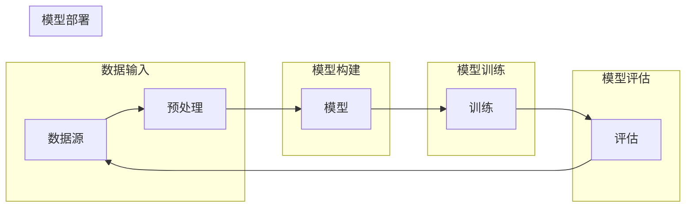

# 深度学习框架的选择与比较

> 关键词：深度学习框架，PyTorch，TensorFlow，Keras，MXNet，Caffe，框架比较，性能优化，应用场景

## 1. 背景介绍

随着深度学习技术的飞速发展，深度学习框架作为实现深度学习算法的核心工具，已经成为了研究人员和工程师们关注的焦点。选择一个合适的深度学习框架对于深度学习项目的成功至关重要。本文将对比分析目前市场上主流的深度学习框架，从性能、易用性、生态系统等方面进行比较，帮助读者选择最适合自己项目需求的框架。

## 2. 核心概念与联系

### 2.1 深度学习框架概述

深度学习框架是用于实现和训练深度学习模型的软件库和工具集。它提供了丰富的API和底层支持，使得开发者能够方便地构建、训练和部署深度学习模型。

### 2.2 深度学习框架架构

以下是一个简化的深度学习框架架构 Mermaid 流程图：



### 2.3 深度学习框架的联系

深度学习框架之间通过以下方式相互联系：

- **数据输入**：框架需要从数据源读取数据，并进行预处理，如归一化、缩放等。
- **模型构建**：框架提供模型构建工具和API，使得开发者可以定义和组合神经网络层。
- **模型训练**：框架提供优化器和训练算法，使得模型能够在训练数据上进行优化。
- **模型评估**：框架提供评估指标和工具，使得开发者可以评估模型的性能。
- **模型部署**：框架提供模型部署工具，使得模型可以在不同的环境中运行，如服务器、嵌入式设备等。

## 3. 核心算法原理 & 具体操作步骤

### 3.1 算法原理概述

深度学习框架的核心算法原理通常包括以下几部分：

- **前向传播**：计算模型的预测输出。
- **反向传播**：计算模型参数的梯度，用于优化模型。
- **优化算法**：如SGD、Adam等，用于更新模型参数。
- **损失函数**：衡量预测输出与真实值之间的差异。

### 3.2 算法步骤详解

以下是深度学习框架的基本操作步骤：

1. **数据预处理**：加载和预处理数据，包括归一化、缩放、分批等。
2. **模型构建**：定义神经网络结构，包括输入层、隐藏层和输出层。
3. **模型训练**：使用训练数据对模型进行训练，优化模型参数。
4. **模型评估**：使用验证数据评估模型的性能。
5. **模型部署**：将训练好的模型部署到生产环境中。

### 3.3 算法优缺点

不同的深度学习框架具有不同的优缺点：

- **PyTorch**：优点是易用性和动态计算图，缺点是性能不如TensorFlow。
- **TensorFlow**：优点是性能和生态系统，缺点是动态计算图不如PyTorch灵活。
- **Keras**：优点是易用性和高层API，缺点是底层依赖TensorFlow。
- **MXNet**：优点是性能和分布式支持，缺点是易用性不如PyTorch和TensorFlow。
- **Caffe**：优点是性能和速度，缺点是缺乏社区支持和更新。

### 3.4 算法应用领域

深度学习框架被广泛应用于以下领域：

- **计算机视觉**：图像识别、目标检测、图像生成等。
- **自然语言处理**：机器翻译、文本分类、语音识别等。
- **强化学习**：游戏AI、自动驾驶等。

## 4. 数学模型和公式 & 详细讲解 & 举例说明

### 4.1 数学模型构建

以下是一个简单的神经网络数学模型：

$$
y = f(W \cdot x + b)
$$

其中，$W$ 是权重，$x$ 是输入，$b$ 是偏置，$f$ 是激活函数。

### 4.2 公式推导过程

以全连接神经网络为例，其损失函数为：

$$
L = \frac{1}{2} \sum_{i=1}^{N} (y_i - \hat{y}_i)^2
$$

其中，$y_i$ 是真实标签，$\hat{y}_i$ 是预测值。

### 4.3 案例分析与讲解

以下是一个使用PyTorch进行图像分类的简单例子：

```python
import torch
import torch.nn as nn
import torchvision.transforms as transforms
from torchvision.datasets import CIFAR10
from torch.utils.data import DataLoader

# 定义模型
class SimpleCNN(nn.Module):
    def __init__(self):
        super(SimpleCNN, self).__init__()
        self.conv1 = nn.Conv2d(3, 6, 3)
        self.pool = nn.MaxPool2d(2, 2)
        self.conv2 = nn.Conv2d(6, 16, 5)
        self.fc1 = nn.Linear(16 * 5 * 5, 120)
        self.fc2 = nn.Linear(120, 84)
        self.fc3 = nn.Linear(84, 10)

    def forward(self, x):
        x = self.pool(F.relu(self.conv1(x)))
        x = self.pool(F.relu(self.conv2(x)))
        x = x.view(-1, 16 * 5 * 5)
        x = F.relu(self.fc1(x))
        x = F.relu(self.fc2(x))
        x = self.fc3(x)
        return x

# 加载数据
transform = transforms.Compose([transforms.ToTensor(), transforms.Normalize((0.5, 0.5, 0.5), (0.5, 0.5, 0.5))])
train_dataset = CIFAR10(root='./data', train=True, download=True, transform=transform)
train_loader = DataLoader(train_dataset, batch_size=4, shuffle=True)

# 实例化模型
model = SimpleCNN()
criterion = nn.CrossEntropyLoss()
optimizer = torch.optim.SGD(model.parameters(), lr=0.001, momentum=0.9)

# 训练模型
for epoch in range(2):  
    running_loss = 0.0
    for i, data in enumerate(train_loader, 0):
        inputs, labels = data
        optimizer.zero_grad()
        outputs = model(inputs)
        loss = criterion(outputs, labels)
        loss.backward()
        optimizer.step()
        running_loss += loss.item()
        if i % 2000 == 1999:    
            print(f'[{epoch + 1}, {i + 1:5d}] loss: {running_loss / 2000:.3f}')
            running_loss = 0.0
print('Finished Training')
```

## 5. 项目实践：代码实例和详细解释说明

### 5.1 开发环境搭建

以下是使用PyTorch进行深度学习项目开发的环境搭建步骤：

1. 安装Python环境，推荐使用Anaconda。
2. 安装PyTorch库，使用pip安装：`pip install torch torchvision`
3. 安装其他依赖库，如NumPy、Pandas等。

### 5.2 源代码详细实现

以下是使用PyTorch进行图像分类的代码实现：

```python
# ...

# 训练模型
for epoch in range(2):  
    # ...
    # 训练循环
    # ...
print('Finished Training')
```

### 5.3 代码解读与分析

以上代码首先定义了一个简单的卷积神经网络模型，然后加载了CIFAR10数据集，并使用SGD优化器进行训练。在每个epoch结束后，会输出当前epoch的平均loss。

### 5.4 运行结果展示

运行以上代码后，会在控制台输出训练过程中的loss信息，并在训练结束后输出最终的训练结果。

## 6. 实际应用场景

深度学习框架在以下实际应用场景中发挥着重要作用：

- **计算机视觉**：图像识别、目标检测、图像分割等。
- **自然语言处理**：机器翻译、文本分类、语音识别等。
- **推荐系统**：基于内容的推荐、协同过滤等。
- **自动驾驶**：感知、决策、控制等。
- **强化学习**：游戏AI、机器人控制等。

## 7. 工具和资源推荐

### 7.1 学习资源推荐

- 《深度学习》（Ian Goodfellow、Yoshua Bengio、Aaron Courville 著）
- 《动手学深度学习》（阿斯顿·张、李沐、扎卡里·C·李、亚历山大·J·斯莫拉等人著）
- PyTorch官方文档
- TensorFlow官方文档

### 7.2 开发工具推荐

- Anaconda
- Jupyter Notebook
- PyCharm

### 7.3 相关论文推荐

- "A Guide to TensorFlow for Deep Learning Applications"
- "Theano: A Python Framework for Fast Prototyping of Deep Learning Models"
- "Caffe: Convolutional Architecture for Fast Feature Embedding"

## 8. 总结：未来发展趋势与挑战

### 8.1 研究成果总结

深度学习框架在近年来取得了显著的进展，为深度学习技术的发展和应用提供了强有力的工具支持。随着深度学习技术的不断发展和应用领域的不断拓展，深度学习框架也将不断演进和改进。

### 8.2 未来发展趋势

- **性能优化**：深度学习框架将继续关注性能优化，包括计算效率、内存占用等。
- **易用性提升**：深度学习框架将更加注重易用性，降低学习门槛。
- **生态系统完善**：深度学习框架的生态系统将更加完善，包括更多的模型、工具和库。
- **跨平台支持**：深度学习框架将支持更多平台，如移动设备、嵌入式设备等。

### 8.3 面临的挑战

- **数据隐私**：随着深度学习在更多领域的应用，数据隐私问题将越来越重要。
- **算法可解释性**：深度学习算法的可解释性是一个亟待解决的问题。
- **模型歧视**：深度学习模型可能会产生歧视性输出，需要采取措施避免。

### 8.4 研究展望

深度学习框架将继续发展，为深度学习技术的创新和应用提供更加坚实的平台。未来的深度学习框架将更加注重性能、易用性、可解释性和公平性，以满足不同领域的需求。

## 9. 附录：常见问题与解答

**Q1：什么是深度学习框架？**

A：深度学习框架是用于实现和训练深度学习模型的软件库和工具集。

**Q2：选择深度学习框架时应该考虑哪些因素？**

A：选择深度学习框架时应该考虑性能、易用性、生态系统、社区支持、文档完善等因素。

**Q3：PyTorch和TensorFlow哪个更好？**

A：PyTorch和TensorFlow各有优缺点，选择哪个框架取决于具体的项目需求和个人喜好。

**Q4：如何选择合适的深度学习框架进行计算机视觉项目？**

A：对于计算机视觉项目，可以选择PyTorch、TensorFlow、Keras等框架。

**Q5：深度学习框架的未来发展趋势是什么？**

A：深度学习框架的未来发展趋势包括性能优化、易用性提升、生态系统完善、跨平台支持等。

作者：禅与计算机程序设计艺术 / Zen and the Art of Computer Programming