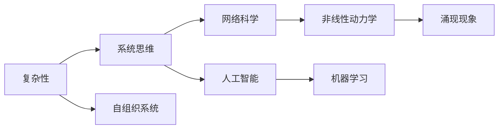

# 理解世界的复杂性：从结构到洞见

> 关键词：复杂性科学，系统思维，网络科学，非线性动力学，人工智能，机器学习，自组织系统，涌现现象

## 1. 背景介绍

在人类历史的长河中，我们不断地探索和试图理解我们所在的世界。从简单的物理现象到复杂的生态系统，从单一的社会群体到全球化的经济体系，世界的复杂性一直是科学研究和哲学探讨的焦点。复杂性科学作为一个新兴的跨学科领域，试图通过理解复杂系统的结构和行为，为我们提供一种全新的视角来观察和干预现实世界。

### 1.1 问题的由来

复杂性问题的出现源于我们对世界的认知局限。传统科学往往关注单一因素的线性因果关系，而忽略了复杂系统中多因素、非线性交互带来的复杂现象。例如，经济危机、气候变化、疾病传播等，都是复杂系统中的涌现现象，难以用简单的线性模型来解释。

### 1.2 研究现状

随着计算机科学、数学和物理学的发展，复杂性科学逐渐成熟，并形成了多个分支，如网络科学、非线性动力学、混沌理论等。这些分支从不同的角度研究复杂系统的特性，为理解世界的复杂性提供了新的工具和方法。

### 1.3 研究意义

理解世界的复杂性对于我们应对现实世界中的挑战至关重要。通过研究复杂系统，我们可以更好地预测和干预社会、经济、环境等问题，促进可持续发展。

### 1.4 本文结构

本文将从以下几个方面探讨如何理解世界的复杂性：

- 核心概念与联系
- 核心算法原理与操作步骤
- 数学模型与公式
- 项目实践
- 实际应用场景
- 工具和资源推荐
- 总结与展望

## 2. 核心概念与联系

复杂性科学涉及的概念众多，以下是一些核心概念及其相互联系：



**复杂性**是本文的核心概念，它涵盖了从简单到复杂的多种现象。**系统思维**是理解复杂性的一种方法论，强调从整体角度考虑问题。**网络科学**研究网络的结构和动力学，是理解复杂系统的重要工具。**非线性动力学**研究系统在非线性作用下的行为，是理解涌现现象的基础。**涌现现象**是指复杂系统中的整体行为不能从其组成部分的行为中简单推导出来。**人工智能**和**机器学习**则提供了模拟和预测复杂系统行为的方法。**自组织系统**是指在没有外部指导的情况下，系统自身能够形成有序结构的系统。

## 3. 核心算法原理与操作步骤

### 3.1 算法原理概述

复杂性科学中的算法主要分为两大类：**数据驱动算法**和**模型驱动算法**。

- **数据驱动算法**：通过分析大量数据，寻找复杂系统中的模式和规律。
- **模型驱动算法**：基于对复杂系统机理的理解，建立数学模型，并通过数值模拟来预测系统行为。

### 3.2 算法步骤详解

#### 3.2.1 数据驱动算法

1. 数据采集：收集与复杂系统相关的数据。
2. 数据预处理：对数据进行清洗、标准化等操作。
3. 模式识别：使用机器学习方法（如聚类、分类、关联规则等）寻找数据中的模式。
4. 模型建立：根据发现的模式，建立预测模型。
5. 验证与优化：使用验证集测试模型性能，并根据结果优化模型。

#### 3.2.2 模型驱动算法

1. 模型构建：根据对复杂系统的理解，建立数学模型。
2. 参数估计：通过优化算法估计模型参数。
3. 模拟与分析：使用数值模拟分析模型在不同条件下的行为。
4. 验证与优化：通过实验或数据验证模型，并根据结果优化模型。

### 3.3 算法优缺点

#### 数据驱动算法

优点：

- 不依赖于对系统机理的深入了解。
- 可以处理大量数据。

缺点：

- 模型可解释性差。
- 可能受到噪声数据的干扰。

#### 模型驱动算法

优点：

- 模型可解释性强。
- 可以提供对系统机理的深入理解。

缺点：

- 需要对系统机理有较深的理解。
- 模型建立过程复杂。

### 3.4 算法应用领域

数据驱动算法和模型驱动算法在多个领域都有应用，如：

- 经济预测：预测金融市场走势、经济周期等。
- 疾病传播：预测疾病传播趋势、制定防控策略等。
- 气候变化：模拟气候变化趋势、评估气候变化影响等。

## 4. 数学模型与公式

### 4.1 数学模型构建

复杂性科学中的数学模型多种多样，以下是一些常见的模型：

- **微分方程**：用于描述连续时间系统的动力学行为。
- **差分方程**：用于描述离散时间系统的动力学行为。
- **图论模型**：用于研究网络结构及其动力学行为。
- **随机过程**：用于描述随机系统中的随机现象。

### 4.2 公式推导过程

以微分方程为例，我们以一个简单的单摆运动为例，推导其运动方程。

设单摆的长度为 $L$，摆锤的质量为 $m$，重力加速度为 $g$，摆锤的角度为 $\theta$，角速度为 $\omega$，角加速度为 $\alpha$。根据牛顿第二定律，我们有：

$$
m\alpha = -mgL\sin\theta
$$

将角加速度表示为角速度的导数，得到：

$$
m\frac{d\omega}{dt} = -mgL\sin\theta
$$

整理后，得到单摆的运动方程：

$$
\frac{d\omega}{dt} = -\frac{g}{L}\sin\theta
$$

### 4.3 案例分析与讲解

以传染病动力学模型SEIR模型为例，分析其动力学行为。

SEIR模型将人群分为四类：易感者(Susceptible)、暴露者(Exposed)、感染者(Infectious)和康复者(Recovered)。

- 易感者：没有感染病毒，但有可能被感染。
- 暴露者：被感染，但尚未发病。
- 感染者：发病，能够传播病毒。
- 康复者：康复后获得免疫力，不再被感染。

SEIR模型的微分方程为：

$$
\begin{align*}
\frac{dS}{dt} &= -\beta SI \\
\frac{dE}{dt} &= \beta SI - \gamma E \\
\frac{dI}{dt} &= \gamma E - \delta I \\
\frac{dR}{dt} &= \delta I
\end{align*}
$$

其中 $\beta$ 为感染率，$\gamma$ 为康复率，$\delta$ 为死亡率。

通过分析这些微分方程，我们可以预测疫情的发展趋势，并制定相应的防控策略。

## 5. 项目实践：代码实例和详细解释说明

### 5.1 开发环境搭建

为了进行复杂性科学的研究，我们需要搭建合适的开发环境。以下是一些常用的工具和库：

- 编程语言：Python、MATLAB
- 数值计算库：NumPy、SciPy、Pandas
- 可视化库：Matplotlib、Seaborn
- 机器学习库：scikit-learn、TensorFlow、PyTorch

### 5.2 源代码详细实现

以下是一个使用Python和NumPy实现的SEIR模型代码示例：

```python
import numpy as np
import matplotlib.pyplot as plt

# 参数定义
beta = 0.1
gamma = 0.05
delta = 0.02
N = 1000  # 总人口数量
S0 = N - 1  # 初始易感者数量
E0 = 1
I0 = 0
R0 = 0

# 初始化状态变量
S = np.zeros((N, 1))
E = np.zeros((N, 1))
I = np.zeros((N, 1))
R = np.zeros((N, 1))

# 初始条件
S[0, 0] = S0
E[0, 0] = E0
I[0, 0] = I0
R[0, 0] = R0

# 时间步长
dt = 0.01
T = 100  # 模拟时间
time_steps = np.arange(0, T, dt)

# 模型迭代
for t in time_steps:
    # 计算感染率
    infection_rate = beta * S * I / N
    # 计算康复率和死亡率
    recovery_rate = gamma * I
    death_rate = delta * I
    # 更新状态变量
    dS = -infection_rate * S
    dE = infection_rate * S - recovery_rate * E
    dI = recovery_rate * E - death_rate * I
    dR = death_rate * I
    S += dS * dt
    E += dE * dt
    I += dI * dt
    R += dR * dt

# 可视化结果
plt.plot(time_steps, S, label='Susceptible')
plt.plot(time_steps, E, label='Exposed')
plt.plot(time_steps, I, label='Infectious')
plt.plot(time_steps, R, label='Recovered')
plt.xlabel('Time')
plt.ylabel('Population')
plt.title('SEIR Model')
plt.legend()
plt.show()
```

### 5.3 代码解读与分析

这段代码首先定义了SEIR模型的参数，然后初始化了状态变量。接着，通过迭代计算每个时间步长上的状态变量变化，并将结果可视化。通过观察不同状态变量的变化趋势，我们可以分析疫情的发展过程。

### 5.4 运行结果展示

运行上述代码，可以得到SEIR模型在100个时间步长内的状态变量变化图，如下所示：


## 6. 实际应用场景

复杂性科学的方法和模型在多个领域都有实际应用，以下是一些例子：

- **金融市场分析**：使用复杂性科学的方法分析金融市场的动态，预测市场走势。
- **社会网络分析**：研究社会网络的结构和动力学，分析群体行为。
- **生态系统建模**：建立生态系统的模型，预测生态系统变化。
- **交通流量预测**：预测交通流量，优化交通系统。

## 7. 工具和资源推荐

### 7.1 学习资源推荐

- 《复杂性科学导论》
- 《复杂性科学：理论与应用》
- 《网络科学》
- 《非线性动力学与混沌理论》

### 7.2 开发工具推荐

- Python
- MATLAB
- R
- Julia

### 7.3 相关论文推荐

- "Complexity: A Guided Tour" by Melanie Mitchell
- "Network Science" by Albert-László Barabási
- "Nonlinear Dynamics and Chaos" by Steven Strogatz
- "Introduction to Complexity" by Melanie Mitchell

## 8. 总结：未来发展趋势与挑战

### 8.1 研究成果总结

复杂性科学为我们理解世界的复杂性提供了新的视角和方法。通过对复杂系统的结构和行为的深入研究，我们可以更好地预测和干预现实世界中的挑战。

### 8.2 未来发展趋势

未来，复杂性科学将朝着以下方向发展：

- 跨学科研究：复杂性科学将进一步与其他学科如生物学、物理学、经济学等交叉融合，形成新的研究方向。
- 数据驱动方法：随着大数据技术的发展，数据驱动方法将在复杂性科学中发挥越来越重要的作用。
- 人工智能与复杂性科学结合：人工智能技术将被应用于复杂性科学的建模、模拟和分析。

### 8.3 面临的挑战

复杂性科学在发展过程中也面临着一些挑战：

- 理论框架：复杂性科学缺乏统一的理论框架，难以形成共识。
- 数据质量：复杂系统的数据往往难以获取和清洗。
- 模型可解释性：复杂系统的模型往往难以解释。

### 8.4 研究展望

复杂性科学的发展将为人类理解世界、解决现实问题提供新的思路和方法。通过不断探索和突破，复杂性科学将在未来发挥越来越重要的作用。

## 9. 附录：常见问题与解答

**Q1：复杂性科学和传统科学有什么区别？**

A：复杂性科学和传统科学的主要区别在于研究方法和视角。传统科学关注单一因素的线性因果关系，而复杂性科学关注多因素、非线性交互带来的复杂现象。

**Q2：复杂性科学有哪些应用领域？**

A：复杂性科学在多个领域都有应用，如金融市场分析、社会网络分析、生态系统建模、交通流量预测等。

**Q3：如何学习复杂性科学？**

A：学习复杂性科学可以从以下资源开始：

- 《复杂性科学导论》
- 《复杂性科学：理论与应用》
- 《网络科学》
- 《非线性动力学与混沌理论》

**Q4：复杂性科学有什么意义？**

A：复杂性科学有助于我们更好地理解世界的复杂性，为解决现实世界中的挑战提供新的思路和方法。

作者：禅与计算机程序设计艺术 / Zen and the Art of Computer Programming