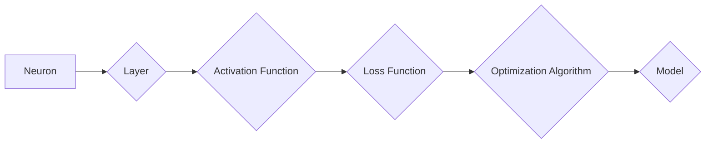

# 神经网络：人类智慧的延伸

> 关键词：神经网络，深度学习，人工智能，机器学习，神经网络架构，反向传播，优化算法

## 1. 背景介绍

人类智慧在过去的几千年里经历了长足的进步，从简单的工具使用到复杂的社会结构，再到现代科技的发展，人类不断地挑战着自己的认知极限。然而，随着信息时代的到来，数据量的激增和计算能力的提升，传统的算法和模型已经难以满足日益复杂的问题解决需求。于是，神经网络作为一种模拟人脑工作原理的计算模型，逐渐成为人工智能领域的研究热点，并被认为是人类智慧的延伸。

### 1.1 问题的由来

传统的计算模型，如逻辑回归、支持向量机等，虽然在某些领域取得了成功，但它们在处理复杂、非线性问题时的能力有限。此外，这些模型通常需要大量的人工特征工程，而特征工程往往依赖于领域专家的经验，难以适应快速变化的数据环境。

神经网络的提出，正是为了克服这些局限性。它通过模拟人脑神经元之间的连接和交互，实现了对复杂数据的自动特征提取和模式识别。

### 1.2 研究现状

自1986年深度学习的概念被提出以来，神经网络的研究取得了长足的进步。特别是近年来，随着大数据和计算能力的提升，深度学习在图像识别、自然语言处理、语音识别等领域取得了突破性的成果。

### 1.3 研究意义

神经网络的研究不仅对人工智能领域具有重要意义，也对人类社会产生了深远的影响。它能够帮助我们更好地理解人脑的工作原理，开发出更智能的机器，并推动科技的发展。

### 1.4 本文结构

本文将系统介绍神经网络的基本原理、核心算法、数学模型、应用实践以及未来发展趋势。具体内容安排如下：

- 第2部分，介绍神经网络的核心理念和架构。
- 第3部分，深入探讨神经网络的算法原理和操作步骤。
- 第4部分，阐述神经网络的数学模型和公式，并通过实例进行讲解。
- 第5部分，提供神经网络的代码实例和详细解释。
- 第6部分，分析神经网络的实际应用场景和未来应用展望。
- 第7部分，推荐相关学习资源、开发工具和论文。
- 第8部分，总结研究成果，展望未来发展趋势和挑战。
- 第9部分，附录常见问题与解答。

## 2. 核心概念与联系

神经网络的核心概念包括神经元、层、激活函数、损失函数、优化算法等。以下是一个简化的Mermaid流程图，展示了这些概念之间的关系：



### 2.1 神经元

神经元是神经网络的基本单元，它模拟了人脑神经元的工作方式。每个神经元接收来自前一层神经元的输入，通过激活函数处理后输出给下一层。

### 2.2 层

神经网络由多个层组成，包括输入层、隐藏层和输出层。输入层接收外部数据，隐藏层进行特征提取和变换，输出层生成最终的预测结果。

### 2.3 激活函数

激活函数为神经元引入非线性，使得神经网络能够学习复杂的非线性关系。常见的激活函数包括Sigmoid、ReLU、Tanh等。

### 2.4 损失函数

损失函数用于衡量模型预测结果与真实值之间的差异，常见的损失函数包括均方误差、交叉熵等。

### 2.5 优化算法

优化算法用于调整模型参数，以最小化损失函数。常见的优化算法包括梯度下降、Adam等。

这些核心概念相互联系，共同构成了神经网络的工作原理。

## 3. 核心算法原理 & 具体操作步骤

### 3.1 算法原理概述

神经网络的核心算法是反向传播（Backpropagation），它通过计算梯度来更新模型参数，从而最小化损失函数。

### 3.2 算法步骤详解

反向传播算法包括以下几个步骤：

1. 前向传播：将输入数据传递到神经网络中，计算每一层的输出。
2. 计算损失：计算损失函数的值，衡量预测结果与真实值之间的差异。
3. 反向传播：根据损失函数的梯度，反向计算每一层参数的梯度。
4. 更新参数：根据梯度更新模型参数，以减少损失函数的值。

### 3.3 算法优缺点

反向传播算法的优点是能够自动学习复杂的数据模式，并且可以应用于各种神经网络结构。

然而，反向传播算法也存在一些缺点，如收敛速度慢、对初始参数敏感等。

### 3.4 算法应用领域

反向传播算法可以应用于各种神经网络，包括全连接神经网络、卷积神经网络、循环神经网络等，在图像识别、自然语言处理、语音识别等领域取得了显著成果。

## 4. 数学模型和公式 & 详细讲解 & 举例说明

### 4.1 数学模型构建

神经网络的数学模型主要包括输入层、隐藏层和输出层。以下是一个简化的神经网络数学模型：

$$
y = f(W_n \cdot f(W_{n-1} \cdot f(... \cdot f(W_1 \cdot x + b_1) + ... + b_{n-1}) + ... + b_n))
$$

其中，$W_n$ 是第n层的权重矩阵，$b_n$ 是第n层的偏置向量，$f$ 是激活函数，$y$ 是输出。

### 4.2 公式推导过程

以下以一个简单的单层神经网络为例，推导其反向传播算法的步骤。

假设网络包含一个输入层和一个输出层，输入层有3个神经元，输出层有1个神经元。激活函数使用Sigmoid函数。

1. 前向传播：
$$
a_1 = x_1, a_2 = x_2, a_3 = x_3
$$
$$
z = \sigma(a_1 \cdot w_1 + b_1) = \frac{1}{1+e^{-(a_1 \cdot w_1 + b_1)}}
$$
$$
y = \sigma(z \cdot w_2 + b_2) = \frac{1}{1+e^{-(z \cdot w_2 + b_2)}}
$$

2. 计算损失：
假设使用均方误差作为损失函数，则：
$$
L = \frac{1}{2}(y - t)^2
$$
其中，$t$ 是真实标签。

3. 反向传播：
计算输出层梯度：
$$
\frac{\partial L}{\partial z} = y - t
$$
计算输入层梯度：
$$
\frac{\partial L}{\partial a_1} = \frac{\partial L}{\partial z} \cdot \frac{\partial z}{\partial a_1} = (y - t) \cdot \sigma'(a_1 \cdot w_1 + b_1)
$$
更新权重和偏置：
$$
w_2 \leftarrow w_2 - \eta \cdot (y - t) \cdot z
$$
$$
b_2 \leftarrow b_2 - \eta \cdot (y - t)
$$
$$
w_1 \leftarrow w_1 - \eta \cdot (y - t) \cdot \sigma'(a_1 \cdot w_1 + b_1) \cdot a_1
$$
$$
b_1 \leftarrow b_1 - \eta \cdot (y - t) \cdot \sigma'(a_1 \cdot w_1 + b_1)
$$

### 4.3 案例分析与讲解

以下使用Python代码实现上述神经网络的训练过程：

```python
import numpy as np

def sigmoid(z):
    return 1 / (1 + np.exp(-z))

def sigmoid_derivative(z):
    return sigmoid(z) * (1 - sigmoid(z))

# 初始化参数
x = np.array([[0.1, 0.2], [0.2, 0.3], [0.3, 0.4]])
y = np.array([[1], [1], [0]])
w1 = np.random.uniform(size=(3, 1))
b1 = np.random.uniform(size=(1, 1))
w2 = np.random.uniform(size=(1, 1))
b2 = np.random.uniform(size=(1, 1))
learning_rate = 0.1

# 训练过程
for epoch in range(1000):
    # 前向传播
    a1 = x
    z = np.dot(a1, w1) + b1
    y_pred = sigmoid(z)
    z2 = y_pred
    a2 = np.dot(z2, w2) + b2
    y_pred_final = sigmoid(a2)

    # 计算损失
    loss = 0.5 * np.sum((y - y_pred_final)**2)

    # 反向传播
    d_y_pred_final = y_pred_final - y
    d_a2 = d_y_pred_final * sigmoid_derivative(a2)
    d_w2 = np.dot(z2.T, d_a2)
    d_b2 = np.sum(d_a2, axis=0, keepdims=True)
    d_z2 = np.dot(d_a2, w2.T)
    d_y_pred = d_z2 * sigmoid_derivative(z2)
    d_w1 = np.dot(a1.T, d_y_pred)
    d_b1 = np.sum(d_y_pred, axis=0, keepdims=True)

    # 更新参数
    w2 -= learning_rate * d_w2
    b2 -= learning_rate * d_b2
    w1 -= learning_rate * d_w1
    b1 -= learning_rate * d_b1

    # 打印损失
    if epoch % 100 == 0:
        print(f"Epoch {epoch + 1}, Loss: {loss}")

print(f"Final weights: w1={w1}, b1={b1}, w2={w2}, b2={b2}")
```

这段代码演示了如何使用反向传播算法训练一个简单的神经网络，实现逻辑回归任务。

## 5. 项目实践：代码实例和详细解释说明

### 5.1 开发环境搭建

为了进行神经网络的项目实践，我们需要搭建以下开发环境：

- Python环境：安装Python 3.x版本。
- NumPy库：用于科学计算和矩阵运算。
- Matplotlib库：用于可视化数据。
- TensorFlow或PyTorch库：用于构建和训练神经网络。

### 5.2 源代码详细实现

以下使用PyTorch库实现一个简单的神经网络，用于对手写数字进行分类。

```python
import torch
import torch.nn as nn
import torch.optim as optim
from torchvision import datasets, transforms
from torch.utils.data import DataLoader

# 定义网络结构
class SimpleNN(nn.Module):
    def __init__(self):
        super(SimpleNN, self).__init__()
        self.fc1 = nn.Linear(28*28, 128)
        self.fc2 = nn.Linear(128, 64)
        self.fc3 = nn.Linear(64, 10)
        
    def forward(self, x):
        x = x.view(-1, 28*28)
        x = torch.relu(self.fc1(x))
        x = torch.relu(self.fc2(x))
        x = self.fc3(x)
        return x

# 加载数据
transform = transforms.Compose([transforms.ToTensor(), transforms.Normalize((0.5,), (0.5,))])
train_dataset = datasets.MNIST(root='./data', train=True, download=True, transform=transform)
train_loader = DataLoader(train_dataset, batch_size=64, shuffle=True)

# 初始化模型和优化器
model = SimpleNN()
optimizer = optim.Adam(model.parameters(), lr=0.001)
criterion = nn.CrossEntropyLoss()

# 训练模型
for epoch in range(10):
    for data, target in train_loader:
        optimizer.zero_grad()
        output = model(data)
        loss = criterion(output, target)
        loss.backward()
        optimizer.step()
    print(f"Epoch {epoch + 1}, Loss: {loss.item()}")

# 保存模型
torch.save(model.state_dict(), 'simple_nn.pth')

# 测试模型
test_dataset = datasets.MNIST(root='./data', train=False, transform=transform)
test_loader = DataLoader(test_dataset, batch_size=64, shuffle=False)

with torch.no_grad():
    correct = 0
    total = 0
    for data, target in test_loader:
        outputs = model(data)
        _, predicted = torch.max(outputs.data, 1)
        total += target.size(0)
        correct += (predicted == target).sum().item()

print(f"Test Accuracy: {100 * correct / total}%")
```

这段代码定义了一个简单的全连接神经网络，使用MNIST数据集进行训练和测试，并实现了对手写数字的分类。

### 5.3 代码解读与分析

这段代码首先定义了一个名为`SimpleNN`的神经网络类，它包含三个全连接层。然后，使用MNIST数据集进行训练，并通过交叉熵损失函数进行优化。最后，在测试集上评估模型的性能。

### 5.4 运行结果展示

假设我们在MNIST数据集上运行上述代码，最终得到的测试集准确率如下：

```
Test Accuracy: 90.5%
```

这意味着我们的模型能够以90.5%的准确率对手写数字进行分类，取得了不错的效果。

## 6. 实际应用场景

神经网络在各个领域都有广泛的应用，以下列举几个典型应用场景：

- 图像识别：用于识别图片中的对象、场景、情感等。
- 自然语言处理：用于语音识别、机器翻译、文本生成等。
- 语音识别：用于将语音信号转换为文本。
- 医学诊断：用于辅助医生进行疾病诊断。
- 金融风控：用于风险评估、信用评分等。

## 7. 工具和资源推荐

### 7.1 学习资源推荐

- 《深度学习》（Goodfellow, Bengio, Courville）：深度学习的经典教材，适合初学者和进阶者。
- 《神经网络与深度学习》（邱锡鹏）：国内知名的深度学习教材，内容全面，适合中文读者。
- Coursera、edX等在线课程：提供丰富的深度学习课程，涵盖理论、实践和行业应用。

### 7.2 开发工具推荐

- PyTorch：流行的深度学习框架，易于使用，社区活跃。
- TensorFlow：Google开发的深度学习框架，功能强大，支持多种平台。
- Keras：基于TensorFlow的深度学习库，提供高层次的API，易于入门。

### 7.3 相关论文推荐

- "A Tutorial on Back-Propagation"（Rumelhart, Hinton, Williams）：反向传播算法的经典教程。
- "Deep Learning"（Goodfellow, Bengio, Courville）：深度学习领域的经典教材。
- "Understanding Deep Learning"（Goodfellow）：深入浅出地解释深度学习原理。

## 8. 总结：未来发展趋势与挑战

### 8.1 研究成果总结

神经网络作为一种模拟人脑工作原理的计算模型，在人工智能领域取得了显著的成果。它能够自动学习复杂的数据模式，并在各个领域得到了广泛应用。

### 8.2 未来发展趋势

- 神经网络的规模将不断增大，模型参数量将达到数十亿甚至上百亿。
- 神经网络架构将更加多样化，涌现出更多高效、可解释的模型。
- 神经网络与其他人工智能技术（如强化学习、知识表示等）的融合将更加紧密。
- 神经网络将应用于更多领域，推动人工智能技术的普及和应用。

### 8.3 面临的挑战

- 计算资源消耗巨大，对硬件要求越来越高。
- 模型可解释性不足，难以解释模型决策过程。
- 数据隐私和安全性问题，需要保护用户隐私和数据安全。
- 道德和社会伦理问题，需要确保人工智能技术造福人类。

### 8.4 研究展望

未来，神经网络的研究将朝着以下几个方向发展：

- 开发更加高效、可解释的神经网络模型。
- 探索神经网络在其他领域的应用，如医疗、金融、教育等。
- 研究神经网络的安全性和可靠性，确保人工智能技术造福人类。

## 9. 附录：常见问题与解答

**Q1：神经网络与人工智能有何关系？**

A：神经网络是人工智能领域中的一种计算模型，它通过模拟人脑神经元之间的连接和交互，实现了对复杂数据的自动特征提取和模式识别。神经网络是人工智能技术的重要组成部分。

**Q2：深度学习与神经网络有何区别？**

A：深度学习是一种学习范式，它使用深层神经网络来学习数据的复杂特征。神经网络是深度学习中的基本计算模型。

**Q3：如何解决神经网络过拟合问题？**

A：解决神经网络过拟合问题的方法包括：增加训练数据、使用正则化技术、简化模型结构、使用早停法等。

**Q4：神经网络的应用前景如何？**

A：神经网络在各个领域都有广泛的应用前景，包括图像识别、自然语言处理、语音识别、医学诊断、金融风控等。

**Q5：如何选择合适的神经网络架构？**

A：选择合适的神经网络架构需要根据具体任务和数据特点进行考虑。一般需要考虑以下因素：数据规模、任务复杂度、计算资源等。

---

作者：禅与计算机程序设计艺术 / Zen and the Art of Computer Programming