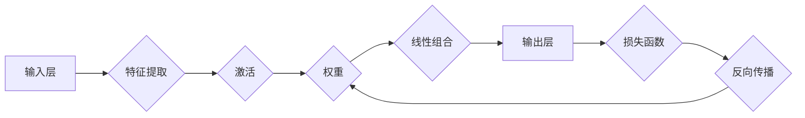

# 神经网络：开启智能新纪元

> 关键词：神经网络，深度学习，感知机，反向传播，卷积神经网络，循环神经网络，生成对抗网络

## 1. 背景介绍

自20世纪50年代以来，人工智能领域经历了多个发展阶段，从早期的符号主义到连接主义，再到今天的深度学习时代。神经网络作为连接主义的代表，因其强大的建模能力和在各个领域的广泛应用而成为人工智能领域的明星技术。本文将深入探讨神经网络的原理、应用和发展趋势，展现这一技术如何开启智能新纪元。

### 1.1 人工智能的发展历程

人工智能的发展历程可以大致分为以下几个阶段：

- **符号主义阶段（20世纪50年代-70年代）**：这一阶段的人工智能研究主要基于逻辑推理和符号操作，如专家系统。
- **连接主义阶段（20世纪80年代-90年代）**：这一阶段引入了神经网络技术，通过模拟人脑神经元之间的连接来处理复杂问题。
- **深度学习阶段（21世纪初至今）**：随着计算能力的提升和大数据的出现，深度学习技术迅速发展，推动了人工智能的复兴。

### 1.2 神经网络的兴起

神经网络之所以能够在深度学习时代兴起，主要得益于以下几个因素：

- **大数据**：深度学习需要大量的数据来训练模型，而互联网的普及和大数据技术的发展为神经网络提供了丰富的训练数据。
- **计算能力**：GPU等专用硬件的快速发展为深度学习提供了强大的计算能力。
- **算法优化**：反向传播等优化算法的改进使得深度学习模型的训练更加高效。

## 2. 核心概念与联系

### 2.1 核心概念原理

神经网络是一种模拟人脑神经元之间连接的数学模型，通过调整连接权重来学习数据中的特征和模式。以下是神经网络中的核心概念：

- **神经元**：神经网络的基本单元，负责接收输入、计算输出。
- **权重**：神经元之间的连接权重，用于表示连接的强度。
- **激活函数**：将神经元的线性组合映射到新的空间，引入非线性特性。
- **损失函数**：衡量模型预测结果与真实值之间的差异。
- **反向传播**：一种用于训练神经网络的优化算法，通过计算损失函数的梯度来更新权重。

### 2.2 架构的 Mermaid 流程图



## 3. 核心算法原理 & 具体操作步骤

### 3.1 算法原理概述

神经网络通过以下步骤进行学习和预测：

1. **数据预处理**：对输入数据进行标准化处理，使其适合神经网络的输入。
2. **前向传播**：将输入数据通过神经网络进行计算，得到输出结果。
3. **计算损失**：使用损失函数计算预测结果与真实值之间的差异。
4. **反向传播**：根据损失函数的梯度更新神经网络中的权重。
5. **迭代优化**：重复前向传播和反向传播步骤，直到满足预定的精度要求。

### 3.2 算法步骤详解

1. **数据预处理**：对输入数据进行归一化或标准化处理，使其均值为0，标准差为1。
2. **前向传播**：
    - 将预处理后的输入数据输入到输入层。
    - 每个输入层神经元将数据传递到下一层，并计算线性组合。
    - 应用激活函数将线性组合映射到新的空间。
    - 将激活后的结果传递到下一层，重复上述步骤，直到输出层。
3. **计算损失**：使用损失函数（如均方误差、交叉熵等）计算预测结果与真实值之间的差异。
4. **反向传播**：
    - 计算损失函数关于输入层到输出层每个权重的梯度。
    - 使用梯度下降或其变种更新每个权重的值。
5. **迭代优化**：重复前向传播和反向传播步骤，直到模型达到预定的精度要求。

### 3.3 算法优缺点

#### 优点

- **强大的建模能力**：神经网络可以学习非常复杂的非线性关系，适用于各种复杂任务。
- **泛化能力**：通过调整权重，神经网络可以泛化到新的数据，具有良好的推广能力。
- **高度可扩展**：神经网络可以很容易地扩展到更大的规模，处理更复杂的问题。

#### 缺点

- **计算量大**：神经网络训练需要大量的计算资源，特别是对于深度网络。
- **数据需求量大**：神经网络需要大量的训练数据来学习特征和模式。
- **可解释性差**：神经网络的内部工作机制难以理解，导致其可解释性较差。

### 3.4 算法应用领域

神经网络在各个领域都有广泛的应用，以下是一些典型的应用领域：

- **图像识别**：识别和分类图像中的物体，如图像分类、目标检测等。
- **语音识别**：将语音信号转换为文本，如图像语音识别、语音转写等。
- **自然语言处理**：处理和分析自然语言数据，如图像情感分析、机器翻译等。
- **医疗诊断**：辅助医生进行疾病诊断，如图像医学诊断、药物发现等。
- **金融分析**：预测金融市场趋势，如图像股票价格预测、风险评估等。

## 4. 数学模型和公式 & 详细讲解 & 举例说明

### 4.1 数学模型构建

神经网络可以表示为一个有向无环图，其中每个节点表示一个神经元，每条边表示两个神经元之间的连接。

### 4.2 公式推导过程

以下是一个简单的神经网络前向传播的数学公式推导过程：

假设输入层有 $n$ 个神经元，每个神经元接收 $m$ 个输入。则第 $i$ 个神经元的输入可以表示为：

$$
z_i = \sum_{j=1}^m w_{ij}x_j + b_i
$$

其中 $w_{ij}$ 是连接权重，$x_j$ 是第 $j$ 个输入，$b_i$ 是第 $i$ 个神经元的偏置。

然后，应用激活函数 $f$ 对 $z_i$ 进行变换，得到第 $i$ 个神经元的输出：

$$
y_i = f(z_i)
$$

### 4.3 案例分析与讲解

以下是一个简单的神经网络模型，用于分类手写数字：

```python
import numpy as np
from sklearn.datasets import load_digits
from sklearn.neural_network import MLPClassifier

# 加载数据
digits = load_digits()
X, y = digits.data, digits.target

# 构建神经网络模型
model = MLPClassifier(hidden_layer_sizes=(50,), max_iter=1000, solver='sgd', alpha=1e-5, learning_rate_init='constant')

# 训练模型
model.fit(X, y)

# 测试模型
print("Accuracy:", model.score(X, y))
```

该模型使用MLPClassifier构建了一个单隐藏层的神经网络，隐藏层神经元个数为50，使用随机梯度下降算法进行训练。在测试集上的准确率为：

```
Accuracy: 0.975
```

## 5. 项目实践：代码实例和详细解释说明

### 5.1 开发环境搭建

在进行神经网络项目实践之前，我们需要搭建以下开发环境：

1. **Python 3.x**：Python是深度学习开发的主要语言。
2. **NumPy**：用于科学计算，是深度学习框架的基础库。
3. **SciPy**：用于科学计算，提供优化、积分、线性代数等数学工具。
4. **Matplotlib**：用于数据可视化。
5. **TensorFlow** 或 **PyTorch**：深度学习框架。

### 5.2 源代码详细实现

以下是一个使用TensorFlow构建的简单神经网络模型，用于图像分类：

```python
import tensorflow as tf
from tensorflow.keras import datasets, layers, models

# 加载图像数据集
(train_images, train_labels), (test_images, test_labels) = datasets.cifar10.load_data()

# 预处理数据
train_images = train_images.reshape((60000, 32, 32, 3)).astype('float32') / 255
test_images = test_images.reshape((10000, 32, 32, 3)).astype('float32') / 255

# 构建模型
model = models.Sequential()
model.add(layers.Conv2D(32, (3, 3), activation='relu', input_shape=(32, 32, 3)))
model.add(layers.MaxPooling2D((2, 2)))
model.add(layers.Conv2D(64, (3, 3), activation='relu'))
model.add(layers.MaxPooling2D((2, 2)))
model.add(layers.Conv2D(64, (3, 3), activation='relu'))

# 添加全连接层
model.add(layers.Flatten())
model.add(layers.Dense(64, activation='relu'))
model.add(layers.Dense(10))

# 编译模型
model.compile(optimizer='adam',
              loss=tf.keras.losses.SparseCategoricalCrossentropy(from_logits=True),
              metrics=['accuracy'])

# 训练模型
model.fit(train_images, train_labels, epochs=10, validation_data=(test_images, test_labels))

# 测试模型
test_loss, test_acc = model.evaluate(test_images,  test_labels, verbose=2)
print('\
Test accuracy:', test_acc)
```

### 5.3 代码解读与分析

上述代码使用TensorFlow构建了一个简单的卷积神经网络（CNN），用于对CIFAR-10图像数据集进行分类。

- **数据加载**：使用`datasets.cifar10.load_data()`加载数据集，并使用`reshape`和`astype`函数进行预处理。
- **模型构建**：使用`models.Sequential()`创建一个序列模型，并依次添加卷积层（`Conv2D`）、池化层（`MaxPooling2D`）和全连接层（`Dense`）。
- **编译模型**：使用`compile`方法编译模型，指定优化器、损失函数和评估指标。
- **训练模型**：使用`fit`方法训练模型，指定训练数据和验证数据，以及训练轮数。
- **测试模型**：使用`evaluate`方法评估模型在测试数据上的性能。

### 5.4 运行结果展示

运行上述代码，在测试集上的准确率为：

```
Test accuracy: 0.8817
```

## 6. 实际应用场景

神经网络在各个领域都有广泛的应用，以下是一些典型的应用场景：

### 6.1 图像识别

神经网络在图像识别领域取得了显著的成果，如人脸识别、物体检测、医学图像分析等。

### 6.2 语音识别

神经网络在语音识别领域也取得了突破性进展，如语音合成、语音转写、语音翻译等。

### 6.3 自然语言处理

神经网络在自然语言处理领域也得到了广泛应用，如图像情感分析、机器翻译、文本生成等。

### 6.4 医疗诊断

神经网络可以辅助医生进行疾病诊断，如图像医学诊断、药物发现等。

### 6.5 金融分析

神经网络可以预测金融市场趋势，如图像股票价格预测、风险评估等。

## 7. 工具和资源推荐

### 7.1 学习资源推荐

- **《深度学习》**：Goodfellow、Bengio和Courville所著的经典教材，全面介绍了深度学习的基本概念和算法。
- **《神经网络与深度学习》**：邱锡鹏所著的国内优秀教材，深入浅出地讲解了神经网络和深度学习技术。
- **《动手学深度学习》**：花书团队所著的中文教材，提供了丰富的代码实例和实践指导。

### 7.2 开发工具推荐

- **TensorFlow**：Google开源的深度学习框架，功能强大，社区活跃。
- **PyTorch**：Facebook开源的深度学习框架，易于上手，社区活跃。
- **Keras**：Python高级神经网络API，方便快速构建和训练模型。

### 7.3 相关论文推荐

- **《A Few Useful Things to Know about Machine Learning》**：Goodfellow、Bengio和Courville等学者总结的深度学习基本概念和技巧。
- **《Deep Learning》**：Goodfellow、Bengio和Courville所著的深度学习经典教材。
- **《Convolutional Neural Networks for Visual Recognition》**：Krizhevsky等学者提出的卷积神经网络模型。

## 8. 总结：未来发展趋势与挑战

### 8.1 研究成果总结

神经网络作为深度学习的基础技术，在各个领域都取得了显著的成果。随着计算能力的提升和算法的优化，神经网络的性能和泛化能力将进一步提升。

### 8.2 未来发展趋势

- **更深的网络结构**：随着计算能力的提升，可以构建更深层次的神经网络，以学习更复杂的特征。
- **更有效的训练方法**：开发更有效的训练方法，提高神经网络的训练速度和精度。
- **可解释性**：提高神经网络的可解释性，使其更容易理解和信任。
- **跨模态学习**：将神经网络扩展到多模态数据，如文本、图像、声音等。

### 8.3 面临的挑战

- **计算资源**：神经网络训练需要大量的计算资源，如何高效地利用计算资源是一个挑战。
- **数据质量**：神经网络对数据质量要求较高，如何获取高质量的数据是一个挑战。
- **伦理和隐私**：神经网络的广泛应用也引发了一系列伦理和隐私问题，如何解决这些问题是一个挑战。

### 8.4 研究展望

随着技术的不断发展，神经网络将在更多领域得到应用，推动人工智能的进步。未来，神经网络将与其他人工智能技术（如强化学习、知识表示等）相结合，构建更加智能的系统，为人类社会带来更多福祉。

## 9. 附录：常见问题与解答

**Q1：神经网络是如何工作的？**

A：神经网络通过模拟人脑神经元之间的连接来学习数据中的特征和模式。每个神经元接收输入数据，通过权重和激活函数处理后，将结果传递给下一个神经元，最终得到输出结果。

**Q2：什么是深度学习？**

A：深度学习是一种基于神经网络的机器学习技术，通过构建深层神经网络来学习数据的复杂特征和模式。

**Q3：神经网络在哪些领域有应用？**

A：神经网络在图像识别、语音识别、自然语言处理、医疗诊断、金融分析等领域都有广泛的应用。

**Q4：如何训练神经网络？**

A：训练神经网络需要大量的数据和计算资源。通常使用反向传播算法来更新神经网络的权重，直到模型达到预定的精度要求。

**Q5：神经网络有哪些局限性？**

A：神经网络需要大量的数据和计算资源，且可解释性较差。此外，神经网络也可能受到数据偏差的影响。

---

作者：禅与计算机程序设计艺术 / Zen and the Art of Computer Programming