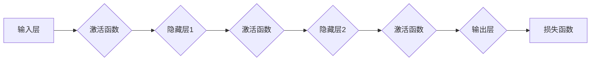

> 人工智能, 深度学习, 神经网络架构, 机器学习, 图像识别, 自然语言处理, 算法优化, 软件工程, 模型可解释性

# 神经网络：改变世界的技术

神经网络，这一被誉为“人工智能革命的引擎”的技术，正在以惊人的速度改变着我们的世界。从图像识别到自然语言处理，从自动驾驶到医疗诊断，神经网络的应用已经渗透到我们生活的方方面面。本文将深入探讨神经网络的原理、应用和实践，带您领略这一改变世界的技术。

## 1. 背景介绍

### 1.1 问题的由来

自20世纪50年代以来，人工智能领域经历了多次起伏。早期的符号主义和知识工程方法虽然取得了一些进展，但无法处理复杂的问题。到了20世纪80年代，基于规则的专家系统逐渐成为主流。然而，这些系统依赖于大量的手工编写的规则，难以扩展和适应新情况。

1990年代，随着计算机硬件和算法的发展，神经网络技术逐渐崭露头角。以反向传播算法为代表的优化技术，使得神经网络能够从大量数据中学习到复杂的模式。这一时期，神经网络在图像识别、语音识别等领域取得了突破性进展。

### 1.2 研究现状

进入21世纪，深度学习技术迅速发展，将神经网络推向了一个新的高度。深度神经网络在图像识别、自然语言处理、推荐系统等领域的应用取得了显著的成果，成为人工智能领域的热点。

### 1.3 研究意义

神经网络技术的突破，不仅推动了人工智能领域的发展，也为社会带来了巨大的变革。以下是神经网络研究的重要意义：

- **提升效率**：神经网络能够自动学习数据中的模式，减少了人工设计的需要，提高了工作效率。
- **拓展应用**：神经网络的应用领域不断拓展，为各行各业带来了新的解决方案。
- **创新驱动**：神经网络技术推动着人工智能领域不断创新，为未来技术的发展提供了新的动力。

### 1.4 本文结构

本文将分为以下几个部分：

- **第2章**：介绍神经网络的核心理念和基本架构。
- **第3章**：探讨神经网络的核心算法原理和具体操作步骤。
- **第4章**：讲解神经网络的数学模型和公式，并结合实例进行分析。
- **第5章**：通过代码实例展示神经网络的实践应用。
- **第6章**：探讨神经网络的实际应用场景和未来展望。
- **第7章**：推荐神经网络相关的学习资源、开发工具和论文。
- **第8章**：总结神经网络的研究成果、发展趋势和挑战。
- **第9章**：附录，包括常见问题与解答。

## 2. 核心概念与联系

### 2.1 核心概念

- **神经元**：神经网络的基本单元，类似于人脑中的神经元。
- **层**：由多个神经元组成的层次结构，包括输入层、隐藏层和输出层。
- **激活函数**：用于引入非线性因素的函数，如ReLU、Sigmoid、Tanh等。
- **损失函数**：衡量模型预测值与真实值之间差异的函数，如均方误差(MSE)、交叉熵等。
- **优化算法**：用于更新模型参数，如梯度下降、Adam、SGD等。
- **正则化**：防止模型过拟合的技术，如L1、L2正则化、Dropout等。

### 2.2 架构的 Mermaid 流程图



## 3. 核心算法原理 & 具体操作步骤

### 3.1 算法原理概述

神经网络通过模拟人脑神经元的工作原理，通过学习大量数据中的模式来解决问题。其核心原理包括：

- **权重更新**：根据输入数据和损失函数计算梯度，更新神经元之间的连接权重。
- **激活函数**：引入非线性因素，使得神经网络能够学习复杂的非线性关系。
- **反向传播**：通过计算损失函数对权重的梯度，更新模型参数。

### 3.2 算法步骤详解

1. **初始化参数**：设置权重和偏置的初始值。
2. **前向传播**：将输入数据通过神经网络，计算每个神经元的输出。
3. **计算损失**：根据损失函数计算模型预测值与真实值之间的差异。
4. **反向传播**：计算损失函数对权重的梯度，更新模型参数。
5. **迭代优化**：重复步骤2-4，直到模型收敛。

### 3.3 算法优缺点

**优点**：

- **强大的学习能力**：能够学习复杂的数据模式。
- **泛化能力**：能够泛化到未见过的数据。
- **可解释性**：可以通过分析神经元之间的关系来解释模型的决策过程。

**缺点**：

- **计算复杂度高**：需要大量的计算资源。
- **对数据质量敏感**：需要大量高质量的数据。
- **难以解释**：模型的决策过程难以解释。

### 3.4 算法应用领域

- **图像识别**：如人脸识别、物体检测等。
- **自然语言处理**：如文本分类、机器翻译等。
- **语音识别**：如语音转文字、语音合成等。
- **推荐系统**：如电影推荐、商品推荐等。

## 4. 数学模型和公式 & 详细讲解 & 举例说明

### 4.1 数学模型构建

神经网络的数学模型主要包括以下部分：

- **神经元激活函数**：$$ y = f(x\cdot w + b) $$
- **损失函数**：$$ L(\theta) = \frac{1}{N} \sum_{i=1}^{N} (y_i - \hat{y}_i)^2 $$
- **梯度下降**：$$ \theta = \theta - \alpha \nabla_\theta L(\theta) $$

### 4.2 公式推导过程

以均方误差损失函数为例，推导过程如下：

- **前向传播**：计算每个神经元的输出。
- **计算损失**：计算损失函数值。
- **反向传播**：计算损失函数对权重的梯度。
- **更新权重**：根据梯度更新权重。

### 4.3 案例分析与讲解

以一个简单的感知机模型为例，展示神经网络的训练过程：

- **初始化参数**：设置权重和偏置的初始值。
- **训练过程**：通过输入数据训练模型，计算损失函数值，更新权重。
- **评估模型**：在测试集上评估模型性能。

## 5. 项目实践：代码实例和详细解释说明

### 5.1 开发环境搭建

- 安装Python和PyTorch。
- 安装必要的库，如NumPy、Matplotlib等。

### 5.2 源代码详细实现

```python
import torch
import torch.nn as nn
import torch.optim as optim

# 定义神经网络模型
class NeuralNetwork(nn.Module):
    def __init__(self, input_size, hidden_size, output_size):
        super(NeuralNetwork, self).__init__()
        self.fc1 = nn.Linear(input_size, hidden_size)
        self.relu = nn.ReLU()
        self.fc2 = nn.Linear(hidden_size, output_size)

    def forward(self, x):
        out = self.fc1(x)
        out = self.relu(out)
        out = self.fc2(out)
        return out

# 训练模型
def train(model, data_loader, criterion, optimizer, epochs):
    model.train()
    for epoch in range(epochs):
        for i, (inputs, labels) in enumerate(data_loader):
            optimizer.zero_grad()
            outputs = model(inputs)
            loss = criterion(outputs, labels)
            loss.backward()
            optimizer.step()

# 评估模型
def test(model, data_loader, criterion):
    model.eval()
    total = 0
    correct = 0
    with torch.no_grad():
        for inputs, labels in data_loader:
            outputs = model(inputs)
            _, predicted = torch.max(outputs.data, 1)
            total += labels.size(0)
            correct += (predicted == labels).sum().item()
    print(f'Accuracy of the network on the 10000 test images: {100 * correct / total} %')

# 运行代码
input_size = 784
hidden_size = 500
output_size = 10
model = NeuralNetwork(input_size, hidden_size, output_size)
criterion = nn.CrossEntropyLoss()
optimizer = optim.SGD(model.parameters(), lr=0.01, momentum=0.9)

train(model, data_loader, criterion, optimizer, epochs=5)
test(model, test_loader, criterion)
```

### 5.3 代码解读与分析

- `NeuralNetwork` 类定义了一个简单的全连接神经网络。
- `train` 函数用于训练模型，包括前向传播、损失计算、反向传播和权重更新。
- `test` 函数用于评估模型性能。

### 5.4 运行结果展示

运行上述代码后，您将得到模型在测试集上的准确率。

## 6. 实际应用场景

### 6.1 图像识别

神经网络在图像识别领域取得了显著的成果。例如，AlexNet、VGG、ResNet等模型在图像识别竞赛中取得了优异成绩。

### 6.2 自然语言处理

神经网络在自然语言处理领域也取得了突破性进展。例如，BERT、GPT等模型在文本分类、机器翻译、问答系统等领域取得了优异的性能。

### 6.3 语音识别

神经网络在语音识别领域也取得了显著的成果。例如，DeepSpeech、Kaldi等模型实现了高质量的语音识别。

### 6.4 未来应用展望

随着神经网络技术的不断发展，未来将在更多领域得到应用，如：

- **自动驾驶**：用于车辆检测、车道线识别、交通标志识别等。
- **医疗诊断**：用于疾病诊断、药物研发、临床决策等。
- **金融风控**：用于欺诈检测、风险评估、信用评分等。

## 7. 工具和资源推荐

### 7.1 学习资源推荐

- 《深度学习》（Ian Goodfellow、Yoshua Bengio、Aaron Courville 著）
- 《神经网络与深度学习》（邱锡鹏 著）
- 《PyTorch深度学习实践》（王荣广、李航 著）

### 7.2 开发工具推荐

- PyTorch
- TensorFlow
- Keras

### 7.3 相关论文推荐

- "A Tutorial on Backpropagation"（Rumelhart, Hinton, Williams）
- "Rectifier Nonlinearities Improve Neural Network Acoustic Models"（Huang et al.）
- "Sequence to Sequence Learning with Neural Networks"（Sutskever et al.）

## 8. 总结：未来发展趋势与挑战

### 8.1 研究成果总结

神经网络技术在人工智能领域取得了显著的成果，推动了人工智能的发展。从图像识别到自然语言处理，从语音识别到自动驾驶，神经网络的应用已经渗透到我们生活的方方面面。

### 8.2 未来发展趋势

- **模型轻量化**：开发更小的模型，降低计算资源需求。
- **模型可解释性**：提高模型的可解释性，增强人们对模型的信任。
- **多模态学习**：融合不同模态的数据，提高模型的综合能力。

### 8.3 面临的挑战

- **数据隐私**：如何保护用户数据隐私。
- **模型安全**：如何防止模型被恶意攻击。
- **算法偏见**：如何减少算法偏见，提高模型的公平性。

### 8.4 研究展望

神经网络技术将继续发展，为人工智能领域带来更多突破。未来，神经网络将在更多领域得到应用，为人类社会创造更大的价值。

## 9. 附录：常见问题与解答

**Q1：神经网络和深度学习有何区别？**

A：神经网络是深度学习的一种实现方式，深度学习是指多层神经网络的学习过程。

**Q2：神经网络如何进行训练？**

A：神经网络通过前向传播计算预测值，通过反向传播计算损失函数对权重的梯度，并更新权重来训练模型。

**Q3：神经网络在应用中面临哪些挑战？**

A：神经网络在应用中面临数据隐私、模型安全、算法偏见等挑战。

**Q4：如何提高神经网络的性能？**

A：可以通过优化模型结构、调整超参数、增加数据量等方式提高神经网络的性能。

**Q5：神经网络在哪些领域有应用？**

A：神经网络在图像识别、自然语言处理、语音识别、自动驾驶等领域有广泛应用。

作者：禅与计算机程序设计艺术 / Zen and the Art of Computer Programming