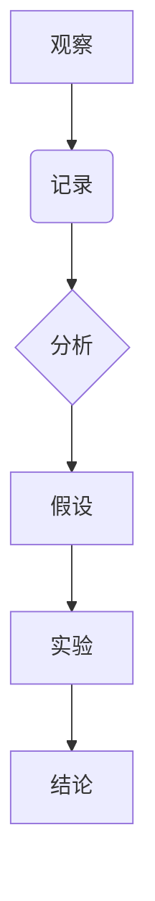

# 科学探究：从观察到结论

> 关键词：科学方法，观察，实验，假设，结论，数据驱动，系统思维，跨学科研究

## 1. 背景介绍

科学探究是人类认识世界、解释现象、预测未来的一种基本方法。从古希腊哲学家亚里士多德的观察和推理，到现代科学实验的精细设计，科学探究的方法论一直在不断发展。在信息技术高速发展的今天，科学探究的方法论在IT领域尤为重要，它帮助我们构建可靠的技术系统，解决复杂的问题。

本文将探讨科学探究的基本流程，包括观察、假设、实验、分析和结论等环节，并探讨如何将科学探究的方法论应用于IT领域。

## 2. 核心概念与联系

### 2.1 观察与记录

观察是科学探究的起点。科学观察要求研究者具有敏锐的观察力和细致的记录能力。观察不仅仅是用眼睛看，更是用心灵去感受和理解。



### 2.2 假设的形成

基于观察的结果，研究者会形成初步的假设。假设是对未观察现象的解释或预测。

### 2.3 实验设计

为了验证假设，研究者需要设计实验。实验设计需要严格控制变量，确保实验结果的可靠性。

### 2.4 数据分析

实验完成后，研究者需要分析实验数据，以验证或否定假设。

### 2.5 得出结论

根据数据分析的结果，研究者可以得出结论，并进一步提出新的假设或理论。

## 3. 核心算法原理 & 具体操作步骤

### 3.1 算法原理概述

科学探究的流程可以概括为以下步骤：

1. 观察现象或问题。
2. 提出假设。
3. 设计实验来验证假设。
4. 收集和分析数据。
5. 根据数据得出结论。
6. 根据结论提出新的假设或理论。

### 3.2 算法步骤详解

#### 3.2.1 观察与记录

- 使用感官和工具进行观察。
- 详细记录观察结果，包括定量和定性数据。

#### 3.2.2 提出假设

- 分析观察结果，提出可能的解释或预测。
- 确保假设是可验证的。

#### 3.2.3 实验设计

- 确定实验目的和假设。
- 设计实验方法，包括实验材料、实验步骤和实验条件。
- 确保实验设计能够控制变量，避免干扰。

#### 3.2.4 数据收集与分析

- 按照实验设计进行实验，收集数据。
- 使用统计方法或数据分析工具对数据进行分析。

#### 3.2.5 得出结论

- 根据数据分析结果，验证或否定假设。
- 根据结论提出新的假设或理论。

### 3.3 算法优缺点

#### 3.3.1 优点

- 系统性强：科学探究的流程是系统性的，确保了研究的严谨性。
- 可重复性：科学探究的结果可以被其他研究者重复验证。
- 累积性：科学探究的结果可以积累，形成科学知识体系。

#### 3.3.2 缺点

- 费时费力：科学探究需要大量的时间和精力。
- 可能存在偏差：观察和实验设计可能存在主观偏差。

### 3.4 算法应用领域

科学探究的方法论适用于所有需要验证和解释的领域，包括：

- 物理学
- 化学
- 生物学
- 天文学
- 地理学
- 计算机科学
- 心理学

## 4. 数学模型和公式 & 详细讲解 & 举例说明

### 4.1 数学模型构建

数学模型是科学探究的重要工具，它可以帮助我们描述和理解现象。

#### 4.1.1 示例：牛顿运动定律

牛顿运动定律描述了物体在力作用下的运动规律。

$$
F = ma
$$

其中，$F$ 是力，$m$ 是物体的质量，$a$ 是加速度。

#### 4.1.2 示例：摩尔定律

摩尔定律描述了计算机性能随时间增长的趋势。

$$
P(t) = P_0 \cdot (2^{n \cdot t})
$$

其中，$P(t)$ 是时间 $t$ 时的计算机性能，$P_0$ 是初始性能，$n$ 是摩尔定律的参数。

### 4.2 公式推导过程

公式的推导需要基于观察、假设和实验数据。

#### 4.2.1 示例：牛顿运动定律的推导

牛顿通过观察物体的运动，提出了牛顿运动定律。他通过实验发现，物体的加速度与作用力成正比，与物体的质量成反比。

### 4.3 案例分析与讲解

#### 4.3.1 案例一：人工智能的发展

人工智能领域的发展是科学探究的典范。研究者通过观察机器学习的发展，提出了深度学习的假设。通过大量的实验，研究者验证了深度学习的有效性，并提出了许多新的模型和算法。

#### 4.3.2 案例二：软件开发的质量保证

软件开发的质量保证也遵循科学探究的流程。开发者通过观察软件缺陷，提出软件质量保证的假设。通过编写测试用例，开发者验证了软件质量保证方法的有效性。

## 5. 项目实践：代码实例和详细解释说明

### 5.1 开发环境搭建

为了演示科学探究的方法，我们将使用Python编写一个简单的线性回归模型。

### 5.2 源代码详细实现

```python
import numpy as np
from sklearn.linear_model import LinearRegression
import matplotlib.pyplot as plt

# 生成模拟数据
X = np.linspace(0, 10, 100).reshape(-1, 1)
y = 3 * X + 2 + np.random.normal(0, 1, 100)

# 创建线性回归模型
model = LinearRegression()

# 训练模型
model.fit(X, y)

# 绘制拟合曲线
plt.scatter(X, y, label='Data')
plt.plot(X, model.predict(X), label='Fit', color='red')
plt.legend()
plt.show()
```

### 5.3 代码解读与分析

上述代码使用Python和sklearn库实现了线性回归模型。首先，我们生成了一组模拟数据，然后创建了一个线性回归模型，并使用模拟数据训练了模型。最后，我们绘制了数据点和拟合曲线。

### 5.4 运行结果展示

运行上述代码后，将显示一个包含模拟数据和拟合曲线的图表。这表明我们的线性回归模型能够有效地拟合模拟数据。

## 6. 实际应用场景

科学探究的方法论在IT领域有广泛的应用，以下是一些例子：

- **软件开发**：通过观察软件缺陷，提出改进方案，并通过实验验证改进的效果。
- **数据科学**：通过分析数据，提出假设，并通过模型验证假设。
- **人工智能**：通过观察学习算法的效果，提出新的学习算法，并通过实验验证算法的有效性。

### 6.4 未来应用展望

随着科学技术的不断发展，科学探究的方法论将在更多领域得到应用。以下是一些未来的应用展望：

- **人工智能**：将科学探究的方法论应用于人工智能研究，推动人工智能的进一步发展。
- **生物技术**：通过科学探究的方法，开发新的生物技术和药物。
- **环境保护**：通过科学探究的方法，保护环境，应对气候变化。

## 7. 工具和资源推荐

### 7.1 学习资源推荐

- 《科学方法》
- 《科学探究》
- 《科学研究方法论》

### 7.2 开发工具推荐

- Python
- R
- MATLAB

### 7.3 相关论文推荐

- 《深度学习：一种概率视角》
- 《统计学习方法》
- 《机器学习：一种统计学习视角》

## 8. 总结：未来发展趋势与挑战

### 8.1 研究成果总结

本文探讨了科学探究的基本流程，包括观察、假设、实验、分析和结论等环节，并探讨了如何将科学探究的方法论应用于IT领域。

### 8.2 未来发展趋势

科学探究的方法论将在更多领域得到应用，推动科学技术的进一步发展。

### 8.3 面临的挑战

科学探究的方法论也面临着一些挑战，如数据质量、模型的可解释性、算法的鲁棒性等。

### 8.4 研究展望

未来，科学探究的方法论将与其他学科相结合，推动人类社会的进步。

## 9. 附录：常见问题与解答

**Q1：科学探究的方法论在IT领域有哪些应用？**

A1：科学探究的方法论在IT领域的应用包括软件开发、数据科学、人工智能等。

**Q2：科学探究的方法论有哪些优点和缺点？**

A2：科学探究的方法论的优点是系统性强、可重复性高、累积性强；缺点是费时费力、可能存在偏差。

**Q3：如何将科学探究的方法论应用于具体的项目？**

A3：将科学探究的方法论应用于具体项目，需要根据项目的特点，制定合适的观察、假设、实验和分析步骤。

作者：禅与计算机程序设计艺术 / Zen and the Art of Computer Programming