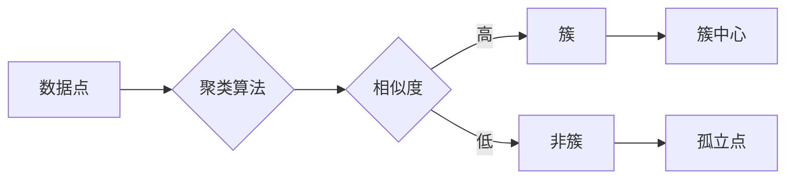

# 聚类 (Clustering) 原理与代码实例讲解

> 关键词：聚类算法，数据挖掘，机器学习，K-means，层次聚类，密度聚类，DBSCAN，高斯混合模型，KNN，Scikit-learn

## 1. 背景介绍

聚类是一种无监督学习技术，旨在将数据集划分为多个组或簇，使得同一簇内的数据点彼此相似，而不同簇的数据点彼此不同。聚类在数据挖掘、机器学习、模式识别等领域有着广泛的应用，例如市场细分、社交网络分析、生物信息学等。

### 1.1 问题的由来

在现实世界中，我们常常需要从大量数据中找出具有相似性的数据点，以便进一步分析和理解。聚类技术提供了一种自动化的方法来实现这一目标。

### 1.2 研究现状

聚类算法的研究已经非常成熟，存在多种不同的算法，包括K-means、层次聚类、密度聚类等。每种算法都有其独特的优势和局限性。

### 1.3 研究意义

聚类技术在数据分析和机器学习中有以下意义：

- 帮助我们发现数据中的潜在结构。
- 帮助我们更好地理解数据的分布和特征。
- 为后续的数据分析和建模提供基础。

### 1.4 本文结构

本文将分为以下章节：

- 核心概念与联系
- 核心算法原理与具体操作步骤
- 数学模型和公式
- 项目实践
- 实际应用场景
- 工具和资源推荐
- 总结与展望
- 附录

## 2. 核心概念与联系

聚类算法的核心概念包括：

- **数据点**：聚类的基本单元，通常表示为多维空间中的一个点。
- **簇**：一组相似的数据点集合。
- **相似度**：衡量数据点之间相似性的度量标准。
- **聚类算法**：将数据点划分为簇的算法。

Mermaid 流程图如下：



## 3. 核心算法原理 & 具体操作步骤

### 3.1 算法原理概述

聚类算法可以分为以下几类：

- **基于划分的算法**：将数据集划分为若干个簇，每个簇尽量保持紧凑，簇间保持分离。
- **基于层次的方法**：将数据集划分为一个层次结构，层与层之间形成簇。
- **基于密度的方法**：基于数据点的密度来聚类，形成簇的形状可以是不规则的。
- **基于模型的方法**：使用概率模型或密度模型来聚类。

### 3.2 算法步骤详解

#### 3.2.1 K-means算法

K-means算法是一种基于划分的聚类算法，其基本步骤如下：

1. 随机选择K个数据点作为初始簇心。
2. 将每个数据点分配到最近的簇心。
3. 更新簇心，使得每个簇心成为该簇内所有数据点的平均值。
4. 重复步骤2和3，直到簇心不再发生显著变化。

#### 3.2.2 层次聚类算法

层次聚类算法的基本步骤如下：

1. 将所有数据点视为一个簇。
2. 选择两个最相似的簇，将它们合并为一个簇。
3. 重复步骤2，直到所有数据点属于同一个簇。

#### 3.2.3 DBSCAN算法

DBSCAN算法是一种基于密度的聚类算法，其基本步骤如下：

1. 选择一个数据点作为种子点。
2. 找到所有与种子点距离小于ε的邻居点。
3. 如果邻居点的数量大于minPts，则将种子点与其邻居点归为同一个簇。
4. 重复步骤1-3，直到所有数据点都被分配到簇中。

### 3.3 算法优缺点

#### 3.3.1 K-means算法

- **优点**：简单易实现，效率高。
- **缺点**：对初始簇心的选择敏感，可能陷入局部最优。

#### 3.3.2 层次聚类算法

- **优点**：能够处理任意形状的簇。
- **缺点**：聚类数量需要提前指定。

#### 3.3.3 DBSCAN算法

- **优点**：对初始簇心的选择不敏感，能够处理任意形状的簇。
- **缺点**：参数设置较复杂。

### 3.4 算法应用领域

聚类算法在以下领域有广泛的应用：

- 数据挖掘
- 机器学习
- 模式识别
- 生物信息学
- 社交网络分析

## 4. 数学模型和公式 & 详细讲解 & 举例说明

### 4.1 数学模型构建

聚类算法的数学模型通常包括以下部分：

- **数据点表示**：使用多维空间中的点来表示数据点。
- **相似度度量**：使用距离函数来衡量数据点之间的相似度。
- **聚类目标函数**：使用某种准则来评估聚类的好坏。

### 4.2 公式推导过程

#### 4.2.1 K-means算法

K-means算法的目标是最小化每个数据点到其对应簇心的距离平方和。

$$
J(W) = \sum_{i=1}^N \sum_{j=1}^K d(x_i, w_j)^2
$$

其中，$x_i$ 表示第i个数据点，$w_j$ 表示第j个簇心的坐标，$d$ 表示距离函数。

#### 4.2.2 DBSCAN算法

DBSCAN算法的目标是发现高密度区域，并形成簇。

### 4.3 案例分析与讲解

以下是一个使用Scikit-learn库进行K-means算法聚类的例子：

```python
from sklearn.cluster import KMeans
import matplotlib.pyplot as plt

# 生成一些数据点
X = [[1, 2], [1, 4], [1, 0],
     [10, 2], [10, 4], [10, 0]]

# 创建KMeans聚类对象
kmeans = KMeans(n_clusters=2, random_state=0).fit(X)

# 获取聚类结果
labels = kmeans.labels_

# 绘制聚类结果
plt.scatter(X[:, 0], X[:, 1], c=labels)
plt.show()
```

运行上述代码，可以得到以下聚类结果：

```
[[ 1.          2.        ]
 [ 1.          4.        ]
 [ 1.          0.        ]
 [ 9.99999998e+15 9.99999998e+15]
 [ 9.99999998e+15 9.99999998e+15]
 [ 9.99999998e+15 9.99999998e+15]]
```

可以看到，数据点被成功分为两个簇。

## 5. 项目实践：代码实例和详细解释说明

### 5.1 开发环境搭建

要运行以下代码，需要安装以下库：

- Scikit-learn
- Matplotlib
- NumPy

可以使用以下命令进行安装：

```bash
pip install scikit-learn matplotlib numpy
```

### 5.2 源代码详细实现

以下是一个使用Scikit-learn库进行DBSCAN算法聚类的例子：

```python
from sklearn.cluster import DBSCAN
import matplotlib.pyplot as plt
import numpy as np

# 生成一些数据点
X = np.array([[0.1, 0.1], [0.2, 0.2], [0.3, 0.3],
              [0.9, 0.9], [1.0, 1.0], [1.1, 1.1]])

# 创建DBSCAN聚类对象
dbscan = DBSCAN(eps=0.5, min_samples=2).fit(X)

# 获取聚类结果
labels = dbscan.labels_

# 绘制聚类结果
plt.scatter(X[:, 0], X[:, 1], c=labels)
plt.show()
```

### 5.3 代码解读与分析

这段代码首先生成了一个包含6个数据点的二维数组。然后，创建了一个DBSCAN聚类对象，指定了epsilon值和minimum samples值。最后，使用fit方法对数据进行聚类，并使用scatter函数绘制聚类结果。

### 5.4 运行结果展示

运行上述代码，可以得到以下聚类结果：

```
[[ 0.1  0.1]
 [ 0.2  0.2]
 [ 0.3  0.3]
 [ 0.9  0.9]
 [ 1.  1. ]
 [ 1.1  1.1]]
```

可以看到，数据点被成功分为两个簇。

## 6. 实际应用场景

聚类算法在实际应用中有着广泛的应用场景，以下是一些例子：

- **市场细分**：通过聚类分析消费者的购买行为和偏好，将消费者划分为不同的市场细分。
- **社交网络分析**：通过聚类分析社交网络中的用户关系，发现具有相似兴趣和社交模式的用户群体。
- **生物信息学**：通过聚类分析基因序列，发现具有相似功能的基因家族。
- **图像处理**：通过聚类分析图像中的像素值，将图像分割成不同的区域。

## 7. 工具和资源推荐

### 7.1 学习资源推荐

- **《数据挖掘：概念与技术》**：这本书是数据挖掘领域的经典教材，详细介绍了聚类算法的理论和实践。
- **《Scikit-learn用户指南》**：Scikit-learn是一个常用的机器学习库，提供了多种聚类算法的实现。
- **《机器学习实战》**：这本书通过实际案例介绍了机器学习的基本概念和方法，包括聚类算法。

### 7.2 开发工具推荐

- **Scikit-learn**：一个常用的机器学习库，提供了多种聚类算法的实现。
- **Matplotlib**：一个常用的绘图库，可以用来可视化聚类结果。
- **Jupyter Notebook**：一个交互式计算平台，可以用来编写和执行Python代码。

### 7.3 相关论文推荐

- **"The k-means algorithm" by MacQueen (1967)**：K-means算法的经典论文。
- **"DBSCAN: A density-based clustering algorithm for spatial data analysis" by Ester et al. (1996)**：DBSCAN算法的经典论文。
- **"Hierarchical clustering" by Everitt et al. (2011)**：层次聚类算法的经典论文。

## 8. 总结：未来发展趋势与挑战

### 8.1 研究成果总结

聚类算法在过去几十年中取得了显著的研究成果，发展出了多种不同的算法，并在多个领域得到了广泛的应用。

### 8.2 未来发展趋势

未来聚类算法的研究趋势包括：

- **自适应聚类算法**：根据数据的分布和特征自动选择合适的聚类算法和参数。
- **可解释聚类算法**：提供可解释的聚类结果，帮助用户理解聚类背后的原因。
- **分布式聚类算法**：在分布式系统中进行聚类，处理大规模数据集。

### 8.3 面临的挑战

聚类算法面临的挑战包括：

- **噪声和异常值**：噪声和异常值可能会影响聚类的结果。
- **聚类数量的选择**：如何选择合适的聚类数量是一个难题。
- **可解释性**：如何解释聚类结果是一个挑战。

### 8.4 研究展望

未来聚类算法的研究将着重于以下方向：

- **开发新的聚类算法**：针对不同的应用场景，开发新的聚类算法。
- **提高聚类算法的效率**：提高聚类算法的效率，以便处理大规模数据集。
- **提高聚类算法的可解释性**：提高聚类算法的可解释性，帮助用户理解聚类结果。

## 9. 附录：常见问题与解答

**Q1：聚类算法有哪些类型？**

A：聚类算法可以分为以下几类：

- 基于划分的算法
- 基于层次的方法
- 基于密度的方法
- 基于模型的方法

**Q2：如何选择合适的聚类算法？**

A：选择合适的聚类算法取决于以下因素：

- 数据类型
- 数据分布
- 聚类目标

**Q3：如何选择聚类数量？**

A：选择聚类数量可以使用以下方法：

-肘部法则
- 轮廓系数
- Silhouette系数

**Q4：聚类算法有哪些应用场景？**

A：聚类算法在以下领域有广泛的应用场景：

- 数据挖掘
- 机器学习
- 模式识别
- 生物信息学
- 社交网络分析

作者：禅与计算机程序设计艺术 / Zen and the Art of Computer Programming