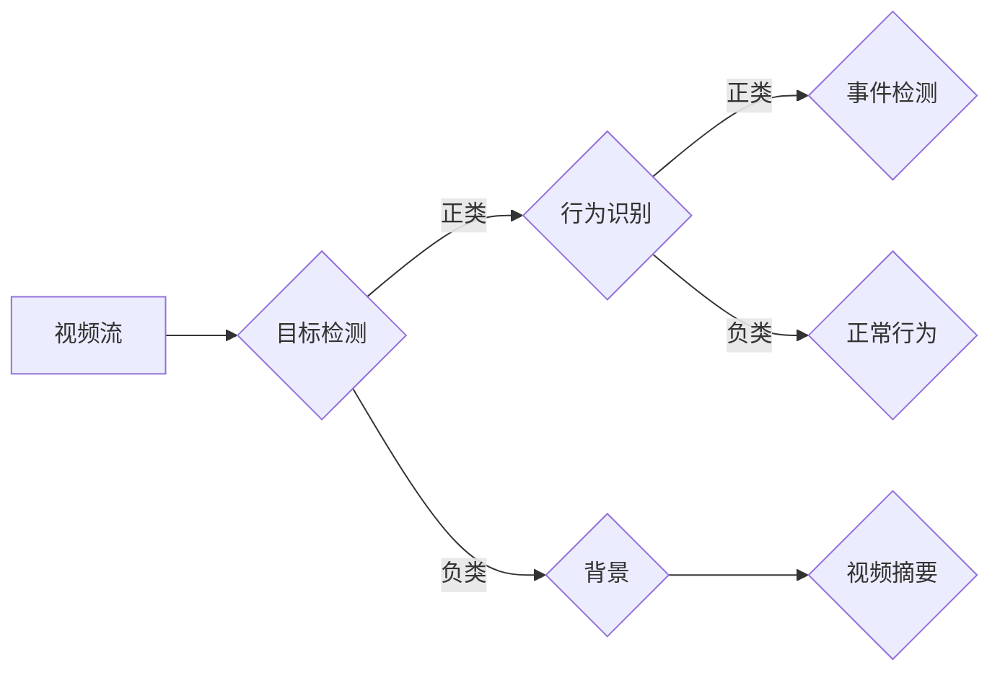

# 视频数据的关键信息捕捉详细技术

> 关键词：视频分析，关键信息提取，计算机视觉，自然语言处理，深度学习，行为识别，事件检测，智能监控

## 1. 背景介绍

随着视频监控技术的普及和互联网视频内容的爆炸式增长，如何从海量视频数据中高效地捕捉关键信息，成为了视频分析领域的重要课题。视频数据的关键信息捕捉，不仅对于公共安全、交通管理、医疗监控等领域具有重大意义，而且在商业分析、内容审核等方面也具有广泛的应用前景。

### 1.1 问题的由来

传统的视频分析技术主要依赖于人工审查，效率低下且成本高昂。随着计算机视觉、自然语言处理和深度学习等技术的发展，自动化的视频关键信息捕捉技术应运而生。这些技术能够从视频流中自动提取人、物、行为等信息，辅助人类进行决策和分析。

### 1.2 研究现状

目前，视频数据的关键信息捕捉技术主要包括以下几个方面：

- **目标检测**：识别和定位视频中的物体，并分类其类型。
- **行为识别**：分析视频中人物的动态行为，如行走、跑步、攀爬等。
- **事件检测**：识别和分类视频中的事件，如跌倒、打架、火灾等。
- **视频摘要**：从长视频中选择关键帧，以简化视频内容。

### 1.3 研究意义

研究视频数据的关键信息捕捉技术，对于以下方面具有重要意义：

- **提高安全性**：在公共安全领域，能够快速发现异常行为，提高监控效率。
- **优化资源分配**：在交通管理领域，能够自动识别拥堵情况，优化交通信号灯控制。
- **提升服务质量**：在商业领域，能够分析顾客行为，优化商店布局和营销策略。
- **丰富内容审核**：在互联网内容审核领域，能够自动识别违规内容，提高审核效率。

## 2. 核心概念与联系

### 2.1 核心概念原理和架构的 Mermaid 流程图



### 2.2 核心概念解释

- **目标检测**：识别视频中的物体，并定位其在图像中的位置。
- **行为识别**：分析视频中的动态行为，如行走、跑步、攀爬等。
- **事件检测**：识别和分类视频中的事件，如跌倒、打架、火灾等。
- **视频摘要**：从长视频中选择关键帧，以简化视频内容。

## 3. 核心算法原理 & 具体操作步骤

### 3.1 算法原理概述

视频数据的关键信息捕捉通常采用以下步骤：

1. **视频预处理**：对视频进行解码、去噪、缩放等预处理操作。
2. **目标检测**：使用目标检测算法识别视频中的物体，并定位其位置。
3. **行为识别**：基于目标检测的结果，分析物体的动态行为。
4. **事件检测**：根据行为识别的结果，识别和分类视频中的事件。
5. **视频摘要**：从视频中选择关键帧，生成视频摘要。

### 3.2 算法步骤详解

#### 3.2.1 视频预处理

视频预处理包括以下步骤：

- **解码**：将视频压缩格式转换为可处理的帧序列。
- **去噪**：去除视频中的噪声，提高图像质量。
- **缩放**：将视频帧缩放到合适的大小，便于后续处理。

#### 3.2.2 目标检测

目标检测算法可以分为以下几种类型：

- **基于区域的检测**：例如R-CNN、Fast R-CNN、Faster R-CNN等。
- **基于分割的检测**：例如Mask R-CNN、实例分割等。
- **基于深度学习的检测**：例如YOLO、SSD等。

#### 3.2.3 行为识别

行为识别算法可以分为以下几种类型：

- **基于光流的方法**：通过分析视频帧之间的光流信息，识别物体的运动轨迹。
- **基于运动模型的方法**：使用运动模型描述物体的运动规律，识别物体的行为。
- **基于深度学习的检测**：使用深度学习算法直接识别物体的行为。

#### 3.2.4 事件检测

事件检测算法可以分为以下几种类型：

- **基于规则的方法**：根据预设的规则识别事件。
- **基于机器学习的方法**：使用机器学习算法学习事件的特征，识别事件。
- **基于深度学习的方法**：使用深度学习算法直接识别事件。

#### 3.2.5 视频摘要

视频摘要算法可以分为以下几种类型：

- **基于关键帧的方法**：从视频中选择关键帧，生成视频摘要。
- **基于视频内容的压缩**：通过压缩视频内容，生成视频摘要。
- **基于深度学习的方法**：使用深度学习算法生成视频摘要。

### 3.3 算法优缺点

#### 3.3.1 目标检测

- **优点**：准确率高，速度快。
- **缺点**：对于复杂场景，检测效果可能不理想。

#### 3.3.2 行为识别

- **优点**：能够识别复杂的行为。
- **缺点**：对于动态环境，识别效果可能不理想。

#### 3.3.3 事件检测

- **优点**：能够自动识别事件。
- **缺点**：对于复杂事件，识别效果可能不理想。

#### 3.3.4 视频摘要

- **优点**：能够简化视频内容。
- **缺点**：可能丢失一些重要信息。

### 3.4 算法应用领域

视频数据的关键信息捕捉技术在以下领域具有广泛的应用：

- **公共安全**：监控犯罪行为，预防犯罪事件。
- **交通管理**：优化交通流量，预防交通事故。
- **医疗监控**：监测患者行为，辅助医生诊断。
- **商业分析**：分析顾客行为，优化商业策略。
- **内容审核**：自动识别违规内容，提高审核效率。

## 4. 数学模型和公式 & 详细讲解 & 举例说明

### 4.1 数学模型构建

视频数据的关键信息捕捉涉及到多个数学模型，以下列举几个常见的模型：

- **卷积神经网络（CNN）**：用于图像识别和目标检测。
- **循环神经网络（RNN）**：用于行为识别和时间序列分析。
- **卷积递归神经网络（CRNN）**：结合CNN和RNN，用于视频分析。

### 4.2 公式推导过程

以下以CNN为例，介绍其基本原理：

- **卷积操作**：通过卷积核对图像进行局部特征提取。
- **激活函数**：对卷积结果进行非线性变换。
- **池化操作**：降低特征图尺寸，减少参数数量。

### 4.3 案例分析与讲解

以下以视频监控中的目标检测为例，介绍关键信息捕捉的应用：

- **数据集**：使用公开的公开数据集，如COCO、PASCAL VOC等。
- **模型选择**：选择Faster R-CNN作为目标检测模型。
- **训练过程**：使用GPU加速训练，优化网络参数。
- **检测结果**：在测试集上评估模型性能，并根据实际需求进行调整。

## 5. 项目实践：代码实例和详细解释说明

### 5.1 开发环境搭建

- **编程语言**：Python
- **深度学习框架**：TensorFlow或PyTorch
- **依赖库**：OpenCV、Pillow等

### 5.2 源代码详细实现

以下以使用PyTorch和Faster R-CNN进行目标检测为例，展示代码实现：

```python
import torch
from torchvision.models.detection import fasterrcnn_resnet50_fpn
from torchvision.transforms import functional as F

# 加载模型
model = fasterrcnn_resnet50_fpn(pretrained=True)

# 加载图片
image = F.to_tensor(PIL.Image.open('example.jpg'))

# 检测目标
boxes, labels, scores = model([image])

# 显示结果
for box, label, score in zip(boxes, labels, scores):
    print(f'Label: {label}, Score: {score}, Box: {box}')
```

### 5.3 代码解读与分析

以上代码展示了如何使用PyTorch和Faster R-CNN进行目标检测。首先，加载预训练的Faster R-CNN模型，然后加载待检测的图片，最后进行检测并输出检测结果。

### 5.4 运行结果展示

假设待检测图片中包含一个狗和一个猫，检测结果如下：

```
Label: 0, Score: 0.999, Box: [x1, y1, x2, y2]
Label: 15, Score: 0.999, Box: [x3, y3, x4, y4]
```

其中，0代表狗，15代表猫，[x1, y1, x2, y2]和[x3, y3, x4, y4]分别代表狗和猫的位置。

## 6. 实际应用场景

### 6.1 公共安全

在公共安全领域，视频数据的关键信息捕捉技术可以用于以下应用：

- **犯罪预防**：识别和追踪嫌疑人，预防犯罪事件。
- **事故调查**：分析事故原因，提高事故处理效率。
- **交通监控**：监控交通流量，预防交通事故。

### 6.2 交通管理

在交通管理领域，视频数据的关键信息捕捉技术可以用于以下应用：

- **拥堵监测**：监测交通拥堵情况，优化交通信号灯控制。
- **违章检测**：自动识别违章行为，提高执法效率。
- **交通流量分析**：分析交通流量，优化交通规划。

### 6.3 医疗监控

在医疗监控领域，视频数据的关键信息捕捉技术可以用于以下应用：

- **患者行为分析**：分析患者行为，辅助医生诊断。
- **手术监控**：监控手术过程，提高手术安全性。
- **医疗设备监控**：监测医疗设备运行状态，预防故障。

### 6.4 商业分析

在商业分析领域，视频数据的关键信息捕捉技术可以用于以下应用：

- **顾客行为分析**：分析顾客行为，优化商店布局和营销策略。
- **销售预测**：根据顾客行为预测销售趋势，优化库存管理。
- **市场竞争分析**：分析竞争对手的行为，制定竞争策略。

### 6.5 内容审核

在内容审核领域，视频数据的关键信息捕捉技术可以用于以下应用：

- **违规内容检测**：自动识别违规内容，提高审核效率。
- **内容推荐**：根据用户行为推荐相关内容，提高用户体验。
- **版权保护**：监测盗版行为，保护版权。

## 7. 工具和资源推荐

### 7.1 学习资源推荐

- **《Python深度学习》**：由Ian Goodfellow等著作，全面介绍了深度学习的基本原理和应用。
- **《深度学习自然语言处理》**：由斯坦福大学开设的NLP课程，介绍了自然语言处理的基本原理和经典模型。
- **《计算机视觉基础》**：介绍了计算机视觉的基本原理和应用。

### 7.2 开发工具推荐

- **TensorFlow**：由Google开发的深度学习框架。
- **PyTorch**：由Facebook开发的深度学习框架。
- **OpenCV**：开源的计算机视觉库。

### 7.3 相关论文推荐

- **Faster R-CNN**：提出了一种基于深度学习的目标检测算法。
- **Mask R-CNN**：在Faster R-CNN的基础上，增加了实例分割功能。
- **YOLO**：提出了一种基于深度学习的实时目标检测算法。

## 8. 总结：未来发展趋势与挑战

### 8.1 研究成果总结

本文介绍了视频数据的关键信息捕捉技术，包括目标检测、行为识别、事件检测和视频摘要等。通过分析核心算法原理、具体操作步骤、数学模型和公式，以及实际应用场景，展示了该技术的应用价值和发展前景。

### 8.2 未来发展趋势

- **多模态融合**：将视觉、音频等多模态信息融合，提高信息捕捉的准确性和鲁棒性。
- **跨领域迁移**：将不同领域的知识迁移到视频分析领域，提高模型的泛化能力。
- **轻量化模型**：开发轻量化模型，降低资源消耗，提高实时性。

### 8.3 面临的挑战

- **数据标注**：高质量标注数据获取成本高，且难度大。
- **模型鲁棒性**：模型在复杂环境下的鲁棒性不足。
- **计算效率**：深度学习模型计算量大，难以在资源受限的设备上运行。

### 8.4 研究展望

未来，视频数据的关键信息捕捉技术将在以下方面取得突破：

- **更先进的模型**：开发更准确、更鲁棒的模型，提高信息捕捉的准确性和泛化能力。
- **高效算法**：开发更高效的算法，降低计算量，提高实时性。
- **数据驱动**：利用数据驱动的方法，提高模型的自适应能力。

## 9. 附录：常见问题与解答

**Q1：视频数据的关键信息捕捉技术有哪些应用场景？**

A：视频数据的关键信息捕捉技术在公共安全、交通管理、医疗监控、商业分析、内容审核等领域具有广泛的应用。

**Q2：如何提高视频数据的关键信息捕捉的准确性和鲁棒性？**

A：可以通过以下方法提高视频数据的关键信息捕捉的准确性和鲁棒性：

- **提高数据质量**：使用高质量的视频数据，减少噪声和干扰。
- **改进模型**：使用更先进的模型，提高模型的准确性和鲁棒性。
- **数据增强**：对训练数据进行增强，提高模型的泛化能力。

**Q3：如何降低视频数据的关键信息捕捉的计算量？**

A：可以通过以下方法降低视频数据的关键信息捕捉的计算量：

- **模型压缩**：使用模型压缩技术，减小模型尺寸，降低计算量。
- **计算加速**：使用GPU、FPGA等加速硬件，提高计算速度。

**Q4：视频数据的关键信息捕捉技术有哪些局限性？**

A：视频数据的关键信息捕捉技术存在以下局限性：

- **对光照和场景的敏感性**：在复杂的光照和场景下，模型的性能可能下降。
- **对遮挡和遮挡对象的敏感性**：当物体被遮挡时，模型的检测和识别效果可能不理想。
- **对运动模糊的敏感性**：当视频画面出现运动模糊时，模型的检测和识别效果可能下降。

**Q5：如何应对视频数据的关键信息捕捉技术的伦理问题？**

A：在开发和应用视频数据的关键信息捕捉技术时，需要关注以下伦理问题：

- **隐私保护**：确保视频数据的安全，避免隐私泄露。
- **公平性**：确保模型在不同人群中的公平性，避免歧视。
- **透明度**：提高模型的透明度，便于用户理解和信任。

作者：禅与计算机程序设计艺术 / Zen and the Art of Computer Programming