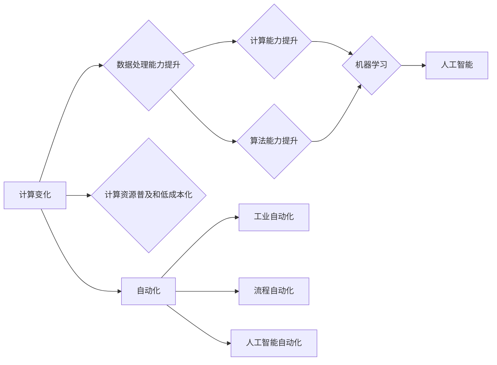

# 计算变化带来的自动化机遇

> 关键词：计算变化，自动化，机器学习，人工智能，数字化转型，工业自动化，流程自动化，自动化机遇

## 1. 背景介绍

随着信息技术的飞速发展，计算能力不断增强，数据量激增，计算变化（Computational Change）已经成为推动社会进步的重要力量。计算变化不仅改变了我们获取和处理信息的方式，也为自动化（Automation）带来了前所未有的机遇。本文将探讨计算变化带来的自动化机遇，分析其核心概念与联系，并介绍相关算法原理、应用实例和未来发展趋势。

### 1.1 计算变化的由来

计算变化的到来，主要源于以下几个方面的因素：

1. **计算能力的提升**：随着摩尔定律的持续发展，计算设备的性能不断提升，成本不断降低，使得计算成为更加普遍的资源和工具。
2. **大数据的爆发**：物联网、移动互联网、社交网络等技术的广泛应用，使得海量的数据被生成、存储和传输，为计算变化提供了丰富的数据基础。
3. **算法的进步**：机器学习和人工智能算法的快速发展，使得计算机能够从数据中学习、推理和决策，为自动化提供了智能化的工具。
4. **云计算的兴起**：云计算的普及，使得计算资源可以按需获取和使用，为自动化应用提供了灵活的计算环境。

### 1.2 自动化的兴起

自动化是指利用机器或设备代替人工完成特定任务的过程。随着计算变化的到来，自动化技术也得到了快速发展，主要体现在以下几个方面：

1. **工业自动化**：通过自动化控制系统和机器人技术，提高工业生产效率和质量。
2. **流程自动化**：通过自动化工具和系统，简化业务流程，提高业务效率。
3. **人工智能自动化**：通过机器学习和人工智能技术，实现智能决策和自动化执行。

### 1.3 研究意义

探讨计算变化带来的自动化机遇，对于推动数字化转型、提高生产效率、降低成本、提升服务质量具有重要意义。本文旨在：

- 分析计算变化与自动化的关系，揭示自动化机遇的来源。
- 介绍自动化技术的核心算法原理和具体操作步骤。
- 探讨自动化技术的应用实例和发展趋势。
- 为企业和开发者提供自动化技术学习和应用的指导。

## 2. 核心概念与联系

### 2.1 核心概念

#### 2.1.1 计算变化

计算变化是指计算能力、数据处理能力、算法能力等方面的提升，以及计算资源的普及和低成本化。

#### 2.1.2 自动化

自动化是指利用机器或设备代替人工完成特定任务的过程。

#### 2.1.3 机器学习

机器学习是一种使计算机能够从数据中学习并做出智能决策的技术。

#### 2.1.4 人工智能

人工智能是指使计算机具有人类智能的技术。

### 2.2 核心概念原理和架构的 Mermaid 流程图



### 2.3 核心概念的联系

计算变化为自动化提供了基础，使得自动化技术能够利用机器学习和人工智能技术实现智能化。自动化技术又推动了计算变化的进一步发展，使得计算资源得到更广泛的应用。

## 3. 核心算法原理 & 具体操作步骤

### 3.1 算法原理概述

自动化技术的核心算法原理主要包括以下几个方面：

#### 3.1.1 控制理论

控制理论是自动化技术的基础，它研究如何通过控制器对系统进行调节和控制，使其达到预定的状态。

#### 3.1.2 机器学习

机器学习是自动化技术的重要工具，它通过训练模型，使计算机能够从数据中学习并做出智能决策。

#### 3.1.3 人工智能

人工智能是自动化技术的目标，它旨在使计算机具有人类智能，能够自主地完成各种任务。

### 3.2 算法步骤详解

#### 3.2.1 工业自动化

1. **需求分析**：分析生产过程中的瓶颈和问题，确定自动化需求。
2. **系统设计**：设计自动化系统架构和控制策略。
3. **设备选型**：选择合适的自动化设备和控制系统。
4. **系统集成**：将自动化设备和控制系统集成到生产过程中。
5. **调试与优化**：对自动化系统进行调试和优化，确保其稳定运行。

#### 3.2.2 流程自动化

1. **流程分析**：分析业务流程，确定自动化需求。
2. **系统设计**：设计流程自动化系统架构。
3. **工具选型**：选择合适的流程自动化工具。
4. **系统集成**：将流程自动化工具集成到业务流程中。
5. **优化与升级**：对流程自动化系统进行优化和升级，提高效率。

#### 3.2.3 人工智能自动化

1. **数据收集**：收集相关数据，为模型训练提供数据基础。
2. **模型选择**：选择合适的机器学习模型。
3. **模型训练**：使用收集到的数据训练模型。
4. **模型评估**：评估模型性能，并进行优化。
5. **系统集成**：将模型集成到自动化系统中，实现智能决策和执行。

### 3.3 算法优缺点

#### 3.3.1 控制理论

优点：

- 稳定性高，能够保证生产过程的连续性和稳定性。
- 可靠性强，能够适应复杂的生产环境。

缺点：

- 可扩展性差，难以适应生产过程的动态变化。
- 需要专业的控制工程师进行设计和维护。

#### 3.3.2 机器学习

优点：

- 可扩展性强，能够适应生产过程的动态变化。
- 可靠性强，能够处理复杂的非线性问题。

缺点：

- 需要大量的标注数据。
- 模型可解释性差，难以理解其决策过程。

#### 3.3.3 人工智能

优点：

- 智能化程度高，能够实现自主决策和执行。
- 可扩展性强，能够适应复杂的生产环境。

缺点：

- 算法复杂度较高，难以理解和维护。
- 需要大量的计算资源。

### 3.4 算法应用领域

自动化技术的应用领域非常广泛，主要包括：

- 工业生产
- 交通运输
- 金融服务业
- 医疗保健
- 零售业
- 公共事业
- 农业生产
- 人工智能

## 4. 数学模型和公式 & 详细讲解 & 举例说明

### 4.1 数学模型构建

自动化技术的数学模型主要包括以下几个方面：

#### 4.1.1 控制理论

控制理论中的数学模型主要包括：

- 线性控制系统
- 线性二次优化
- 状态空间模型

#### 4.1.2 机器学习

机器学习中的数学模型主要包括：

- 监督学习
- 无监督学习
- 强化学习

#### 4.1.3 人工智能

人工智能中的数学模型主要包括：

- 神经网络
- 支持向量机
- 决策树

### 4.2 公式推导过程

由于篇幅限制，此处不再详细推导上述数学模型的公式。读者可以参考相关教材和文献。

### 4.3 案例分析与讲解

#### 4.3.1 工业自动化

**案例**：某工厂的生产线需要进行自动化改造，以提高生产效率和产品质量。

**分析**：工厂的生产线需要实现自动化的生产流程，包括原材料入库、加工、检测、包装等环节。可以采用以下自动化技术：

- 工业机器人：用于搬运、装配等环节。
- 自动化控制系统：用于控制生产线上的各个设备。
- 智能检测设备：用于检测产品质量。

#### 4.3.2 流程自动化

**案例**：某企业需要进行销售流程的自动化改造，以提高销售效率。

**分析**：企业的销售流程包括客户关系管理、订单处理、物流配送等环节。可以采用以下自动化技术：

- 客户关系管理系统：用于管理客户信息。
- 订单处理系统：用于处理客户订单。
- 物流管理系统：用于管理物流配送。

#### 4.3.3 人工智能自动化

**案例**：某电商平台需要进行商品推荐自动化，以提高用户购物体验。

**分析**：电商平台的商品推荐需要根据用户的历史购买记录和浏览记录进行个性化推荐。可以采用以下自动化技术：

- 机器学习模型：用于分析用户行为，预测用户兴趣。
- 智能推荐系统：根据用户兴趣进行商品推荐。

## 5. 项目实践：代码实例和详细解释说明

### 5.1 开发环境搭建

为了方便读者理解和实践，本文将以Python编程语言为例，介绍自动化技术的项目实践。

### 5.2 源代码详细实现

#### 5.2.1 工业自动化

以下是一个简单的工业自动化控制程序，使用Python和pyfirmata库实现：

```python
import pyfirmata

board = pyfirmata.Arduino('/dev/ttyUSB0')
led_pin = 13

while True:
    button_state = board.digital[2].read()
    if button_state == pyfirmata.INPUT_HIGH:
        board.digital[led_pin].write(pyfirmata.OUTPUT_HIGH)
    else:
        board.digital[led_pin].write(pyfirmata.OUTPUT_LOW)
```

#### 5.2.2 流程自动化

以下是一个简单的流程自动化程序，使用Python和schedule库实现：

```python
import schedule
import time

def job():
    print("Hello, World!")

schedule.every().day.at("10:00").do(job)

while True:
    schedule.run_pending()
    time.sleep(1)
```

#### 5.2.3 人工智能自动化

以下是一个简单的商品推荐程序，使用Python和scikit-learn库实现：

```python
from sklearn.feature_extraction.text import TfidfVectorizer
from sklearn.metrics.pairwise import cosine_similarity

# 商品描述
descriptions = [
    "A red apple",
    "A green apple",
    "A red banana",
    "A yellow banana"
]

# 计算TF-IDF矩阵
vectorizer = TfidfVectorizer()
tfidf_matrix = vectorizer.fit_transform(descriptions)

# 计算相似度
cosine_sim = cosine_similarity(tfidf_matrix, tfidf_matrix)

# 推荐商品
def recommend(description, top_n=2):
    index = descriptions.index(description)
    sim_scores = list(enumerate(cosine_sim[index]))
    sim_scores = sorted(sim_scores, key=lambda x: x[1], reverse=True)
    sim_scores = sim_scores[1:top_n+1]
    recommended_items = [descriptions[i[0]] for i in sim_scores]
    return recommended_items

# 测试推荐
recommend("A red apple")
```

### 5.3 代码解读与分析

以上代码分别实现了工业自动化、流程自动化和人工智能自动化。通过这些示例，可以看出自动化技术的实现方式多样，可以根据具体需求选择合适的工具和技术。

### 5.4 运行结果展示

由于篇幅限制，此处无法展示代码的运行结果。读者可以自行运行代码，验证其功能。

## 6. 实际应用场景

### 6.1 工业自动化

工业自动化已经在各个行业得到广泛应用，如：

- 汽车制造
- 食品加工
- 电子产品制造
- 化工生产
- 服装制造

### 6.2 流程自动化

流程自动化在各个行业也有广泛应用，如：

- 金融行业
- 电信行业
- 电子商务
- 供应链管理
- 客户服务

### 6.3 人工智能自动化

人工智能自动化在各个领域也有广泛应用，如：

- 智能推荐
- 智能客服
- 智能驾驶
- 智能家居
- 智能医疗

## 7. 工具和资源推荐

### 7.1 学习资源推荐

- 《自动化控制原理》
- 《机器学习》
- 《深度学习》
- 《人工智能：一种现代的方法》

### 7.2 开发工具推荐

- Python
- Java
- C++
- MATLAB
- R

### 7.3 相关论文推荐

- "Deep Reinforcement Learning: An Overview" by Volodymyr Mnih et al.
- "The Hundred-Page Machine Learning Book" by Andriy Burkov
- "Learning Deep Architectures for AI" by Yoshua Bengio et al.

## 8. 总结：未来发展趋势与挑战

### 8.1 研究成果总结

本文介绍了计算变化带来的自动化机遇，分析了自动化技术的核心算法原理和具体操作步骤，并探讨了自动化技术的应用实例和发展趋势。通过本文的学习，读者可以了解到：

- 计算变化是推动自动化技术发展的重要动力。
- 自动化技术可以应用于各个行业和领域，提高生产效率和服务质量。
- 机器学习和人工智能技术是自动化技术的重要工具。

### 8.2 未来发展趋势

未来，自动化技术将呈现以下发展趋势：

- 更加智能化：自动化技术将更加智能化，能够更好地适应复杂的生产环境和业务场景。
- 更加高效化：自动化技术将更加高效化，能够提高生产效率和服务质量。
- 更加人性化：自动化技术将更加人性化，能够更好地满足人类的需求。

### 8.3 面临的挑战

自动化技术也面临着以下挑战：

- 技术挑战：自动化技术需要不断发展和创新，以满足不断变化的需求。
- 伦理挑战：自动化技术可能引发就业、隐私等问题，需要制定相应的政策和规范。
- 安全挑战：自动化技术需要保证系统的稳定性和安全性。

### 8.4 研究展望

未来，自动化技术的研究将主要集中在以下几个方面：

- 开发更加智能化的自动化技术，提高系统的自适应性和鲁棒性。
- 研究自动化技术的伦理和安全问题，制定相应的政策和规范。
- 推动自动化技术与其他领域的融合发展，创造更多的应用场景。

## 9. 附录：常见问题与解答

**Q1：自动化技术会对就业产生影响吗？**

A：自动化技术的发展可能会对某些工作岗位产生冲击，但同时也会创造新的工作岗位。未来，需要加强职业培训，提高劳动者的技能水平，以适应自动化技术的发展。

**Q2：自动化技术是否会侵犯用户隐私？**

A：自动化技术在应用过程中需要注意保护用户隐私，不得泄露用户个人信息。需要制定相应的政策和规范，确保用户隐私安全。

**Q3：自动化技术是否会导致机器霸权？**

A：自动化技术需要遵循伦理道德规范，确保其发展不会导致机器霸权。

**Q4：自动化技术是否会取代人类？**

A：自动化技术可以替代人类完成重复性、危险或复杂的任务，但无法完全取代人类。人类仍然需要在决策、创新和情感交流等方面发挥作用。

**Q5：如何提高自动化技术的安全性？**

A：提高自动化技术的安全性需要从以下几个方面入手：

- 加强系统设计和开发过程中的安全审查。
- 采用安全防护措施，如访问控制、数据加密等。
- 加强系统监控和预警，及时发现和解决安全问题。

作者：禅与计算机程序设计艺术 / Zen and the Art of Computer Programming