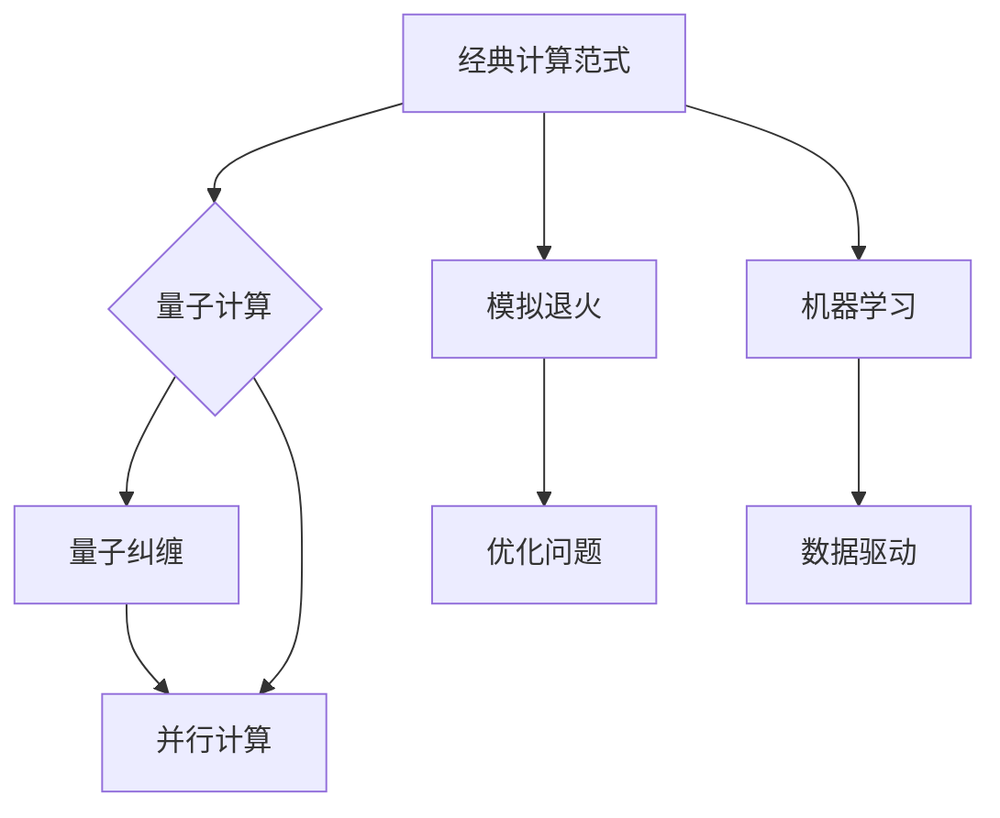

> 量子计算，计算范式，人工智能，机器学习，模拟退火，图灵完备，可扩展性，量子纠缠，并行计算，计算理论

# 计算的本质变化与未来趋势

在人类历史上，计算技术的进步一直是推动科技进步和经济社会发展的关键力量。从古代的算盘到现代的超级计算机，计算能力的提升不断刷新着我们对世界的理解和操控能力。然而，随着信息技术的飞速发展，计算的本质正在发生深刻的变革。本文将探讨计算的本质变化，并展望未来计算技术的发展趋势。

## 1. 背景介绍

### 1.1 计算技术的演变

从最早的算盘、计算尺到机械计算机，再到现代的电子计算机，计算技术经历了漫长的发展历程。每一次技术的革新都极大地提升了计算速度和效率，拓展了计算的应用范围。

### 1.2 量子计算的兴起

近年来，量子计算作为一种全新的计算范式，因其潜在的计算能力和对传统计算理论的颠覆性挑战，成为了研究的热点。量子计算利用量子位（qubit）的叠加和纠缠等特性，可以实现超乎传统计算机的并行计算和高效求解。

### 1.3 计算的本质变化

随着量子计算、人工智能等技术的发展，计算的本质正在发生变化。传统的基于位（bit）的计算模型正在向基于量子位（qubit）的计算模型转变，计算范式从模拟向模拟退火和机器学习等方向拓展。

## 2. 核心概念与联系

### 2.1 计算范式

#### Mermaid 流程图


### 2.2 核心概念

- **经典计算范式**：基于位（bit）的二进制计算模型，是现代计算机的基本原理。
- **量子计算**：利用量子位（qubit）的叠加和纠缠等特性进行计算。
- **模拟退火**：一种基于概率的优化算法，用于求解复杂的优化问题。
- **机器学习**：使计算机通过数据学习来改善性能。
- **量子纠缠**：量子位之间的特殊关联，可实现超乎传统计算机的并行计算。
- **并行计算**：同时处理多个任务或数据的能力。

## 3. 核心算法原理 & 具体操作步骤

### 3.1 算法原理概述

#### 量子计算

量子计算的核心原理是量子位（qubit）的叠加和纠缠。量子位可以同时表示0和1的状态，从而实现并行计算。量子纠缠则允许量子位之间进行超距离通信。

#### 模拟退火

模拟退火算法模拟物理过程中的退火过程，通过不断降低温度来使系统达到最低能量状态，从而解决优化问题。

#### 机器学习

机器学习算法通过学习数据中的模式，自动从数据中提取特征，并用于预测或决策。

### 3.2 算法步骤详解

#### 量子计算

1. 初始化量子位：将量子位初始化为特定的状态。
2. 应用量子门：使用量子门操作量子位，实现特定的计算逻辑。
3. 测量量子位：测量量子位的状态，得到最终的计算结果。

#### 模拟退火

1. 初始化解：随机生成一个解。
2. 计算目标函数值：计算当前解的目标函数值。
3. 降温：逐渐降低系统的温度。
4. 更新解：根据概率接受或拒绝新的解。
5. 重复步骤2-4，直至满足终止条件。

#### 机器学习

1. 数据准备：收集和预处理数据。
2. 特征提取：从数据中提取有用的特征。
3. 选择模型：选择合适的机器学习模型。
4. 训练模型：使用训练数据训练模型。
5. 验证模型：使用验证数据评估模型性能。
6. 部署模型：将模型应用于实际问题。

### 3.3 算法优缺点

#### 量子计算

优点：具有超乎传统计算机的并行计算能力和高效求解复杂问题的能力。

缺点：技术尚不成熟，硬件实现复杂，可扩展性有限。

#### 模拟退火

优点：适用于求解复杂的优化问题。

缺点：收敛速度慢，需要大量计算资源。

#### 机器学习

优点：能够从数据中自动学习，提高决策和预测的准确性。

缺点：依赖于大量标注数据，可解释性较差。

### 3.4 算法应用领域

#### 量子计算

量子计算适用于解决特定类型的计算问题，如整数分解、搜索、优化等。

#### 模拟退火

模拟退火适用于求解复杂的优化问题，如旅行商问题、装箱问题等。

#### 机器学习

机器学习适用于各种数据分析和预测任务，如分类、回归、聚类等。

## 4. 数学模型和公式 & 详细讲解 & 举例说明

### 4.1 数学模型构建

#### 量子计算

量子计算可以使用量子电路模型进行描述，其中量子门是基本的操作单元。

#### 模拟退火

模拟退火可以使用马尔可夫链蒙特卡洛方法进行描述。

#### 机器学习

机器学习可以使用各种概率统计模型进行描述，如线性回归、逻辑回归、支持向量机等。

### 4.2 公式推导过程

#### 量子计算

量子电路模型可以使用线性代数进行描述。

#### 模拟退火

马尔可夫链蒙特卡洛方法可以使用概率论进行描述。

#### 机器学习

机器学习中的公式推导过程取决于具体的模型和算法。

### 4.3 案例分析与讲解

#### 量子计算

以Shor算法为例，展示量子计算在整数分解问题上的优势。

#### 模拟退火

以旅行商问题为例，展示模拟退火算法的求解过程。

#### 机器学习

以分类问题为例，展示机器学习算法的应用。

## 5. 项目实践：代码实例和详细解释说明

### 5.1 开发环境搭建

#### 量子计算

- 安装Python和Qiskit库。

#### 模拟退火

- 安装Python和PyTorch库。

#### 机器学习

- 安装Python和scikit-learn库。

### 5.2 源代码详细实现

#### 量子计算

```python
from qiskit import QuantumCircuit, Aer, execute

# 创建量子电路
circ = QuantumCircuit(2)

# 添加量子门
circ.h(0)
circ.cx(0, 1)

# 执行电路
backend = Aer.get_backend('qasm_simulator')
result = execute(circ, backend).result()
print(result.get_counts(circ))
```

#### 模拟退火

```python
import torch
import torch.nn.functional as F

# 定义模拟退火算法
def simulated_annealing(loss_function, initial_temp, final_temp, alpha):
    temp = initial_temp
    current_solution = None
    current_loss = float('inf')
    
    while temp > final_temp:
        new_solution = ...  # 生成新的解
        new_loss = loss_function(new_solution)
        
        if new_loss < current_loss:
            current_solution = new_solution
            current_loss = new_loss
        else:
            if np.random.rand() < np.exp(-(new_loss - current_loss) / temp):
                current_solution = new_solution
        
        temp *= alpha
    
    return current_solution

# 定义损失函数
def loss_function(solution):
    # ...

# 运行模拟退火算法
solution = simulated_annealing(loss_function, initial_temp=1.0, final_temp=0.01, alpha=0.99)
```

#### 机器学习

```python
from sklearn.datasets import load_iris
from sklearn.model_selection import train_test_split
from sklearn.tree import DecisionTreeClassifier

# 加载数据
data = load_iris()
X, y = data.data, data.target

# 划分训练集和测试集
X_train, X_test, y_train, y_test = train_test_split(X, y, test_size=0.2)

# 定义决策树分类器
clf = DecisionTreeClassifier()

# 训练模型
clf.fit(X_train, y_train)

# 评估模型
score = clf.score(X_test, y_test)
print(f"Test score: {score}")
```

### 5.3 代码解读与分析

以上代码展示了量子计算、模拟退火和机器学习的基本实现。量子计算使用Qiskit库创建量子电路和执行量子计算。模拟退火使用PyTorch库实现，通过迭代更新解并逐渐降低温度。机器学习使用scikit-learn库实现，通过决策树分类器进行分类任务。

### 5.4 运行结果展示

运行以上代码，可以得到量子计算、模拟退火和机器学习的结果。量子计算可以模拟量子电路的执行过程，模拟退火可以找到最优解或近似最优解，机器学习可以训练和评估模型。

## 6. 实际应用场景

### 6.1 量子计算

量子计算在密码学、材料科学、药物发现等领域具有潜在的应用价值。

### 6.2 模拟退火

模拟退火在优化问题、机器学习、图像处理等领域具有广泛应用。

### 6.3 机器学习

机器学习在推荐系统、自然语言处理、图像识别等领域具有广泛的应用。

## 7. 工具和资源推荐

### 7.1 学习资源推荐

- 《量子计算：原理、算法与应用》
- 《模拟退火：优化问题的算法方法》
- 《机器学习：原理与算法》

### 7.2 开发工具推荐

- Qiskit：量子计算开发工具
- PyTorch：机器学习开发工具
- scikit-learn：机器学习库

### 7.3 相关论文推荐

- Shor's Algorithm
- Simulated Annealing
- Machine Learning

## 8. 总结：未来发展趋势与挑战

### 8.1 研究成果总结

量子计算、模拟退火和机器学习等计算技术的发展，为解决传统计算难以处理的复杂问题提供了新的思路和方法。

### 8.2 未来发展趋势

未来，计算技术将朝着以下方向发展：

- 量子计算：实现更强大的计算能力，解决传统计算难以处理的问题。
- 模拟退火：提高算法的效率和鲁棒性，扩展应用范围。
- 机器学习：实现更智能的算法，提高模型的可解释性和可扩展性。

### 8.3 面临的挑战

计算技术的发展也面临着以下挑战：

- 技术难度：量子计算、模拟退火和机器学习等技术的实现难度较大。
- 数据安全：随着数据量的增加，数据安全和隐私保护成为重要问题。
- 可解释性和可控性：提高模型的可解释性和可控性，降低风险。

### 8.4 研究展望

未来，计算技术的研究将朝着以下方向发展：

- 跨学科融合：将量子计算、模拟退火和机器学习等计算技术与其他学科进行融合，解决更广泛的问题。
- 人工智能：利用计算技术实现更智能的算法，推动人工智能技术的发展。
- 可持续发展：将计算技术应用于可持续发展领域，推动环境保护和社会进步。

## 9. 附录：常见问题与解答

**Q1：量子计算与传统计算机有什么区别？**

A：量子计算与传统计算机的区别在于，量子计算机利用量子位（qubit）的叠加和纠缠等特性，可以实现超乎传统计算机的并行计算和高效求解。

**Q2：模拟退火算法在哪些领域有应用？**

A：模拟退火算法在优化问题、机器学习、图像处理等领域有广泛应用。

**Q3：机器学习有哪些应用场景？**

A：机器学习在推荐系统、自然语言处理、图像识别等领域有广泛的应用。

**Q4：计算技术的发展对人类社会有哪些影响？**

A：计算技术的发展对人类社会具有深远的影响，包括提高生产效率、改善生活质量、推动科技创新等。

**Q5：未来计算技术有哪些发展趋势？**

A：未来计算技术将朝着量子计算、模拟退火和机器学习等方向发展，实现更强大的计算能力、更智能的算法和更广泛的应用。

作者：禅与计算机程序设计艺术 / Zen and the Art of Computer Programming