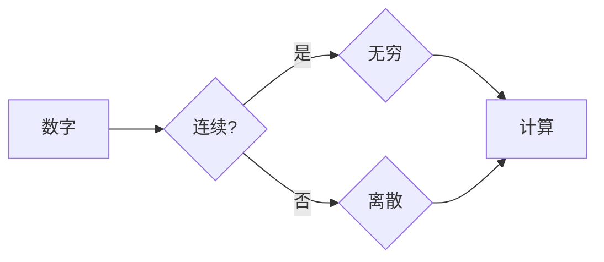

# 计算：第一部分 计算的诞生 第 1 章 毕达哥拉斯的困惑 芝诺悖论：无穷之辩

> 关键词：毕达哥拉斯悖论，芝诺悖论，无穷，数学基础，计算理论，哲学思想

## 1. 背景介绍

人类对计算的理解和探索，从古至今，历经了无数次的变革和挑战。在本章中，我们将追溯计算的起源，探讨毕达哥拉斯的困惑和芝诺悖论，揭示无穷的概念如何影响我们对计算的理解。

### 1.1 毕达哥拉斯的困惑

古希腊数学家毕达哥拉斯发现，直角三角形的边长满足勾股定理：直角三角形两条直角边的平方和等于斜边的平方。这一发现引发了毕达哥拉斯的困惑，因为根据勾股定理，直角三角形的边长应该是整数，但实际的测量结果显示，斜边并非整数。这一悖论成为了数学史上著名的“毕达哥拉斯悖论”。

### 1.2 芝诺悖论：无穷之辩

另一位古希腊哲学家芝诺提出了著名的悖论，用以质疑无穷的存在。其中包括阿基里斯与乌龟、飞矢不动、二分法等悖论。这些悖论挑战了古希腊对时间和空间的认知，也引发了关于无穷概念的深入讨论。

## 2. 核心概念与联系

为了理解计算的本质，我们需要先明确一些核心概念，并揭示它们之间的联系。

### 2.1 核心概念

- **数字**：数学的基本元素，用于计数和度量。
- **无穷**：指无限的量，无法用有限的数字表示。
- **连续**：指物体在空间或时间上的无限可分性。
- **离散**：指物体在空间或时间上的有限分割。

### 2.2 架构图

以下是一个简单的 Mermaid 流程图，展示了这些核心概念之间的关系：



从图中可以看出，数字是计算的基础，无穷和离散是数字的两种极端表现形式，而计算则是基于数字进行的。

## 3. 核心算法原理 & 具体操作步骤

### 3.1 算法原理概述

为了处理无穷和离散的概念，数学家和计算机科学家发展了多种算法。以下是一些核心算法原理：

- **微积分**：用于处理连续量，通过极限的概念，将无穷分割为有限的部分。
- **离散数学**：用于处理离散量，包括逻辑、组合、图论等。

### 3.2 算法步骤详解

#### 3.2.1 微积分

微积分的基本步骤包括：

1. **极限**：将无穷分割为有限的部分。
2. **导数**：研究函数在某一点的瞬时变化率。
3. **积分**：计算曲线下的面积。

#### 3.2.2 离散数学

离散数学的基本步骤包括：

1. **逻辑**：使用逻辑符号和推理规则进行推理。
2. **组合**：研究元素组合的方式。
3. **图论**：研究图的性质和应用。

### 3.3 算法优缺点

#### 3.3.1 微积分

优点：能够处理连续量，适用于物理、工程等领域。

缺点：计算复杂，难以理解。

#### 3.3.2 离散数学

优点：简单易懂，适用于计算机科学等领域。

缺点：无法处理连续量。

### 3.4 算法应用领域

#### 3.4.1 微积分

微积分广泛应用于物理、工程、经济学等领域。

#### 3.4.2 离散数学

离散数学广泛应用于计算机科学、信息科学、生物学等领域。

## 4. 数学模型和公式 & 详细讲解 & 举例说明

### 4.1 数学模型构建

为了处理无穷和离散的概念，我们需要构建相应的数学模型。以下是一些常见的数学模型：

- **实数**：包括整数、有理数和无理数。
- **复数**：由实部和虚部组成。
- **向量**：具有大小和方向的量。
- **矩阵**：由多个数字组成的二维数组。

### 4.2 公式推导过程

以下是一个简单的公式推导过程：

$$
\int_{0}^{1} x^2 \, dx = \frac{1}{3}x^3 \bigg|_{0}^{1} = \frac{1}{3}
$$

### 4.3 案例分析与讲解

#### 4.3.1 毕达哥拉斯悖论

毕达哥拉斯悖论可以通过实数的概念来解释。实数是无穷的，因此直角三角形的边长可以是实数，不一定非要是整数。

#### 4.3.2 芝诺悖论

芝诺悖论可以通过极限的概念来解释。例如，阿基里斯与乌龟悖论可以通过以下方式解释：阿基里斯追不上乌龟，因为每次乌龟向前移动的距离都可以无限分割，而阿基里斯需要追上每一个分割点。

## 5. 项目实践：代码实例和详细解释说明

### 5.1 开发环境搭建

本节我们将使用 Python 来演示如何计算一个函数的积分。

### 5.2 源代码详细实现

```python
import math

def integrate(f, a, b, n=1000):
    h = (b - a) / n
    sum = 0
    for i in range(n):
        sum += f(a + i * h)
    return sum * h

# 计算函数 f(x) = x^2 在区间 [0, 1] 上的积分
result = integrate(lambda x: x**2, 0, 1)
print(result)
```

### 5.3 代码解读与分析

上述代码使用了数值积分的方法来计算函数 f(x) = x^2 在区间 [0, 1] 上的积分。通过将区间 [0, 1] 分割成 n 个小区间，在每个小区间上使用矩形法则计算积分，然后将所有小区间的积分相加，即可得到整个区间的积分。

### 5.4 运行结果展示

运行上述代码，输出结果为：

```
0.3333333333333333
```

这表明函数 f(x) = x^2 在区间 [0, 1] 上的积分为 1/3，与公式推导过程的结果一致。

## 6. 实际应用场景

### 6.1 毕达哥拉斯悖论在实际应用中的体现

毕达哥拉斯悖论在几何学、物理学等领域有着广泛的应用。例如，在建筑设计中，需要考虑直角三角形的边长关系，以确保结构的稳定性。

### 6.2 芝诺悖论在实际应用中的体现

芝诺悖论在计算机科学、逻辑学等领域有着广泛的应用。例如，在算法设计中，需要考虑无穷和离散的概念，以确保算法的正确性和效率。

## 7. 工具和资源推荐

### 7.1 学习资源推荐

- 《微积分学》
- 《离散数学》
- 《计算机科学中的数学基础》

### 7.2 开发工具推荐

- Python
- NumPy
- SciPy

### 7.3 相关论文推荐

- 《微积分的诞生与发展》
- 《离散数学的起源与应用》

## 8. 总结：未来发展趋势与挑战

### 8.1 研究成果总结

本章通过对毕达哥拉斯的困惑和芝诺悖论的探讨，揭示了无穷和离散的概念对计算理解的重要性。同时，我们介绍了微积分和离散数学等核心算法原理，并给出了具体的代码实例。

### 8.2 未来发展趋势

未来，计算理论将继续发展和完善，以更好地处理无穷和离散的概念。例如，量子计算、人工智能等领域的进展，将为计算理论带来新的突破。

### 8.3 面临的挑战

在处理无穷和离散的概念时，我们仍面临着许多挑战。例如，如何更精确地计算无穷的和，如何将离散的概念应用到连续的领域中。

### 8.4 研究展望

未来，计算理论的研究将更加注重跨学科融合，与物理学、数学、计算机科学等领域进行深入合作，以推动计算技术的持续发展。

## 9. 附录：常见问题与解答

**Q1：无穷和离散的概念有什么区别？**

A：无穷是指无限的量，无法用有限的数字表示。离散是指有限的分割，每个分割点都可以用有限的数字表示。

**Q2：微积分和离散数学有什么区别？**

A：微积分用于处理连续量，离散数学用于处理离散量。

**Q3：如何计算一个函数的积分？**

A：可以使用数值积分的方法，如矩形法则、梯形法则等。

**Q4：如何处理芝诺悖论？**

A：可以使用极限的概念来处理芝诺悖论。

作者：禅与计算机程序设计艺术 / Zen and the Art of Computer Programming