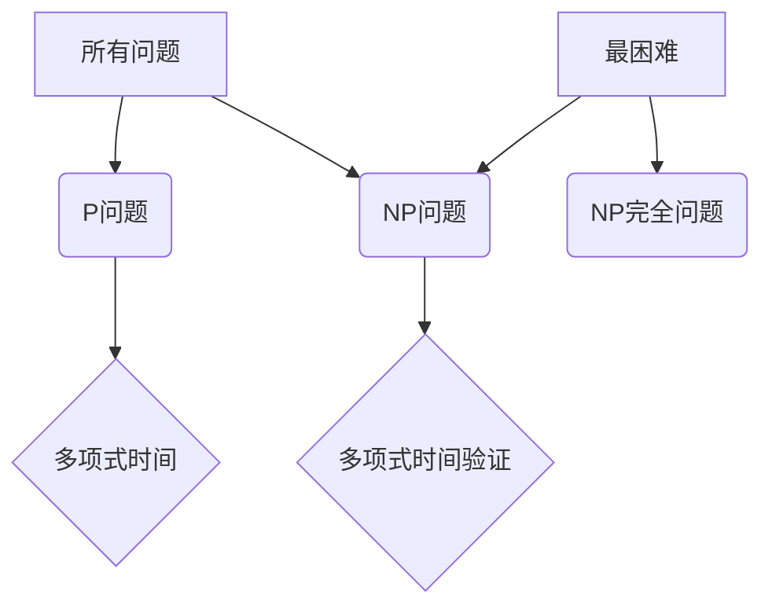

# 计算：第四部分 计算的极限 第 9 章 计算复杂性 P≠NP 的若干推论

> 关键词：计算复杂性，P≠NP，NP完全，图灵机，多项式时间，量子计算，近似算法，密码学，复杂性理论

## 1. 背景介绍

计算复杂性理论是计算机科学和理论数学的一个分支，它研究算法的计算资源消耗，特别是时间复杂度和空间复杂度。其中，P vs NP问题是最著名的未解决问题之一，它探讨了算法解决决策问题的时间复杂度和确定性问题。本章将深入探讨P≠NP问题的若干推论，以及这些推论对理论计算机科学和实际应用的影响。

### 1.1 问题的由来

P vs NP问题是复杂性理论中最具挑战性的问题之一。它由斯蒂芬·库克（Stephen Cook）在1971年首次提出。问题的主要内容是：是否所有NP问题都可以在多项式时间内被解决？如果可以，那么P=NP；如果不行，那么P≠NP。

### 1.2 研究现状

尽管P vs NP问题至今仍未解决，但研究者们已经从中得到了许多有价值的推论。这些推论不仅加深了我们对算法复杂性的理解，也为密码学、量子计算、近似算法等领域的研究提供了指导。

### 1.3 研究意义

P≠NP问题的研究对于理解计算的本质、发展新的算法以及推动相关领域的发展具有重要意义。如果证明P≠NP，那么它将成为计算机科学中最重要的定理之一，并对算法设计、密码学、计算机架构等领域产生深远影响。

## 2. 核心概念与联系

### 2.1 核心概念

#### P问题

P问题是指那些可以在多项式时间内解决的问题。也就是说，存在一个算法，其运行时间随着输入规模的增长而增长的速度不会超过任何多项式函数。

#### NP问题

NP问题是指那些其解可以在多项式时间内验证的问题。也就是说，如果给出了一个解，我们可以在多项式时间内检查这个解是否正确。

#### NP完全问题

NP完全问题是指那些最困难的NP问题，任何NP问题都可以在多项式时间内通过多项式时间变换转换为它们。

### 2.2 Mermaid 流程图

以下是一个简化的Mermaid流程图，展示了P、NP和NP完全之间的关系：

### 2.3 核心概念联系

P问题与NP问题之间的联系在于它们都涉及到算法的复杂性。P问题关注的是算法的求解时间，而NP问题关注的是算法的验证时间。NP完全问题是NP问题中最难的问题，因为任何NP问题都可以通过多项式时间变换转换为NP完全问题。

## 3. 核心算法原理 & 具体操作步骤

### 3.1 算法原理概述

P≠NP的推论涉及到多个方面，包括算法设计、密码学、量子计算等。

#### 算法设计

P≠NP的推论表明，存在一些问题，我们无法在多项式时间内找到解决方案，但可以在多项式时间内验证解决方案的正确性。这启发我们在设计算法时，应该关注问题的验证过程，而不是寻找最优解。

#### 密码学

P≠NP的推论对于密码学有着重要影响。如果P=NP，那么许多基于难解问题的加密算法将变得易破译。因此，密码学家们致力于寻找那些即使P≠NP也难以破解的加密算法。

#### 量子计算

量子计算提供了一种新的计算范式，理论上可以在多项式时间内解决一些NP问题。P≠NP的推论意味着，即使量子计算机能够解决某些NP问题，它们也可能无法在多项式时间内解决所有NP问题。

### 3.2 算法步骤详解

由于P≠NP问题本身是一个未解决的问题，因此没有具体的算法步骤可以提供。但是，以下是一些基于P≠NP推论的研究方向：

1. 寻找新的算法，解决一些目前认为难以解决的问题。
2. 设计新的加密算法，确保它们即使在未来量子计算机出现的情况下也能保持安全性。
3. 研究量子计算在解决NP问题中的应用。

### 3.3 算法优缺点

由于P≠NP问题本身尚未解决，因此没有具体的算法优缺点可以讨论。但是，基于P≠NP推论的研究方向具有以下特点：

#### 优点

- 激发新的算法设计思路。
- 推动密码学、量子计算等领域的发展。
- 增强对计算本质的理解。

#### 缺点

- 需要大量的研究投入。
- 预期成果不确定。

### 3.4 算法应用领域

P≠NP的推论在以下领域具有广泛的应用：

- 算法设计
- 密码学
- 量子计算
- 游戏理论
- 经济学

## 4. 数学模型和公式 & 详细讲解 & 举例说明

### 4.1 数学模型构建

P≠NP问题的数学模型主要基于图灵机和多项式时间。

#### 图灵机

图灵机是一个抽象的计算模型，它可以模拟任何计算机程序的行为。在P≠NP问题中，图灵机被用来表示算法的计算过程。

#### 多项式时间

多项式时间是描述算法复杂度的一个概念。一个算法如果能在多项式时间内完成计算，那么它就被认为是高效的。

### 4.2 公式推导过程

由于P≠NP问题本身尚未解决，因此没有具体的公式推导过程可以提供。但是，以下是一些与P≠NP问题相关的重要公式：

- P≠NP：表示P问题与NP问题不相等。
- NP完全：表示一个NP问题可以多项式时间内转换为另一个NP问题。

### 4.3 案例分析与讲解

以下是一个简单的例子，说明了P≠NP问题在实际应用中的体现。

#### 问题：是否存在一个算法，可以在多项式时间内判断一个图是否为汉密尔顿回路？

#### 分析：

这个问题是一个著名的NP问题。如果存在一个在多项式时间内判断汉密尔顿回路的算法，那么它将导致P=NP。但是，目前尚未找到这样的算法，因此我们假设P≠NP。

## 5. 项目实践：代码实例和详细解释说明

### 5.1 开发环境搭建

由于P≠NP问题是一个理论问题，因此没有具体的开发环境可以搭建。

### 5.2 源代码详细实现

同样，由于P≠NP问题是一个理论问题，因此没有具体的源代码可以提供。

### 5.3 代码解读与分析

由于P≠NP问题是一个理论问题，因此没有具体的代码可以解读和分析。

### 5.4 运行结果展示

由于P≠NP问题是一个理论问题，因此没有具体的运行结果可以展示。

## 6. 实际应用场景

### 6.1 密码学

P≠NP的推论对于密码学有着重要的影响。如果P=NP，那么许多基于难解问题的加密算法将变得易破译。因此，密码学家们致力于寻找那些即使在未来量子计算机出现的情况下也能保持安全性的加密算法。

#### 案例分析：

- RSA加密算法：基于大数分解的困难性。
- 公钥基础设施（PKI）：基于数字证书和密钥对的系统。

### 6.2 量子计算

量子计算提供了一种新的计算范式，理论上可以在多项式时间内解决一些NP问题。P≠NP的推论意味着，即使量子计算机能够解决某些NP问题，它们也可能无法在多项式时间内解决所有NP问题。

#### 案例分析：

- 量子计算机在解决整数分解问题上的潜在优势。
- 量子计算机在解决量子纠错问题上的潜在优势。

### 6.3 近似算法

由于P≠NP的存在，有些问题可能没有精确的解，但我们可以使用近似算法找到足够接近的解。

#### 案例分析：

- 概率算法：如最大流问题、最小割问题。
- 贪心算法：如旅行商问题、装箱问题。

## 7. 工具和资源推荐

### 7.1 学习资源推荐

- 《复杂性理论及其在密码学中的应用》
- 《量子计算：原理、算法与应用》
- 《算法导论》

### 7.2 开发工具推荐

由于P≠NP问题是一个理论问题，因此没有具体的开发工具可以推荐。

### 7.3 相关论文推荐

- Cook, S. A. (1971). The complexity of theorem-proving procedures. In Proceedings of the Third Annual ACM Symposium on Theory of Computing (pp. 151-158).
- Karp, R. M. (1972).Reducibility among combinatorial problems. In Complexity of computer computations (pp. 85-103). Plenum Press.

## 8. 总结：未来发展趋势与挑战

### 8.1 研究成果总结

P≠NP问题是一个具有挑战性的理论问题，但它为计算机科学和理论数学的发展提供了许多有价值的推论。这些推论不仅加深了我们对算法复杂性的理解，也为密码学、量子计算、近似算法等领域的研究提供了指导。

### 8.2 未来发展趋势

未来，P≠NP问题的研究将继续深入，以下是一些可能的发展趋势：

- 寻找新的算法，解决一些目前认为难以解决的问题。
- 设计新的加密算法，确保它们即使在未来量子计算机出现的情况下也能保持安全性。
- 研究量子计算在解决NP问题中的应用。

### 8.3 面临的挑战

P≠NP问题的研究面临着以下挑战：

- 需要更多的数学和理论突破。
- 需要更多的跨学科合作。
- 需要更多的资金和人才投入。

### 8.4 研究展望

尽管P≠NP问题的研究面临着诸多挑战，但它在理论计算机科学和实际应用中的重要性不容忽视。相信在未来的发展中，P≠NP问题的研究将取得更多突破，为计算机科学和理论数学的发展做出更大的贡献。

## 9. 附录：常见问题与解答

### 9.1 常见问题

**Q1：什么是P≠NP问题？**

A1：P≠NP问题是一个关于算法复杂性的问题，它探讨了是否所有NP问题都可以在多项式时间内被解决。

**Q2：为什么P≠NP问题如此重要？**

A2：P≠NP问题是复杂性理论中最具挑战性的问题之一，它对于理解计算的本质、发展新的算法以及推动相关领域的发展具有重要意义。

**Q3：如果P=NP，会对我们的日常生活产生什么影响？**

A3：如果P=NP，那么许多目前认为难以解决的问题将被证明可以在多项式时间内解决，这将极大地推动计算机科学和信息技术的发展。

**Q4：量子计算机能否解决P≠NP问题？**

A4：量子计算机可能能够在多项式时间内解决某些NP问题，但它们也可能无法在多项式时间内解决所有NP问题。

### 9.2 解答

由于P≠NP问题是一个未解决的问题，因此以上问题的解答仅供参考。随着研究的深入，我们对P≠NP问题的理解可能会有新的突破。

---

作者：禅与计算机程序设计艺术 / Zen and the Art of Computer Programming