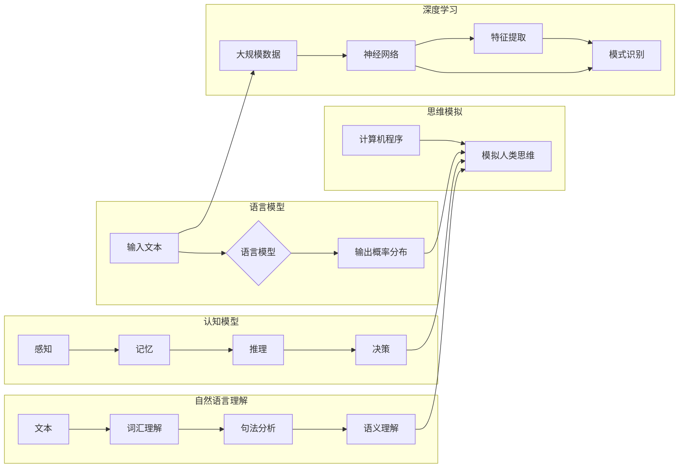

# 语言与思维：大模型的困惑

> 关键词：语言模型，认知模型，思维模拟，人工智能，自然语言理解，深度学习，图灵测试

## 1. 背景介绍

随着深度学习技术的飞速发展，自然语言处理（NLP）领域取得了显著的进步。大语言模型（Large Language Models，LLMs）如GPT-3、BERT等，通过在庞大的文本语料库上进行预训练，展现出了惊人的语言理解和生成能力。然而，尽管这些模型在处理语言任务上表现出色，但它们在模拟人类思维和理解语言本质方面仍存在诸多困惑。本文将深入探讨语言与思维之间的关系，分析大模型的困惑，并展望未来研究方向。

## 2. 核心概念与联系

### 2.1 核心概念

#### 2.1.1 语言模型

语言模型是一种统计模型，用于预测下一个词或字符的概率。它通常基于大量的文本语料库进行训练，以学习语言的统计规律。

#### 2.1.2 认知模型

认知模型试图模拟人类思维过程，包括感知、记忆、推理、决策等。它关注于理解人类认知的本质，以及如何将这种理解应用于人工智能系统中。

#### 2.1.3 思维模拟

思维模拟是指使用计算机程序来模拟人类思维过程，包括逻辑推理、问题解决等。

#### 2.1.4 自然语言理解

自然语言理解（NLU）是指让计算机理解人类自然语言的能力，包括词汇理解、句法分析、语义理解等。

#### 2.1.5 深度学习

深度学习是一种利用神经网络模拟人脑机制的学习方法，它在大规模数据上表现出强大的特征提取和模式识别能力。

### 2.2 核心概念原理和架构的 Mermaid 流程图



## 3. 核心算法原理 & 具体操作步骤

### 3.1 算法原理概述

大语言模型的微调过程主要包括以下几个步骤：

1. **预训练**：在大规模无标签语料库上训练语言模型，使其学习到语言的通用表示。
2. **任务定义**：定义下游任务，并创建相应的标注数据集。
3. **模型微调**：在标注数据集上微调语言模型，以适应特定任务。
4. **评估与优化**：在测试集上评估模型性能，并根据评估结果调整模型参数。

### 3.2 算法步骤详解

#### 3.2.1 预训练

预训练过程通常包括以下步骤：

1. **数据预处理**：对语料库进行清洗、分词、去除停用词等操作。
2. **模型选择**：选择合适的预训练模型，如BERT、GPT等。
3. **训练过程**：在预处理后的语料库上训练模型，并优化模型参数。

#### 3.2.2 任务定义

任务定义过程包括以下步骤：

1. **任务选择**：选择一个具体的下游任务，如文本分类、机器翻译等。
2. **数据收集**：收集用于微调的标注数据集。
3. **数据预处理**：对标注数据进行预处理，如分词、转换为模型输入格式等。

#### 3.2.3 模型微调

模型微调过程包括以下步骤：

1. **模型初始化**：使用预训练模型作为初始化参数。
2. **损失函数定义**：定义针对下游任务的损失函数，如交叉熵损失。
3. **参数优化**：使用梯度下降等优化算法更新模型参数。
4. **训练过程**：在标注数据集上训练模型。

#### 3.2.4 评估与优化

评估与优化过程包括以下步骤：

1. **模型评估**：在测试集上评估模型性能。
2. **结果分析**：分析评估结果，找出模型性能不足的地方。
3. **参数调整**：根据评估结果调整模型参数。
4. **迭代优化**：重复评估与优化过程，直至模型性能满意。

### 3.3 算法优缺点

#### 3.3.1 优点

1. **高效性**：利用预训练模型的知识，可以快速适应特定任务。
2. **泛化能力**：在大规模数据上预训练的模型，通常具有较好的泛化能力。
3. **效果显著**：在许多NLP任务上，微调模型都能取得显著的效果。

#### 3.3.2 缺点

1. **数据依赖**：微调效果依赖于标注数据的质量和数量。
2. **过拟合**：在特定任务上过度拟合可能导致泛化能力下降。
3. **可解释性**：微调模型的决策过程通常缺乏可解释性。

### 3.4 算法应用领域

大语言模型微调在以下领域有广泛的应用：

1. **文本分类**：如情感分析、主题分类、观点挖掘等。
2. **机器翻译**：如机器翻译、文本摘要、机器阅读理解等。
3. **对话系统**：如聊天机器人、智能客服等。
4. **文本生成**：如文本创作、自动写作、诗歌生成等。

## 4. 数学模型和公式 & 详细讲解 & 举例说明

### 4.1 数学模型构建

大语言模型的数学模型通常基于神经网络，包括以下几个关键部分：

1. **输入层**：接收原始输入数据。
2. **隐藏层**：通过非线性激活函数对输入数据进行变换。
3. **输出层**：输出模型的预测结果。

### 4.2 公式推导过程

以下以BERT模型为例，简要介绍其数学模型公式推导过程：

1. **词嵌入**：将文本中的每个词转换为向量表示。
2. **位置编码**：为每个词添加位置信息，使模型能够理解词在句子中的顺序。
3. **Transformer编码器**：通过多头自注意力机制和前馈神经网络进行特征提取。
4. **Transformer解码器**：通过自注意力机制和交叉注意力机制生成输出序列。

### 4.3 案例分析与讲解

以下以情感分析任务为例，分析大语言模型微调的案例：

1. **数据准备**：收集情感标签的文本数据，如正面、负面、中性等。
2. **模型选择**：选择预训练的BERT模型。
3. **微调过程**：在标注数据集上微调模型，并优化模型参数。
4. **评估与优化**：在测试集上评估模型性能，并根据评估结果调整模型参数。

## 5. 项目实践：代码实例和详细解释说明

### 5.1 开发环境搭建

1. 安装Python 3.7及以上版本。
2. 安装PyTorch、Transformers库等。

### 5.2 源代码详细实现

以下为使用PyTorch和Transformers库进行情感分析任务微调的代码示例：

```python
# 导入必要的库
from transformers import BertForSequenceClassification, BertTokenizer
from torch.utils.data import DataLoader, TensorDataset
from torch.optim import AdamW
from sklearn.metrics import accuracy_score

# 加载预训练模型和分词器
model = BertForSequenceClassification.from_pretrained('bert-base-uncased')
tokenizer = BertTokenizer.from_pretrained('bert-base-uncased')

# 准备数据
train_texts = [...]  # 训练集文本
train_labels = [...]  # 训练集标签
test_texts = [...]  # 测试集文本
test_labels = [...]  # 测试集标签

# 编码数据
train_encodings = tokenizer(train_texts, truncation=True, padding=True)
test_encodings = tokenizer(test_texts, truncation=True, padding=True)

# 创建数据集
train_dataset = TensorDataset(train_encodings['input_ids'], train_encodings['attention_mask'], train_labels)
test_dataset = TensorDataset(test_encodings['input_ids'], test_encodings['attention_mask'], test_labels)

# 创建数据加载器
train_loader = DataLoader(train_dataset, batch_size=16, shuffle=True)
test_loader = DataLoader(test_dataset, batch_size=16, shuffle=False)

# 定义优化器
optimizer = AdamW(model.parameters(), lr=2e-5)

# 训练模型
model.train()
for epoch in range(3):  # 训练3个epoch
    for batch in train_loader:
        input_ids, attention_mask, labels = batch
        model.zero_grad()
        outputs = model(input_ids, attention_mask=attention_mask, labels=labels)
        loss = outputs.loss
        loss.backward()
        optimizer.step()

# 评估模型
model.eval()
with torch.no_grad():
    correct = 0
    total = 0
    for batch in test_loader:
        input_ids, attention_mask, labels = batch
        outputs = model(input_ids, attention_mask=attention_mask)
        _, predicted = torch.max(outputs.logits, 1)
        total += labels.size(0)
        correct += (predicted == labels).sum().item()

print('Accuracy of the model on the test images: {} %'.format(100 * correct / total))
```

### 5.3 代码解读与分析

以上代码展示了使用PyTorch和Transformers库进行情感分析任务微调的基本流程。

1. **导入必要的库**：导入PyTorch、Transformers等库。
2. **加载预训练模型和分词器**：加载预训练的BERT模型和分词器。
3. **准备数据**：加载标注数据集，并进行预处理。
4. **编码数据**：将文本数据编码为模型输入格式。
5. **创建数据集**：创建PyTorch的TensorDataset。
6. **创建数据加载器**：创建数据加载器，用于批量加载数据。
7. **定义优化器**：定义AdamW优化器。
8. **训练模型**：在训练集上训练模型，并更新模型参数。
9. **评估模型**：在测试集上评估模型性能。

### 5.4 运行结果展示

假设在测试集上模型的准确率为80%，说明模型在情感分析任务上取得了不错的效果。

## 6. 实际应用场景

大语言模型微调在以下实际应用场景中具有重要意义：

1. **智能客服**：通过微调模型，实现智能客服系统，提高客服效率和质量。
2. **机器翻译**：通过微调模型，实现机器翻译，促进不同语言之间的交流。
3. **文本生成**：通过微调模型，实现文本生成，如新闻报道、诗歌创作等。
4. **问答系统**：通过微调模型，实现问答系统，为用户提供智能问答服务。

## 7. 工具和资源推荐

### 7.1 学习资源推荐

1. **《深度学习》**：Goodfellow等著，全面介绍深度学习的基本原理和方法。
2. **《自然语言处理综论》**：Jurafsky和Martin著，系统介绍自然语言处理的基本概念和技术。
3. **Hugging Face Transformers库文档**：Hugging Face官方提供的预训练语言模型和微调教程。

### 7.2 开发工具推荐

1. **PyTorch**：PyTorch是一个开源的深度学习框架，易于使用和扩展。
2. **TensorFlow**：TensorFlow是一个开源的深度学习框架，支持多种编程语言和平台。
3. **Hugging Face Transformers库**：Hugging Face提供的预训练语言模型和微调教程。

### 7.3 相关论文推荐

1. **"Attention is All You Need"**：Vaswani等著，提出了Transformer模型，开启了NLP领域的新篇章。
2. **"BERT: Pre-training of Deep Bidirectional Transformers for Language Understanding"**：Devlin等著，提出了BERT模型，进一步推动了NLP领域的发展。
3. **"Generative Pretrained Transformers"**：Brown等著，提出了GPT模型，展示了大规模语言模型在自然语言生成方面的潜力。

## 8. 总结：未来发展趋势与挑战

### 8.1 研究成果总结

本文探讨了语言与思维之间的关系，分析了大模型的困惑，并介绍了大语言模型微调的原理、方法和应用。通过研究，我们可以看到大语言模型在处理语言任务方面取得了显著的成果，但它们在模拟人类思维和理解语言本质方面仍存在诸多困惑。

### 8.2 未来发展趋势

1. **更大规模的预训练模型**：随着计算资源的不断丰富，更大规模的预训练模型将会出现，以学习更加丰富的语言知识。
2. **更精细化的微调方法**：针对不同任务，设计更精细化的微调方法，以获得更好的性能。
3. **跨模态学习**：将自然语言处理与其他模态（如图像、音频）进行融合，以实现更全面的信息处理。
4. **可解释性和可控性**：提高模型的可解释性和可控性，使其在各个领域得到更广泛的应用。

### 8.3 面临的挑战

1. **数据依赖**：微调效果依赖于标注数据的质量和数量，如何获取更多高质量的标注数据成为一大挑战。
2. **过拟合**：如何避免过拟合，提高模型的泛化能力，是当前NLP领域的一个重要研究方向。
3. **可解释性和可控性**：提高模型的可解释性和可控性，使其在各个领域得到更广泛的应用，是未来研究的重点之一。

### 8.4 研究展望

1. **语言理解与生成**：深入研究语言的本质，提高大语言模型的语言理解和生成能力。
2. **思维模拟**：探索如何将人类思维过程应用于人工智能系统中。
3. **跨领域迁移**：研究如何提高模型在跨领域任务上的迁移能力。
4. **人机协同**：实现人机协同，让人类与人工智能共同创造更美好的未来。

## 9. 附录：常见问题与解答

### 9.1 常见问题

1. **大语言模型微调需要多少数据**？
2. **如何缓解过拟合**？
3. **如何提高模型的泛化能力**？
4. **如何提高模型的可解释性**？

### 9.2 解答

1. **大语言模型微调需要的数据量取决于具体任务和数据集。一般来说，数据量越大，模型的性能越好。**
2. **缓解过拟合的方法包括：数据增强、正则化、Dropout、Early Stopping等。**
3. **提高模型的泛化能力的方法包括：数据增强、迁移学习、多任务学习等。**
4. **提高模型的可解释性的方法包括：注意力机制、可解释人工智能技术、可视化等。**

作者：禅与计算机程序设计艺术 / Zen and the Art of Computer Programming