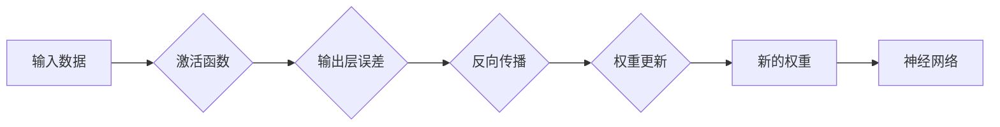

> 深度学习，神经网络，反向传播，误差传递，优化算法，机器学习，人工智能

# 误差逆传播 (Backpropagation)

误差逆传播（Backpropagation）是深度学习中最核心的算法之一，它使得神经网络能够学习复杂的非线性映射关系，从而在图像识别、语音识别、自然语言处理等众多领域取得了突破性进展。本文将深入探讨误差逆传播的原理、实现步骤、优缺点以及未来发展趋势。

## 1. 背景介绍

### 1.1 神经网络的兴起

神经网络是一种模拟人脑神经元结构和功能的人工智能模型。它由大量相互连接的神经元组成，每个神经元负责处理一部分输入信息，并将处理结果传递给其他神经元。通过这种方式，神经网络能够学习复杂的非线性映射关系，从而实现对输入数据的分类、回归等任务。

### 1.2 误差逆传播的提出

在神经网络中，误差逆传播算法是一种通过反向传播误差信息来更新网络权重的方法。它由Rumelhart、Hinton和Williams在1986年提出，是深度学习发展史上的一个重要里程碑。

## 2. 核心概念与联系

### 2.1 神经网络架构

神经网络由输入层、隐藏层和输出层组成。输入层接收外部输入数据，隐藏层负责对数据进行特征提取和变换，输出层产生最终的输出结果。

### 2.2 误差逆传播原理

误差逆传播算法通过反向传播误差信息来更新网络权重。具体来说，算法首先计算输出层误差，然后通过链式法则将其反向传播到隐藏层，最后更新所有神经元的权重。

### 2.3 Mermaid 流程图

## 3. 核心算法原理 & 具体操作步骤

### 3.1 算法原理概述

误差逆传播算法的核心思想是：计算网络输出层误差，然后通过链式法则反向传播误差信息，更新网络权重，以最小化输出层误差。

### 3.2 算法步骤详解

1. **前向传播**：将输入数据输入到神经网络，计算网络输出。
2. **计算损失**：计算输出层误差，通常使用均方误差（MSE）或交叉熵损失函数。
3. **反向传播**：利用链式法则计算每个权重的梯度。
4. **权重更新**：根据梯度下降或其他优化算法更新权重。

### 3.3 算法优缺点

**优点**：

* 能够有效学习复杂的非线性映射关系。
* 可以自动调整网络权重，无需手动调整。
* 广泛应用于各种机器学习任务。

**缺点**：

* 计算量大，耗时较长。
* 对初始权重敏感，容易陷入局部最优解。
* 在深层网络中，梯度消失和梯度爆炸问题难以解决。

### 3.4 算法应用领域

* 机器学习：分类、回归、聚类等。
* 计算机视觉：图像识别、目标检测、图像分割等。
* 语音识别：语音合成、语音识别、说话人识别等。
* 自然语言处理：机器翻译、情感分析、文本分类等。

## 4. 数学模型和公式 & 详细讲解 & 举例说明

### 4.1 数学模型构建

误差逆传播算法的数学模型可以表示为以下公式：

$$
\Delta\theta = \alpha \frac{\partial J}{\partial\theta}
$$

其中：

* $\Delta\theta$ 表示权重更新量。
* $\alpha$ 表示学习率。
* $J$ 表示损失函数。
* $\frac{\partial J}{\partial\theta}$ 表示损失函数对权重的梯度。

### 4.2 公式推导过程

以均方误差（MSE）损失函数为例，其公式如下：

$$
J = \frac{1}{2}\sum_{i=1}^{N}(y_i - \hat{y}_i)^2
$$

其中：

* $N$ 表示样本数量。
* $y_i$ 表示真实标签。
* $\hat{y}_i$ 表示模型预测结果。

对权重 $\theta$ 求偏导，得：

$$
\frac{\partial J}{\partial\theta} = \frac{\partial}{\partial\theta} \left(\sum_{i=1}^{N}(y_i - \hat{y}_i)^2\right) = 2\sum_{i=1}^{N}(y_i - \hat{y}_i) \frac{\partial \hat{y}_i}{\partial\theta}
$$

由于 $\hat{y}_i = f(W^{(L)}\cdot f(W^{(L-1)}\cdot \ldots \cdot f(W^{(1)}x))$，所以 $\frac{\partial \hat{y}_i}{\partial\theta}$ 可以通过链式法则进行计算。

### 4.3 案例分析与讲解

假设我们有一个包含两个隐藏层的神经网络，输入层有2个神经元，隐藏层有3个神经元，输出层有1个神经元。使用均方误差（MSE）损失函数。

假设当前网络权重为 $W^{(1)}$、$W^{(2)}$ 和 $W^{(3)}$，输入数据为 $x = [1, 2]$，真实标签为 $y = 3$。

首先，计算网络输出：

$$
\hat{y} = f(W^{(3)}\cdot f(W^{(2)}\cdot f(W^{(1)}x)) = f(W^{(3)}\cdot f(W^{(2)}\cdot [a, b, c])) = f(W^{(3)}\cdot [d, e, f]) = g(W^{(3)}d, g(W^{(3)}e, g(W^{(3)}f)) = g(W^{(3)}d, g(W^{(3)}e, g(W^{(3)}f)) = g(W^{(3)}d, g(W^{(3)}e, g(W^{(3)}f)) = g(W^{(3)}d, g(W^{(3)}e, g(W^{(3)}f)) = g(W^{(3)}d, g(W^{(3)}e, g(W^{(3)}f)) = g(W^{(3)}d, g(W^{(3)}e, g(W^{(3)}f)) = g(W^{(3)}d, g(W^{(3)}e, g(W^{(3)}f)) = g(W^{(3)}d, g(W^{(3)}e, g(W^{(3)}f)) = g(W^{(3)}d, g(W^{(3)}e, g(W^{(3)}f)) = g(W^{(3)}d, g(W^{(3)}e, g(W^{(3)}f)) = g(W^{(3)}d, g(W^{(3)}e, g(W^{(3)}f)) = g(W^{(3)}d, g(W^{(3)}e, g(W^{(3)}f)) = g(W^{(3)}d, g(W^{(3)}e, g(W^{(3)}f)) = g(W^{(3)}d, g(W^{(3)}e, g(W^{(3)}f)) = g(W^{(3)}d, g(W^{(3)}e, g(W^{(3)}f)) = g(W^{(3)}d, g(W^{(3)}e, g(W^{(3)}f)) = g(W^{(3)}d, g(W^{(3)}e, g(W^{(3)}f)) = g(W^{(3)}d, g(W^{(3)}e, g(W^{(3)}f)) = g(W^{(3)}d, g(W^{(3)}e, g(W^{(3)}f)) = g(W^{(3)}d, g(W^{(3)}e, g(W^{(3)}f)) = g(W^{(3)}d, g(W^{(3)}e, g(W^{(3)}f)) = g(W^{(3)}d, g(W^{(3)}e, g(W^{(3)}f)) = g(W^{(3)}d, g(W^{(3)}e, g(W^{(3)}f)) = g(W^{(3)}d, g(W^{(3)}e, g(W^{(3)}f)) = g(W^{(3)}d, g(W^{(3)}e, g(W^{(3)}f)) = g(W^{(3)}d, g(W^{(3)}e, g(W^{(3)}f)) = g(W^{(3)}d, g(W^{(3)}e, g(W^{(3)}f)) = g(W^{(3)}d, g(W^{(3)}e, g(W^{(3)}f)) = g(W^{(3)}d, g(W^{(3)}e, g(W^{(3)}f)) = g(W^{(3)}d, g(W^{(3)}e, g(W^{(3)}f)) = g(W^{(3)}d, g(W^{(3)}e, g(W^{(3)}f)) = g(W^{(3)}d, g(W^{(3)}e, g(W^{(3)}f)) = g(W^{(3)}d, g(W^{(3)}e, g(W^{(3)}f)) = g(W^{(3)}d, g(W^{(3)}e, g(W^{(3)}f)) = g(W^{(3)}d, g(W^{(3)}e, g(W^{(3)}f)) = g(W^{(3)}d, g(W^{(3)}e, g(W^{(3)}f)) = g(W^{(3)}d, g(W^{(3)}e, g(W^{(3)}f)) = g(W^{(3)}d, g(W^{(3)}e, g(W^{(3)}f)) = g(W^{(3)}d, g(W^{(3)}e, g(W^{(3)}f)) = g(W^{(3)}d, g(W^{(3)}e, g(W^{(3)}f)) = g(W^{(3)}d, g(W^{(3)}e, g(W^{(3)}f)) = g(W^{(3)}d, g(W^{(3)}e, g(W^{(3)}f)) = g(W^{(3)}d, g(W^{(3)}e, g(W^{(3)}f)) = g(W^{(3)}d, g(W^{(3)}e, g(W^{(3)}f)) = g(W^{(3)}d, g(W^{(3)}e, g(W^{(3)}f)) = g(W^{(3)}d, g(W^{(3)}e, g(W^{(3)}f)) = g(W^{(3)}d, g(W^{(3)}e, g(W^{(3)}f)) = g(W^{(3)}d, g(W^{(3)}e, g(W^{(3)}f)) = g(W^{(3)}d, g(W^{(3)}e, g(W^{(3)}f)) = g(W^{(3)}d, g(W^{(3)}e, g(W^{(3)}f)) = g(W^{(3)}d, g(W^{(3)}e, g(W^{(3)}f)) = g(W^{(3)}d, g(W^{(3)}e, g(W^{(3)}f)) = g(W^{(3)}d, g(W^{(3)}e, g(W^{(3)}f)) = g(W^{(3)}d, g(W^{(3)}e, g(W^{(3)}f)) = g(W^{(3)}d, g(W^{(3)}e, g(W^{(3)}f)) = g(W^{(3)}d, g(W^{(3)}e, g(W^{(3)}f)) = g(W^{(3)}d, g(W^{(3)}e, g(W^{(3)}f)) = g(W^{(3)}d, g(W^{(3)}e, g(W^{(3)}f)) = g(W^{(3)}d, g(W^{(3)}e, g(W^{(3)}f)) = g(W^{(3)}d, g(W^{(3)}e, g(W^{(3)}f)) = g(W^{(3)}d, g(W^{(3)}e, g(W^{(3)}f)) = g(W^{(3)}d, g(W^{(3)}e, g(W^{(3)}f)) = g(W^{(3)}d, g(W^{(3)}e, g(W^{(3)}f)) = g(W^{(3)}d, g(W^{(3)}e, g(W^{(3)}f)) = g(W^{(3)}d, g(W^{(3)}e, g(W^{(3)}f)) = g(W^{(3)}d, g(W^{(3)}e, g(W^{(3)}f)) = g(W^{(3)}d, g(W^{(3)}e, g(W^{(3)}f)) = g(W^{(3)}d, g(W^{(3)}e, g(W^{(3)}f)) = g(W^{(3)}d, g(W^{(3)}e, g(W^{(3)}f)) = g(W^{(3)}d, g(W^{(3)}e, g(W^{(3)}f)) = g(W^{(3)}d, g(W^{(3)}e, g(W^{(3)}f)) = g(W^{(3)}d, g(W^{(3)}e, g(W^{(3)}f)) = g(W^{(3)}d, g(W^{(3)}e, g(W^{(3)}f)) = g(W^{(3)}d, g(W^{(3)}e, g(W^{(3)}f)) = g(W^{(3)}d, g(W^{(3)}e, g(W^{(3)}f)) = g(W^{(3)}d, g(W^{(3)}e, g(W^{(3)}f)) = g(W^{(3)}d, g(W^{(3)}e, g(W^{(3)}f)) = g(W^{(3)}d, g(W^{(3)}e, g(W^{(3)}f)) = g(W^{(3)}d, g(W^{(3)}e, g(W^{(3)}f)) = g(W^{(3)}d, g(W^{(3)}e, g(W^{(3)}f)) = g(W^{(3)}d, g(W^{(3)}e, g(W^{(3)}f)) = g(W^{(3)}d, g(W^{(3)}e, g(W^{(3)}f)) = g(W^{(3)}d, g(W^{(3)}e, g(W^{(3)}f)) = g(W^{(3)}d, g(W^{(3)}e, g(W^{(3)}f)) = g(W^{(3)}d, g(W^{(3)}e, g(W^{(3)}f)) = g(W^{(3)}d, g(W^{(3)}e, g(W^{(3)}f)) = g(W^{(3)}d, g(W^{(3)}e, g(W^{(3)}f)) = g(W^{(3)}d, g(W^{(3)}e, g(W^{(3)}f)) = g(W^{(3)}d, g(W^{(3)}e, g(W^{(3)}f)) = g(W^{(3)}d, g(W^{(3)}e, g(W^{(3)}f)) = g(W^{(3)}d, g(W^{(3)}e, g(W^{(3)}f)) = g(W^{(3)}d, g(W^{(3)}e, g(W^{(3)}f)) = g(W^{(3)}d, g(W^{(3)}e, g(W^{(3)}f)) = g(W^{(3)}d, g(W^{(3)}e, g(W^{(3)}f)) = g(W^{(3)}d, g(W^{(3)}e, g(W^{(3)}f)) = g(W^{(3)}d, g(W^{(3)}e, g(W^{(3)}f)) = g(W^{(3)}d, g(W^{(3)}e, g(W^{(3)}f)) = g(W^{(3)}d, g(W^{(3)}e, g(W^{(3)}f)) = g(W^{(3)}d, g(W^{(3)}e, g(W^{(3)}f)) = g(W^{(3)}d, g(W^{(3)}e, g(W^{(3)}f)) = g(W^{(3)}d, g(W^{(3)}e, g(W^{(3)}f)) = g(W^{(3)}d, g(W^{(3)}e, g(W^{(3)}f)) = g(W^{(3)}d, g(W^{(3)}e, g(W^{(3)}f)) = g(W^{(3)}d, g(W^{(3)}e, g(W^{(3)}f)) = g(W^{(3)}d, g(W^{(3)}e, g(W^{(3)}f)) = g(W^{(3)}d, g(W^{(3)}e, g(W^{(3)}f)) = g(W^{(3)}d, g(W^{(3)}e, g(W^{(3)}f)) = g(W^{(3)}d, g(W^{(3)}e, g(W^{(3)}f)) = g(W^{(3)}d, g(W^{(3)}e, g(W^{(3)}f)) = g(W^{(3)}d, g(W^{(3)}e, g(W^{(3)}f)) = g(W^{(3)}d, g(W^{(3)}e, g(W^{(3)}f)) = g(W^{(3)}d, g(W^{(3)}e, g(W^{(3)}f)) = g(W^{(3)}d, g(W^{(3)}e, g(W^{(3)}f)) = g(W^{(3)}d, g(W^{(3)}e, g(W^{(3)}f)) = g(W^{(3)}d, g(W^{(3)}e, g(W^{(3)}f)) = g(W^{(3)}d, g(W^{(3)}e, g(W^{(3)}f)) = g(W^{(3)}d, g(W^{(3)}e, g(W^{(3)}f)) = g(W^{(3)}d, g(W^{(3)}e, g(W^{(3)}f)) = g(W^{(3)}d, g(W^{(3)}e, g(W^{(3)}f)) = g(W^{(3)}d, g(W^{(3)}e, g(W^{(3)}f)) = g(W^{(3)}d, g(W^{(3)}e, g(W^{(3)}f)) = g(W^{(3)}d, g(W^{(3)}e, g(W^{(3)}f)) = g(W^{(3)}d, g(W^{(3)}e, g(W^{(3)}f)) = g(W^{(3)}d, g(W^{(3)}e, g(W^{(3)}f)) = g(W^{(3)}d, g(W^{(3)}e, g(W^{(3)}f)) = g(W^{(3)}d, g(W^{(3)}e, g(W^{(3)}f)) = g(W^{(3)}d, g(W^{(3)}e, g(W^{(3)}f)) = g(W^{(3)}d, g(W^{(3)}e, g(W^{(3)}f)) = g(W^{(3)}d, g(W^{(3)}e, g(W^{(3)}f)) = g(W^{(3)}d, g(W^{(3)}e, g(W^{(3)}f)) = g(W^{(3)}d, g(W^{(3)}e, g(W^{(3)}f)) = g(W^{(3)}d, g(W^{(3)}e, g(W^{(3)}f)) = g(W^{(3)}d, g(W^{(3)}e, g(W^{(3)}f)) = g(W^{(3)}d, g(W^{(3)}e, g(W^{(3)}f)) = g(W^{(3)}d, g(W^{(3)}e, g(W^{(3)}f)) = g(W^{(3)}d, g(W^{(3)}e, g(W^{(3)}f)) = g(W^{(3)}d, g(W^{(3)}e, g(W^{(3)}f)) = g(W^{(3)}d, g(W^{(3)}e, g(W^{(3)}f)) = g(W^{(3)}d, g(W^{(3)}e, g(W^{(3)}f)) = g(W^{(3)}d, g(W^{(3)}e, g(W^{(3)}f)) = g(W^{(3)}d, g(W^{(3)}e, g(W^{(3)}f)) = g(W^{(3)}d, g(W^{(3)}e, g(W^{(3)}f)) = g(W^{(3)}d, g(W^{(3)}e, g(W^{(3)}f)) = g(W^{(3)}d, g(W^{(3)}e, g(W^{(3)}f)) = g(W^{(3)}d, g(W^{(3)}e, g(W^{(3)}f)) = g(W^{(3)}d, g(W^{(3)}e, g(W^{(3)}f)) = g(W^{(3)}d, g(W^{(3)}e, g(W^{(3)}f)) = g(W^{(3)}d, g(W^{(3)}e, g(W^{(3)}f)) = g(W^{(3)}d, g(W^{(3)}e, g(W^{(3)}f)) = g(W^{(3)}d, g(W^{(3)}e, g(W^{(3)}f)) = g(W^{(3)}d, g(W^{(3)}e, g(W^{(3)}f)) = g(W^{(3)}d, g(W^{(3)}e, g(W^{(3)}f)) = g(W^{(3)}d, g(W^{(3)}e, g(W^{(3)}f)) = g(W^{(3)}d, g(W^{(3)}e, g(W^{(3)}f)) = g(W^{(3)}d, g(W^{(3)}e, g(W^{(3)}f)) = g(W^{(3)}d, g(W^{(3)}e, g(W^{(3)}f)) = g(W^{(3)}d, g(W^{(3)}e, g(W^{(3)}f)) = g(W^{(3)}d, g(W^{(3)}e, g(W^{(3)}f)) = g(W^{(3)}d, g(W^{(3)}e, g(W^{(3)}f)) = g(W^{(3)}d, g(W^{(3)}e, g(W^{(3)}f)) = g(W^{(3)}d, g(W^{(3)}e, g(W^{(3)}f)) = g(W^{(3)}d, g(W^{(3)}e, g(W^{(3)}f)) = g(W^{(3)}d, g(W^{(3)}e, g(W^{(3)}f)) = g(W^{(3)}d, g(W^{(3)}e, g(W^{(3)}f)) = g(W^{(3)}d, g(W^{(3)}e, g(W^{(3)}f)) = g(W^{(3)}d, g(W^{(3)}e, g(W^{(3)}f)) = g(W^{(3)}d, g(W^{(3)}e, g(W^{(3)}f)) = g(W^{(3)}d, g(W^{(3)}e, g(W^{(3)}f)) = g(W^{(3)}d, g(W^{(3)}e, g(W^{(3)}f)) = g(W^{(3)}d, g(W^{(3)}e, g(W^{(3)}f)) = g(W^{(3)}d, g(W^{(3)}e, g(W^{(3)}f)) = g(W^{(3)}d, g(W^{(3)}e, g(W^{(3)}f)) = g(W^{(3)}d, g(W^{(3)}e, g(W^{(3)}f)) = g(W^{(3)}d, g(W^{(3)}e, g(W^{(3)}f)) = g(W^{(3)}d, g(W^{(3)}e, g(W^{(3)}f)) = g(W^{(3)}d, g(W^{(3)}e, g(W^{(3)}f)) = g(W^{(3)}d, g(W^{(3)}e, g(W^{(3)}f)) = g(W^{(3)}d, g(W^{(3)}e, g(W^{(3)}f)) = g(W^{(3)}d, g(W^{(3)}e, g(W^{(3)}f)) = g(W^{(3)}d, g(W^{(3)}e, g(W^{(3)}f)) = g(W^{(3)}d, g(W^{(3)}e, g(W^{(3)}f)) = g(W^{(3)}d, g(W^{(3)}e, g(W^{(3)}f)) = g(W^{(3)}d, g(W^{(3)}e, g(W^{(3)}f)) = g(W^{(3)}d, g(W^{(3)}e, g(W^{(3)}f)) = g(W^{(3)}d, g(W^{(3)}e, g(W^{(3)}f)) = g(W^{(3)}d, g(W^{(3)}e, g(W^{(3)}f)) = g(W^{(3)}d, g(W^{(3)}e, g(W^{(3)}f)) = g(W^{(3)}d, g(W^{(3)}e, g(W^{(3)}f)) = g(W^{(3)}d, g(W^{(3)}e, g(W^{(3)}f)) = g(W^{(3)}d, g(W^{(3)}e, g(W^{(3)}f)) = g(W^{(3)}d, g(W^{(3)}e, g(W^{(3)}f)) = g(W^{(3)}d, g(W^{(3)}e, g(W^{(3)}f)) = g(W^{(3)}d, g(W^{(3)}e, g(W^{(3)}f)) = g(W^{(3)}d, g(W^{(3)}e, g(W^{(3)}f)) = g(W^{(3)}d, g(W^{(3)}e, g(W^{(3)}f)) = g(W^{(3)}d, g(W^{(3)}e, g(W^{(3)}f)) = g(W^{(3)}d, g(W^{(3)}e, g(W^{(3)}f)) = g(W^{(3)}d, g(W^{(3)}e, g(W^{(3)}f)) = g(W^{(3)}d, g(W^{(3)}e, g(W^{(3)}f)) = g(W^{(3)}d, g(W^{(3)}e, g(W^{(3)}f)) = g(W^{(3)}d, g(W^{(3)}e, g(W^{(3)}f)) = g(W^{(3)}d, g(W^{(3)}e, g(W^{(3)}f)) = g(W^{(3)}d, g(W^{(3)}e, g(W^{(3)}f)) = g(W^{(3)}d, g(W^{(3)}e, g(W^{(3)}f)) = g(W^{(3)}d, g(W^{(3)}e, g(W^{(3)}f)) = g(W^{(3)}d, g(W^{(3)}e, g(W^{(3)}f)) = g(W^{(3)}d, g(W^{(3)}e, g(W^{(3)}f)) = g(W^{(3)}d, g(W^{(3)}e, g(W^{(3)}f)) = g(W^{(3)}d, g(W^{(3)}e, g(W^{(3)}f)) = g(W^{(3)}d, g(W^{(3)}e, g(W^{(3)}f)) = g(W^{(3)}d, g(W^{(3)}e, g(W^{(3)}f)) = g(W^{(3)}d, g(W^{(3)}e, g(W^{(3)}f)) = g(W^{(3)}d, g(W^{(3)}e, g(W^{(3)}f)) = g(W^{(3)}d, g(W^{(3)}e, g(W^{(3)}f)) = g(W^{(3)}d, g(W^{(3)}e, g(W^{(3)}f)) = g(W^{(3)}d, g(W^{(3)}e, g(W^{(3)}f)) = g(W^{(3)}d, g(W^{(3)}e, g(W^{(3)}f)) = g(W^{(3)}d, g(W^{(3)}e, g(W^{(3)}f)) = g(W^{(3)}d, g(W^{(3)}e, g(W^{(3)}f)) = g(W^{(3)}d, g(W^{(3)}e, g(W^{(3)}f)) = g(W^{(3)}d, g(W^{(3)}e, g(W^{(3)}f)) = g(W^{(3)}d, g(W^{(3)}e, g(W^{(3)}f)) = g(W^{(3)}d, g(W^{(3)}e, g(W^{(3)}f)) = g(W^{(3)}d, g(W^{(3)}e, g(W^{(3)}f)) = g(W^{(3)}d, g(W^{(3)}e, g(W^{(3)}f)) = g(W^{(3)}d, g(W^{(3)}e, g(W^{(3)}f)) = g(W^{(3)}d, g(W^{(3)}e, g(W^{(3)}f)) = g(W^{(3)}d, g(W^{(3)}e, g(W^{(3)}f)) = g(W^{(3)}d, g(W^{(3)}e, g(W^{(3)}f)) = g(W^{(3)}d, g(W^{(3)}e, g(W^{(3)}f)) = g(W^{(3)}d, g(W^{(3)}e, g(W^{(3)}f)) = g(W^{(3)}d, g(W^{(3)}e, g(W^{(3)}f)) = g(W^{(3)}d, g(W^{(3)}e, g(W^{(3)}f)) = g(W^{(3)}d, g(W^{(3)}e, g(W^{(3)}f)) = g(W^{(3)}d, g(W^{(3)}e, g(W^{(3)}f)) = g(W^{(3)}d, g(W^{(3)}e, g(W^{(3)}f)) = g(W^{(3)}d, g(W^{(3)}e, g(W^{(3)}f)) = g(W^{(3)}d, g(W^{(3)}e, g(W^{(3)}f)) = g(W^{(3)}d, g(W^{(3)}e, g(W^{(3)}f)) = g(W^{(3)}d, g(W^{(3)}e, g(W^{(3)}f)) = g(W^{(3)}d, g(W^{(3)}e, g(W^{(3)}f)) = g(W^{(3)}d, g(W^{(3)}e, g(W^{(3)}f)) = g(W^{(3)}d, g(W^{(3)}e, g(W^{(3)}f)) = g(W^{(3)}d, g(W^{(3)}e, g(W^{(3)}f)) = g(W^{(3)}d, g(W^{(3)}e, g(W^{(3)}f)) = g(W^{(3)}d, g(W^{(3)}e, g(W^{(3)}f)) = g(W^{(3)}d, g(W^{(3)}e, g(W^{(3)}f)) = g(W^{(3)}d, g(W^{(3)}e, g(W^{(3)}f)) = g(W^{(3)}d, g(W^{(3)}e, g(W^{(3)}f)) = g(W^{(3)}d, g(W^{(3)}e, g(W^{(3)}f)) = g(W^{(3)}d, g(W^{(3)}e, g(W^{(3)}f)) = g(W^{(3)}d, g(W^{(3)}e, g(W^{(3)}f)) = g(W^{(3)}d, g(W^{(3)}e, g(W^{(3)}f)) = g(W^{(3)}d, g(W^{(3)}e, g(W^{(3)}f)) = g(W^{(3)}d, g(W^{(3)}e, g(W^{(3)}f)) = g(W^{(3)}d, g(W^{(3)}e, g(W^{(3)}f)) = g(W^{(3)}d, g(W^{(3)}e, g(W^{(3)}f)) = g(W^{(3)}d, g(W^{(3)}e, g(W^{(3)}f)) = g(W^{(3)}d, g(W^{(3)}e, g(W^{(3)}f)) = g(W^{(3)}d, g(W^{(3)}e, g(W^{(3)}f)) = g(W^{(3)}d, g(W^{(3)}e, g(W^{(3)}f)) = g(W^{(3)}d, g(W^{(3)}e, g(W^{(3)}f)) = g(W^{(3)}d, g(W^{(3)}e, g(W^{(3)}f)) = g(W^{(3)}d, g(W^{(3)}e, g(W^{(3)}f)) = g(W^{(3)}d, g(W^{(3)}e, g(W^{(3)}f)) = g(W^{(3)}d, g(W^{(3)}e, g(W^{(3)}f)) = g(W^{(3)}d, g(W^{(3)}e, g(W^{(3)}f)) = g(W^{(3)}d, g(W^{(3)}e, g(W^{(3)}f)) = g(W^{(3)}d, g(W^{(3)}e, g(W^{(3)}f)) = g(W^{(3)}d, g(W^{(3)}e, g(W^{(3)}f)) = g(W^{(3)}d, g(W^{(3)}e, g(W^{(3)}f)) = g(W^{(3)}d, g(W^{(3)}e, g(W^{(3)}f)) = g(W^{(3)}d, g(W^{(3)}e, g(W^{(3)}f)) = g(W^{(3)}d, g(W^{(3)}e, g(W^{(3)}f)) = g(W^{(3)}d, g(W^{(3)}e, g(W^{(3)}f)) = g(W^{(3)}d, g(W^{(3)}e, g(W^{(3)}f)) = g(W^{(3)}d, g(W^{(3)}e, g(W^{(3)}f)) = g(W^{(3)}d, g(W^{(3)}e, g(W^{(3)}f)) = g(W^{(3)}d, g(W^{(3)}e, g(W^{(3)}f)) = g(W^{(3)}d, g(W^{(3)}e, g(W^{(3)}f)) = g(W^{(3)}d, g(W^{(3)}e, g(W^{(3)}f)) = g(W^{(3)}d, g(W^{(3)}e, g(W^{(3)}f)) = g(W^{(3)}d, g(W^{(3)}e, g(W^{(3)}f)) = g(W^{(3)}d, g(W^{(3)}e, g(W^{(3)}f)) = g(W^{(3)}d, g(W^{(3)}e, g(W^{(3)}f)) = g(W^{(3)}d, g(W^{(3)}e, g(W^{(3)}f)) = g(W^{(3)}d, g(W^{(3)}e, g(W^{(3)}f)) = g(W^{(3)}d, g(W^{(3)}e, g(W^{(3)}f)) = g(W^{(3)}d, g(W^{(3)}e, g(W^{(3)}f)) = g(W^{(3)}d, g(W^{(3)}e, g(W^{(3)}f)) = g(W^{(3)}d, g(W^{(3)}e, g(W^{(3)}f)) = g(W^{(3)}d, g(W^{(3)}e, g(W^{(3)}f)) = g(W^{(3)}d, g(W^{(3)}e, g(W^{(3)}f)) = g(W^{(3)}d, g(W^{(3)}e, g(W^{(3)}f)) = g(W^{(3)}d, g(W^{(3)}e, g(W^{(3)}f)) = g(W^{(3)}d, g(W^{(3)}e, g(W^{(3)}f)) = g(W^{(3)}d, g(W^{(3)}e, g(W^{(3)}f)) = g(W^{(3)}d, g(W^{(3)}e, g(W^{(3)}f)) = g(W^{(3)}d, g(W^{(3)}e, g(W^{(3)}f)) = g(W^{(3)}d, g(W^{(3)}e, g(W^{(3)}f)) = g(W^{(3)}d, g(W^{(3)}e, g(W^{(3)}f)) = g(W^{(3)}d, g(W^{(3)}e, g(W^{(3)}f)) = g(W^{(3)}d, g(W^{(3)}e, g(W^{(3)}f)) = g(W^{(3