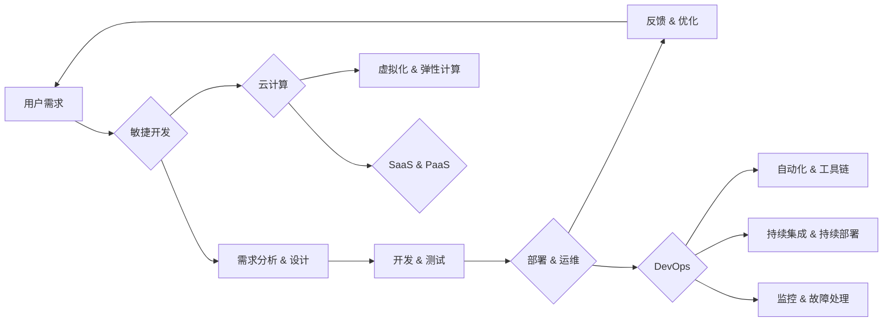

# 软件 2.0 的价值：提升效率、创造价值

> 关键词：软件 2.0，软件架构，敏捷开发，云计算，DevOps，微服务，数字化转型，价值流

## 1. 背景介绍

自计算机诞生以来，软件行业经历了从软件1.0到软件2.0的演变。软件1.0时代，软件是封闭、孤岛式的，功能和性能是主要关注点。而软件2.0时代，软件的开放性、协作性和服务化成为核心，其价值在于提升效率、创造价值。本文将探讨软件2.0的核心概念、价值、架构原则和实际应用，以期为软件开发者、架构师和IT领导者提供参考。

### 1.1 软件1.0到软件2.0的转变

软件1.0时代，软件的主要特征如下：

- **封闭性**：软件系统通常由单一组织内部开发，与其他系统之间的交互性较差。
- **孤岛式**：软件系统之间缺乏协同，难以共享数据和资源。
- **关注点单一**：主要关注软件的功能和性能，忽视用户体验和业务价值。

随着互联网的兴起，软件1.0时代的局限性逐渐显现，软件2.0时代应运而生。软件2.0的主要特征如下：

- **开放性**：软件系统采用开放接口，便于与其他系统进行集成和交互。
- **协作性**：软件系统支持多人协作开发、测试、部署和维护。
- **服务化**：软件系统以服务的形式提供服务，实现资源共享和按需使用。

### 1.2 软件2.0的价值

软件2.0的价值主要体现在以下几个方面：

- **提升效率**：通过自动化、流程优化和协作，提高软件开发、测试、部署和维护的效率。
- **创造价值**：通过满足用户需求、优化业务流程和创新产品，为企业和个人创造价值。
- **增强用户体验**：提供更加个性化和便捷的用户体验，提升用户满意度。

## 2. 核心概念与联系

### 2.1 核心概念

软件2.0的核心概念包括：

- **敏捷开发**：强调快速迭代、灵活适应变化和持续交付。
- **云计算**：提供弹性、按需使用的计算资源和服务。
- **DevOps**：融合开发、运维，实现快速、可靠地交付软件。
- **微服务**：将大型应用程序拆分为小型、独立的服务，提高可扩展性和灵活性。

### 2.2 架构原理和流程图

以下为软件2.0架构原理和流程图：



该流程图展示了软件2.0的架构原理，包括需求分析、开发、测试、部署、运维和优化等环节，以及与敏捷开发、云计算、DevOps和微服务的关系。

## 3. 核心算法原理 & 具体操作步骤

### 3.1 算法原理概述

软件2.0的算法原理主要包括：

- **敏捷开发**：Scrum、Kanban等敏捷方法。
- **云计算**：虚拟化、容器化等技术。
- **DevOps**：自动化工具、持续集成/持续部署(CI/CD)流程。
- **微服务**：RESTful API、服务网格等技术。

### 3.2 算法步骤详解

以下为软件2.0的具体操作步骤：

1. **需求分析**：收集用户需求，明确软件功能、性能和用户体验等方面的要求。
2. **设计**：设计软件架构，包括技术选型、模块划分和接口设计。
3. **开发**：按照设计文档进行开发，实现软件功能。
4. **测试**：进行单元测试、集成测试和系统测试，确保软件质量。
5. **部署**：将软件部署到生产环境，包括配置服务器、部署应用程序等。
6. **运维**：监控软件运行状态，进行故障处理和性能优化。
7. **反馈**：收集用户反馈，分析软件性能和用户体验问题。
8. **优化**：根据用户反馈和性能分析结果，对软件进行优化和迭代。

### 3.3 算法优缺点

软件2.0的算法具有以下优点：

- **快速迭代**：敏捷开发、DevOps和微服务等技术支持快速迭代，提高开发效率。
- **灵活适应**：云计算、容器化等技术提供弹性的计算资源，便于适应业务变化。
- **高可用性**：DevOps和微服务架构提高系统可用性和容错能力。

但软件2.0的算法也存在一些缺点：

- **复杂性**：软件2.0架构涉及多种技术和工具，学习曲线较陡。
- **成本**：云计算、DevOps和微服务等技术的部署和维护成本较高。
- **安全性**：软件2.0架构的安全性需要得到保障，避免数据泄露和攻击。

### 3.4 算法应用领域

软件2.0的算法适用于以下领域：

- **互联网公司**：互联网公司需要快速迭代、灵活适应市场变化，软件2.0架构可以帮助他们实现这些目标。
- **金融行业**：金融行业对系统可用性和安全性要求较高，软件2.0架构可以帮助提高系统稳定性和安全性。
- **医疗行业**：医疗行业需要提高工作效率和患者满意度，软件2.0架构可以帮助实现这些目标。

## 4. 数学模型和公式 & 详细讲解 & 举例说明

### 4.1 数学模型构建

软件2.0的数学模型主要包括：

- **敏捷开发**：使用甘特图、看板等工具进行项目管理和进度控制。
- **云计算**：使用弹性计算模型进行资源分配和调度。
- **DevOps**：使用服务化架构进行系统设计。

### 4.2 公式推导过程

以下为软件2.0的一些公式推导过程：

- **敏捷开发**：使用Cone of Uncertainty模型分析项目风险和不确定性。
- **云计算**：使用弹性计算公式计算资源需求。

### 4.3 案例分析与讲解

以下为一个软件2.0的案例分析：

**案例：某金融公司构建线上交易平台**

1. **需求分析**：该公司需要构建一个安全、高效、可扩展的线上交易平台。
2. **设计**：采用微服务架构，将系统拆分为订单、支付、风控等独立服务。
3. **开发**：使用敏捷开发方法，按迭代周期进行开发。
4. **测试**：进行单元测试、集成测试和系统测试，确保系统质量。
5. **部署**：使用云计算平台进行部署，实现弹性扩展。
6. **运维**：使用DevOps工具进行监控和故障处理。

该案例展示了软件2.0架构在实际应用中的优势，如快速迭代、灵活适应和高效交付。

## 5. 项目实践：代码实例和详细解释说明

### 5.1 开发环境搭建

以下为构建线上交易平台的开发环境搭建步骤：

1. 安装Java开发工具包。
2. 安装数据库软件。
3. 安装微服务框架，如Spring Cloud。
4. 安装DevOps工具，如Jenkins、Docker等。

### 5.2 源代码详细实现

以下为订单服务模块的源代码实现：

```java
@RestController
@RequestMapping("/orders")
public class OrderController {

    @Autowired
    private OrderService orderService;

    @PostMapping
    public ResponseEntity<String> createOrder(@RequestBody OrderRequest request) {
        Order order = orderService.createOrder(request);
        return ResponseEntity.ok(order.getId());
    }

    @GetMapping("/{id}")
    public ResponseEntity<Order> getOrder(@PathVariable String id) {
        Order order = orderService.getOrder(id);
        return ResponseEntity.ok(order);
    }
}
```

### 5.3 代码解读与分析

该订单服务模块通过Spring Boot框架实现RESTful API，提供创建订单和查询订单的功能。其中，`OrderRequest`类用于接收客户端发送的订单请求，`OrderService`类负责订单逻辑处理。

### 5.4 运行结果展示

运行订单服务后，可以通过以下API进行测试：

- 创建订单：POST /orders
- 查询订单：GET /orders/{id}

## 6. 实际应用场景

### 6.1 互联网公司

互联网公司需要快速迭代、灵活适应市场变化，软件2.0架构可以帮助他们实现这些目标。

### 6.2 金融行业

金融行业对系统可用性和安全性要求较高，软件2.0架构可以帮助提高系统稳定性和安全性。

### 6.3 医疗行业

医疗行业需要提高工作效率和患者满意度，软件2.0架构可以帮助实现这些目标。

## 7. 工具和资源推荐

### 7.1 学习资源推荐

- 《敏捷软件开发：原则、模式与实践》
- 《云计算：概念、技术和实践》
- 《DevOps实践指南》

### 7.2 开发工具推荐

- 敏捷开发：Jira、Trello
- 云计算：AWS、Azure、阿里云
- DevOps：Jenkins、Docker、Kubernetes

### 7.3 相关论文推荐

- 《敏捷软件开发：原则、模式与实践》
- 《云计算：概念、技术和实践》
- 《DevOps实践指南》

## 8. 总结：未来发展趋势与挑战

### 8.1 研究成果总结

本文探讨了软件2.0的核心概念、价值、架构原则和实际应用，以期为软件开发者、架构师和IT领导者提供参考。

### 8.2 未来发展趋势

1. **更加智能化**：人工智能技术将应用于软件开发的各个阶段，提高开发效率和智能化水平。
2. **更加自动化**：自动化工具将应用于软件开发、测试、部署和维护等环节，减少人工干预。
3. **更加开放**：软件将更加开放，支持跨平台、跨语言的开发和应用。

### 8.3 面临的挑战

1. **技术复杂性**：软件2.0涉及多种技术和工具，学习曲线较陡。
2. **安全性**：软件2.0架构的安全性需要得到保障，避免数据泄露和攻击。
3. **人才短缺**：具备软件2.0技能的人才相对短缺，需要加强人才培养。

### 8.4 研究展望

未来，软件2.0将朝着更加智能化、自动化和开放的方向发展，为软件开发带来更多可能性。同时，也需要关注技术复杂性、安全性和人才短缺等挑战，以确保软件2.0的健康发展。

## 9. 附录：常见问题与解答

**Q1：软件2.0与软件1.0的主要区别是什么？**

A：软件1.0主要关注功能和性能，强调封闭性、孤岛式；而软件2.0更加关注开放性、协作性和服务化，强调快速迭代、灵活适应和持续交付。

**Q2：敏捷开发、云计算和DevOps之间的关系是什么？**

A：敏捷开发、云计算和DevOps都是软件2.0的重要组成部分，它们相互支持、相互促进，共同推动软件2.0的发展。

**Q3：如何选择合适的软件架构？**

A：选择合适的软件架构需要根据具体业务需求、技术水平和团队经验进行综合考虑。

**Q4：如何保证软件2.0架构的安全性？**

A：保证软件2.0架构的安全性需要从多个方面入手，包括数据安全、网络安全和代码安全等。

**Q5：软件2.0对人才的需求有哪些？**

A：软件2.0对人才的需求包括软件开发、测试、运维和项目管理等方面，需要具备跨学科的知识和技能。

作者：禅与计算机程序设计艺术 / Zen and the Art of Computer Programming