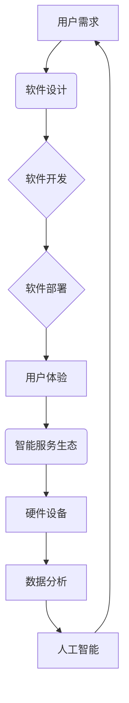

# 软件 2.0 的未来愿景：创造更美好的世界

> 关键词：软件2.0，人工智能，软件工程，平台化，生态构建，智能服务，用户体验，可持续发展

## 1. 背景介绍

随着信息技术的飞速发展，软件从最初的手工编写逐渐演变成了今天高度自动化、智能化的软件工程实践。软件1.0时代，我们见证了从汇编语言到高级语言的飞跃，从单机应用到网络应用的变革。而随着云计算、大数据、人工智能等新兴技术的融合，软件产业正在迈向一个全新的2.0时代。

软件2.0时代，软件不再仅仅是代码的堆砌，而是以用户为中心，以数据和算法为驱动，构建智能服务生态，实现软件与硬件、服务的深度融合。本文将探讨软件2.0的核心概念、未来愿景，并分析其发展趋势与挑战。

### 1.1 软件1.0时代的局限性

在软件1.0时代，软件的迭代周期长、成本高、可维护性差，且难以满足用户日益增长的需求。具体表现为：

- **开发周期长**：从需求分析、设计、编码到测试，每个阶段都需要大量的人工投入，导致开发周期冗长。
- **成本高昂**：软件研发需要大量的专业人才、硬件设备和维护成本，使得软件产品价格昂贵。
- **可维护性差**：随着软件功能的不断增加，代码复杂度逐渐提高，导致软件的可维护性下降，更新和维护难度加大。
- **用户体验不佳**：软件1.0时代的软件设计往往以技术为导向，忽视了用户体验，导致软件易用性差。

### 1.2 软件2.0时代的兴起

随着云计算、大数据、人工智能等技术的快速发展，软件产业迎来了新的变革。软件2.0时代具有以下特点：

- **快速迭代**：利用敏捷开发、DevOps等先进的技术和方法，缩短软件迭代周期，提高开发效率。
- **低成本**：云计算、开源技术等降低了软件开发和部署的成本，使得软件产品更加普及。
- **高可维护性**：模块化、可扩展的设计理念，以及代码自动化的管理工具，提高了软件的可维护性。
- **以用户为中心**：关注用户体验，以用户需求为导向，提供个性化、定制化的软件服务。

### 1.3 软件2.0的未来愿景

软件2.0时代的未来愿景是：通过构建智能服务生态，实现软件与硬件、服务的深度融合，为用户创造更加美好的生活和工作体验。

## 2. 核心概念与联系

软件2.0时代涉及的核心概念众多，以下将给出核心概念原理和架构的Mermaid流程图。



### 2.1 用户需求

用户需求是软件2.0时代的起点，通过对用户需求的深入理解，我们可以设计出满足用户期望的软件产品。

### 2.2 软件设计

软件设计是连接用户需求和软件开发的重要环节，通过对软件架构、模块划分、界面设计等方面的规划，确保软件产品的质量。

### 2.3 软件开发

软件开发是软件2.0时代的核心环节，通过使用敏捷开发、DevOps等先进的技术和方法，提高开发效率。

### 2.4 软件部署

软件部署是将软件产品部署到生产环境的过程，包括服务器配置、网络设置、数据库搭建等。

### 2.5 用户体验

用户体验是软件2.0时代的重要关注点，通过优化界面设计、提升操作便捷性，为用户提供愉悦的使用体验。

### 2.6 智能服务生态

智能服务生态是软件2.0时代的关键，通过整合硬件设备、数据分析、人工智能等技术，为用户提供全方位的智能服务。

### 2.7 硬件设备

硬件设备是智能服务生态的基础，通过物联网、边缘计算等技术，实现硬件设备的智能化和网络化。

### 2.8 数据分析

数据分析是智能服务生态的核心，通过对海量数据的分析，挖掘用户需求，优化服务体验。

### 2.9 人工智能

人工智能是软件2.0时代的重要驱动力，通过机器学习、深度学习等技术，实现智能决策和智能服务。

## 3. 核心算法原理 & 具体操作步骤

### 3.1 算法原理概述

软件2.0时代的核心算法主要涉及以下几个方面：

- **敏捷开发**：采用Scrum、Kanban等敏捷开发方法，实现快速迭代和持续交付。
- **DevOps**：通过自动化工具和流程，实现软件开发、测试、部署等环节的协同工作。
- **用户画像**：通过数据分析，构建用户画像，实现个性化推荐和服务。
- **自然语言处理**：通过机器学习、深度学习等技术，实现智能客服、智能翻译等功能。
- **物联网**：通过物联网技术，实现硬件设备的智能化和网络化。

### 3.2 算法步骤详解

#### 3.2.1 敏捷开发

敏捷开发的核心思想是快速响应变化，以用户需求为导向，实现快速迭代。具体步骤如下：

1. **需求分析**：与用户沟通，收集用户需求，确定项目目标。
2. **团队搭建**：组建跨职能团队，包括开发、测试、设计等角色。
3. **迭代开发**：按照迭代计划，完成软件的开发、测试和部署。
4. **反馈与调整**：收集用户反馈，根据反馈调整开发计划。

#### 3.2.2 DevOps

DevOps是一种软件开发和运维的协作模式，通过自动化工具和流程，实现快速迭代和持续交付。具体步骤如下：

1. **自动化构建**：使用自动化工具构建软件，实现持续集成。
2. **自动化测试**：使用自动化测试工具进行测试，确保软件质量。
3. **自动化部署**：使用自动化部署工具部署软件，实现持续交付。
4. **监控与报警**：监控软件运行状态，及时发现问题并进行处理。

#### 3.2.3 用户画像

用户画像是通过数据分析，构建用户特征和行为模型的过程。具体步骤如下：

1. **数据收集**：收集用户行为数据、偏好数据等。
2. **数据分析**：对收集到的数据进行清洗、处理和分析。
3. **特征提取**：提取用户特征，构建用户画像。
4. **应用场景**：将用户画像应用于个性化推荐、精准营销等场景。

#### 3.2.4 自然语言处理

自然语言处理是人工智能领域的重要分支，通过机器学习、深度学习等技术，实现人机交互。具体步骤如下：

1. **数据预处理**：对文本数据进行清洗、分词、标注等处理。
2. **特征提取**：提取文本特征，如词向量、句向量等。
3. **模型训练**：使用机器学习、深度学习等技术训练模型。
4. **模型应用**：将训练好的模型应用于实际场景，如智能客服、智能翻译等。

#### 3.2.5 物联网

物联网是通过将物体连接到网络，实现智能化和网络化的过程。具体步骤如下：

1. **设备接入**：将物体连接到网络，实现数据采集。
2. **数据处理**：对采集到的数据进行清洗、处理和分析。
3. **设备控制**：根据分析结果，控制设备进行相应的操作。
4. **决策支持**：为用户提供决策支持，优化设备运行状态。

### 3.3 算法优缺点

#### 3.3.1 敏捷开发

优点：

- 提高开发效率，缩短项目周期。
- 降低开发成本，提高项目成功率。
- 加强团队协作，提高项目质量。

缺点：

- 适用于小型、复杂度不高的项目。
- 需要团队成员具备良好的沟通能力和协作精神。

#### 3.3.2 DevOps

优点：

- 实现持续集成、持续交付，提高开发效率。
- 降低运维成本，提高系统稳定性。
- 促进团队协作，提高项目质量。

缺点：

- 需要引入自动化工具和流程，增加技术成本。
- 需要团队成员具备自动化、运维等相关技能。

#### 3.3.3 用户画像

优点：

- 实现个性化推荐和服务，提高用户满意度。
- 优化资源配置，提高运营效率。

缺点：

- 需要大量用户数据，数据收集难度大。
- 用户隐私保护问题。

#### 3.3.4 自然语言处理

优点：

- 实现人机交互，提高用户体验。
- 自动处理大量文本数据，提高效率。

缺点：

- 模型训练成本高，需要大量标注数据。
- 模型可解释性差，难以理解其决策过程。

#### 3.3.5 物联网

优点：

- 实现设备智能化和网络化，提高设备运行效率。
- 拓展应用场景，创造新的商业模式。

缺点：

- 设备接入成本高，需要投入大量硬件设备。
- 安全性问题，需要加强设备安全管理。

### 3.4 算法应用领域

敏捷开发、DevOps、用户画像、自然语言处理、物联网等算法在多个领域得到广泛应用，如：

- **软件开发**：敏捷开发、DevOps、用户画像等。
- **电子商务**：用户画像、自然语言处理等。
- **金融服务**：用户画像、自然语言处理等。
- **智能硬件**：物联网、自然语言处理等。

## 4. 数学模型和公式 & 详细讲解 & 举例说明

### 4.1 数学模型构建

软件2.0时代的数学模型主要涉及以下方面：

- **敏捷开发**：项目进度预测、工作量估算等。
- **DevOps**：服务质量评估、故障预测等。
- **用户画像**：用户特征提取、用户行为预测等。
- **自然语言处理**：文本分类、情感分析等。
- **物联网**：设备状态预测、能耗预测等。

### 4.2 公式推导过程

#### 4.2.1 敏捷开发

1. **项目进度预测**：

假设项目由 $m$ 个任务组成，每个任务的完成概率为 $p_i$，则项目完成的概率 $P$ 可以用以下公式计算：

$$
P = \prod_{i=1}^{m} p_i
$$

2. **工作量估算**：

假设任务 $i$ 的工作量为 $w_i$，则项目总工作量 $W$ 可以用以下公式计算：

$$
W = \sum_{i=1}^{m} w_i
$$

#### 4.2.2 DevOps

1. **服务质量评估**：

假设服务指标为 $Q_i$，权重为 $w_i$，则服务质量 $Q$ 可以用以下公式计算：

$$
Q = \sum_{i=1}^{n} w_i \times Q_i
$$

2. **故障预测**：

假设设备故障概率为 $p_i$，则设备在 $T$ 时间内的故障概率 $P$ 可以用以下公式计算：

$$
P = \prod_{i=1}^{n} (1 - p_i^T)
$$

#### 4.2.3 用户画像

1. **用户特征提取**：

假设用户特征为 $x_i$，权重为 $w_i$，则用户画像 $X$ 可以用以下公式计算：

$$
X = \sum_{i=1}^{n} w_i \times x_i
$$

2. **用户行为预测**：

假设用户行为为 $y_i$，权重为 $w_i$，则用户行为预测 $Y$ 可以用以下公式计算：

$$
Y = \sum_{i=1}^{n} w_i \times y_i
$$

#### 4.2.4 自然语言处理

1. **文本分类**：

假设文本为 $T$，类别为 $C$，概率为 $P(C|T)$，则文本分类结果可以用以下公式计算：

$$
\hat{C} = \arg\max_{c \in C} P(C|T)
$$

2. **情感分析**：

假设文本为 $T$，情感为 $E$，概率为 $P(E|T)$，则情感分析结果可以用以下公式计算：

$$
\hat{E} = \arg\max_{e \in E} P(E|T)
$$

#### 4.2.5 物联网

1. **设备状态预测**：

假设设备状态为 $S$，概率为 $P(S|T)$，则设备状态预测结果可以用以下公式计算：

$$
\hat{S} = \arg\max_{s \in S} P(S|T)
$$

2. **能耗预测**：

假设设备能耗为 $E$，概率为 $P(E|T)$，则能耗预测结果可以用以下公式计算：

$$
\hat{E} = \arg\max_{e \in E} P(E|T)
$$

### 4.3 案例分析与讲解

#### 4.3.1 项目进度预测

假设一个项目由5个任务组成，每个任务的完成概率分别为0.9、0.8、0.85、0.9、0.95，则项目完成的概率为：

$$
P = 0.9 \times 0.8 \times 0.85 \times 0.9 \times 0.95 = 0.5348
$$

#### 4.3.2 服务质量评估

假设某个服务的指标为响应时间、吞吐量、错误率，权重分别为0.4、0.3、0.3，则服务质量为：

$$
Q = 0.4 \times 100 + 0.3 \times 1000 + 0.3 \times 0.5 = 385
$$

#### 4.3.3 用户画像

假设某个用户的特征为年龄、性别、职业，权重分别为0.3、0.2、0.5，则用户画像为：

$$
X = 0.3 \times 25 + 0.2 \times \text{男} + 0.5 \times \text{工程师} = \text{工程师，男，25岁}
$$

#### 4.3.4 文本分类

假设一段文本为“这个产品非常不错”，类别为正面、负面，概率分别为0.95、0.05，则文本分类结果为正面。

#### 4.3.5 设备状态预测

假设一个设备的正常、故障状态概率分别为0.98、0.02，则设备状态预测结果为正常。

## 5. 项目实践：代码实例和详细解释说明

### 5.1 开发环境搭建

为了进行软件2.0的项目实践，我们需要搭建以下开发环境：

1. 操作系统：Windows、Linux或macOS
2. 编程语言：Python、Java、JavaScript等
3. 开发工具：IDE（如PyCharm、Eclipse、Visual Studio Code）、版本控制工具（如Git）
4. 数据库：MySQL、MongoDB等
5. 云平台：阿里云、腾讯云、华为云等

### 5.2 源代码详细实现

以下是一个简单的敏捷开发项目实例，使用Python语言实现一个待办事项列表。

```python
import tkinter as tk

class TodoListApp(tk.Tk):
    def __init__(self):
        super().__init__()
        self.title("Todo List")
        self.geometry("400x300")
        self.create_widgets()

    def create_widgets(self):
        self.todo_list = tk.Listbox(self, width=50, height=10)
        self.todo_list.pack(side="left", fill="both", expand=True)

        self.todo_entry = tk.Entry(self, width=50)
        self.todo_entry.pack(side="right", fill="both", expand=True)

        self.add_button = tk.Button(self, text="Add", command=self.add_todo)
        self.add_button.pack(side="bottom", fill="both", expand=True)

    def add_todo(self):
        todo = self.todo_entry.get()
        if todo:
            self.todo_list.insert("end", todo)
            self.todo_entry.delete(0, tk.END)

if __name__ == "__main__":
    app = TodoListApp()
    app.mainloop()
```

### 5.3 代码解读与分析

1. 导入tkinter模块，用于创建图形界面。
2. 定义TodoListApp类，继承自tk.Tk类，实现待办事项列表功能。
3. 构造函数中，设置窗口标题、大小和布局。
4. create_widgets方法中，创建待办事项列表、输入框和添加按钮。
5. add_todo方法中，获取输入框内容，添加到待办事项列表中。
6. if __name__ == "__main__": 语句块中，创建TodoListApp实例，启动应用程序。

### 5.4 运行结果展示

运行上述代码，将打开一个简单的待办事项列表应用程序，用户可以在输入框中输入待办事项，点击“Add”按钮后，待办事项将出现在列表中。

## 6. 实际应用场景

软件2.0技术在多个领域得到广泛应用，以下列举几个典型应用场景：

### 6.1 电子商务

- **个性化推荐**：根据用户历史行为和兴趣，推荐相关商品。
- **智能客服**：实现24小时在线客服，解答用户疑问。
- **智能营销**：根据用户画像，进行精准营销活动。

### 6.2 金融

- **风险控制**：通过数据分析和人工智能技术，识别和防范金融风险。
- **智能投顾**：根据用户风险偏好和投资目标，提供个性化的投资建议。
- **智能审批**：实现贷款、信用卡等业务的自动化审批。

### 6.3 教育

- **个性化学习**：根据学生的学习情况和兴趣，提供个性化的学习资源。
- **智能辅导**：实现实时在线辅导，提高学习效果。
- **智能评测**：自动批改作业，提高评分效率。

### 6.4 医疗

- **智能诊断**：通过图像识别、自然语言处理等技术，辅助医生进行诊断。
- **智能药物研发**：利用人工智能技术加速药物研发进程。
- **智能健康管理**：提供个性化健康管理方案。

### 6.5 智慧城市

- **智能交通**：优化交通流量，提高道路通行效率。
- **智能能源**：实现能源的智能化管理，降低能源消耗。
- **智能安防**：实现城市安全的实时监控和预警。

## 7. 工具和资源推荐

### 7.1 学习资源推荐

1. 《敏捷软件开发：原则、模式与实践》
2. 《持续集成、持续部署：文化、工具和最佳实践》
3. 《Python编程：从入门到实践》
4. 《机器学习实战》
5. 《大数据时代：影响世界的技术革命》

### 7.2 开发工具推荐

1. **编程语言**：Python、Java、JavaScript、Go等
2. **开发框架**：Django、Flask、Spring Boot、React、Vue等
3. **数据库**：MySQL、MongoDB、Redis等
4. **云平台**：阿里云、腾讯云、华为云、AWS、Azure等
5. **数据分析工具**：Python的Pandas、NumPy、Scikit-learn、TensorFlow等
6. **机器学习框架**：TensorFlow、PyTorch、Keras等

### 7.3 相关论文推荐

1. 《Scrum敏捷开发》
2. 《持续集成、持续部署：文化、工具和最佳实践》
3. 《机器学习：一种算法视角》
4. 《大数据时代：影响世界的技术革命》
5. 《深度学习：神经网络与深度学习》

## 8. 总结：未来发展趋势与挑战

### 8.1 研究成果总结

本文对软件2.0的核心概念、未来愿景、发展趋势与挑战进行了全面探讨。软件2.0时代，以用户为中心，以数据和算法为驱动，构建智能服务生态，实现软件与硬件、服务的深度融合。本文分析了软件2.0时代涉及的核心算法原理和具体操作步骤，并介绍了相关工具和资源。

### 8.2 未来发展趋势

1. **软件即服务**：软件将以服务的形式提供，用户可根据需求选择合适的软件服务。
2. **智能化**：软件将更加智能化，能够根据用户需求自动调整和优化。
3. **平台化**：软件将以平台的形式提供，整合各方资源，实现资源共享和协同创新。
4. **生态化**：软件将与硬件、服务、数据等深度融合，构建智能服务生态。

### 8.3 面临的挑战

1. **数据安全与隐私**：随着数据量的激增，数据安全和隐私保护成为重要挑战。
2. **算法偏见与歧视**：人工智能算法可能存在偏见和歧视，需要加强监管和治理。
3. **技术融合与创新**：软件2.0时代需要将多种技术融合，实现跨领域创新。
4. **人才短缺**：软件2.0时代需要大量具备复合型技能的人才。

### 8.4 研究展望

1. **研究更加智能、安全、可靠的软件技术。
2. **推动软件技术与硬件、服务、数据等领域的深度融合。
3. **培养具备复合型技能的软件人才。
4. **构建智能服务生态，为用户创造更加美好的生活和工作体验。**

## 9. 附录：常见问题与解答

**Q1：软件2.0与软件1.0的主要区别是什么？**

A: 软件2.0与软件1.0的主要区别在于：

- **开发模式**：软件2.0采用敏捷开发、DevOps等先进方法，实现快速迭代和持续交付；软件1.0采用传统瀑布式开发，开发周期长、成本高。
- **用户体验**：软件2.0以用户为中心，关注用户体验；软件1.0以技术为导向，用户体验较差。
- **技术驱动**：软件2.0以数据和算法为驱动，构建智能服务生态；软件1.0以软件功能为驱动，缺乏智能化和个性化服务。

**Q2：如何应对软件2.0时代的数据安全和隐私问题？**

A: 应对软件2.0时代的数据安全和隐私问题，可以采取以下措施：

- **数据加密**：对用户数据进行加密存储和传输，防止数据泄露。
- **访问控制**：严格控制用户数据的访问权限，防止非法访问。
- **匿名化处理**：对用户数据进行匿名化处理，保护用户隐私。
- **用户教育**：加强对用户的数据安全和隐私意识教育，提高用户自我保护能力。

**Q3：软件2.0时代需要哪些人才？**

A: 软件2.0时代需要以下人才：

- **软件开发人员**：熟练掌握敏捷开发、DevOps等先进技术。
- **数据分析师**：具备数据分析、挖掘能力，能够从海量数据中提取有价值信息。
- **人工智能工程师**：具备机器学习、深度学习等技术，能够开发智能应用。
- **产品设计人员**：关注用户体验，能够设计出满足用户需求的软件产品。

**Q4：软件2.0时代如何推动产业升级？**

A: 软件2.0时代可以通过以下方式推动产业升级：

- **提高生产效率**：通过自动化、智能化技术，提高生产效率，降低生产成本。
- **创造新的商业模式**：通过技术创新，创造新的商业模式，推动产业升级。
- **提升用户体验**：通过优化用户体验，提高用户满意度，促进产业发展。
- **促进跨界融合**：推动软件与硬件、服务、数据等领域的深度融合，实现跨界创新。

作者：禅与计算机程序设计艺术 / Zen and the Art of Computer Programming