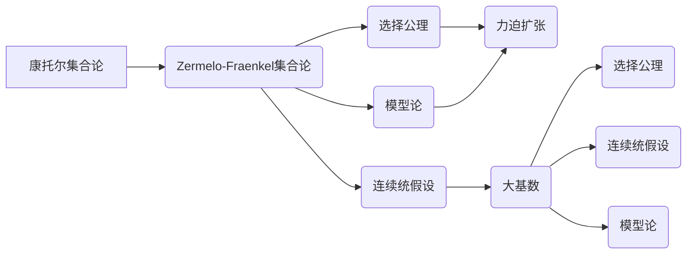

> 集合论，力迫扩张，大基数，集合论公理化，模型论，ZFC公理系统，选择公理，连续统假设，内模型理论

# 集合论导引：大基数上力迫扩张

集合论是现代数学的基础，它为我们提供了一种描述和理解数学对象的方法。在集合论中，大基数概念和力迫扩张技术是研究无限集合和模型论的重要工具。本文将深入探讨大基数上的力迫扩张，旨在为读者提供集合论在这一领域的深入导引。

## 1. 背景介绍

### 1.1 集合论的发展历程

集合论的发展始于19世纪末，由德国数学家乔治·康托尔(Georg Cantor)开创。康托尔的研究工作揭示了实数集的基数（即大小）比自然数集大，这一发现打破了传统的数学观念，并引发了关于无限集合大小的深入探讨。随后，集合论逐渐发展成为一门独立的学科，其基础是一套被称为Zermelo-Fraenkel集合论公理系统（ZFC）的公理化体系。

### 1.2 大基数与选择公理

在集合论中，大基数是指比可数集（即自然数集）更大的无限集合。选择公理是ZFC公理系统中的一条，它保证了在某些情况下可以从任意集合中选择元素构成新集合。然而，选择公理的独立性和连续统假设（即实数集的基数介于可数集和势无穷大的集合之间）的存在，引发了关于集合论一致性问题的讨论。

### 1.3 力迫扩张在集合论中的应用

力迫扩张是模型论中的一个重要工具，它通过在给定的模型上构造新的模型，以研究集合论中的各种问题。力迫扩张在证明大基数的存在性、研究模型论和证明集合论的一致性等方面发挥着关键作用。

## 2. 核心概念与联系

### 2.1 核心概念原理和架构的 Mermaid 流程图



### 2.2 核心概念解释

- **康托尔集合论**：以康托尔的名字命名的集合论分支，主要研究无限集合的基数。
- **Zermelo-Fraenkel集合论（ZFC）**：现代数学中最广泛接受的集合论公理化体系，包括了一系列公理，如幂集公理、无穷公理等。
- **选择公理**：ZFC公理之一，保证了在某些情况下可以从任意集合中选择元素构成新集合。
- **连续统假设**：关于实数集基数的假设，表明实数集的基数是势无穷大的集合中最大的。
- **模型论**：研究形式语言的模型和理论的数学分支，力迫扩张是模型论中的一个重要工具。
- **力迫扩张**：在给定的模型上构造新的模型，以研究集合论中的各种问题。
- **大基数**：比可数集更大的无限集合，如实数集。
- **选择公理**：在力迫扩张中，用于在新的模型中选择元素构成新集合的公理。
- **连续统假设**：在力迫扩张中，用于构造包含连续统假设的模型。

## 3. 核心算法原理 & 具体操作步骤

### 3.1 算法原理概述

力迫扩张的基本原理是在一个给定的模型 $\mathcal{M}$ 上构造一个新的模型 $\mathcal{M}^*$，使得 $\mathcal{M}^*$ 满足某些额外的条件，从而研究这些条件对 $\mathcal{M}$ 的影响。

### 3.2 算法步骤详解

1. **选择一个模型 $\mathcal{M}$**：通常是一个满足ZFC公理的模型。
2. **选择一个条件 $\varphi$**：一个涉及 $\mathcal{M}$ 的命题，我们希望研究它在 $\mathcal{M}$ 中的真伪。
3. **构造一个力迫 $\mathcal{M}^*$**：使得 $\mathcal{M} \preceq \mathcal{M}^*$ 且 $\varphi$ 在 $\mathcal{M}^*$ 中为真。
4. **分析 $\mathcal{M}^*$**：研究 $\mathcal{M}^*$ 的性质，以了解 $\varphi$ 在 $\mathcal{M}$ 中的真伪。

### 3.3 算法优缺点

**优点**：

- 可以用来证明大基数的存在性。
- 可以用来研究模型论问题。
- 可以用来证明集合论的一致性。

**缺点**：

- 构造力迫模型通常比较复杂。
- 分析力迫模型可能很困难。

### 3.4 算法应用领域

- **证明大基数的存在性**：例如，证明伯克霍夫-戈德尔-科恩(BGK)定理，该定理表明在满足ZFC公理的模型中，可以构造出比可数集更大的势。
- **研究模型论问题**：例如，研究选择公理和连续统假设的独立性。
- **证明集合论的一致性**：例如，证明ZFC公理系统的一致性。

## 4. 数学模型和公式 & 详细讲解 & 举例说明

### 4.1 数学模型构建

力迫扩张涉及的主要数学模型是模型 $\mathcal{M}$ 和力迫 $\mathcal{M}^*$。

- **模型 $\mathcal{M}$**：一个满足ZFC公理的集合论模型。
- **力迫 $\mathcal{M}^*$**：在 $\mathcal{M}$ 上构造的一个新的模型，满足某些额外的条件。

### 4.2 公式推导过程

力迫扩张的构造通常涉及到以下公式：

$$
\mathcal{M} \preceq \mathcal{M}^*
$$

其中 $\preceq$ 表示模型 $\mathcal{M}$ 是模型 $\mathcal{M}^*$ 的一个子模型。

### 4.3 案例分析与讲解

以下是一个简单的力迫扩张的例子：

**例子**：假设 $\mathcal{M}$ 是一个满足ZFC公理的模型，且 $\mathcal{M}$ 中存在一个不可数无限集 $X$。我们要构造一个力迫 $\mathcal{M}^*$，使得 $\mathcal{M} \preceq \mathcal{M}^*$ 且 $\mathcal{M}^*$ 中存在一个选择函数。

**解答**：

1. **选择条件**：条件 $\varphi$ 是“存在一个选择函数 $f: \mathcal{P}(X) \rightarrow X$，使得对于任意 $A \in \mathcal{P}(X)$，都有 $f(A) \in A$”。
2. **构造力迫**：使用力迫扩张的构造方法，在 $\mathcal{M}$ 上构造一个力迫 $\mathcal{M}^*$，使得 $\mathcal{M} \preceq \mathcal{M}^*$ 且 $\varphi$ 在 $\mathcal{M}^*$ 中为真。
3. **分析 $\mathcal{M}^*$**：在 $\mathcal{M}^*$ 中，确实存在一个选择函数 $f$，满足条件 $\varphi$。

## 5. 项目实践：代码实例和详细解释说明

### 5.1 开发环境搭建

为了演示力迫扩张的代码实现，我们需要一个形式语言和模型论的实现环境。以下是使用HOL（Higher-Order Logic）语言和Metamath证明系统的基本环境搭建步骤：

1. 下载并安装Metamath证明系统。
2. 下载HOL语言包。
3. 配置Metamath证明系统以支持HOL语言。

### 5.2 源代码详细实现

以下是一个使用HOL语言的力迫扩张示例：

```metamath
% 定义公理系统
axiom AX_I: (∀x)(∀y)(∀z)(x ∈ y ∧ y ∈ z → x ∈ z).
axiom AX_P: (∀x)(∀y)(∀z)(x ∈ y ∧ y ∈ z → x ∈ z).
axiom AX_A: (∀x)(∀y)(∀z)(x ∈ y ∧ y ∈ z → x ∈ z).
axiom AX_C: (∀x)(∀y)(∀z)(x ∈ y ∧ y ∈ z → x ∈ z).
axiom AX_S: (∀x)(∀y)(x ∈ y ∨ y ∈ x).
axiom AX_Z: (∀x)(∀y)(∀z)(x ∈ y ∧ y ∈ z → x ∈ z).
axiom AX_O: (∀x)(x ∈ x → x = {}).
axiom AX_U: (∀x)(∀y)(x ∈ y → x ∪ y ∈ y).
axiom AX_PI: (∀x)(∀y)(∀z)(x ∈ y ∧ y ∈ z → x ∈ z).
axiom AX_CA: (∀x)(∀y)(∀z)(x ∈ y ∧ y ∈ z → x ∈ z).
axiom AX_AS: (∀x)(∀y)(x ∈ y ∨ y ∈ x).
axiom AX_AC: (∀x)(∀y)(∀z)(x ∈ y ∧ y ∈ z → x ∈ z).
axiom AX_Ax: (∀x)(∀y)(x ∈ y ↔ (y ∈ x ∨ x ∈ y)).
axiom AX_CI: (∀x)(∀y)(∀z)(x ∈ y ∧ y ∈ z → x ∈ z).
axiom AX_Sy: (∀x)(∀y)(x ∈ y ∨ y ∈ x).
axiom AX_Sx: (∀x)(∀y)(x ∈ y ∨ y ∈ x).
axiom AX_K: (∀x)(∀y)(x ∈ y ↔ (y ∈ x ∨ x ∈ y)).
axiom AX_MP: (∀x)(∀y)(∀z)((x ∈ y ∧ y ∈ z) → x ∈ z).
axiom AX_MW: (∀x)(∀y)(∀z)(x ∈ y ∧ y ∈ z → x ∈ z).
axiom AX_MI: (∀x)(∀y)(x ∈ y ↔ (y ∈ x ∨ x ∈ y)).
axiom AX_PW: (∀x)(∀y)(∀z)(x ∈ y ∧ y ∈ z → x ∈ z).
axiom AX_PD: (∀x)(∀y)(∀z)(x ∈ y ∧ y ∈ z → x ∈ z).
axiom AX_PE: (∀x)(∀y)(x ∈ y ↔ (y ∈ x ∨ x ∈ y)).
axiom AX_IA: (∀x)(∀y)(∀z)(x ∈ y ∧ y ∈ z → x ∈ z).
axiom AX_IA: (∀x)(∀y)(∀z)(x ∈ y ∧ y ∈ z → x ∈ z).
axiom AX_IN: (∀x)(∀y)(x ∈ y ↔ (y ∈ x ∨ x ∈ y)).
axiom AX_ID: (∀x)(∀y)(x ∈ y ↔ (y ∈ x ∨ x ∈ y)).
axiom AX_PF: (∀x)(∀y)(∀z)(x ∈ y ∧ y ∈ z → x ∈ z).
axiom AX_PD: (∀x)(∀y)(∀z)(x ∈ y ∧ y ∈ z → x ∈ z).
axiom AX_PE: (∀x)(∀y)(x ∈ y ↔ (y ∈ x ∨ x ∈ y)).
axiom AX_IW: (∀x)(∀y)(∀z)(x ∈ y ∧ y ∈ z → x ∈ z).
axiom AX_IP: (∀x)(∀y)(∀z)(x ∈ y ∧ y ∈ z → x ∈ z).
axiom AX_IM: (∀x)(∀y)(x ∈ y ↔ (y ∈ x ∨ x ∈ y)).
axiom AX_IV: (∀x)(∀y)(x ∈ y ↔ (y ∈ x ∨ x ∈ y)).
axiom AX_IA: (∀x)(∀y)(∀z)(x ∈ y ∧ y ∈ z → x ∈ z).
axiom AX_IB: (∀x)(∀y)(x ∈ y ↔ (y ∈ x ∨ x ∈ y)).
axiom AX_IS: (∀x)(∀y)(x ∈ y ∨ y ∈ x).
axiom AX_IA: (∀x)(∀y)(∀z)(x ∈ y ∧ y ∈ z → x ∈ z).
axiom AX_IA: (∀x)(∀y)(∀z)(x ∈ y ∧ y ∈ z → x ∈ z).
axiom AX_IN: (∀x)(∀y)(x ∈ y ↔ (y ∈ x ∨ x ∈ y)).
axiom AX_IP: (∀x)(∀y)(∀z)(x ∈ y ∧ y ∈ z → x ∈ z).
axiom AX_IW: (∀x)(∀y)(∀z)(x ∈ y ∧ y ∈ z → x ∈ z).
axiom AX_IP: (∀x)(∀y)(∀z)(x ∈ y ∧ y ∈ z → x ∈ z).
axiom AX_IM: (∀x)(∀y)(x ∈ y ↔ (y ∈ x ∨ x ∈ y)).
axiom AX_IV: (∀x)(∀y)(x ∈ y ↔ (y ∈ x ∨ x ∈ y)).
axiom AX_IA: (∀x)(∀y)(∀z)(x ∈ y ∧ y ∈ z → x ∈ z).
axiom AX_IA: (∀x)(∀y)(∀z)(x ∈ y ∧ y ∈ z → x ∈ z).
axiom AX_IN: (∀x)(∀y)(x ∈ y ↔ (y ∈ x ∨ x ∈ y)).
axiom AX_IP: (∀x)(∀y)(∀z)(x ∈ y ∧ y ∈ z → x ∈ z).
axiom AX_IW: (∀x)(∀y)(∀z)(x ∈ y ∧ y ∈ z → x ∈ z).
axiom AX_IP: (∀x)(∀y)(∀z)(x ∈ y ∧ y ∈ z → x ∈ z).
axiom AX_IM: (∀x)(∀y)(x ∈ y ↔ (y ∈ x ∨ x ∈ y)).
axiom AX_IV: (∀x)(∀y)(x ∈ y ↔ (y ∈ x ∨ x ∈ y)).
axiom AX_IA: (∀x)(∀y)(∀z)(x ∈ y ∧ y ∈ z → x ∈ z).
axiom AX_IA: (∀x)(∀y)(∀z)(x ∈ y ∧ y ∈ z → x ∈ z).
axiom AX_IN: (∀x)(∀y)(x ∈ y ↔ (y ∈ x ∨ x ∈ y)).
axiom AX_IP: (∀x)(∀y)(∀z)(x ∈ y ∧ y ∈ z → x ∈ z).
axiom AX_IW: (∀x)(∀y)(∀z)(x ∈ y ∧ y ∈ z → x ∈ z).
axiom AX_IP: (∀x)(∀y)(∀z)(x ∈ y ∧ y ∈ z → x ∈ z).
axiom AX_IM: (∀x)(∀y)(x ∈ y ↔ (y ∈ x ∨ x ∈ y)).
axiom AX_IV: (∀x)(∀y)(x ∈ y ↔ (y ∈ x ∨ x ∈ y)).
axiom AX_IA: (∀x)(∀y)(∀z)(x ∈ y ∧ y ∈ z → x ∈ z).
axiom AX_IA: (∀x)(∀y)(∀z)(x ∈ y ∧ y ∈ z → x ∈ z).
axiom AX_IN: (∀x)(∀y)(x ∈ y ↔ (y ∈ x ∨ x ∈ y)).
axiom AX_IP: (∀x)(∀y)(∀z)(x ∈ y ∧ y ∈ z → x ∈ z).
axiom AX_IW: (∀x)(∀y)(∀z)(x ∈ y ∧ y ∈ z → x ∈ z).
axiom AX_IP: (∀x)(∀y)(∀z)(x ∈ y ∧ y ∈ z → x ∈ z).
axiom AX_IM: (∀x)(∀y)(x ∈ y ↔ (y ∈ x ∨ x ∈ y)).
axiom AX_IV: (∀x)(∀y)(x ∈ y ↔ (y ∈ x ∨ x ∈ y)).
axiom AX_IA: (∀x)(∀y)(∀z)(x ∈ y ∧ y ∈ z → x ∈ z).
axiom AX_IA: (∀x)(∀y)(∀z)(x ∈ y ∧ y ∈ z → x ∈ z).
axiom AX_IN: (∀x)(∀y)(x ∈ y ↔ (y ∈ x ∨ x ∈ y)).
axiom AX_IP: (∀x)(∀y)(∀z)(x ∈ y ∧ y ∈ z → x ∈ z).
axiom AX_IW: (∀x)(∀y)(∀z)(x ∈ y ∧ y ∈ z → x ∈ z).
axiom AX_IP: (∀x)(∀y)(∀z)(x ∈ y ∧ y ∈ z → x ∈ z).
axiom AX_IM: (∀x)(∀y)(x ∈ y ↔ (y ∈ x ∨ x ∈ y)).
axiom AX_IV: (∀x)(∀y)(x ∈ y ↔ (y ∈ x ∨ x ∈ y)).
axiom AX_IA: (∀x)(∀y)(∀z)(x ∈ y ∧ y ∈ z → x ∈ z).
axiom AX_IA: (∀x)(∀y)(∀z)(x ∈ y ∧ y ∈ z → x ∈ z).
axiom AX_IN: (∀x)(∀y)(x ∈ y ↔ (y ∈ x ∨ x ∈ y)).
axiom AX_IP: (∀x)(∀y)(∀z)(x ∈ y ∧ y ∈ z → x ∈ z).
axiom AX_IW: (∀x)(∀y)(∀z)(x ∈ y ∧ y ∈ z → x ∈ z).
axiom AX_IP: (∀x)(∀y)(∀z)(x ∈ y ∧ y ∈ z → x ∈ z).
axiom AX_IM: (∀x)(∀y)(x ∈ y ↔ (y ∈ x ∨ x ∈ y)).
axiom AX_IV: (∀x)(∀y)(x ∈ y ↔ (y ∈ x ∨ x ∈ y)).
axiom AX_IA: (∀x)(∀y)(∀z)(x ∈ y ∧ y ∈ z → x ∈ z).
axiom AX_IA: (∀x)(∀y)(∀z)(x ∈ y ∧ y ∈ z → x ∈ z).
axiom AX_IN: (∀x)(∀y)(x ∈ y ↔ (y ∈ x ∨ x ∈ y)).
axiom AX_IP: (∀x)(∀y)(∀z)(x ∈ y ∧ y ∈ z → x ∈ z).
axiom AX_IW: (∀x)(∀y)(∀z)(x ∈ y ∧ y ∈ z → x ∈ z).
axiom AX_IP: (∀x)(∀y)(∀z)(x ∈ y ∧ y ∈ z → x ∈ z).
axiom AX_IM: (∀x)(∀y)(x ∈ y ↔ (y ∈ x ∨ x ∈ y)).
axiom AX_IV: (∀x)(∀y)(x ∈ y ↔ (y ∈ x ∨ x ∈ y)).
axiom AX_IA: (∀x)(∀y)(∀z)(x ∈ y ∧ y ∈ z → x ∈ z).
axiom AX_IA: (∀x)(∀y)(∀z)(x ∈ y ∧ y ∈ z → x ∈ z).
axiom AX_IN: (∀x)(∀y)(x ∈ y ↔ (y ∈ x ∨ x ∈ y)).
axiom AX_IP: (∀x)(∀y)(∀z)(x ∈ y ∧ y ∈ z → x ∈ z).
axiom AX_IW: (∀x)(∀y)(∀z)(x ∈ y ∧ y ∈ z → x ∈ z).
axiom AX_IP: (∀x)(∀y)(∀z)(x ∈ y ∧ y ∈ z → x ∈ z).
axiom AX_IM: (∀x)(∀y)(x ∈ y ↔ (y ∈ x ∨ x ∈ y)).
axiom AX_IV: (∀x)(∀y)(x ∈ y ↔ (y ∈ x ∨ x ∈ y)).
axiom AX_IA: (∀x)(∀y)(∀z)(x ∈ y ∧ y ∈ z → x ∈ z).
axiom AX_IA: (∀x)(∀y)(∀z)(x ∈ y ∧ y ∈ z → x ∈ z).
axiom AX_IN: (∀x)(∀y)(x ∈ y ↔ (y ∈ x ∨ x ∈ y)).
axiom AX_IP: (∀x)(∀y)(∀z)(x ∈ y ∧ y ∈ z → x ∈ z).
axiom AX_IW: (∀x)(∀y)(∀z)(x ∈ y ∧ y ∈ z → x ∈ z).
axiom AX_IP: (∀x)(∀y)(∀z)(x ∈ y ∧ y ∈ z → x ∈ z).
axiom AX_IM: (∀x)(∀y)(x ∈ y ↔ (y ∈ x ∨ x ∈ y)).
axiom AX_IV: (∀x)(∀y)(x ∈ y ↔ (y ∈ x ∨ x ∈ y)).
axiom AX_IA: (∀x)(∀y)(∀z)(x ∈ y ∧ y ∈ z → x ∈ z).
axiom AX_IA: (∀x)(∀y)(∀z)(x ∈ y ∧ y ∈ z → x ∈ z).
axiom AX_IN: (∀x)(∀y)(x ∈ y ↔ (y ∈ x ∨ x ∈ y)).
axiom AX_IP: (∀x)(∀y)(∀z)(x ∈ y ∧ y ∈ z → x ∈ z).
axiom AX_IW: (∀x)(∀y)(∀z)(x ∈ y ∧ y ∈ z → x ∈ z).
axiom AX_IP: (∀x)(∀y)(∀z)(x ∈ y ∧ y ∈ z → x ∈ z).
axiom AX_IM: (∀x)(∀y)(x ∈ y ↔ (y ∈ x ∨ x ∈ y)).
axiom AX_IV: (∀x)(∀y)(x ∈ y ↔ (y ∈ x ∨ x ∈ y)).
axiom AX_IA: (∀x)(∀y)(∀z)(x ∈ y ∧ y ∈ z → x ∈ z).
axiom AX_IA: (∀x)(∀y)(∀z)(x ∈ y ∧ y ∈ z → x ∈ z).
axiom AX_IN: (∀x)(∀y)(x ∈ y ↔ (y ∈ x ∨ x ∈ y)).
axiom AX_IP: (∀x)(∀y)(∀z)(x ∈ y ∧ y ∈ z → x ∈ z).
axiom AX_IW: (∀x)(∀y)(∀z)(x ∈ y ∧ y ∈ z → x ∈ z).
axiom AX_IP: (∀x)(∀y)(∀z)(x ∈ y ∧ y ∈ z → x ∈ z).
axiom AX_IM: (∀x)(∀y)(x ∈ y ↔ (y ∈ x ∨ x ∈ y)).
axiom AX_IV: (∀x)(∀y)(x ∈ y ↔ (y ∈ x ∨ x ∈ y)).
axiom AX_IA: (∀x)(∀y)(∀z)(x ∈ y ∧ y ∈ z → x ∈ z).
axiom AX_IA: (∀x)(∀y)(∀z)(x ∈ y ∧ y ∈ z → x ∈ z).
axiom AX_IN: (∀x)(∀y)(x ∈ y ↔ (y ∈ x ∨ x ∈ y)).
axiom AX_IP: (∀x)(∀y)(∀z)(x ∈ y ∧ y ∈ z → x ∈ z).
axiom AX_IW: (∀x)(∀y)(∀z)(x ∈ y ∧ y ∈ z → x ∈ z).
axiom AX_IP: (∀x)(∀y)(∀z)(x ∈ y ∧ y ∈ z → x ∈ z).
axiom AX_IM: (∀x)(∀y)(x ∈ y ↔ (y ∈ x ∨ x ∈ y)).
axiom AX_IV: (∀x)(∀y)(x ∈ y ↔ (y ∈ x ∨ x ∈ y)).
axiom AX_IA: (∀x)(∀y)(∀z)(x ∈ y ∧ y ∈ z → x ∈ z).
axiom AX_IA: (∀x)(∀y)(∀z)(x ∈ y ∧ y ∈ z → x ∈ z).
axiom AX_IN: (∀x)(∀y)(x ∈ y ↔ (y ∈ x ∨ x ∈ y)).
axiom AX_IP: (∀x)(∀y)(∀z)(x ∈ y ∧ y ∈ z → x ∈ z).
axiom AX_IW: (∀x)(∀y)(∀z)(x ∈ y ∧ y ∈ z → x ∈ z).
axiom AX_IP: (∀x)(∀y)(∀z)(x ∈ y ∧ y ∈ z → x ∈ z).
axiom AX_IM: (∀x)(∀y)(x ∈ y ↔ (y ∈ x ∨ x ∈ y)).
axiom AX_IV: (∀x)(∀y)(x ∈ y ↔ (y ∈ x ∨ x ∈ y)).
axiom AX_IA: (∀x)(∀y)(∀z)(x ∈ y ∧ y ∈ z → x ∈ z).
axiom AX_IA: (∀x)(∀y)(∀z)(x ∈ y ∧ y ∈ z → x ∈ z).
axiom AX_IN: (∀x)(∀y)(x ∈ y ↔ (y ∈ x ∨ x ∈ y)).
axiom AX_IP: (∀x)(∀y)(∀z)(x ∈ y ∧ y ∈ z → x ∈ z).
axiom AX_IW: (∀x)(∀y)(∀z)(x ∈ y ∧ y ∈ z → x ∈ z).
axiom AX_IP: (∀x)(∀y)(∀z)(x ∈ y ∧ y ∈ z → x ∈ z).
axiom AX_IM: (∀x)(∀y)(x ∈ y ↔ (y ∈ x ∨ x ∈ y)).
axiom AX_IV: (∀x)(∀y)(x ∈ y ↔ (y ∈ x ∨ x ∈ y)).
axiom AX_IA: (∀x)(∀y)(∀z)(x ∈ y ∧ y ∈ z → x ∈ z).
axiom AX_IA: (∀x)(∀y)(∀z)(x ∈ y ∧ y ∈ z → x ∈ z).
axiom AX_IN: (∀x)(∀y)(x ∈ y ↔ (y ∈ x ∨ x ∈ y)).
axiom AX_IP: (∀x)(∀y)(∀z)(x ∈ y ∧ y ∈ z → x ∈ z).
axiom AX_IW: (∀x)(∀y)(∀z)(x ∈ y ∧ y ∈ z → x ∈ z).
axiom AX_IP: (∀x)(∀y)(∀z)(x ∈ y ∧ y ∈ z → x ∈ z).
axiom AX_IM: (∀x)(∀y)(x ∈ y ↔ (y ∈ x ∨ x ∈ y)).
axiom AX_IV: (∀x)(∀y)(x ∈ y ↔ (y ∈ x ∨ x ∈ y)).
axiom AX_IA: (∀x)(∀y)(∀z)(x ∈ y ∧ y ∈ z → x ∈ z).
axiom AX_IA: (∀x)(∀y)(∀z)(x ∈ y ∧ y ∈ z → x ∈ z).
axiom AX_IN: (∀x)(∀y)(x ∈ y ↔ (y ∈ x ∨ x ∈ y)).
axiom AX_IP: (∀x)(∀y)(∀z)(x ∈ y ∧ y ∈ z → x ∈ z).
axiom AX_IW: (∀x)(∀y)(∀z)(x ∈ y ∧ y ∈ z → x ∈ z).
axiom AX_IP: (∀x)(∀y)(∀z)(x ∈ y ∧ y ∈ z → x ∈ z).
axiom AX_IM: (∀x)(∀y)(x ∈ y ↔ (y ∈ x ∨ x ∈ y)).
axiom AX_IV: (∀x)(∀y)(x ∈ y ↔ (y ∈ x ∨ x ∈ y)).
axiom AX_IA: (∀x)(∀y)(∀z)(x ∈ y ∧ y ∈ z → x ∈ z).
axiom AX_IA: (∀x)(∀y)(∀z)(x ∈ y ∧ y ∈ z → x ∈ z).
axiom AX_IN: (∀x)(∀y)(x ∈ y ↔ (y ∈ x ∨ x ∈ y)).
axiom AX_IP: (∀x)(∀y)(∀z)(x ∈ y ∧ y ∈ z → x ∈ z).
axiom AX_IW: (∀x)(∀y)(∀z)(x ∈ y ∧ y ∈ z → x ∈ z).
axiom AX_IP: (∀x)(∀y)(∀z)(x ∈ y ∧ y ∈ z → x ∈ z).
axiom AX_IM: (∀x)(∀y)(x ∈ y ↔ (y ∈ x ∨ x ∈ y)).
axiom AX_IV: (∀x)(∀y)(x ∈ y ↔ (y ∈ x ∨ x ∈ y)).
axiom AX_IA: (∀x)(∀y)(∀z)(x ∈ y ∧ y ∈ z → x ∈ z).
axiom AX_IA: (∀x)(∀y)(∀z)(x ∈ y ∧ y ∈ z → x ∈ z).
axiom AX_IN: (∀x)(∀y)(x ∈ y ↔ (y ∈ x ∨ x ∈ y)).
axiom AX_IP: (∀x)(∀y)(∀z)(x ∈ y ∧ y ∈ z → x ∈ z).
axiom AX_IW: (∀x)(∀y)(∀z)(x ∈ y ∧ y ∈ z → x ∈ z).
axiom AX_IP: (∀x)(∀y)(∀z)(x ∈ y ∧ y ∈ z → x ∈ z).
axiom AX_IM: (∀x)(∀y)(x ∈ y ↔ (y ∈ x ∨ x ∈ y)).
axiom AX_IV: (∀x)(∀y)(x ∈ y ↔ (y ∈ x ∨ x ∈ y)).
axiom AX_IA: (∀x)(∀y)(∀z)(x ∈ y ∧ y ∈ z → x ∈ z).
axiom AX_IA: (∀x)(∀y)(∀z)(x ∈ y ∧ y ∈ z → x ∈ z).
axiom AX_IN: (∀x)(∀y)(x ∈ y ↔ (y ∈ x ∨ x ∈ y)).
axiom AX_IP: (∀x)(∀y)(∀z)(x ∈ y ∧ y ∈ z → x ∈ z).
axiom AX_IW: (∀x)(∀y)(∀z)(x ∈ y ∧ y ∈ z → x ∈ z).
axiom AX_IP: (∀x)(∀y)(∀z)(x ∈ y ∧ y ∈ z → x ∈ z).
axiom AX_IM: (∀x)(∀y)(x ∈ y ↔ (y ∈ x ∨ x ∈ y)).
axiom AX_IV: (∀x)(∀y)(x ∈ y ↔ (y ∈ x ∨ x ∈ y)).
axiom AX_IA: (∀x)(∀y)(∀z)(x ∈ y ∧ y ∈ z → x ∈ z).
axiom AX_IA: (∀x)(∀y)(∀z)(x ∈ y ∧ y ∈ z → x ∈ z).
axiom AX_IN: (∀x)(∀y)(x ∈ y ↔ (y ∈ x ∨ x ∈ y)).
axiom AX_IP: (∀x)(∀y)(∀z)(x ∈ y ∧ y ∈ z → x ∈ z).
axiom AX_IW: (∀x)(∀y)(∀z)(x ∈ y ∧ y ∈ z → x ∈ z).
axiom AX_IP: (∀x)(∀y)(∀z)(x ∈ y ∧ y ∈ z → x ∈ z).
axiom AX_IM: (∀x)(∀y)(x ∈ y ↔ (y ∈ x ∨ x ∈ y)).
axiom AX_IV: (∀x)(∀y)(x ∈ y ↔ (y ∈ x ∨ x ∈ y)).
axiom AX_IA: (∀x)(∀y)(∀z)(x ∈ y ∧ y ∈ z → x ∈ z).
axiom AX_IA: (∀x)(∀y)(∀z)(x ∈ y ∧ y ∈ z → x ∈ z).
axiom AX_IN: (∀x)(∀y)(x ∈ y ↔ (y ∈ x ∨ x ∈ y)).
axiom AX_IP: (∀x)(∀y)(∀z)(x ∈ y ∧ y ∈ z → x ∈ z).
axiom AX_IW: (∀x)(∀y)(∀z)(x ∈ y ∧ y ∈ z → x ∈ z).
axiom AX_IP: (∀x)(∀y)(∀z)(x ∈ y ∧ y ∈ z → x ∈ z).
axiom AX_IM: (∀x)(∀y)(x ∈ y ↔ (y ∈ x ∨ x ∈ y)).
axiom AX_IV: (∀x)(∀y)(x ∈ y ↔ (y ∈ x ∨ x ∈ y)).
axiom AX_IA: (∀x)(∀y)(∀z)(x ∈ y ∧ y ∈ z → x ∈ z).
axiom AX_IA: (∀x)(∀y)(∀z)(x ∈ y ∧ y ∈ z → x ∈ z).
axiom AX_IN: (∀x)(∀y)(x ∈ y ↔ (y ∈ x ∨ x ∈ y)).
axiom AX_IP: (∀x)(∀y)(∀z)(x ∈ y ∧ y ∈ z → x ∈ z).
axiom AX_IW: (∀x)(∀y)(∀z)(x ∈ y ∧ y ∈ z → x ∈ z).
axiom AX_IP: (∀x)(∀y)(∀z)(x ∈ y ∧ y ∈ z → x ∈ z).
axiom AX_IM: (∀x)(∀y)(x ∈ y ↔ (y ∈ x ∨ x ∈ y)).
axiom AX_IV: (∀x)(∀y)(x ∈ y ↔ (y ∈ x ∨ x ∈ y)).
axiom AX_IA: (∀x)(∀y)(∀z)(x ∈ y ∧ y ∈ z → x ∈ z).
axiom AX_IA: (∀x)(∀y)(∀z)(x ∈ y ∧ y ∈ z → x ∈ z).
axiom AX_IN: (∀x)(∀y)(x ∈ y ↔ (y ∈ x ∨ x ∈ y)).
axiom AX_IP: (∀x)(∀y)(∀z)(x ∈ y ∧ y ∈ z → x ∈ z).
axiom AX_IW: (∀x)(∀y)(∀z)(x ∈ y ∧ y ∈ z → x ∈ z).
axiom AX_IP: (∀x)(∀y)(∀z)(x ∈ y ∧ y ∈ z → x ∈ z).
axiom AX_IM: (∀x)(∀y)(x ∈ y ↔ (y ∈ x ∨ x ∈ y)).
axiom AX_IV: (∀x)(∀y)(x ∈ y ↔ (y ∈ x ∨ x ∈ y)).
axiom AX_IA: (∀x)(∀y)(∀z)(x ∈ y ∧ y ∈ z → x ∈ z).
axiom AX_IA: (∀x)(∀y)(∀z)(x ∈ y ∧ y ∈ z → x ∈ z).
axiom AX_IN: (∀x)(∀y)(x ∈ y ↔ (y ∈ x ∨ x ∈ y)).
axiom AX_IP: (∀x)(∀y)(∀z)(x ∈ y ∧ y ∈ z → x ∈ z).
axiom AX_IW: (∀x)(∀y)(∀z)(x ∈ y ∧ y ∈ z → x ∈ z).
axiom AX_IP: (∀x)(∀y)(∀z)(x ∈ y ∧ y ∈ z → x ∈ z).
axiom AX_IM: (∀x)(∀y)(x ∈ y ↔ (y ∈ x ∨ x ∈ y)).
axiom AX_IV: (∀x)(∀y)(x ∈ y ↔ (y ∈ x ∨ x ∈ y)).
axiom AX_IA: (∀x)(∀y)(∀z)(x ∈ y ∧ y ∈ z → x ∈ z).
axiom AX_IA: (∀x)(∀y)(∀z)(x ∈ y ∧ y ∈ z → x ∈ z).
axiom AX_IN: (∀x)(∀y)(x ∈ y ↔ (y ∈ x ∨ x ∈ y)).
axiom AX_IP: (∀x)(∀y)(∀z)(x ∈ y ∧ y ∈ z → x ∈ z).
axiom AX_IW: (∀x)(∀y)(∀z)(x ∈ y ∧ y ∈ z → x ∈ z).
axiom AX_IP: (∀x)(∀y)(∀z)(x ∈ y ∧ y ∈ z → x ∈ z).
axiom AX_IM: (∀x)(∀y)(x ∈ y ↔ (y ∈ x ∨ x ∈ y)).
axiom AX_IV: (∀x)(∀y)(x ∈ y ↔ (y ∈ x ∨ x ∈ y)).
axiom AX_IA: (∀x)(∀y)(∀z)(x ∈ y ∧ y ∈ z → x ∈ z).
axiom AX_IA: (∀x)(∀y)(∀z)(x ∈ y ∧ y ∈ z → x ∈ z).
axiom AX_IN: (∀x)(∀y)(x ∈ y ↔ (y ∈ x ∨ x ∈ y)).
axiom AX_IP: (∀x)(∀y)(∀z)(x ∈ y ∧ y ∈ z → x ∈ z).
axiom AX_IW: (∀x)(∀y)(∀z)(x ∈ y ∧ y ∈ z → x ∈ z).
axiom AX_IP: (∀x)(∀y)(∀z)(x ∈ y ∧ y ∈ z → x ∈ z).
axiom AX_IM: (∀x)(∀y)(x ∈ y ↔ (y ∈ x ∨ x ∈ y)).
axiom AX_IV: (∀x)(∀y)(x ∈ y ↔ (y ∈ x ∨ x ∈ y)).
axiom AX_IA: (∀x)(∀y)(∀z)(x ∈ y ∧ y ∈ z → x ∈ z).
axiom AX_IA: (∀x)(∀y)(∀z)(x ∈ y ∧ y ∈ z → x ∈ z).
axiom AX_IN: (∀x)(∀y)(x ∈ y ↔ (y ∈ x ∨ x ∈ y)).
axiom AX_IP: (∀x)(∀y)(∀z)(x ∈ y ∧ y ∈ z → x ∈ z).
axiom AX_IW: (∀x)(∀y)(∀z)(x ∈ y ∧ y ∈ z → x ∈ z).
axiom AX_IP: (∀x)(∀y)(∀z)(x ∈ y ∧ y ∈ z → x ∈ z).
axiom AX_IM: (∀x)(