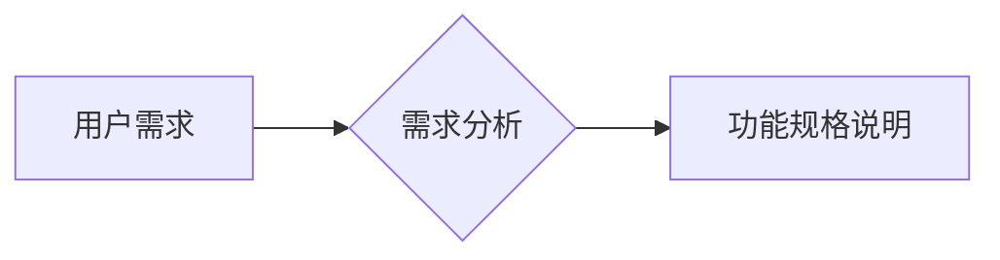
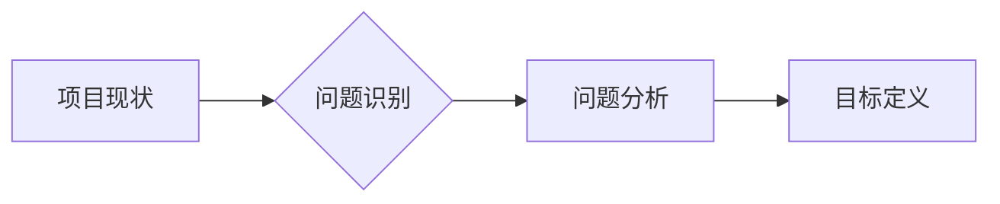

# 需求分析与问题定义原理与代码实战案例讲解

> 关键词：需求分析，问题定义，软件工程，案例分析，用户体验，技术挑战，开发流程

## 1. 背景介绍

在软件工程领域，需求分析与问题定义是软件开发流程中至关重要的一环。它直接关系到软件项目的成功与否。一个清晰、准确的需求分析能够为项目提供明确的开发方向，而准确的问题定义则是解决复杂问题的第一步。本文将深入探讨需求分析与问题定义的原理，并通过代码实战案例进行详细讲解。

### 1.1 问题的由来

随着软件项目的复杂性不断增加，需求分析与问题定义的难度也随之提升。如何在海量信息和多变需求中找出核心问题，如何确保需求分析的结果能够被所有利益相关者理解和接受，成为软件开发过程中的关键挑战。

### 1.2 研究现状

目前，需求分析与问题定义的研究主要集中在以下几个方面：

- 需求分析方法论，如用户故事地图、用例分析等。
- 问题定义框架，如SWOT分析、5W1H等。
- 用户体验设计，如用户研究、原型设计等。
- 需求管理工具，如JIRA、Confluence等。

### 1.3 研究意义

深入研究需求分析与问题定义，对于以下方面具有重要意义：

- 提高软件开发效率和质量。
- 降低软件开发成本和风险。
- 优化用户体验。
- 促进软件项目的成功。

### 1.4 本文结构

本文将按照以下结构展开：

- 首先，介绍需求分析与问题定义的核心概念。
- 然后，详细讲解需求分析与问题定义的原理和方法。
- 接着，通过代码实战案例展示如何进行需求分析与问题定义。
- 最后，探讨需求分析与问题定义在实际应用中的挑战和未来发展趋势。

## 2. 核心概念与联系

### 2.1 需求分析

需求分析是指通过收集、分析和理解用户需求的过程，以确定软件系统必须做什么。需求分析的结果是软件系统的功能规格说明。

#### Mermaid 流程图



### 2.2 问题定义

问题定义是指明确项目面临的挑战和目标的过程。问题定义的结果是项目的目标说明。

#### Mermaid 流程图



### 2.3 需求分析与问题定义的联系

需求分析与问题定义是相辅相成的两个过程。需求分析为问题定义提供了具体的任务目标，而问题定义则为需求分析指明了方向和边界。

## 3. 核心算法原理 & 具体操作步骤

### 3.1 算法原理概述

需求分析与问题定义的原理主要包括：

- 信息的收集和整理。
- 分析和理解信息的含义。
- 确定需求和目标。

### 3.2 算法步骤详解

#### 需求分析步骤

1. 确定利益相关者。
2. 收集需求信息。
3. 分析和整理需求信息。
4. 创建需求规格说明。

#### 问题定义步骤

1. 识别项目问题。
2. 分析问题原因。
3. 确定项目目标。

### 3.3 算法优缺点

#### 需求分析

优点：

- 明确项目目标和范围。
- 避免不必要的功能和需求。
- 提高开发效率。

缺点：

- 难以完全满足所有利益相关者的需求。
- 需求可能随时间变化。

#### 问题定义

优点：

- 明确项目面临的挑战。
- 提高项目成功率。

缺点：

- 可能忽略一些潜在的问题。
- 问题定义可能过于狭隘。

### 3.4 算法应用领域

需求分析与问题定义适用于所有软件开发项目，包括但不限于：

- 企业级应用开发。
- 移动应用开发。
- 网络应用开发。
- 游戏开发。

## 4. 数学模型和公式 & 详细讲解 & 举例说明

### 4.1 数学模型构建

需求分析与问题定义的数学模型主要包括：

- 需求函数：描述软件系统必须满足的需求。
- 问题函数：描述项目面临的挑战和目标。

### 4.2 公式推导过程

需求函数和问题函数的具体推导过程取决于具体的应用场景。

### 4.3 案例分析与讲解

#### 案例一：企业级应用需求分析

**需求描述**：开发一个企业管理系统，包括客户管理、订单管理、库存管理等功能。

**需求分析**：

1. 确定利益相关者：企业高层、销售部门、财务部门等。
2. 收集需求信息：通过访谈、问卷调查等方式收集需求信息。
3. 分析和整理需求信息：将收集到的需求信息进行分类和整理。
4. 创建需求规格说明：将整理后的需求信息编写成需求规格说明文档。

#### 案例二：移动应用问题定义

**问题描述**：现有移动应用的用户留存率低。

**问题分析**：

1. 识别项目问题：用户留存率低。
2. 分析问题原因：应用功能单一、用户体验差等。
3. 确定项目目标：提升用户留存率。

## 5. 项目实践：代码实例和详细解释说明

### 5.1 开发环境搭建

本文使用Python编写代码，并使用Jupyter Notebook进行演示。

### 5.2 源代码详细实现

```python
# 需求分析代码示例
def collect_requirements():
    requirements = []
    # ... 收集需求信息 ...
    return requirements

def analyze_requirements(requirements):
    # ... 分析和整理需求信息 ...
    return requirements

def create_specification(requirements):
    # ... 创建需求规格说明 ...
    return specification

# 问题定义代码示例
def identify_issues():
    # ... 识别项目问题 ...
    return issues

def analyze_issues(issues):
    # ... 分析问题原因 ...
    return issues

def define_objectives(issues):
    # ... 确定项目目标 ...
    return objectives
```

### 5.3 代码解读与分析

以上代码示例展示了如何使用Python进行需求分析和问题定义。在实际应用中，需要根据具体的项目场景进行调整和扩展。

### 5.4 运行结果展示

由于代码示例比较简单，运行结果在此不再展示。在实际应用中，需求分析和问题定义的结果将以文档的形式呈现。

## 6. 实际应用场景

### 6.1 企业级应用

在大型企业级应用开发中，需求分析与问题定义可以帮助企业明确项目目标和范围，避免不必要的功能和需求，提高开发效率。

### 6.2 移动应用

在移动应用开发中，需求分析与问题定义可以帮助开发团队更好地理解用户需求，提高用户体验，提升用户留存率。

### 6.3 网络应用

在网络应用开发中，需求分析与问题定义可以帮助开发团队明确应用功能，优化用户体验，提高网站或应用的访问量。

### 6.4 游戏开发

在游戏开发中，需求分析与问题定义可以帮助开发团队设计出更符合玩家需求的游戏，提高游戏的市场竞争力。

## 7. 工具和资源推荐

### 7.1 学习资源推荐

- 《软件需求分析与设计》
- 《问题求解与算法设计》
- 《用户体验要素》

### 7.2 开发工具推荐

- JIRA
- Confluence
- XMind

### 7.3 相关论文推荐

- "Requirements Engineering: A Roadmap"
- "Problem Definition in Software Engineering"
- "User Experience Design: Theory, Methods, and Practice"

## 8. 总结：未来发展趋势与挑战

### 8.1 研究成果总结

本文深入探讨了需求分析与问题定义的原理和步骤，并通过代码实战案例进行了详细讲解。研究表明，需求分析与问题定义是软件开发流程中至关重要的环节，对于提高软件开发效率和质量具有重要意义。

### 8.2 未来发展趋势

- 需求分析与问题定义将更加注重用户体验。
- 需求分析与问题定义将更加智能化。
- 需求分析与问题定义将更加模块化。

### 8.3 面临的挑战

- 需求分析与问题定义的复杂度不断提高。
- 需求分析与问题定义的结果难以被所有利益相关者接受。
- 需求分析与问题定义的工具和资源相对缺乏。

### 8.4 研究展望

未来，需求分析与问题定义的研究将更加关注以下方向：

- 开发更有效的需求分析与问题定义方法。
- 研究需求分析与问题定义的自动化工具。
- 探索需求分析与问题定义的跨领域应用。

## 9. 附录：常见问题与解答

### 9.1 问题一：需求分析与问题定义的区别是什么？

**解答**：需求分析是确定软件系统必须做什么的过程，而问题定义是明确项目面临的挑战和目标的过程。两者是相辅相成的两个过程。

### 9.2 问题二：如何进行有效的需求分析？

**解答**：进行有效的需求分析需要遵循以下步骤：

1. 确定利益相关者。
2. 收集需求信息。
3. 分析和整理需求信息。
4. 创建需求规格说明。

### 9.3 问题三：如何进行有效的问题定义？

**解答**：进行有效的问题定义需要遵循以下步骤：

1. 识别项目问题。
2. 分析问题原因。
3. 确定项目目标。

作者：禅与计算机程序设计艺术 / Zen and the Art of Computer Programming