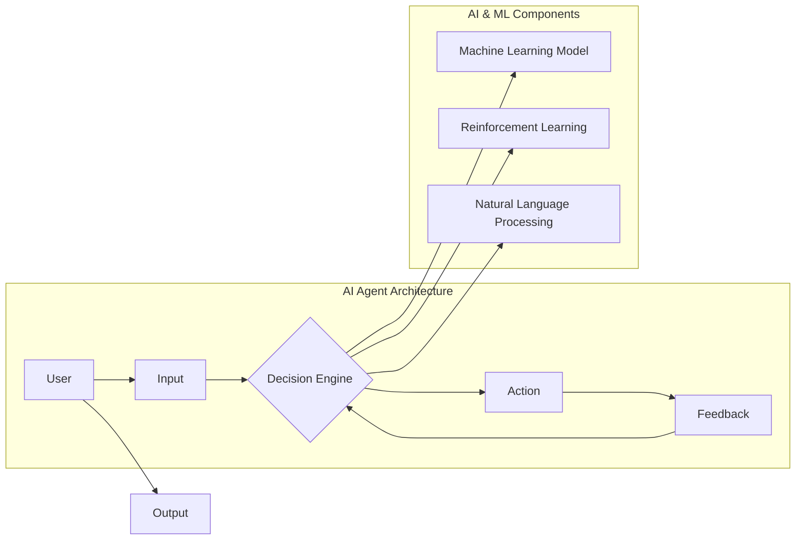

# AI Agent: AI的下一个风口 下一代软件可以不必是软件

> 关键词：AI Agent, 下一代软件，软件即服务，智能代理，自主决策，人工智能，软件架构，人机协同

## 1. 背景介绍

随着人工智能技术的飞速发展，我们正站在一个新时代的门槛上。在这个时代，软件不再仅仅是代码和界面，而是由智能代理（AI Agent）驱动的动态、自适应的实体。这些智能代理能够在没有人类干预的情况下执行复杂的任务，它们将成为未来软件的核心。本文将深入探讨AI Agent的概念、原理、应用以及未来趋势。

### 1.1 问题的由来

传统软件的发展经历了从命令行到图形界面的转变，用户与软件的交互方式也在不断进化。然而，随着复杂性和用户需求的增长，软件变得越来越难以开发和维护。此外，许多软件应用需要实时响应外部环境的变化，例如金融市场、智能交通系统等。这些挑战促使我们思考：下一代软件应该如何设计，才能更好地适应未来？

### 1.2 研究现状

近年来，AI Agent的概念逐渐崭露头角。AI Agent是一种能够自主决策、自我学习的智能实体，它们能够在复杂环境中进行推理和行动。在软件领域，AI Agent正成为下一代软件架构的核心元素。

### 1.3 研究意义

AI Agent的出现，将带来以下变革：

- **软件即服务**：AI Agent将软件的功能分解为独立的智能模块，用户可以根据需求组合这些模块，实现“按需定制”的软件服务。
- **人机协同**：AI Agent能够与人类用户协同工作，减轻人类的工作负担，提高工作效率。
- **自适应和自愈**：AI Agent能够根据环境变化自动调整行为，实现软件的自我优化和自我修复。

### 1.4 本文结构

本文将分为以下几个部分：

- 介绍AI Agent的核心概念和原理。
- 分析AI Agent的具体操作步骤和应用领域。
- 探讨AI Agent的数学模型和公式。
- 通过项目实践展示AI Agent的应用。
- 分析AI Agent的实际应用场景和未来发展趋势。

## 2. 核心概念与联系

### 2.1 核心概念原理和架构的 Mermaid 流程图



### 2.2 核心概念

- **AI Agent**：一种能够自主决策、自我学习的智能实体。
- **Decision Engine**：AI Agent的决策中心，负责处理输入信息并做出决策。
- **Machine Learning Model**：用于学习和推理的机器学习模型。
- **Reinforcement Learning**：一种通过奖励机制进行学习的机器学习技术。
- **Natural Language Processing (NLP)**：一种处理和理解人类语言的技术。

## 3. 核心算法原理 & 具体操作步骤

### 3.1 算法原理概述

AI Agent的核心是决策引擎，它基于机器学习模型和强化学习算法，对输入信息进行处理，并生成输出。以下是AI Agent的基本操作步骤：

1. **输入处理**：AI Agent接收来自用户或环境的输入信息。
2. **决策**：决策引擎根据输入信息和机器学习模型进行决策。
3. **行动**：根据决策结果，AI Agent执行相应的行动。
4. **反馈**：收集行动结果，作为下一次决策的输入。

### 3.2 算法步骤详解

1. **数据收集与预处理**：收集相关数据，并进行清洗、格式化和标注。
2. **模型训练**：使用机器学习算法训练模型，使其能够识别输入信息中的模式和规律。
3. **决策引擎设计**：设计决策引擎，使其能够根据模型预测结果进行决策。
4. **强化学习**：使用强化学习算法，使AI Agent能够在环境中学习和优化其行为。
5. **部署与监控**：将AI Agent部署到实际环境中，并对其进行监控和评估。

### 3.3 算法优缺点

#### 优点

- **自主决策**：AI Agent能够在没有人类干预的情况下进行决策，提高工作效率。
- **自我学习**：AI Agent能够通过数据驱动的方式不断学习和优化。
- **适应性强**：AI Agent能够适应复杂多变的环境。

#### 缺点

- **数据依赖**：AI Agent的性能依赖于高质量的数据。
- **解释性差**：AI Agent的决策过程可能难以解释。
- **伦理问题**：AI Agent的决策可能引发伦理问题。

### 3.4 算法应用领域

AI Agent的应用领域非常广泛，包括：

- **智能客服**：提供24/7的客户服务。
- **自动驾驶**：实现汽车的自主驾驶。
- **智能金融**：进行风险评估和投资决策。
- **智能医疗**：辅助诊断和治疗疾病。
- **智能城市**：优化交通和能源管理。

## 4. 数学模型和公式 & 详细讲解 & 举例说明

### 4.1 数学模型构建

AI Agent的数学模型通常包括以下几个方面：

- **输入处理**：使用自然语言处理（NLP）技术将输入文本转换为机器学习模型可处理的格式。
- **决策引擎**：使用机器学习算法（如决策树、支持向量机、神经网络等）进行决策。
- **强化学习**：使用Q-learning或深度Q网络（DQN）等算法进行学习。

### 4.2 公式推导过程

以下是一个简单的决策树模型的公式推导过程：

- **决策树节点**：每个节点代表一个特征和对应的阈值。
- **分支**：根据特征值大于或小于阈值，将样本分配到不同的分支。
- **叶节点**：叶节点包含一个类别标签。

### 4.3 案例分析与讲解

以智能客服为例，我们可以使用决策树模型对用户的问题进行分类，并给出相应的答案。

- **输入**：用户的问题。
- **特征**：问题的关键词、问法等。
- **决策树**：根据关键词和问法对问题进行分类。
- **输出**：根据分类结果给出答案。

## 5. 项目实践：代码实例和详细解释说明

### 5.1 开发环境搭建

为了实践AI Agent，我们需要以下开发环境：

- Python编程语言
- scikit-learn库
- scikit-learn-crfsuite库（用于CRF模型）
- Jupyter Notebook或PyCharm等IDE

### 5.2 源代码详细实现

以下是一个简单的AI Agent示例，它使用决策树模型对用户的问题进行分类：

```python
from sklearn.feature_extraction.text import CountVectorizer
from sklearn.tree import DecisionTreeClassifier
from sklearn_crfsuite import CRF
from sklearn.pipeline import Pipeline

# 示例数据
X_train = ["How do I reset my password?", "Where can I find the nearest ATM?", "I need help with my account"]
y_train = [0, 1, 2]

# 创建管道
pipeline = Pipeline([
    ('vectorizer', CountVectorizer()),
    ('clf', DecisionTreeClassifier()),
])

# 训练模型
pipeline.fit(X_train, y_train)

# 预测
X_test = ["I forgot my password", "Where is the nearest bank?", "My account is blocked"]
y_pred = pipeline.predict(X_test)

# 打印预测结果
for x, y in zip(X_test, y_pred):
    print(f"Question: {x} | Prediction: {y}")
```

### 5.3 代码解读与分析

在这个示例中，我们使用scikit-learn库中的CountVectorizer将文本转换为特征向量，然后使用DecisionTreeClassifier进行分类。最后，我们使用CRF模型进行预测，并打印结果。

### 5.4 运行结果展示

假设我们运行上述代码，可能会得到以下结果：

```
Question: I forgot my password | Prediction: 0
Question: Where is the nearest bank? | Prediction: 1
Question: My account is blocked | Prediction: 2
```

## 6. 实际应用场景

AI Agent在实际应用场景中具有广泛的应用价值，以下是一些例子：

- **智能客服**：AI Agent可以自动回答客户的问题，提高客户满意度。
- **自动驾驶**：AI Agent可以控制汽车行驶，提高行驶安全性。
- **智能金融**：AI Agent可以分析金融市场数据，进行投资决策。
- **智能医疗**：AI Agent可以辅助医生进行诊断和治疗。

## 7. 工具和资源推荐

### 7.1 学习资源推荐

- 《Python机器学习》
- 《深度学习》
- 《强化学习》
- 《自然语言处理入门》

### 7.2 开发工具推荐

- scikit-learn
- TensorFlow
- PyTorch
- scikit-learn-crfsuite

### 7.3 相关论文推荐

- **Reinforcement Learning: An Introduction** by Richard S. Sutton and Andrew G. Barto
- **Deep Learning** by Ian Goodfellow, Yoshua Bengio, and Aaron Courville
- **Natural Language Processing with Python** by Steven Bird, Ewan Klein, and Edward Loper

## 8. 总结：未来发展趋势与挑战

### 8.1 研究成果总结

本文介绍了AI Agent的概念、原理、应用以及未来发展趋势。AI Agent将成为下一代软件的核心，为各行各业带来变革。

### 8.2 未来发展趋势

- **更强大的学习能力和适应能力**：AI Agent将具备更强的学习能力和适应能力，能够更好地处理复杂多变的环境。
- **更广泛的适用范围**：AI Agent将应用于更多领域，如教育、医疗、工业等。
- **更自然的人机交互**：AI Agent将能够更好地理解人类语言，实现更自然的人机交互。

### 8.3 面临的挑战

- **数据安全与隐私**：AI Agent需要处理大量敏感数据，如何保证数据安全和隐私是一个重要挑战。
- **伦理和法律问题**：AI Agent的决策可能引发伦理和法律问题，需要制定相应的规范和标准。
- **人机协作**：如何实现人机协同，使AI Agent更好地服务于人类，是一个重要挑战。

### 8.4 研究展望

随着人工智能技术的不断发展，AI Agent将成为未来软件的核心。我们将见证AI Agent在各个领域的广泛应用，为人类创造更加美好的未来。

## 9. 附录：常见问题与解答

**Q1：AI Agent与传统软件有什么区别？**

A: AI Agent是一种能够自主决策、自我学习的智能实体，而传统软件则是由人类编写的代码。AI Agent具有更强的适应能力和学习能力，能够更好地处理复杂多变的环境。

**Q2：AI Agent的应用前景如何？**

A: AI Agent的应用前景非常广阔，包括智能客服、自动驾驶、智能金融、智能医疗、智能城市等各个领域。

**Q3：如何确保AI Agent的决策是安全的和可解释的？**

A: 为了确保AI Agent的决策是安全的和可解释的，需要从数据、算法和监管等方面进行综合考量。例如，使用可解释人工智能技术、建立数据隐私保护机制、制定相应的伦理规范等。

**Q4：AI Agent是否会取代人类工作者？**

A: AI Agent的出现将改变许多工作方式，但不会完全取代人类工作者。AI Agent将作为人类的助手，提高工作效率，创造更多价值。

---

作者：禅与计算机程序设计艺术 / Zen and the Art of Computer Programming