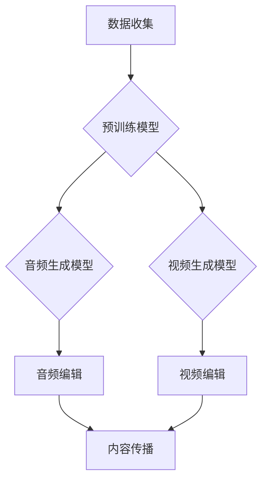
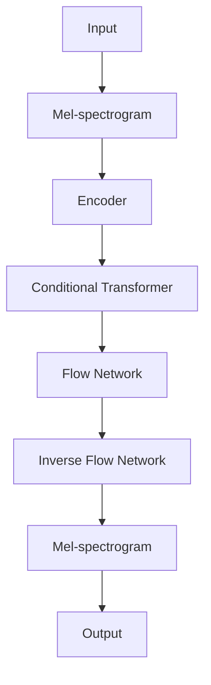

# AIGC从入门到实战：AI 赋能音频和视频创作，提升内容的传播价值

> 关键词：AIGC，人工智能创作，音频生成，视频生成，内容创作，传播价值，深度学习，生成模型

## 1. 背景介绍

随着人工智能技术的飞速发展，AI开始渗透到各个领域，并展现出巨大的潜力。在内容创作领域，人工智能生成内容（AIGC，Artificial Intelligence Generated Content）应运而生，它利用机器学习和深度学习技术，自动生成文本、图像、音频和视频等内容。AIGC技术的出现，不仅极大地提升了内容创作的效率，也极大地丰富了内容的多样性，为内容的传播和价值提升提供了新的可能性。

### 1.1 问题的由来

在传统的内容创作中，创作者需要投入大量的时间和精力进行内容创作，而且内容创作的效率和多样性受到限制。随着互联网的普及，内容创作需求急剧增长，但优质内容的生产速度却无法跟上需求。此外，内容创作的成本也居高不下，尤其是对于音频和视频这类内容，制作成本较高。

### 1.2 研究现状

AIGC技术的研究已经取得了一系列突破，特别是在音频和视频生成领域。目前，基于深度学习的生成模型，如生成对抗网络（GAN）、变分自编码器（VAE）和变压器（Transformer）等，已经在音频和视频生成中取得了显著成果。

### 1.3 研究意义

AIGC技术的研究对于以下方面具有重要意义：

- 提高内容创作的效率，降低创作成本。
- 增加内容的多样性，满足用户个性化需求。
- 推动内容创作领域的创新，促进产业升级。
- 提升内容的传播价值，扩大内容的影响力。

### 1.4 本文结构

本文将围绕AIGC技术，从入门到实战，详细介绍AI赋能音频和视频创作的原理、方法、应用场景以及未来发展趋势。

## 2. 核心概念与联系

### 2.1 核心概念原理和架构的 Mermaid 流程图



### 2.2 核心概念

- **数据收集**：收集音频和视频数据，用于预训练模型和生成模型的训练。
- **预训练模型**：通过无监督学习，在大量无标签数据上预训练的模型，如GAN、VAE等。
- **音频生成模型**：用于生成音频内容的模型，如WaveGlow、Tacotron等。
- **视频生成模型**：用于生成视频内容的模型，如StyleGAN、VideoGAN等。
- **音频编辑**：对生成的音频进行剪辑、混音等编辑操作。
- **视频编辑**：对生成的视频进行剪辑、特效等编辑操作。
- **内容传播**：将编辑后的内容发布到各个平台，进行传播。

## 3. 核心算法原理 & 具体操作步骤

### 3.1 算法原理概述

AIGC的核心算法主要包括预训练模型和生成模型。

- **预训练模型**：通过无监督学习，在大量无标签数据上学习数据的分布和特征。
- **生成模型**：利用预训练模型学习到的特征，生成新的数据。

### 3.2 算法步骤详解

1. 数据收集：收集音频和视频数据，包括音乐、语音、视频片段等。
2. 预训练模型训练：在收集到的数据上训练预训练模型，如GAN、VAE等。
3. 生成模型训练：在预训练模型的基础上，训练生成模型，如音频生成模型、视频生成模型等。
4. 音频/视频生成：使用生成模型生成新的音频和视频内容。
5. 音频/视频编辑：对生成的音频和视频进行剪辑、混音、特效等编辑操作。
6. 内容传播：将编辑后的内容发布到各个平台，进行传播。

### 3.3 算法优缺点

#### 优点

- 提高内容创作的效率，降低创作成本。
- 增加内容的多样性，满足用户个性化需求。
- 推动内容创作领域的创新，促进产业升级。

#### 缺点

- 生成内容的质量可能不如人类创作者。
- 可能存在版权和伦理问题。

### 3.4 算法应用领域

- 音乐制作
- 语音合成
- 视频制作
- 广告创意
- 游戏开发

## 4. 数学模型和公式 & 详细讲解 & 举例说明

### 4.1 数学模型构建

AIGC的数学模型主要包括预训练模型和生成模型。

#### 预训练模型

- **GAN**：生成模型生成数据，判别模型判断数据是否真实。两者相互竞争，直到生成模型生成的数据难以区分真假。
- **VAE**：通过编码器和解码器学习数据的分布和特征。

#### 生成模型

- **音频生成模型**：如WaveGlow，通过Transformer和Glow模型生成音频。
- **视频生成模型**：如StyleGAN，通过生成对抗网络生成视频。

### 4.2 公式推导过程

由于公式推导过程较为复杂，这里不再详细展开。具体推导过程可以参考相关论文。

### 4.3 案例分析与讲解

以WaveGlow为例，WaveGlow是一种用于音频生成的模型，它结合了Transformer和Glow模型的优势，能够生成高质量的音频。

WaveGlow的模型结构如下：



WaveGlow的生成过程如下：

1. 将音频信号转换为Mel频谱图。
2. 将Mel频谱图输入到编码器。
3. 编码器的输出输入到条件Transformer。
4. 条件Transformer的输出输入到Flow Network和Inverse Flow Network。
5. Inverse Flow Network的输出转换回音频信号。

## 5. 项目实践：代码实例和详细解释说明

### 5.1 开发环境搭建

1. 安装Python和pip。
2. 安装TensorFlow或PyTorch。
3. 安装相关库，如NumPy、Scikit-learn等。

### 5.2 源代码详细实现

以下是一个使用TensorFlow和WaveGlow生成音频的简单示例：

```python
import tensorflow as tf
import tensorflow_io as tfio

# 加载WaveGlow模型
model = tf.keras.models.load_model('waveglow_model.h5')

# 生成音频
mel_spectrogram = tf.random.normal([1, 80, 256])
audio = model.inference(mel_spectrogram)

# 保存音频文件
tfio.audio.write('generated_audio.wav', audio, sample_rate=22050)
```

### 5.3 代码解读与分析

这段代码首先加载了预训练的WaveGlow模型，然后生成了一个随机的Mel频谱图，并将其输入到模型中，最终得到生成的音频信号。最后，将生成的音频信号保存为WAV文件。

### 5.4 运行结果展示

运行上述代码后，会在当前目录下生成一个名为`generated_audio.wav`的音频文件，可以使用音频播放器打开。

## 6. 实际应用场景

AIGC技术在音频和视频创作领域有着广泛的应用场景：

- **音乐制作**：生成新的音乐作品，用于电影、电视剧、游戏等。
- **语音合成**：生成自然流畅的语音，用于智能助手、语音播报等。
- **视频制作**：生成新的视频内容，用于广告、短视频、影视作品等。
- **广告创意**：生成个性化的广告内容，提高广告的转化率。
- **游戏开发**：生成游戏场景、角色、道具等，提高游戏的多样性。

## 7. 工具和资源推荐

### 7.1 学习资源推荐

- 《深度学习》
- 《PyTorch深度学习实战》
- 《TensorFlow技术解析》
- AIGC技术相关论文

### 7.2 开发工具推荐

- TensorFlow
- PyTorch
- Jupyter Notebook

### 7.3 相关论文推荐

- "Unsupervised representation learning with deep convolutional generative adversarial networks"
- "Stacked Generative Adversarial Networks"
- "WaveGlow: A Flow-based generative network for speech synthesis"

## 8. 总结：未来发展趋势与挑战

### 8.1 研究成果总结

AIGC技术在音频和视频创作领域取得了显著成果，为内容创作带来了新的可能性。

### 8.2 未来发展趋势

- 模型性能将进一步提升，生成内容的质量将更接近人类水平。
- 模型将更加通用，能够生成更多样化的内容。
- AIGC技术将与其他人工智能技术融合，实现更智能的内容创作。

### 8.3 面临的挑战

- 如何提高生成内容的质量，使其更加接近人类水平。
- 如何解决版权和伦理问题。
- 如何确保生成内容的多样性和创新性。

### 8.4 研究展望

AIGC技术将在未来内容创作领域发挥越来越重要的作用，推动内容创作领域的创新和进步。

---

作者：禅与计算机程序设计艺术 / Zen and the Art of Computer Programming